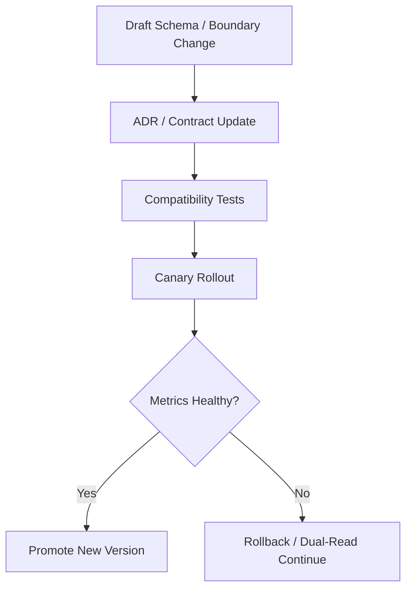

# Architecture Governance And Versioning Contract

---

## OAPEFLIR Association

This contract participates in the following phases of the OAPEFLIR eight-phase loop:

- **Observe**: Signal collection and aggregation
- **Assess**: Pre-execution assessment and risk judgment
- **Plan**: Task decomposition and DAG construction
- **Execute**: Step execution and fault tolerance
- **Feedback**: Signal collection and preprocessing
- **Learn**: Pattern detection and knowledge extraction
- **Improve**: Improvement candidate evaluation and rollout
- **Release**: Controlled release and rollback

---

## 1. Scope

This contract defines the architecture decision process, module boundary governance, and version compatibility strategies required for mature industrial platforms.

Related Documents:

- `project_structure_contract.md`
- `api_surface_contract.md`
- `control_vs_intelligence_boundary_contract.md`
- `workflow_static_analysis_and_compensation_contract.md`

## 2. Goals

- Ensure new architecture decisions enter formal ADR process, rather than staying in chat or code comments.
- Tighten call boundaries between domain layer, orchestration layer, runtime layer, and infrastructure layer.
- Establish unified version governance for workflow DSL, role contract, tool schema, event schema, and memory schema.

## 3. ADR Governance Requirements

The following changes must add new ADR or update existing ADR:

- Adding new authoritative store, queue, broker, or cache.
- Adding new cross-boundary security model, execution model, or tenant isolation model.
- Changing model selection strategy, fallback strategy, or control/intelligence boundary.
- Changing workflow DSL, event schema, tool schema compatibility strategy.
- Introducing new production-level dependencies, plugin distribution mechanisms, or cross-region disaster recovery solutions.

Each ADR must contain at least:

- context
- decision
- alternatives considered
- trade-offs
- adoption trigger
- rollback / exit criteria
- migration impact

Supplementary requirements:

- If a design explicitly references an external system or external framework, "borrowing points" and "points not directly adopted" should be recorded.
- If deciding not to adopt an seemingly reasonable external solution, the minimal rejection reason should be retained to avoid the same proposal being repeatedly resubmitted.
- For long-term stable boundaries, allowing introduction of architecture smell inventory or guard scripts to continuously discover facade pollution, cross-layer dependencies, and runtime service locator bloat.
- For long-term high-frequency changing core modules, continuously review module bloat risk; if central modules chronically absorb unrelated responsibilities, priority should be given to splitting boundaries, rather than continuing to accumulate logic to "all-powerful core".

## 4. Module Boundaries

Recommended layers:

| Layer | Responsible Content | Forbidden Direct Dependencies |
| --- | --- | --- |
| `domain` | Task, workflow, decision, result, policy objects | Infra details, SDK clients |
| `orchestration` | Planner, orchestrator, transition service, recovery manager | Underlying DB driver, specific web framework |
| `runtime` | Execution, lease, worker, queue, sandbox, gateway | Product narrative objects, UI components |
| `infrastructure` | PostgreSQL, Redis, object store, provider adapter, observability adapter | Business orchestration rules |

Boundary rules:

- Cross-layer capabilities must be exposed through interface / port.
- "Upper layers directly stealing lower layer implementation details" is not allowed.
- Domain objects must not hold infrastructure clients.
- Prompt, workflow, and policy files must not replace mandatory system code boundaries.
- Public facade must not retroactively re-export private implementations, avoiding freezing accidental paths into de facto public contracts.
- Type layer / contract layer should not directly bind implementation shims; if lazy loading is necessary, it should be received through explicit runtime boundary.

## 5. Version Governance Objects

Objects that must be explicitly versioned:

- `workflow_dsl_version`
- `role_contract_version`
- `tool_schema_version`
- `event_schema_version`
- `message_parts_version`
- `memory_schema_version`
- `policy_bundle_version`
- `prompt_bundle_version`

## 6. Compatibility Strategy

| Object | Default Compatibility Strategy |
| --- | --- |
| workflow DSL | Minor backward compatible, major allows breaking changes |
| role contract | Minor adds optional fields, major changes required fields or semantics |
| tool schema | Within production, must be compatible with two adjacent minor versions |
| event schema | Producer and consumer must be compatible with at least current and previous versions |
| memory schema | Must provide migration or lazy upgrade rules during upgrade |

## 7. Version Upgrade Process

## 7.1 Protocol and Recovery Hints

External protocols or control plane handshakes should at least clarify:

- protocol version negotiation
- role / scope boundary
- device / client identity shape
- structured recovery hint on auth or compatibility failure

Rules:

- Protocol changes belong to contract changes and should not drift quietly relying on implementation details alone.
- On compatibility failure, should try to return structured recovery suggestions, not just exposing bare error strings.
- External methods, payloads, and notification naming should follow unified conventions, e.g., `*Params / *Response / *Notification` or equivalent style, not mixing multiple naming systems within the same protocol layer.
- Experimental / unstable surfaces must be explicitly marked, with defined promotion or deletion paths to avoid temporary fields lingering as implicit formal interfaces long-term.

## 8. Closure Conclusion

Mature industrial platforms cannot maintain stability by just "current implementation can run".

Formal architecture governance must simultaneously cover:

- Decision records
- Layer boundaries
- Schema versions
- Compatibility windows
- Upgrade and rollback conditions
