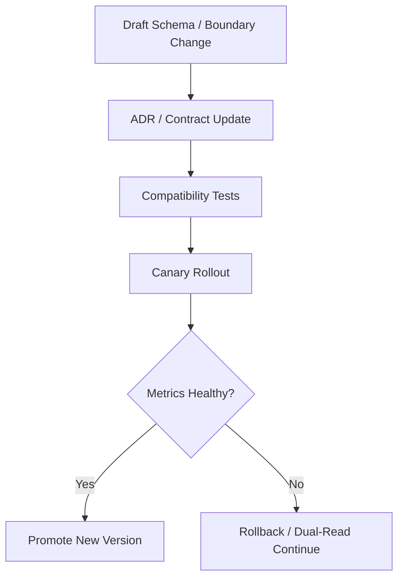

# Architecture Governance And Versioning Contract

---

## OAPEFLIR Association

This contract participates in the following stages of the OAPEFLIR eight-stage loop:

- **Observe**: Signal collection and aggregation
- **Assess**: Pre-execution assessment and risk judgment
- **Plan**: Task decomposition and DAG construction
- **Execute**: Step execution and fault tolerance
- **Feedback**: Signal collection and preprocessing
- **Learn**: Pattern detection and knowledge extraction
- **Improve**: Improvement candidate evaluation and rollout
- **Release**: Controlled release and rollback

---

## 1. Scope

This contract defines the architectural decision process, module boundary governance, and version compatibility strategy required for mature industrial platforms.

Related documents:

- `project_structure_contract.md`
- `api_surface_contract.md`
- `control_vs_intelligence_boundary_contract.md`
- `workflow_static_analysis_and_compensation_contract.md`

## 2. Objectives

- Ensure new architectural trade-offs enter the formal ADR process, rather than remaining in chat or code comments.
- Tighten the invocation boundaries between the domain layer, orchestration layer, runtime layer, and infrastructure layer.
- Establish unified version governance for workflow DSL, role contracts, tool schemas, event schemas, and memory schemas.

## 3. ADR Governance Requirements

The following changes must introduce a new ADR or update an existing ADR:

- Adding authoritative stores, queues, brokers, or caches.
- Adding cross-boundary security models, execution models, or tenant isolation models.
- Changing model selection strategies, fallback strategies, or control/intelligence boundaries.
- Changing compatibility strategies for workflow DSL, event schemas, or tool schemas.
- Introducing new production-level dependencies, plugin distribution mechanisms, or cross-region disaster recovery solutions.

Each ADR must include at minimum:

- context
- decision
- alternatives considered
- trade-offs
- adoption trigger
- rollback / exit criteria
- migration impact

Additional requirements:

- If a design explicitly references an external system or external framework, document the "borrowed points" and "points not directly adopted."
- If deciding not to adopt a seemingly reasonable external solution, retain a minimal rejection reason to avoid the same solution being repeatedly re-proposed.
- For long-term stable boundaries, allow the introduction of an architecture smell inventory or guard scripts to continuously detect facade pollution, cross-layer dependencies, and runtime service locator bloat.
- For core modules that change frequently over the long term, continuously review module bloat risks; if a central module persistently absorbs unrelated responsibilities, prioritize splitting boundaries rather than continuing to pile logic onto an "omniscient core."

## 4. Module Boundaries

Recommended layers:

| Layer | Responsible For | Forbidden Direct Dependencies |
| --- | --- | --- |
| `domain` | task, workflow, decision, result, policy objects | infra details, SDK clients |
| `orchestration` | planner, orchestrator, transition service, recovery manager | low-level DB drivers, specific web frameworks |
| `runtime` | execution, lease, worker, queue, sandbox, gateway | product narrative objects, UI components |
| `infrastructure` | PostgreSQL, Redis, object store, provider adapter, observability adapter | business orchestration rules |

Boundary rules:

- Cross-layer capabilities must be exposed through interfaces / ports.
- "Upper layers are not allowed to directly call lower-layer implementation details."
- Domain objects must not hold infrastructure clients.
- Prompt, workflow, and policy files must not replace mandatory system code boundaries.
- Public facades must not re-export private implementations in reverse, avoiding freezing accidental paths into de facto public contracts.
- Type layer / contract layer should not directly bind implementation shims; if lazy loading is necessary, it must be handled through explicit runtime boundaries.

## 5. Version Governance Objects

Objects that must be explicitly versioned:

- `workflow_dsl_version`
- `role_contract_version`
- `tool_schema_version`
- `event_schema_version`
- `message_parts_version`
- `memory_schema_version`
- `policy_bundle_version`
- `prompt_bundle_version`

## 6. Compatibility Strategy

| Object | Default Compatibility Strategy |
| --- | --- |
| workflow DSL | minor backward compatible, major allows breaking changes |
| role contract | minor adds optional fields, major changes required fields or semantics |
| tool schema | must be compatible with two adjacent minor versions in production |
| event schema | producer and consumer must be compatible with at least current and previous versions |
| memory schema | must provide migration or lazy upgrade rules during upgrades |

## 7. Version Upgrade Process

## 7.1 Protocol and Recovery Hints

External protocols or control plane handshakes must explicitly define at minimum:

- protocol version negotiation
- role / scope boundary
- device / client identity shape
- structured recovery hint on auth or compatibility failure

Rules:

- Protocol changes are contract changes and should not silently drift through implementation details alone.
- On compatibility failure, should return structured recovery suggestions rather than exposing bare error strings.
- External methods, payloads, and notification naming should follow unified conventions, such as `*Params / *Response / *Notification` or equivalent styles, and should not mix multiple naming systems within the same protocol layer.
- experimental / unstable surfaces must be explicitly marked, with defined promotion or deletion paths to avoid temporary fields lingering long-term as implicit formal interfaces.

## 8. Closure Conclusion

Mature industrial platforms cannot maintain stability by merely "keeping the current implementation running."

Formal architectural governance must simultaneously cover:

- decision records
- layer boundaries
- schema versions
- compatibility windows
- upgrade and rollback conditions
