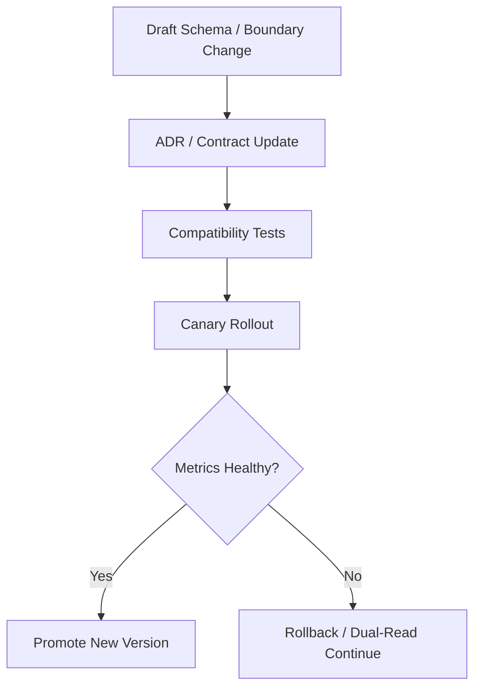

# Architecture Governance And Versioning Contract

---

## OAPEFLIR Relationship

This contract participates in the following stages of the OAPEFLIR eight-stage cycle:

- **Observe**: Signal collection and aggregation
- **Assess**: Pre-execution assessment and risk judgment
- **Plan**: Task decomposition and DAG construction
- **Execute**: Step execution and fault tolerance
- **Feedback**: Signal collection and preprocessing
- **Learn**: Pattern detection and knowledge extraction
- **Improve**: Improvement candidate assessment and rollout
- **Release**: Controlled release and rollback

---

## 1. Scope

This contract defines the architecture decision process, module boundary governance, and version compatibility strategy required for a mature industrial platform.

Related documents:

- `project_structure_contract.md`
- `api_surface_contract.md`
- `control_vs_intelligence_boundary_contract.md`
- `workflow_static_analysis_and_compensation_contract.md`

## 2. Objectives

- Ensure new architecture decisions enter the formal ADR process, rather than staying in chat or code comments.
- Tighten call boundaries between domain layer, orchestration layer, runtime layer, and infrastructure layer.
- Establish unified version governance for workflow DSL, role contract, tool schema, event schema, and memory schema.

## 3. ADR Governance Requirements

The following changes must create a new ADR or update an existing ADR:

- Adding new authoritative store, queue, broker, or cache.
- Adding cross-boundary security model, execution model, or tenant isolation model.
- Changing model selection strategy, fallback strategy, or control/intelligence boundary.
- Changing workflow DSL, event schema, or tool schema compatibility strategy.
- Introducing new production-level dependencies, plugin distribution mechanism, or cross-region disaster recovery solution.

Each ADR must include at least:

- context
- decision
- alternatives considered
- trade-offs
- adoption trigger
- rollback / exit criteria
- migration impact

Supplementary requirements:

- If a design explicitly references an external system or framework, record "borrowed points" and "points not directly adopted".
- If deciding not to adopt a seemingly reasonable external solution, retain the minimum rejection reason to avoid the same proposal being re-proposed repeatedly.
- For long-term stable boundaries, an architecture smell inventory or guard script can be introduced to continuously discover facade pollution, cross-layer dependencies, and runtime service locator bloat.
- For core modules with high-frequency changes over the long term, continuously review module bloat risk; if a central module continuously absorbs unrelated responsibilities, priority should be given to splitting boundaries rather than continuing to pile logic onto an "all-powerful core".

## 4. Module Boundaries

Recommended layers:

| Layer | Responsible For | Prohibited Direct Dependencies |
| --- | --- | --- |
| `domain` | task, workflow, decision, result, policy objects | infra details, SDK clients |
| `orchestration` | planner, orchestrator, transition service, recovery manager | low-level DB driver, specific web framework |
| `runtime` | execution, lease, worker, queue, sandbox, gateway | product narrative objects, UI components |
| `infrastructure` | PostgreSQL, Redis, object store, provider adapter, observability adapter | business orchestration rules |

Boundary rules:

- Cross-layer capabilities must be exposed through interface / port.
- "Upper layer directly stealing lower-layer implementation details" is not allowed.
- Domain objects must not hold infrastructure clients.
- Prompt, workflow, and policy files must not replace mandatory system code boundaries.
- Public facade must not反向 re-export private implementations, avoiding freezing accidental paths into de facto public contracts.
- Type layer / contract layer should not directly bind implementation shim; if lazy/load is necessary, it should be received through an explicit runtime boundary.

## 5. Version Governance Objects

Objects that must be explicitly versioned:

- `workflow_dsl_version`
- `role_contract_version`
- `tool_schema_version`
- `event_schema_version`
- `message_parts_version`
- `memory_schema_version`
- `policy_bundle_version`
- `prompt_bundle_version`

## 6. Compatibility Strategy

| Object | Default Compatibility Strategy |
| --- | --- |
| workflow DSL | minor backward compatible, major allows breaking change |
| role contract | minor adds optional fields, major changes required fields or semantics |
| tool schema | must be compatible with two adjacent minor versions in production |
| event schema | producer and consumer must be compatible with at least current and previous version |
| memory schema | must provide migration or lazy upgrade rules on upgrade |

## 7. Version Upgrade Process

## 7.1 Protocol and Recovery Hints

External protocols or control plane handshakes should at least clarify:

- protocol version negotiation
- role / scope boundary
- device / client identity shape
- structured recovery hint on auth or compatibility failure

Rules:

- Protocol changes belong to contract changes; they should not silently drift through implementation details.
- On compatibility failure, structured recovery suggestions should be returned as much as possible, rather than just exposing bare error strings.
- External method, payload, and notification naming should follow unified conventions, such as `*Params / *Response / *Notification` or equivalent style; multiple naming systems should not be mixed in the same protocol layer.
- Experimental / unstable surfaces must be explicitly marked, with defined promotion or deletion paths to avoid temporary fields from lingering as implicit formal interfaces.

## 8. Closure Conclusion

Mature industrial platforms cannot maintain stability by just "current implementation works".

Formal architecture governance must simultaneously cover:

- Decision records
- Layer boundaries
- Schema versions
- Compatibility windows
- Upgrade and rollback conditions