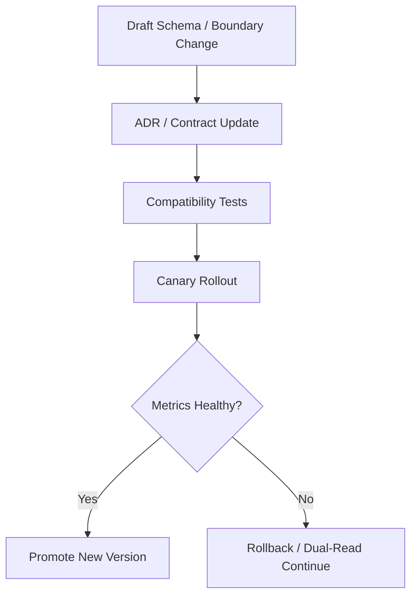

# Architecture Governance And Versioning Contract

---

## OAPEFLIR 关联

本 contract 参vs OAPEFLIR 八阶段循环中的以下阶段：

- **Observe**：信号采集vs聚合
- **Assess**：执lines前评估vs风险判断
- **Plan**：任务分解vs DAG 构建
- **Execute**：步骤执linesvs容错
- **Feedback**：信号收集vs预handle
- **Learn**：模式检测vs知识提取
- **Improve**：改进候选评估vs rollout
- **Release**：受控发布vs回滚

---

## 1. 范围

本 contract defines成熟工业平台所需的ArchitectureDecision流程、模块边界治理和版本兼容策略。

相关文档：

- `project_structure_contract.md`
- `api_surface_contract.md`
- `control_vs_intelligence_boundary_contract.md`
- `workflow_static_analysis_and_compensation_contract.md`

## 2. 目标

- 让新增Architecture取舍进入正式 ADR 流程，而不is停留在聊天或codecomment里。
- 收紧领域层、编排层、运lines时层、基础设施层之间的call边界。
- 为 workflow DSL、role contract、tool schema、event schema、memory schema 建立统一版本治理。

## 3. ADR 治理要求

以下变化必须新增 ADR，或更新现有 ADR：

- 新增 authoritative store、queue、broker 或 cache。
- 新增跨边界security模型、执lines模型或租户隔离模型。
- 变更模型选择策略、fallback 策略或控制/智能边界。
- 变更 workflow DSL、event schema、tool schema 的兼容策略。
- references入新的生产级relies on、插件分发机制或跨区域容灾方案。

每份 ADR 至少contains：

- context
- decision
- alternatives considered
- trade-offs
- adoption trigger
- rollback / exit criteria
- migration impact

补充要求：

- 若某项设计显式参考外部系统或外部框架，应record“借鉴点”和“不directly采用的点”。
- 若决定不采用某个看似合理的外部方案，应保留最小拒绝理由，避免同一方案反复被重新提案。
- 对长期稳定边界，允许references入 architecture smell inventory 或 guard script，持续发现 facade 污染、越层relies on和 runtime service locator 膨胀。
- 对长期高频变更的核心模块，应持续审查模块膨胀风险；若中心模块长期吸纳no关职责，应优先拆分边界，而不is继续向“万能 core”堆积逻辑。

## 4. 模块边界

推荐层iterations：

| 层 | 负责内容 | 禁止directlyrelies on |
|---|-------|--------|
| `domain` | task、workflow、decision、result、policy objects | infra 细节、SDK 客户端 |
| `orchestration` | planner、orchestrator、transition service、recovery manager | 底层 DB driver、具体 web framework |
| `runtime` | execution、lease、worker、queue、sandbox、gateway | 产品叙事对象、UI 组件 |
| `infrastructure` | PostgreSQL、Redis、object store、provider adapter、observability adapter | 业务编排规则 |

边界规则：

- 跨层能力必须via interface / port 暴露。
- 不允许“上层directly偷调下层implementation details”。
- 领域对象不得持有基础设施 client。
- prompt、workflow、policy 文件不得替代mandatory系统code边界。
- public facade 不得反向 re-export 私有实现，避免把偶然路径冻结成事实上的公共契约。
- class型层 / contract 层不应directly绑定实现 shim；若必须 lazy/load，应via明确 runtime boundary 承接。

## 5. 版本治理对象

必须显式版本化的对象：

- `workflow_dsl_version`
- `role_contract_version`
- `tool_schema_version`
- `event_schema_version`
- `message_parts_version`
- `memory_schema_version`
- `policy_bundle_version`
- `prompt_bundle_version`

## 6. 兼容性策略

| 对象 | defaults to兼容策略 |
| --- | --- |
| workflow DSL | minor 向后兼容，major 允许 breaking change |
| role contract | minor 新增optional字段，major 改必填或语义 |
| tool schema | 生产内必须兼容两个相邻 minor |
| event schema | producer vs consumer 至少兼容当前版和前一版 |
| memory schema | 升级时必须提供 migration 或 lazy upgrade 规则 |

## 7. 版本升级流程

## 7.1 协议vs恢复提示

对外协议或Control Plane握手至少应明确：

- protocol version negotiation
- role / scope boundary
- device / client identity shape
- structured recovery hint on auth or compatibility failure

规则：

- 协议变化belongs to contract 变化，不应只靠implementation details悄悄漂移。
- 兼容failed时应尽量返回结构化恢复Recommendation，而不is只暴露裸错误字符串。
- 对外方法、payload、notification 命名应遵循统一约定，例如 `*Params / *Response / *Notification` 或等价风格，不应在同一协议层混用多种命名体系。
- experimental / unstable surface 必须显式标记，并defines升格或删除路径，避免临时字段长期滞留为隐式正式接口。

## 8. 收口Conclusion

成熟工业平台不能只靠“当前实现能跑”维持稳定。

正式的Architecture治理必须同时覆盖：

- Decisionrecord
- 层级边界
- schema 版本
- 兼容窗口
- 升级vs回滚条件
