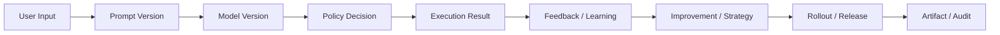

# Audit Lineage And Retention Contract

---

## OAPEFLIR Association

This contract participates in the following stages of the OAPEFLIR 8-stage loop:

- **Observe**: Signal collection and aggregation
- **Assess**: Pre-execution assessment and risk judgment
- **Plan**: Task decomposition and DAG construction
- **Execute**: Step execution and fault tolerance
- **Feedback**: Signal collection and preprocessing
- **Learn**: Pattern detection and knowledge extraction
- **Improve**: Improvement candidate evaluation and rollout
- **Release**: Controlled release and rollback

---

## 1. Scope

This contract defines industrial-grade audit, evidence chain, data retention, and deletion strategy.

Related Documents:

- `data_classification_and_prompt_handling_contract.md`
- `storage_schema_contract.md`
- `tenant_and_organization_contract.md`

## 2. Goals

- Enable key behaviors to be traced back to people, systems, versions, and policies.
- Enable enterprises to export evidence chains.
- Make retention / deletion not just a slogan, but with objects, time limits, and exception rules.

## 3. Evidence Chain Objects

- `model_version_evidence`
- `prompt_version_evidence`
- `policy_decision_evidence`
- `approval_evidence`
- `data_lineage_evidence`
- `release_bundle_evidence`
- `strategy_version_evidence`
- `rollout_evidence`
- `feedback_lineage_evidence`
- `knowledge_provenance_evidence`
- `memory_promotion_evidence`

## 4. Audit Subjects

Unified actor model:

- `user`
- `agent`
- `system`
- `scheduler`
- `admin`
- `webhook`
- `recovery`

Explanation: `recovery` represents changes automatically triggered by recovery chain (recovery coordinator, stale lease reclamation, reconciliation scans, etc.). The difference from `system` is: `system` is normal system behavior during operation, while `recovery` is system behavior on exception recovery path; the two should be distinguishable in audit and alerting.

## 5. Minimum Audit Fields

- `audit_id`
- `actor_type`
- `actor_id`
- `tenant_id?`
- `workspace_id?`
- `task_id?`
- `execution_id?`
- `action`
- `resource_ref`
- `decision_ref?`
- `version_ref?`
- `created_at`

## 6. Data Retention Tiering

| Data Type | Minimum Requirement |
| --- | --- |
| task / execution core records | Longer than business accountability window |
| audit log | Longer than security audit window |
| artifact | Retained according to business and compliance policy |
| PII derived data | Must support deletion SLA |
| backup | Must have deletion and legal preservation exception rules |

### 6.1 Event Retention Policy (`ObservabilityRetentionPolicy`)

Set retention days by event tier:

| tier | Default Retention | Description |
| --- | --- | --- |
| `tier_1` | `null` (never auto-delete) | Key factual events, require long-term traceability |
| `tier_2` | `14` days | At-least-once events,过期后可清理 |
| `tier_3` | `3` days | Best-effort events, short-cycle cleanup |

Event deletable conditions:

- Retention period for the tier has elapsed
- **AND** associated task has reached terminal state (`done / failed / cancelled`) or task is empty

### 6.2 Message Retention Policy

- Default retention: `30` days
- Message types in `preservedMessageTypes` allowlist are never auto-deleted (e.g., `compaction_summary`, `approval_decision`)
- Message deletable conditions:
  - Created time exceeds retention period
  - Message type is not in preserved allowlist
  - **AND** associated session and task have both reached terminal state

### 6.3 Protection Rules

- All messages of active sessions (non-terminal) are protected, even if associated task has reached terminal state.
- `CompactionRecord` is never auto-deleted (compression records are key lineage for context reconstruction).
- Retention policy supports two modes: `dry_run` and `enforced`; `dry_run` only generates reports without executing deletion.

## 7. Deletion and Exceptions

- PII deletion requests must have SLA.
- When legal hold is in effect, associated objects can pause deletion, but must have audit trail.
- Backup deletion and primary database deletion must be distinguished and explained.
- Retention policy execution results must generate `ObservabilityRetentionReport`, containing cleanup statistics for each tier and message type.

## 8. Lineage Relationships

## 9. Export Requirements

Production system should support exporting:

- Designated task audit package
- Designated tenant audit package
- Designated time window security events
- prompt/model/policy version correspondence
- Complete feedback -> learning -> improvement -> rollout lineage

## 10. Conclusion

Industrial-grade systems must not only "be able to log", but also prove:

- Who did it
- What version was used
- Why it was allowed
- Where the data came from and where it flowed
