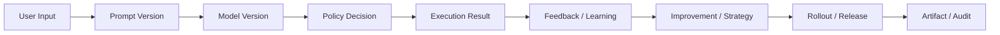

# Audit Lineage And Retention Contract

---

## OAPEFLIR Association

This contract participates in the following stages of the OAPEFLIR 8-stage loop:

- **Observe**: Signal collection and aggregation
- **Assess**: Pre-execution assessment and risk judgment
- **Plan**: Task decomposition and DAG construction
- **Execute**: Step execution and fault tolerance
- **Feedback**: Signal collection and preprocessing
- **Learn**: Pattern detection and knowledge extraction
- **Improve**: Improvement candidate evaluation and rollout
- **Release**: Controlled release and rollback

---

## 1. Scope

This contract defines industrial-grade auditing, evidence chains, data retention, and deletion policies.

Related documents:

- `data_classification_and_prompt_handling_contract.md`
- `storage_schema_contract.md`
- `tenant_and_organization_contract.md`

## 2. Objectives

- Make key actions traceable to people, systems, versions, and policies.
- Enable enterprises to export evidence chains.
- Make retention / deletion not just a slogan, but with objects, time limits, and exception rules.

## 3. Evidence Chain Objects

- `model_version_evidence`
- `prompt_version_evidence`
- `policy_decision_evidence`
- `approval_evidence`
- `data_lineage_evidence`
- `release_bundle_evidence`
- `strategy_version_evidence`
- `rollout_evidence`
- `feedback_lineage_evidence`
- `knowledge_provenance_evidence`
- `memory_promotion_evidence`

## 4. Audit Subjects

Unified actor model:

- `user`
- `agent`
- `system`
- `scheduler`
- `admin`
- `webhook`
- `recovery`

Note: `recovery` represents changes automatically triggered by the recovery chain (recovery coordinator, stale lease reclamation, reconciliation scans, etc.). The distinction from `system` is: `system` is normal runtime system behavior, while `recovery` is system behavior during exception recovery paths. Both should be distinguishable in auditing and alerting.

## 5. Minimum Audit Fields

- `audit_id`
- `actor_type`
- `actor_id`
- `tenant_id?`
- `workspace_id?`
- `task_id?`
- `harness_run_id?`
- `node_run_id?`
- `execution_id?` (legacy query key)
- `action`
- `resource_ref`
- `decision_ref?`
- `version_ref?`
- `created_at`

## 6. Data Retention Tiers

| Data Type | Minimum Requirement |
| --- | --- |
| task / execution core records | longer than business accountability window |
| audit log | longer than security audit window |
| artifact | retained according to business and compliance policies |
| PII-derived data | must support deletion SLA |
| backup | must have deletion and legal preservation exception rules |

### 6.1 Event Retention Policy (`ObservabilityRetentionPolicy`)

Set retention days by event tier:

| tier | Default Retention | Description |
| --- | --- | --- |
| `tier_1` | `null` (never auto-delete) | Critical factual events, require long-term traceability |
| `tier_2` | `14` days | At-least-once events, can be cleaned up after expiration |
| `tier_3` | `3` days | Best-effort events, short-cycle cleanup |

Event deletability conditions:

- The retention period for the tier has expired
- **AND** the associated task has reached a terminal state (`done / failed / cancelled`) or the task is empty

### 6.2 Message Retention Policy

- Default retention: `30` days
- Message types in the `preservedMessageTypes` whitelist are never auto-deleted (e.g., `compaction_summary`, `approval_decision`)
- Message deletability conditions:
  - Created time exceeds retention period
  - Message type is not in the preserved whitelist
  - **AND** both associated session and task have reached terminal states

### 6.3 Protection Rules

- All messages in active sessions (non-terminal) are protected, even if the associated task has reached terminal state.
- `CompactionRecord` is never auto-deleted (compaction records are key lineage for context reconstruction).
- Retention policies support both `dry_run` and `enforced` modes: `dry_run` only generates reports without executing deletions.

## 7. Deletion and Exceptions

- PII deletion requests must have SLAs.
- When legal hold is in effect, related objects may pause deletion, but must have audit traces.
- Backup deletion and primary database deletion must be distinguished and explained.
- Retention policy execution results must generate `ObservabilityRetentionReport`, including cleanup statistics for each tier and message type.

## 8. Lineage Relationships

## 9. Export Requirements

Production systems should support exports:

- Designated task audit packages
- Designated tenant audit packages
- Designated time-window security events
- Prompt/model/policy version correspondence
- Complete lineage of feedback -> learning -> improvement -> rollout

## 10. Closure Conclusion

Industrial-grade systems must not only "be able to log," but also prove:

- Who did it
- What version was used
- Why it was allowed
- Where the data came from and where it went