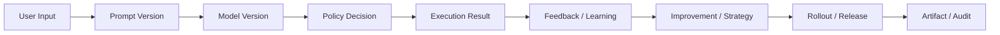

# Audit Lineage And Retention Contract

---

## OAPEFLIR 关联

本 contract 参vs OAPEFLIR 八阶段循环中的以下阶段：

- **Observe**：信号采集vs聚合
- **Assess**：执lines前评估vs风险判断
- **Plan**：任务分解vs DAG 构建
- **Execute**：步骤执linesvs容错
- **Feedback**：信号收集vs预handle
- **Learn**：模式检测vs知识提取
- **Improve**：改进候选评估vs rollout
- **Release**：受控发布vs回滚

---

## 1. 范围

本 contract defines工业级审计、证据链、data保留vs删除策略。

相关文档：

- `data_classification_and_prompt_handling_contract.md`
- `storage_schema_contract.md`
- `tenant_and_organization_contract.md`

## 2. 目标

- 让关键lines为可追溯到人、系统、版本和策略。
- 让企业可export证据链。
- 让 retention / deletion 不is一句口号，而is带对象、时限和例外规则。

## 3. 证据链对象

- `model_version_evidence`
- `prompt_version_evidence`
- `policy_decision_evidence`
- `approval_evidence`
- `data_lineage_evidence`
- `release_bundle_evidence`
- `strategy_version_evidence`
- `rollout_evidence`
- `feedback_lineage_evidence`
- `knowledge_provenance_evidence`
- `memory_promotion_evidence`

## 4. 审计主体

统一 actor model：

- `user`
- `agent`
- `system`
- `scheduler`
- `admin`
- `webhook`
- `recovery`

Description：`recovery` table示由恢复链（recovery coordinator、stale lease 回收、reconciliation 扫描等）自动触发的变更。vs `system` 的区别在于：`system` is正常运lines时的系统lines为，`recovery` is异常恢复路径的系统lines为，两者在审计和告警层面应可区分。

## 5. 最小审计字段

- `audit_id`
- `actor_type`
- `actor_id`
- `tenant_id?`
- `workspace_id?`
- `task_id?`
- `harness_run_id?`
- `node_run_id?`
- `execution_id?`（legacy query key）
- `action`
- `resource_ref`
- `decision_ref?`
- `version_ref?`
- `created_at`

## 6. data保留分层

| dataclass型 | 最小要求 |
| --- | --- |
| task / execution 核心record | 长于业务追责窗口 |
| audit log | 长于security审计窗口 |
| artifact | 按业务vs合规策略保留 |
| PII 派生data | 需supported删除 SLA |
| backup | 必须有删除vs法务保全例外规则 |

### 6.1 事件保留策略（`ObservabilityRetentionPolicy`）

按事件 tier 分级设置保留天数：

| tier | defaults to保留 | Description |
|---|-------|--------|
| `tier_1` | `null`（永不自动删除） | 关键事实事件，需长期可追溯 |
| `tier_2` | `14` 天 | at-least-once 事件，过期后可清理 |
| `tier_3` | `3` 天 | best-effort 事件，短cycle清理 |

事件可删除条件：

- 所属 tier 的保留期已到
- **且**关联任务已达终态（`done / failed / cancelled`）或任务为空

### 6.2 消息保留策略

- defaults to保留：`30` 天
- `preservedMessageTypes` 白名单内的消息class型永不自动删除（如 `compaction_summary`、`approval_decision`）
- 消息可删除条件：
  - 创建timeexceeds过保留期
  - 消息class型不在 preserved 白名单内
  - **且**关联 session 和 task 均已达终态

### 6.3 保护规则

- 活跃 session（非终态）的所有消息都受保护，即使关联 task 已终态。
- `CompactionRecord` 永不自动删除（压缩recordis上下文重建的关键 lineage）。
- 保留策略supported `dry_run` 和 `enforced` 两种模式：`dry_run` 只生成报告不执lines删除。

## 7. 删除vs例外

- PII 删除request必须有 SLA。
- legal hold 生效时，相关对象可暂停删除，但必须有审计痕迹。
- backup 删除vs主库删除必须区分Description。
- 保留策略执lines结果必须生成 `ObservabilityRetentionReport`，contains每个 tier 和消息class型的清理统计。

## 8. Lineage 关系

## 9. export要求

生产系统应supportedexport：

- 指定任务审计包
- 指定租户审计包
- 指定time窗security事件
- prompt/model/policy 版本对应关系
- feedback -> learning -> improvement -> rollout 的完整 lineage

## 10. 收口Conclusion

工业级系统不只要“能记日志”，还要能证明：

- 谁做的
- 用了什么版本
- 为什么被允许
- data从哪里来，流向哪里去
