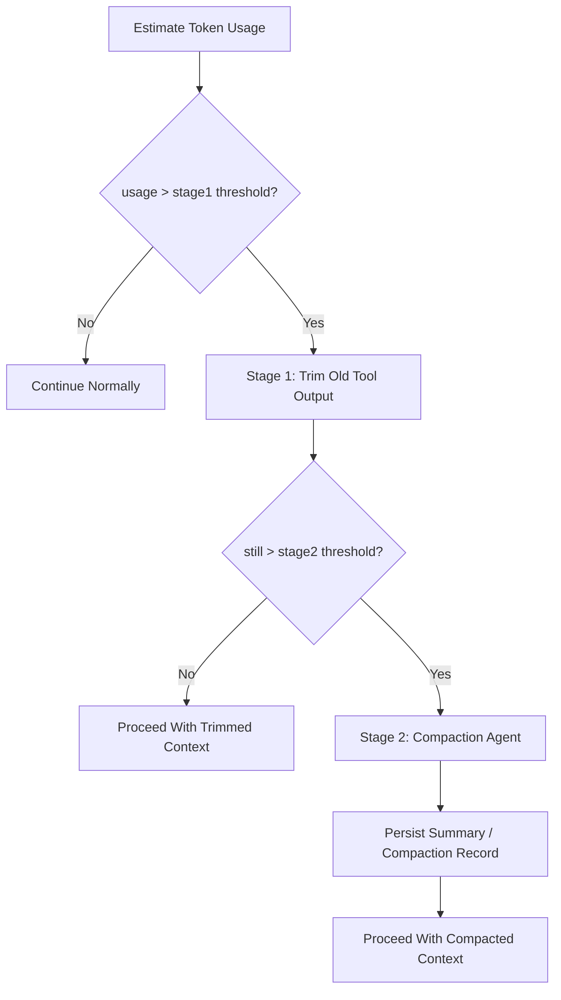

# Context Compaction And Overflow Contract

> **OAPEFLIR Related**: This contract defines the context management strategy for OAPEFLIR's 8 phases, corresponding to ADR-016 and ADR-060 Plan Hub.
> **Last Updated**: 2026-04-17

## 1. Scope

This contract defines a two-stage overflow handling strategy when LLM context approaches token limits.

Related Documents:

- `context_propagation_contract.md`
- `tool_output_sanitization_contract.md`
- `runtime_execution_contract.md`
- `cost_and_budget_contract.md`
- [ADR-060 Plan Hub](../adr/060-explicit-planning-hub.md)

## 2. Goals

The two-stage strategy must simultaneously:

- Minimize unnecessary compaction model call costs.
- Prioritize preserving user intent and recent execution facts in very long tasks.
- Prevent context compression from breaking main task success rate and recovery capability.

## 3. Core Principles

- Trim first, then compact; never immediately invoke the compaction agent.
- Prioritize trimming high-volume, low-information-density old tool outputs.
- User messages, system rules, and recent execution facts are preserved first.
- Compaction results must be traceable, replaceable, and recoverable.

## 4. Two-Stage Strategy

## 5. Threshold Model

Phase 1a/1b recommended minimum maintenance:

- `stage1_trigger_ratio`
- `stage2_trigger_ratio`
- `recent_tool_result_window`
- `compaction_max_frequency_per_session`

Recommended baselines:

- `stage1_trigger_ratio = 0.70`
- `stage2_trigger_ratio = 0.85`
- `recent_tool_result_window = 3`
- `reserved_output_budget_tokens = min(20000, provider_max_output_tokens)`

These thresholds are adjustable but must come from unified configuration, not scattered in call sites.
Rules:

- Overflow detection should not only look at "current usage" but also deduct model output reserved space, avoiding situations where input fills the context leaving no room for valid responses.
- If a provider explicitly states maximum output token capability, prioritize provider capability for reserved budget estimation; otherwise fall back to platform default reserved space.
- If KV cache fixed prefix is enabled, fixed prefix budget and variable suffix budget must be accounted separately; fixed prefix does not participate in normal overflow trimming.

## 6. Stage 1 Fast Trimming

Goals:

- Zero additional LLM cost
- Quickly reclaim context space

Rules:

- Scan messages from oldest to newest
- Prioritize handling `tool_result` / large external outputs
- Preserve the last `N` rounds of complete tool results
- Older tool results can be replaced with stable placeholder summaries, e.g., "Tool result trimmed"
- User messages, system prompts, approval decisions, and recent assistant plans default to not being trimmed
- Can declare `protected_parts` or equivalent lists, which must not be directly trimmed in Stage 1. Currently protected message types:
  - `user_request`: User request message
  - `assistant_plan`: Assistant planning message
  - `approval_decision`: Approval decision message
  - `compaction_summary`: Existing compaction summary
  - The latest user inbound message (regardless of `messageType`)
- If structured `FeedbackSignal` / `LearningObject` summaries have been injected into the context, they should be treated as protected parts to avoid losing critical evidence chains in Learn/Improve闭环.

Supplementary notes:

- Before entering true summarization, a `microcompact` lightweight local compaction step can be added, such as removing duplicate prefixes, trimming redundant blocks, or compressing low-value display messages.
- `microcompact` falls within Stage 1 scope and should not introduce additional model calls.

## 7. Stage 2 Compaction Agent

Triggered only when still exceeding threshold after Stage 1.

Output must include at least:

- `summary_text`
- `covered_message_range`
- `source_message_ids`
- `compaction_reason`
- `created_at`

Rules:

- Compaction results must be persisted, not just held in memory.
- Original messages covered by summaries must still be traceable to original records or artifacts.
- Consecutive compaction frequency in the same session should be limited (default `compaction_max_frequency_per_session = 2`) to avoid compaction recursion consuming context.
- Post-compaction cleanup should be executed after compaction, such as clearing temporary cache, resetting baseline, and recording new compact boundary.
- Overflow-triggered compaction and manually-triggered compaction must be distinguishable for later tuning.

## 8. Preservation Priority (Applicable to OAPEFLIR 8 Phases)

Recommended from high to low:

1. system / policy / runtime guardrail
2. Latest user request
3. Recent approvals and key status events
4. Recent assistant plans and result summaries
5. Last `N` rounds of complete tool results
6. Older tool results and lengthy outputs
7. Rebuildable display fragments, old retry records, and historical redundant progress messages

### 8.1 OAPEFLIR Phase-Specific Preservation Rules

| OAPEFLIR Phase | Protected Content | Reason |
|--------------|---------|------|
| Observe | Latest observation signals | Assess relies on |
| Assess | UnifiedAssessment results | Plan relies on |
| Plan | Plan DTO + version | Execute relies on (R3-SINGLE constraint) |
| Execute | DualChannelStepOutput | Feedback relies on |
| Feedback | FeedbackSignal[] | Learn evidence chain (R4-EVIDENCE) |
| Learn | LearningObject + evidence | Improve relies on |
| Improve | ImprovementCandidate | Rollout relies on |
| Rollout | RolloutRecord | Audit traceability |

## 9. `CompactionRecord`

| Field | Type | Description |
|---|-------|--------|
| `compaction_id` | `string` | Compaction record ID |
| `session_id` | `string` | Owning session |
| `task_id` | `string` | Owning task |
| `stage` | `trim \| summarize` | Current stage |
| `source_message_ids` | `string[]` | Covered messages |
| `summary_ref` | `string?` | Summary reference |
| `token_reduction_estimate` | `number` | Estimated token recovery |
| `created_at` | `timestamp` | Creation time |

## 10. Failure Semantics

- Stage 1 is local trimming and should not collapse entirely due to single tool result parsing failure.
- When Stage 2 compaction call fails, the system must fall back to Stage 1 results, preserve the trimmed context from Stage 1, and mark stage back to `trim` with `errorCode: "runtime.compaction_budget_exhausted"`, rather than silently losing context.
- If compaction failure blocks the main flow, it should return identifiable error codes rather than generalizing to provider's common errors.

Recommended error codes:

- `runtime.context_overflow`
- `provider.compaction_unavailable`
- `validation.compaction_record_invalid`
- `runtime.compaction_budget_exhausted`

## 11. Observability and Cost Requirements

Record at minimum:

- Current token usage ratio
- Whether Stage 1 was entered
- Whether Stage 2 was entered
- Compaction count
- Estimated token savings
- Compaction additional cost

Rules:

- Compaction is cost-sensitive and must be part of cost and observability systems.
- If certain task types frequently trigger Stage 2, feedback should go to prompt / tool output / workflow design, not just continuing to compress.

## 12. Recovery and Consistency

- When reassembling context after recovery, must identify which messages were trimmed and which were replaced by compaction summaries.
- Approval results, final state reasons, or recent critical plans must not be lost due to compression.
- Compaction must not change task main state, event facts, or audit records.
- If compaction is triggered by recovery, transport reconstruction, or session re-entry, must preserve compaction lineage to avoid summarizing the same message segment repeatedly.
- If overflow is triggered by provider switch or auth profile change, must recalculate usable budget rather than using old model's context thresholds.
- If fixed prefix KV cache is enabled, must first restore prefix/domain block boundaries after recovery, then restore variable suffix; prefix fragments must not be repeatedly stuffed into summary.

## 12A. KV Cache Fixed Prefix Coordination

When fixed prefix cache is enabled, system prompt must be split at minimum into:

1. `fixed_prefix`
2. `domain_block`
3. `variable_suffix`

Rules:

- `fixed_prefix` is a cross-agent shared block and defaults to not participating in Stage 1/2 compaction.
- `domain_block` can reuse cache key when domain is unchanged, but should still be counted into static prefix space.
- `variable_suffix` is the main object of normal overflow management.
- If compaction record covers `variable_suffix`, must preserve the `fixed_prefix_cache_key` or equivalent hash used at that time for later reuse and diagnosis.

## 13. Phase Boundaries

Phase 1a does:

- Token usage estimation
- Stage 1 fast trimming

Phase 1b does:

- Stage 2 compaction agent
- Compaction record persistence

Currently does not do:

- Multi-layer semantic memory automatic refill
- Cross-session intelligent summary fusion
- Embedding-based context automatic reordering

## 14. Closure Conclusion

The correct response to context overflow is not "summarize earlier and more frequently", but first use the lowest-cost trimming to reclaim space, then hand truly important long-term semantics to compaction.