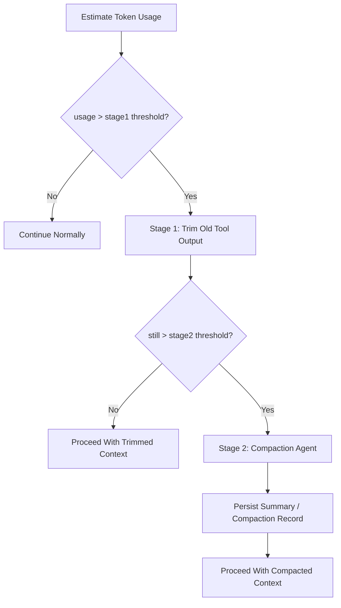

# Context Compaction And Overflow Contract

> **OAPEFLIR Related**: This contract defines context management strategy for OAPEFLIR 8 stages, corresponding to ADR-016 and ADR-060 Plan Hub.
> **Updated**: 2026-04-17

## 1. Scope

This contract defines a two-stage overflow handling strategy when LLM context approaches token limit.

Related documents:

- `context_propagation_contract.md`
- `tool_output_sanitization_contract.md`
- `runtime_execution_contract.md`
- `cost_and_budget_contract.md`
- [ADR-060 Plan Hub](../adr/060-explicit-planning-hub.md)

## 2. Goals

Two-stage strategy must simultaneously achieve:

- Minimize unnecessary compaction model call costs.
- Prioritize preserving user intent and recent execution facts in ultra-long tasks.
- Do not let context compaction destroy main task success rate and recoverability.

## 3. Core Principles

- First trim, then compress; never directly invoke compaction agent from the start.
- Prioritize trimming old tool outputs with high volume and low information density.
- User messages, system rules, and recent execution facts are prioritized for preservation.
- Compaction results must be traceable, replaceable, and recoverable.

## 4. Two-Stage Strategy

## 5. Threshold Model

Phase 1a / 1b recommends maintaining at minimum:

- `stage1_trigger_ratio`
- `stage2_trigger_ratio`
- `recent_tool_result_window`
- `compaction_max_frequency_per_session`

Recommended baseline:

- `stage1_trigger_ratio = 0.70`
- `stage2_trigger_ratio = 0.85`
- `recent_tool_result_window = 3`
- `reserved_output_budget_tokens = min(20000, provider_max_output_tokens)`

These thresholds are adjustable but must come from unified configuration, not scattered in call sites.
Rules:

- Overflow judgment should not only look at "how much is currently used", but also deduct model output reserved area to avoid having no space for valid reply after input just fills up.
- If provider explicitly provides maximum output token capability, prioritize estimating reserved budget by provider capability; otherwise fall back to platform default reserved area.
- If KV cache fixed prefix is enabled, fixed prefix budget and variable suffix budget must be accounted separately; fixed prefix does not participate in normal overflow trimming.

## 6. Stage 1 Fast Trimming

Goals:

- Zero additional LLM cost
- Quick context space recovery

Rules:

- Scan from oldest to newest by message timestamp
- Prioritize processing `tool_result` / large external outputs
- Preserve the last `N` rounds of tool result complete content
- Older tool results can be replaced with stable placeholder summaries, e.g., "Tool result trimmed"
- User messages, system prompt, approval decisions, and recent assistant plans are not trimmed by default
- Can declare `protected_parts` or equivalent allowlist, must not be directly trimmed in Stage 1. Currently protected message types:
  - `user_request`: User request message
  - `assistant_plan`: Assistant planning message
  - `approval_decision`: Approval decision message
  - `compaction_summary`: Existing compression summary
  - Latest user inbound message (regardless of `messageType`)
- If structured `FeedbackSignal` / `LearningObject` summary has been injected into context, they should be handled as protected parts to avoid losing key evidence chain in Learn / Improve closed loop.

Supplementary notes:

- Before entering actual summarization, a local lightweight contraction step like `microcompact` can be added, such as removing duplicate prefixes, trimming redundant blocks, or compressing low-value display messages.
- `microcompact` is within Stage 1 scope and should not introduce additional model calls.

## 7. Stage 2 Compaction Agent

Triggered only when still exceeding threshold after Stage 1.

Output must include at minimum:

- `summary_text`
- `covered_message_range`
- `source_message_ids`
- `compaction_reason`
- `created_at`

Rules:

- Compaction results must be persisted, not just kept in memory.
- Original messages covered by summary must still be traceable to original record or artifact.
- Consecutive compaction frequency in the same session should be limited (default `compaction_max_frequency_per_session = 2`) to avoid compaction recursion devouring context.
- After compaction completes, post-compaction cleanup should be executed, such as clearing temporary cache, resetting baseline, and recording new compact boundary.
- Overflow-triggered compaction and manually-triggered compaction must be distinguishable for subsequent tuning.

## 8. Preservation Priority (Applicable to OAPEFLIR 8 Stages)

Recommended from high to low:

1. system / policy / runtime guardrail
2. Latest user request
3. Recent approvals and key status events
4. Recent assistant plans and result summaries
5. Last `N` rounds of complete tool results
6. Older tool results and lengthy outputs
7. Display fragments that can be reconstructed, old retry records, and historically redundant progress messages

### 8.1 OAPEFLIR Stage-Specific Preservation Rules

| OAPEFLIR Stage | Protected Content | Reason |
|--------------|---------|------|
| Observe | Latest observation signals | Assess dependency |
| Assess | UnifiedAssessment results | Plan dependency |
| Plan | Plan DTO + version | Execute dependency (R3-SINGLE constraint) |
| Execute | DualChannelStepOutput | Feedback dependency |
| Feedback | FeedbackSignal[] | Learn evidence chain (R4-EVIDENCE) |
| Learn | LearningObject + evidence | Improve dependency |
| Improve | ImprovementCandidate | Rollout dependency |
| Rollout | RolloutRecord | Audit traceability |

## 9. `CompactionRecord`

| Field | Type | Description |
| --- | --- | --- |
| `compaction_id` | `string` | Compression record ID |
| `session_id` | `string` | Session it belongs to |
| `task_id` | `string` | Task it belongs to |
| `stage` | `trim \| summarize` | Current stage |
| `source_message_ids` | `string[]` | Covered messages |
| `summary_ref` | `string?` | Summary reference |
| `token_reduction_estimate` | `number` | Estimated token recovery |
| `created_at` | `timestamp` | Generation time |

## 10. Failure Semantics

- Stage 1 is local trimming and should not crash entirely due to single tool result parsing failure.
- When Stage 2 compaction call fails, system must fall back to Stage 1 result, preserve Stage 1 trimmed context, and mark stage back to `trim` with `errorCode: "runtime.compaction_budget_exhausted"`, instead of silently losing context.
- If compaction failure blocks main flow, should return identifiable error code instead of generalizing to provider common error.

Recommended error codes:

- `runtime.context_overflow`
- `provider.compaction_unavailable`
- `validation.compaction_record_invalid`
- `runtime.compaction_budget_exhausted`

## 11. Observability and Cost Requirements

Record at minimum:

- Current token occupancy ratio
- Whether Stage 1 was entered
- Whether Stage 2 was entered
- Compaction count
- Estimated saved tokens
- Compaction additional cost

Rules:

- Compaction is a cost-sensitive action and must enter cost and observability system.
- If a certain task type frequently triggers Stage 2, should feedback to prompt / tool output / workflow design, not just continue compressing.

## 12. Recovery and Consistency

- When recovering and reassembling context, must be able to identify which messages have been trimmed and which have been replaced by compaction summary.
- Approval results, final state reasons, or recent key plans must not be lost due to compression.
- Compaction must not change task main state, event facts, or audit records.
- If compaction is triggered by recovery, transport reconstruction, or session re-entry, must preserve compaction lineage to avoid repeatedly summarizing the same message segment.
- If overflow is triggered by provider switch or auth profile change, must recalculate usable budget, not follow old model's context threshold.
- If fixed prefix KV cache is enabled, after recovery must first restore prefix/domain block boundary, then restore variable suffix; must not repeatedly compress prefix fragments into summary.

## 12A. KV Cache Fixed Prefix Linkage

When fixed prefix cache is enabled, system prompt is split at minimum into:

1. `fixed_prefix`
2. `domain_block`
3. `variable_suffix`

Rules:

- `fixed_prefix` is a cross-agent shared block and does not participate in Stage 1/2 compaction by default.
- `domain_block` can reuse cache key when domain is unchanged, but still counts toward static prefix space.
- `variable_suffix` is the main object of normal overflow management.
- If compaction record covers `variable_suffix`, must preserve the `fixed_prefix_cache_key` or equivalent hash used at that time for subsequent reuse and diagnosis.

## 13. Phase Boundaries

Phase 1a does:

- Token occupancy estimation
- Stage 1 fast trimming

Phase 1b does:

- Stage 2 compaction agent
- Compaction record persistence

Currently does not do:

- Multi-layer semantic memory automatic backfill
- Cross-session intelligent summary fusion
- Embedding-based context automatic reordering

## 14. Closure Conclusion

The correct response to context overflow is not "summarize earlier and more frequently", but first use lowest-cost trimming to recover space, then delegate truly needed long-term semantics to compaction.