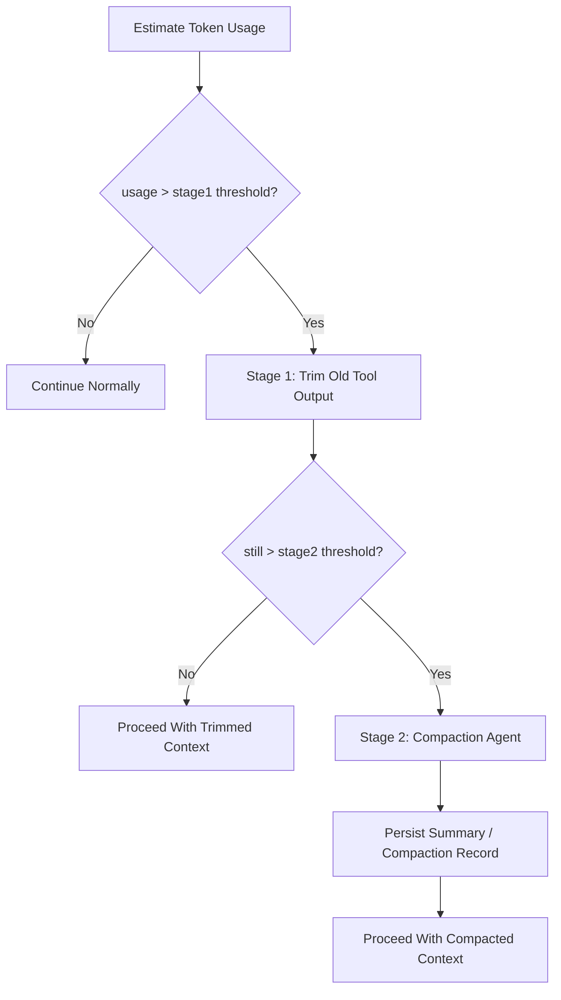

# Context Compaction And Overflow Contract

## 1. Scope

This contract defines a two-stage overflow handling strategy when LLM context approaches token limits.

Related documents:

- `context_propagation_contract.md`
- `tool_output_sanitization_contract.md`
- `runtime_execution_contract.md`
- `cost_and_budget_contract.md`

## 2. Goals

The two-stage strategy must simultaneously achieve:

- Minimize unnecessary compaction model call costs.
- Prioritize preserving user intent and recent execution facts in long-running tasks.
- Not let context compression break main task success rate and recovery capability.

## 3. Core Principles

- Trim first, then compact; do not directly call the compaction agent from the start.
- Prioritize trimming old tool outputs with high volume and low information density.
- User messages, system rules, and recent execution facts are preserved first.
- Compaction results must be traceable, replaceable, and recoverable.

## 4. Two-Stage Strategy

## 5. Threshold Model

Phase 1a / 1b should at minimum maintain:

- `stage1_trigger_ratio`
- `stage2_trigger_ratio`
- `recent_tool_result_window`
- `compaction_max_frequency_per_session`

Recommended baselines:

- `stage1_trigger_ratio = 0.70`
- `stage2_trigger_ratio = 0.85`
- `recent_tool_result_window = 3`
- `reserved_output_budget_tokens = min(20000, provider_max_output_tokens)`

These thresholds are adjustable but must come from unified configuration, not scattered at call sites.
Rules:

- Overflow judgment should not only look at "how much is currently used" but also deduct the model output reserve area to avoid having no space to generate valid responses after the input is just filled.
- If the provider explicitly gives maximum output token capability, prioritize estimating the reserve budget according to provider capability; otherwise fall back to platform default reserve area.
- If KV cache fixed prefix is enabled, fixed prefix budget and variable suffix budget must be accounted separately; fixed prefix does not participate in normal overflow trimming.

## 6. Stage 1 Fast Trimming

Goals:

- Zero additional LLM cost
- Rapidly reclaim context space

Rules:

- Scan messages from oldest to newest by time
- Prioritize processing `tool_result` / large external outputs
- Keep the complete content of the most recent `N` rounds of tool results
- Earlier tool results can be replaced with stable placeholder summaries, e.g., "Tool result trimmed"
- User messages, system prompts, approval decisions, and recent assistant plans are not trimmed by default
- `protected_parts` or equivalent allowlists can be declared; currently protected message types must not be directly trimmed in Stage 1:
  - `user_request`: User request message
  - `assistant_plan`: Assistant planning message
  - `approval_decision`: Approval decision message
  - `compaction_summary`: Existing compression summary
  - The latest user inbound message (regardless of `messageType`)
- If structured `FeedbackSignal` / `LearningObject` summaries have been injected into the context, they should be treated as protected parts to avoid losing key evidence chains in the Learn / Improve closed loop.

Supplementary notes:

- Before entering true summarization, a `microcompact` local lightweight contraction step can be added, such as removing duplicate prefixes, trimming redundant blocks, or compressing low-value display messages.
- `microcompact` is within Stage 1 scope and should not introduce additional model calls.

## 7. Stage 2 Compaction Agent

Triggered only when still exceeding threshold after Stage 1.

Output should at minimum include:

- `summary_text`
- `covered_message_range`
- `source_message_ids`
- `compaction_reason`
- `created_at`

Rules:

- Compaction results must be persisted, not just kept in memory.
- Original messages covered by summary must still be traceable to original records or artifacts.
- Continuous compaction frequency in the same session should be limited (default `compaction_max_frequency_per_session = 2`) to avoid compaction recursion devouring context.
- After compaction completes, post-compaction cleanup should be executed, such as clearing temporary cache, resetting baseline, and recording new compact boundary.
- Overflow-triggered compaction and manually-triggered compaction must be distinguishable for later tuning.

## 8. Retention Priority

Suggested from high to low:

1. system / policy / runtime guardrail
2. Latest user request
3. Recent approvals and key status events
4. Recent assistant plan and result summaries
5. Most recent `N` rounds of complete tool results
6. Older tool results and lengthy outputs
7. Rebuildable display fragments, old retry records, and historical redundant progress messages

## 9. `CompactionRecord`

| Field | Type | Description |
| --- | --- | --- |
| `compaction_id` | `string` | Compression record ID |
| `session_id` | `string` | Associated session |
| `task_id` | `string` | Associated task |
| `stage` | `trim \| summarize` | Current stage |
| `source_message_ids` | `string[]` | Covered messages |
| `summary_ref` | `string?` | Summary reference |
| `token_reduction_estimate` | `number` | Estimated tokens recovered |
| `created_at` | `timestamp` | Creation time |

## 10. Failure Semantics

- Stage 1 is local trimming and should not crash entirely due to single tool result parsing failure.
- When Stage 2 compaction call fails, the system must fall back to Stage 1 results, preserve the Stage 1 trimmed context, and mark stage back to `trim` with `errorCode: "runtime.compaction_budget_exhausted"`, not silently lose context.
- If compaction failure blocks the main flow, it should return a recognizable error code, not generalize to provider common errors.

Suggested error codes:

- `runtime.context_overflow`
- `provider.compaction_unavailable`
- `validation.compaction_record_invalid`
- `runtime.compaction_budget_exhausted`

## 11. Observability and Cost Requirements

Record at minimum:

- Current token usage ratio
- Whether Stage 1 was entered
- Whether Stage 2 was entered
- Compaction count
- Estimated savings tokens
- Compaction additional cost

Rules:

- Compaction is a cost-sensitive action and must enter the cost and observability system.
- If a certain type of task frequently triggers Stage 2, it should feedback to prompt / tool output / workflow design, not just continue compressing.

## 12. Recovery and Consistency

- When rebuilding context after recovery, must be able to identify which messages have been trimmed and which have been replaced by compaction summaries.
- Approval results, terminal state reasons, or recent key plans must not be lost due to compression.
- Compaction must not change task primary state, event facts, or audit records.
- If compaction is triggered by recovery, transport reconstruction, or session re-entry, compaction lineage must be preserved to avoid repeatedly summarizing the same message segment.
- If overflow is triggered by provider switch or auth profile change, usable budget must be recalculated, not continue using old model's context threshold.
- If fixed prefix KV cache is enabled, must first restore prefix/domain block boundary after recovery, then restore variable suffix; do not repeatedly compress prefix fragments into summary.

## 12A. KV Cache Fixed Prefix Integration

When fixed prefix cache is enabled, system prompt is at minimum split into:

1. `fixed_prefix`
2. `domain_block`
3. `variable_suffix`

Rules:

- `fixed_prefix` is a cross-agent shared block and does not participate in Stage 1/2 compaction by default.
- `domain_block` can reuse cache key when domain is unchanged but should still be counted into static prefix space.
- `variable_suffix` is the main object of normal overflow management.
- If compaction record covers `variable_suffix`, must preserve the `fixed_prefix_cache_key` or equivalent hash used at that time for later reuse and diagnostics.

## 13. Phase Boundaries

Phase 1a does:

- Token usage estimation
- Stage 1 fast trimming

Phase 1b does:

- Stage 2 compaction agent
- Compaction record persistence

Currently does not do:

- Multi-layer semantic memory auto-reinjection
- Cross-session intelligent summary fusion
- Embedding-based context automatic reordering

## 14. Closure Conclusion

The correct response to context overflow is not "summarize earlier and more frequently" but first use the lowest-cost trimming to reclaim space, then hand truly persistent long-term semantics to compaction.
