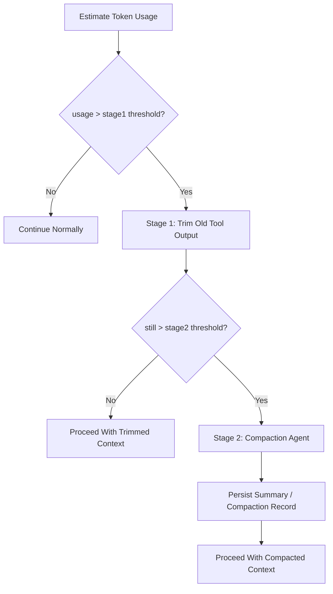

# Context Compaction And Overflow Contract

> **OAPEFLIR Related**: This contract defines the context management strategy for OAPEFLIR 8 stages, corresponding to ADR-016 and ADR-060 Plan Hub.
> **Updated**: 2026-04-17

## 1. Scope

This contract defines a two-stage overflow handling strategy when LLM context approaches token limit.

Related Documents:

- `context_propagation_contract.md`
- `tool_output_sanitization_contract.md`
- `runtime_execution_contract.md`
- `cost_and_budget_contract.md`
- [ADR-060 Plan Hub](../adr/060-explicit-planning-hub.md)

## 2. Goals

Two-stage strategy must simultaneously achieve:

- Minimize unnecessary compaction model call costs.
- Prioritize preserving user intent and recent execution facts in very long tasks.
- Do not let context compression destroy main task success rate and recovery capability.

## 3. Core Principles

- First trim, then compress; calling compaction agent upfront is not allowed.
- Prioritize trimming high-volume, low-information-density old tool outputs.
- User messages, system rules, and recent execution facts are prioritized for retention.
- Compaction results must be traceable, replaceable, and recoverable.

## 4. Two-Stage Strategy

## 5. Threshold Model

Phase 1a / 1b recommendations at least maintain:

- `stage1_trigger_ratio`
- `stage2_trigger_ratio`
- `recent_tool_result_window`
- `compaction_max_frequency_per_session`

Recommended baselines:

- `stage1_trigger_ratio = 0.70`
- `stage2_trigger_ratio = 0.85`
- `recent_tool_result_window = 3`
- `reserved_output_budget_tokens = min(20000, provider_max_output_tokens)`

These thresholds are adjustable but must come from unified configuration, not scattered at call sites.

Rules:

- Overflow judgment should not only look at "how much is currently used", but also deduct model output retention area to avoid having no space to generate valid response after input just fills up.
- If provider explicitly gives maximum output token capability, prioritize estimating retention budget according to provider capability; otherwise fall back to platform default retention area.
- If KV cache fixed prefix is enabled, fixed prefix budget and variable suffix budget must be accounted separately; fixed prefix does not participate in normal overflow trimming.

## 6. Stage 1 Fast Trimming

Goals:

- Zero additional LLM cost
- Quickly reclaim context space

Rules:

- Scan from oldest to newest by message time
- Prioritize processing `tool_result` / large external outputs
- Keep recent `N` rounds of tool result complete content
- Older tool results can be replaced with stable placeholder summaries, e.g., "Tool result trimmed"
- User messages, system prompt, approval decisions, and recent assistant plans are not trimmed by default
- `protected_parts` or equivalent allowlist can be declared, and must not be directly trimmed in Stage 1. Currently protected message types:
  - `user_request`: User request message
  - `assistant_plan`: Assistant planning message
  - `approval_decision`: Approval decision message
  - `compaction_summary`: Existing compression summary
  - Latest user inbound message (regardless of `messageType`)
- If structured `FeedbackSignal` / `LearningObject` summaries have been injected into context, they should be treated as protected parts to avoid losing key evidence chain in Learn / Improve closed loop.

Supplementary notes:

- Before entering real summarization, a local lightweight shrinkage step like `microcompact` can be added, such as removing duplicate prefixes, trimming redundant blocks, or compressing low-value display messages.
- `microcompact` belongs to Stage 1 scope and should not introduce additional model calls.

## 7. Stage 2 Compaction Agent

Triggered only when still exceeding threshold after Stage 1.

Output must at least include:

- `summary_text`
- `covered_message_range`
- `source_message_ids`
- `compaction_reason`
- `created_at`

Rules:

- Compaction results must be persisted, not just exist in memory.
- Original messages covered by summary must still be traceable to original records or artifacts.
- Continuous compaction frequency for the same session should be limited (default `compaction_max_frequency_per_session = 2`) to avoid compaction recursion devouring context.
- After compaction completes, post-compaction cleanup should be executed, such as clearing temporary cache, resetting baseline, and recording new compact boundary.
- Overflow-triggered compaction and manually-triggered compaction must be distinguishable for subsequent tuning.

## 8. Retention Priority (OAPEFLIR 8 Stages Applicable)

Recommended from high to low:

1. system / policy / runtime guardrail
2. Latest user request
3. Recent approvals and key status events
4. Recent assistant plan and result summary
5. Recent `N` rounds of complete tool results
6. Older tool results and lengthy outputs
7. Rebuildable display fragments, old retry records, and historical redundant progress messages

### 8.1 OAPEFLIR Stage-Specific Retention Rules

| OAPEFLIR Stage | Protected Content | Reason |
|--------------|---------|------|
| Observe | Latest observation signals | Assess depends on |
| Assess | UnifiedAssessment results | Plan depends on |
| Plan | Plan DTO + version | Execute depends on (R3-SINGLE constraint) |
| Execute | DualChannelStepOutput | Feedback depends on |
| Feedback | FeedbackSignal[] | Learn evidence chain (R4-EVIDENCE) |
| Learn | LearningObject + evidence | Improve depends on |
| Improve | ImprovementCandidate | Rollout depends on |
| Rollout | RolloutRecord | Audit traceability |

## 9. `CompactionRecord`

| Field | Type | Description |
| --- | --- | --- |
| `compaction_id` | `string` | Compaction record ID |
| `session_id` | `string` | Associated session |
| `task_id` | `string` | Associated task |
| `stage` | `trim \| summarize` | Current stage |
| `source_message_ids` | `string[]` | Covered messages |
| `summary_ref` | `string?` | Summary reference |
| `token_reduction_estimate` | `number` | Estimated token recovery |
| `created_at` | `timestamp` | Creation time |

## 10. Failure Semantics

- Stage 1 is local trimming and should not crash entirely due to single tool result parse failure.
- When Stage 2 compaction call fails, system must fall back to Stage 1 result, keep Stage 1 trimmed context, and mark stage back to `trim` with `errorCode: "runtime.compaction_budget_exhausted"`, rather than silently losing context.
- If compaction failure blocks main flow, a recognizable error code should be returned, not generalized as provider ordinary error.

Recommended error codes:

- `runtime.context_overflow`
- `provider.compaction_unavailable`
- `validation.compaction_record_invalid`
- `runtime.compaction_budget_exhausted`

## 11. Observability and Cost Requirements

At least record:

- Current token usage ratio
- Whether entering Stage 1
- Whether entering Stage 2
- Compaction count
- Estimated saved tokens
- Compaction additional cost

Rules:

- Compaction is a cost-sensitive action and must enter cost and observability system.
- If a certain task type frequently triggers Stage 2, feedback should be given to prompt / tool output / workflow design, not just continue compressing.

## 12. Recovery and Consistency

- When reassembling context after recovery, must be able to identify which messages have been trimmed and which have been replaced by compaction summary.
- Approval results, terminal state reasons, or recent key plans must not be lost due to compression.
- Compaction must not change task primary state, event facts, or audit records.
- If compaction is triggered by recovery, transport reconstruction, or session re-entry, compaction lineage must be preserved to avoid duplicate summarization of the same message segment.
- If overflow is triggered by provider switch or auth profile change, usable budget must be recalculated, not using old model's context threshold.
- If fixed prefix KV cache is enabled, prefix/domain block boundary must be restored first after recovery, then variable suffix; prefix fragments must not be repeatedly pressed into summary.

## 12A. KV Cache Fixed Prefix Linkage

When fixed prefix cache is enabled, system prompt is at least split into:

1. `fixed_prefix`
2. `domain_block`
3. `variable_suffix`

Rules:

- `fixed_prefix` is a cross-agent shared block and does not participate in Stage 1/2 compaction by default.
- `domain_block` can reuse cache key when domain is unchanged, but should still be counted into static prefix space.
- `variable_suffix` is the main object of normal overflow management.
- If compaction record covers `variable_suffix`, must preserve the `fixed_prefix_cache_key` or equivalent hash used at that time for subsequent reuse and diagnosis.

## 13. Phase Boundaries

Phase 1a does:

- Token usage estimation
- Stage 1 fast trimming

Phase 1b does:

- Stage 2 compaction agent
- Compaction record persistence

Currently not doing:

- Multi-layer semantic memory auto-replenishment
- Cross-session intelligent summary fusion
- Embedding-based context auto-reordering

## 14. Conclusion

The correct way to handle context overflow is not "summarize earlier and more frequently", but first reclaim space with the lowest-cost trimming, then hand truly long-term semantics to be preserved to compaction.
