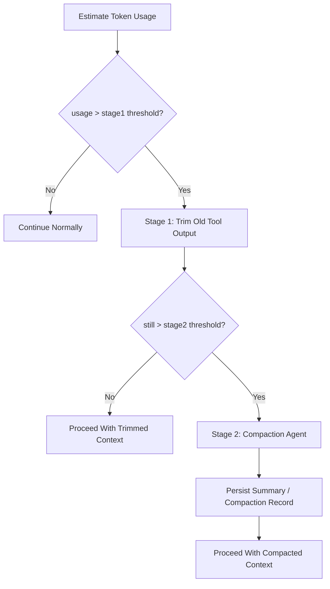

# Context Compaction And Overflow Contract

> **OAPEFLIR Association**: This contract defines context management strategies across the OAPEFLIR 8 stages, corresponding to ADR-016 and ADR-060 Plan Hub.
> **Update Date**: 2026-04-17

## 1. Scope

This contract defines a two-stage overflow handling strategy when LLM context approaches token limits.

Related documents:

- `context_propagation_contract.md`
- `tool_output_sanitization_contract.md`
- `runtime_execution_contract.md`
- `cost_and_budget_contract.md`
- [ADR-060 Plan Hub](../adr/060-explicit-planning-hub.md)

## 2. Goals

The two-stage strategy must simultaneously achieve:

- Minimize unnecessary compaction model call costs.
- Prioritize preserving user intent and recent execution facts in ultra-long tasks.
- Prevent context compression from undermining main task success rate and recovery capability.

## 3. Core Principles

- Trim first, then compact; do not immediately call the compaction agent.
- Prioritize cutting old tool outputs with high volume and low information density.
- Preserve user messages, system rules, and recent execution facts by priority.
- Compaction results must be traceable, replaceable, and recoverable.

## 4. Two-Stage Strategy

## 5. Threshold Model

Phase 1a / 1b should maintain at minimum:

- `stage1_trigger_ratio`
- `stage2_trigger_ratio`
- `recent_tool_result_window`
- `compaction_max_frequency_per_session`

Recommended baselines:

- `stage1_trigger_ratio = 0.70`
- `stage2_trigger_ratio = 0.85`
- `recent_tool_result_window = 3`
- `reserved_output_budget_tokens = min(20000, provider_max_output_tokens)`

These thresholds are adjustable but must come from unified configuration and must not be scattered in call sites.
Rules:

- Overflow judgment should not only look at "how much is currently used" but should also deduct the model output reserved area to avoid having no space to generate valid responses after input just fills up.
- If the provider explicitly states maximum output token capability, prioritize estimating reserved budget based on provider capability; otherwise fall back to platform default reserved area.
- If KV cache fixed prefix is enabled, fixed prefix budget and variable suffix budget must be accounted separately; fixed prefix does not participate in normal overflow trimming.

## 6. Stage 1 Fast Trimming

Goals:

- Zero additional LLM cost
- Rapid context space recovery

Rules:

- Scan from oldest to newest by message timestamp
- Prioritize processing `tool_result` / large external outputs
- Keep the latest `N` rounds of tool results complete
- Older tool results can be replaced with stable placeholder summaries, for example "Tool result trimmed"
- User messages, system prompt, approval decisions, and recent assistant plans are not trimmed by default
- `protected_parts` or equivalent allowlists can be declared; these must not be directly trimmed in Stage 1. Currently protected message types:
  - `user_request`: User request message
  - `assistant_plan`: Assistant planning message
  - `approval_decision`: Approval decision message
  - `compaction_summary`: Existing compression summary
  - The latest user inbound message (regardless of `messageType`)
- If structured `FeedbackSignal` / `LearningObject` summaries have been injected into context, they should be treated as protected parts to avoid losing key evidence chains in the Learn / Improve closed loop.

Supplementary notes:

- Before entering true summarization, a `microcompact` local lightweight compaction step can be added, such as removing duplicate prefixes, trimming redundant blocks, or compressing low-value display messages.
- `microcompact` falls within Stage 1 scope and should not introduce additional model calls.

## 7. Stage 2 Compaction Agent

Only triggered when still exceeding threshold after Stage 1.

Output must include at minimum:

- `summary_text`
- `covered_message_range`
- `source_message_ids`
- `compaction_reason`
- `created_at`

Rules:

- Compaction results must be persisted and not just exist in memory.
- Original messages covered by summarization must still be traceable to original records or artifacts.
- Consecutive compaction frequency in the same session should be limited (default `compaction_max_frequency_per_session = 2`) to avoid compaction recursion devouring context.
- After compaction completes, post-compaction cleanup should be executed, such as clearing temporary cache, resetting baselines, and recording new compact boundary.
- Overflow-triggered compaction and manually-triggered compaction must be distinguishable for subsequent tuning.

## 8. Retention Priority (Applicable to OAPEFLIR 8 Stages)

From high to low, recommended as follows:

1. system / policy / runtime guardrail
2. Latest user request
3. Recent approvals and key status events
4. Recent assistant plans and result summaries
5. Latest `N` rounds of complete tool results
6. Older tool results and lengthy outputs
7. Rebuildable display fragments, old retry records, and historically redundant progress messages

### 8.1 OAPEFLIR Stage-Specific Retention Rules

| OAPEFLIR Stage | Protected Content | Reason |
|--------------|---------|------|
| Observe | Latest observation signals | Assess dependency |
| Assess | UnifiedAssessment results | Plan dependency |
| Plan | Plan DTO + version | Execute dependency (R3-SINGLE constraint) |
| Execute | DualChannelStepOutput | Feedback dependency |
| Feedback | FeedbackSignal[] | Learn evidence chain (R4-EVIDENCE) |
| Learn | LearningObject + evidence | Improve dependency |
| Improve | ImprovementCandidate | Rollout dependency |
| Rollout | RolloutRecord | Audit traceability |

## 9. `CompactionRecord`

| Field | Type | Description |
| --- | --- | --- |
| `compaction_id` | `string` | Compaction record ID |
| `session_id` | `string` | Session |
| `task_id` | `string` | Task |
| `stage` | `trim \| summarize` | Current stage |
| `source_message_ids` | `string[]` | Messages covered |
| `summary_ref` | `string?` | Summary reference |
| `token_reduction_estimate` | `number` | Estimated token recovery |
| `created_at` | `timestamp` | Creation time |

## 10. Failure Semantics

- Stage 1 is local trimming and should not crash entirely due to a single tool result parsing failure.
- When Stage 2 compaction call fails, the system must fall back to Stage 1 results, keep the Stage 1-trimmed context, and mark stage back to `trim` with `errorCode: "runtime.compaction_budget_exhausted"`, rather than silently losing context.
- If compaction failure blocks the main flow, a recognizable error code should be returned, not generalized as provider ordinary errors.

Suggested error codes:

- `runtime.context_overflow`
- `provider.compaction_unavailable`
- `validation.compaction_record_invalid`
- `runtime.compaction_budget_exhausted`

## 11. Observability and Cost Requirements

Record at minimum:

- Current token usage ratio
- Whether entered Stage 1
- Whether entered Stage 2
- Compaction count
- Estimated token savings
- Compaction extra cost

Rules:

- Compaction is a cost-sensitive action and must enter the cost and observability system.
- If a certain task type frequently triggers Stage 2, feedback should be given to prompt / tool output / workflow design, not just continue compressing.

## 12. Recovery and Consistency

- When reassembling context after recovery, must identify which messages have been trimmed and which have been replaced by compaction summaries.
- Approval results, terminal state reasons, or recent key plans must not be lost due to compression.
- Compaction must not change task primary state, event facts, or audit records.
- If compaction is triggered by recovery, transport reconstruction, or session re-entry, compaction lineage must be preserved to avoid repeatedly summarizing the same message segment.
- If overflow is triggered by provider switch or auth profile change, usable budget must be recalculated rather than using old model's context thresholds.
- If fixed prefix KV cache is enabled, must first restore prefix/domain block boundaries after recovery, then restore variable suffix; must not repeatedly compress prefix fragments into summary.

## 12A. KV Cache Fixed Prefix Linkage

When fixed prefix cache is enabled, system prompt is at minimum divided into:

1. `fixed_prefix`
2. `domain_block`
3. `variable_suffix`

Rules:

- `fixed_prefix` is a cross-agent shared block and does not participate in Stage 1/2 compaction by default.
- `domain_block` can reuse cache key when domain is unchanged but still counts toward static prefix space.
- `variable_suffix` is the main object for normal overflow management.
- If compaction record covers `variable_suffix`, must preserve the `fixed_prefix_cache_key` or equivalent hash used at that time for subsequent reuse and diagnosis.

## 13. Phase Boundaries

Phase 1a does:

- Token usage estimation
- Stage 1 fast trimming

Phase 1b does:

- Stage 2 compaction agent
- Compaction record persistence

Currently does not do:

- Multi-layer semantic memory auto-replenishment
- Cross-session intelligent summary fusion
- Embedding-based context auto-reordering

## 14. Closure Conclusion

The correct response to context overflow is not "summarize earlier and more frequently" but first use the lowest-cost trimming to recover space, then hand the truly long-term semantics to be preserved to compaction.