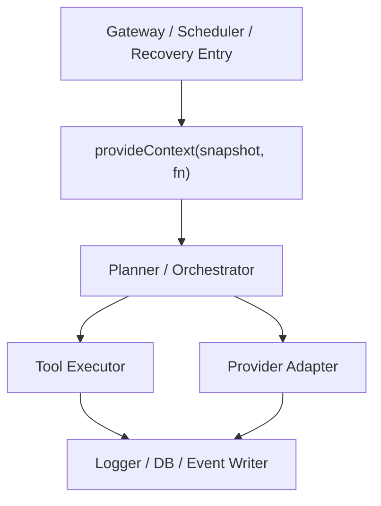

# Context Propagation Contract

> **OAPEFLIR Related**: This contract defines context propagation for OAPEFLIR's 8 phases, corresponding to ADR-016.
> **Last Updated**: 2026-04-17

## 1. Scope

This contract defines runtime context propagation rules based on `AsyncLocalStorage`, avoiding `taskId / sessionId / agentId / traceId / workdir` being passed through deep call chains.

Related Documents:

- `runtime_execution_contract.md`
- `app_error_contract.md`
- `observability_contract.md`
- `tool_and_provider_execution_contract.md`
- [ADR-016 OAPEFLIR 8-Phase Model](../adr/016-oapeflir-loop-model.md)

## 2. Goals

Phase 1a context propagation must at least ensure:

- Logs, DB, and tool execution can automatically obtain current run / node / attempt / trace.
- Cancellation, timeout, and recovery chains can read the same context snapshot.
- Explicit parameters only retain tool-specific configuration and no longer carry global runtime identity.

## 3. `RuntimeContextSnapshot`

| Field | Type | Description |
|---|-------|--------|
| `trace_id` | `string` | Trace tracking primary key |
| `span_id` | `string?` | Current span (aligned with `trace_and_root_cause_observability_contract.md` §3) |
| `parent_span_id` | `string?` | Parent span |
| `harness_run_id` | `string` | Current HarnessRun |
| `node_run_id` | `string?` | Current NodeRun |
| `attempt_id` | `string?` | Current NodeAttempt |
| `plan_graph_id` | `string?` | Current execution graph ID |
| `graph_version` | `integer?` | Current execution graph version |
| `task_id` | `string?` | Legacy task query entry |
| `execution_id` | `string?` | Legacy execution query entry |
| `workflow_id` | `string?` | Legacy workflow query entry |
| `session_id` | `string?` | Current session |
| `agent_id` | `string?` | Current agent |
| `division_id` | `string?` | Current division |
| `stage_view_ref` | `string?` | Current closed-loop stage view reference |
| `loop_iteration_view` | `integer?` | Current closed-loop iteration projection |
| `knowledge_namespace` | `string?` | Current knowledge namespace |
| `memory_layer` | `string?` | Current memory layer |
| `domain_id` | `string?` | Current domain |
| `ref_id` | `string?` | Current typed ref |
| `workdir` | `string?` | Current working directory |
| `request_id` | `string?` | Current external request |
| `approval_id` | `string?` | Current approval context |
| `abort_signal_ref` | `string?` | Cancellation signal reference |
| `budget_scope_id` | `string?` | Budget aggregation scope |

Note: `span_id` and `parent_span_id` are used to locate current execution position in the trace tree. Each time entering a new `NodeAttempt`, tool call, or LLM call, should update `span_id` via `withContextPatch` and push old `span_id` into `parent_span_id`. Phase 1a may not implement a complete span tree, but field positions should be reserved to avoid future breaking changes.

## 4. Propagation Entry Points

Must explicitly `provideContext(...)` from one of the following entry points:

- Gateway receives user request
- Scheduler / runtime creates execution
- Recovery chain re-takes over stale run
- Approval resume recovers execution

## 5. API Constraints

Minimum runtime interface recommended:

- `provideContext(snapshot, fn)`
- `getContext()`
- `getContextOrNull()`
- `withContextPatch(partial, fn)`
- `assertContext(requiredKeys)`

Rules:

- `getContext()` must explicitly throw on missing context and must not return pseudo-default values.
- `withContextPatch` can only overwrite local fields and must not silently lose existing identifiers.
- Background detached tasks must explicitly copy or rebuild context and must not rely on implicit inheritance.

## 6. Boundary with Explicit Parameters

Content that should be retained in explicit parameters:

- `timeout_ms`
- `tool arguments`
- `provider model`
- `sandbox options`
- `output destination`

Content that should no longer be passed through layers via explicit parameters:

- `harness_run_id`
- `node_run_id`
- `attempt_id`
- `plan_graph_id`
- `graph_version`
- `task_id`
- `session_id`
- `agent_id`
- `trace_id`
- `division_id`
- `stage_view_ref`
- `loop_iteration_view`
- `knowledge_namespace`
- `memory_layer`
- `domain_id`
- `ref_id`

## 7. Cancellation and Recovery Semantics

- The same context snapshot should be associated with a queryable cancellation signal reference.
- When recovering a new attempt, a new `attempt_id` must be created; if node-level recovery occurs, `node_run_id` or its attempt lineage must also be refreshed, while maintaining `harness_run_id / trace_id` continuity.
- Old attempt's ALS context must not be reused after recovery.

## 8. Observability and Audit Requirements

All structured logs, events, and DB writes must be able to obtain from context at minimum:

- `trace_id`
- `harness_run_id`
- `node_run_id?`
- `attempt_id?`
- `agent_id?`

Rules:

- If current operation lacks these key fields, should fail early rather than write unlinkable records.
- `actor` in audit logs must not conflict with runtime context fields.
- If compatibility layer still reads `task_id / execution_id`, must also be able to trace back to `harness_run_id / node_run_id / attempt_id` from the same snapshot.

## 9. Phase Boundaries

Phase 1a explicitly does:

- Single-process `AsyncLocalStorage`
- Unified read entry for runtime, tool, provider, logging, DB

Currently does not do:

- Cross-process automatic context propagation
- OpenTelemetry full链路 automatic injection
- Remote worker context federation

## 10. Testing Requirements

Must cover at minimum:

- Context not lost under nested async calls
- Context not crossed between concurrent tasks
- Detached task fails directly if context not explicitly provided
- After recovery attempt, `attempt_id` refreshed but `harness_run_id / trace_id` maintains lineage continuity

## 11. Closure Conclusion

The focus of context propagation is not about passing fewer parameters, but making "who is currently executing what" a fact that any runtime layer can reliably read.

## v4.3 Architecture Remediation

The following items fix contract deviations recorded in `platform-architecture-implementation-consistency-audit.md`. If historical paragraphs of this document conflict with this section, this section, `docs_zh/architecture/00-platform-architecture.md`, ADR-109 through ADR-113, and `src/platform/contracts/executable-contracts/` take precedence.

- T-18: This document originally used `task_id / execution_id / workflow_id` as ALS primary identity. Root cause: Context contract directly reused the old gateway/runtime parameter passing model and did not upgrade with the `HarnessRun / NodeRun / PlanGraphBundle / NodeAttempt` truth model. Fix: The body now elevates `harness_run_id / node_run_id / attempt_id / plan_graph_id / graph_version` to snapshot primary keys, with old fields retained only as compatibility query entries.

Mandatory rules: State transitions must go through `RuntimeStateMachine.transition(command)`; execution plans must use `PlanGraphBundle`; execution results must use `NodeAttemptReceipt`; truth events must use `platform.*`; OAPEFLIR can only be used as `oapeflir.view.*` / rationale projection; budget must use `BudgetLedger` / `BudgetReservation` / `BudgetSettlement`.