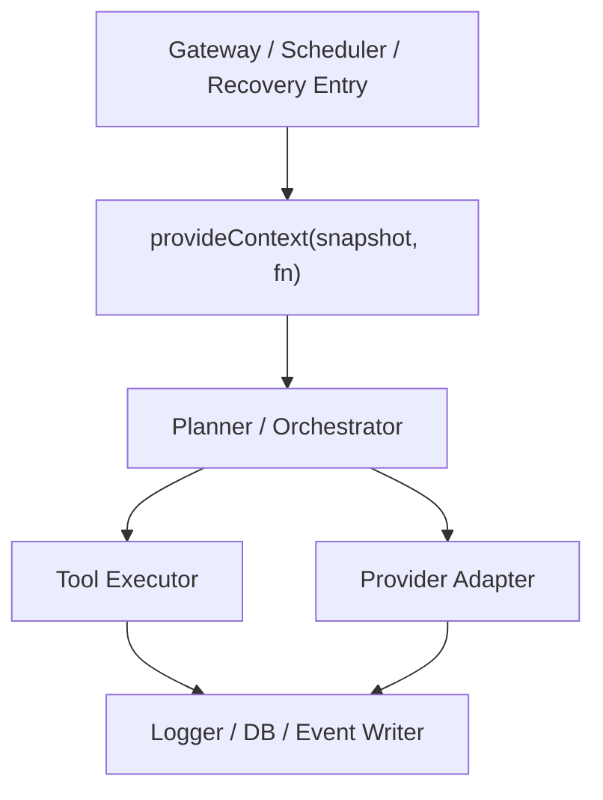

# Context Propagation Contract

## 1. Scope

This contract defines runtime context propagation rules based on `AsyncLocalStorage`, avoiding the need to pass `taskId / sessionId / agentId / traceId / workdir` through deep call chains.

Related documents:

- `runtime_execution_contract.md`
- `app_error_contract.md`
- `observability_contract.md`
- `tool_and_provider_execution_contract.md`

## 2. Goals

Phase 1a context propagation must at minimum guarantee:

- Logs, DB, and tool execution can automatically get current task / execution / trace.
- Cancellation, timeout, and recovery chains can read the same context snapshot.
- Explicit parameters only retain tool-specific configuration and no longer carry global runtime identity.

## 3. `RuntimeContextSnapshot`

| Field | Type | Description |
| --- | --- | --- |
| `trace_id` | `string` | Trace ID primary key |
| `span_id` | `string?` | Current span (aligned with `trace_and_root_cause_observability_contract.md` §3) |
| `parent_span_id` | `string?` | Parent span |
| `task_id` | `string` | Current task |
| `execution_id` | `string?` | Current execution |
| `workflow_id` | `string?` | Current workflow |
| `session_id` | `string?` | Current session |
| `agent_id` | `string?` | Current agent |
| `division_id` | `string?` | Current division |
| `oapeflir_stage` | `string?` | Current closed-loop stage |
| `loop_iteration` | `integer?` | Current closed-loop iteration |
| `knowledge_namespace` | `string?` | Current knowledge namespace |
| `memory_layer` | `string?` | Current memory layer |
| `domain_id` | `string?` | Current domain |
| `ref_id` | `string?` | Current typed ref |
| `workdir` | `string?` | Current working directory |
| `request_id` | `string?` | Current external request |
| `approval_id` | `string?` | Current approval context |
| `abort_signal_ref` | `string?` | Cancellation signal reference |
| `budget_scope_id` | `string?` | Budget aggregation scope |

Note: `span_id` and `parent_span_id` are used to locate the current execution position in the trace tree. Each time entering a new agent step, tool call, or LLM call, `span_id` should be updated via `withContextPatch` and old `span_id` pushed into `parent_span_id`. Phase 1a may not implement a complete span tree, but field positions should be reserved to avoid future breaking changes.

## 4. Propagation Entrypoints

Must explicitly `provideContext(...)` through one of the following entrypoints:

- Gateway receives user request
- Scheduler / runtime creates execution
- Recovery chain re-takes over stale run
- Approval resume restores execution

## 5. API Constraints

Minimum runtime interface suggestions:

- `provideContext(snapshot, fn)`
- `getContext()`
- `getContextOrNull()`
- `withContextPatch(partial, fn)`
- `assertContext(requiredKeys)`

Rules:

- `getContext()` must explicitly throw error when no context, not return a fake default.
- `withContextPatch` can only overwrite partial fields and must not silently lose existing identifiers.
- Background detached tasks must explicitly copy or rebuild context and cannot rely on implicit inheritance.

## 6. Boundary with Explicit Parameters

Content to keep in explicit parameters:

- `timeout_ms`
- `tool arguments`
- `provider model`
- `sandbox options`
- `output destination`

Content that should no longer be passed through explicit parameters layer by layer:

- `task_id`
- `session_id`
- `agent_id`
- `trace_id`
- `division_id`
- `oapeflir_stage`
- `loop_iteration`
- `knowledge_namespace`
- `memory_layer`
- `domain_id`
- `ref_id`

## 7. Cancellation and Recovery Semantics

- The same context snapshot should be associated with a queryable cancellation signal reference.
- When resuming a new execution, a new `execution_id` must be created but the same `task_id / trace_id` lineage can be reused.
- Old execution's ALS context must not continue to be reused after recovery.

## 8. Observability and Audit Requirements

All structured logs, events, and DB writes must at minimum be able to get from context:

- `trace_id`
- `task_id`
- `execution_id?`
- `agent_id?`

Rules:

- If the current operation lacks these key fields, it should fail early rather than write unassociable records.
- `actor` in audit logs must not conflict with runtime context fields.

## 9. Phase Boundaries

Phase 1a explicitly does:

- Single-process `AsyncLocalStorage`
- Unified read entrypoints for runtime, tool, provider, logging, DB

Currently does not do:

- Cross-process automatic context propagation
- OpenTelemetry full chain automatic injection
- Remote worker context federation

## 10. Testing Requirements

At minimum cover:

- Context not lost under nested async calls
- Context does not cross-talk between concurrent tasks
- Detached tasks fail directly if context not explicitly provided
- After recovering execution, `execution_id` is refreshed but `task_id / trace_id` maintains lineage continuity

## 11. Closure Conclusion

The focus of context propagation is not "passing fewer parameters" but making "who is currently executing what" a fact that any layer of the runtime can reliably read.
