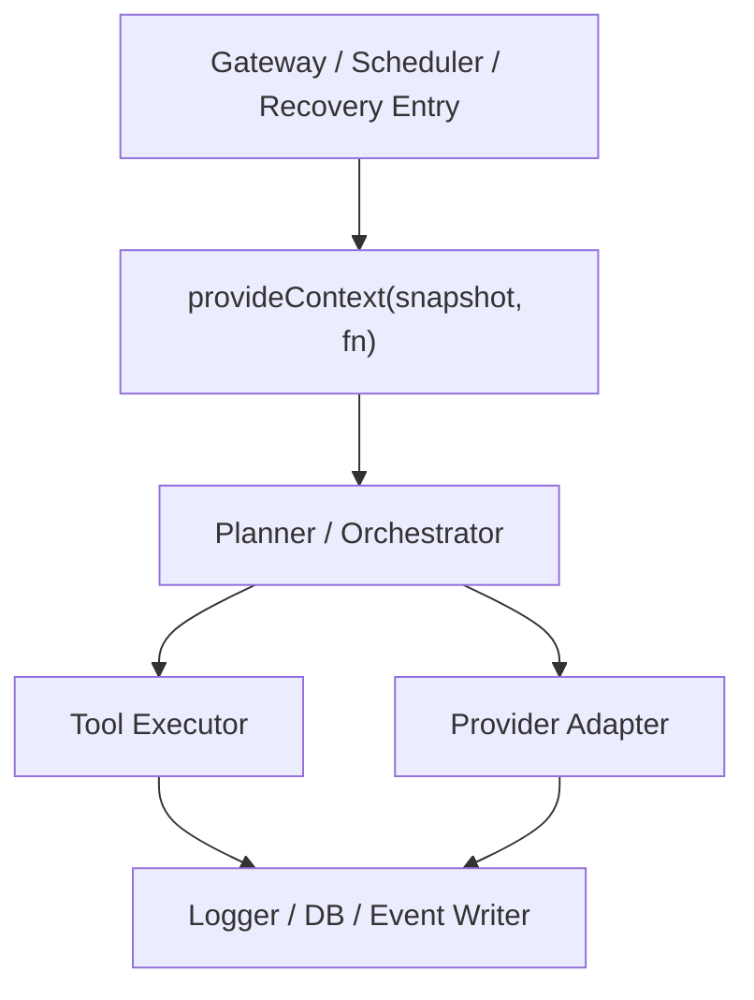

# Context Propagation Contract

> **OAPEFLIR 相关**：本 contract defines OAPEFLIR 8 阶段的上下文传播，对应 ADR-016。
> **更新日期**：2026-04-17

## 1. 范围

本 contract definesbased on `AsyncLocalStorage` 的运lines时上下文传播规则，避免 `taskId / sessionId / agentId / traceId / workdir` 在深层call链中层层透传。

相关文档：

- `runtime_execution_contract.md`
- `app_error_contract.md`
- `observability_contract.md`
- `tool_and_provider_execution_contract.md`
- [ADR-016 OAPEFLIR 八阶段模型](../adr/016-oapeflir-loop-model.md)

## 2. 目标

Phase 1a 的上下文传播至少要保证：

- 日志、DB、工具执lines能自动拿到当前 run / node / attempt / trace。
- 取消、timeout和恢复链能读取同一份上下文快照。
- 显式参数只保留工具特有configure，不继续承载globally运lines身份。

## 3. `RuntimeContextSnapshot`

| 字段 | class型 | Description |
|---|-------|--------|
| `trace_id` | `string` | 链路追踪主键 |
| `span_id` | `string?` | 当前 span（对齐 `trace_and_root_cause_observability_contract.md` §3） |
| `parent_span_id` | `string?` | 父 span |
| `harness_run_id` | `string` | 当前 HarnessRun |
| `node_run_id` | `string?` | 当前 NodeRun |
| `attempt_id` | `string?` | 当前 NodeAttempt |
| `plan_graph_id` | `string?` | 当前执lines图 ID |
| `graph_version` | `integer?` | 当前执lines图版本 |
| `task_id` | `string?` | legacy 任务查询入口 |
| `execution_id` | `string?` | legacy execution 查询入口 |
| `workflow_id` | `string?` | legacy workflow 查询入口 |
| `session_id` | `string?` | 当前会话 |
| `agent_id` | `string?` | 当前 agent |
| `division_id` | `string?` | 当前事业部 |
| `stage_view_ref` | `string?` | 当前闭环阶段 view references用 |
| `loop_iteration_view` | `integer?` | 当前闭环轮iterations投影 |
| `knowledge_namespace` | `string?` | 当前 knowledge namespace |
| `memory_layer` | `string?` | 当前 memory layer |
| `domain_id` | `string?` | 当前 domain |
| `ref_id` | `string?` | 当前 typed ref |
| `workdir` | `string?` | 当前工作目录 |
| `request_id` | `string?` | 当前外部request |
| `approval_id` | `string?` | 当前审批上下文 |
| `abort_signal_ref` | `string?` | 取消信号references用 |
| `budget_scope_id` | `string?` | budget聚合范围 |

Description：`span_id` 和 `parent_span_id` used for在 trace 树中定位当前执lines位置。每进入一个新 `NodeAttempt`、tool call 或 LLM call 时，应via `withContextPatch` 更新 `span_id` 并将旧 `span_id` 推入 `parent_span_id`。Phase 1a 可不实现完整 span 树，但字段位应保留以避免后续破坏性变更。

## 4. 传播入口

必须由以下入口之一显式 `provideContext(...)`：

- gateway 收到userrequest
- scheduler / runtime 创建 execution
- 恢复链重新接管 stale run
- approval resume 恢复执lines

## 5. API 约束

最小运lines接口Recommendation为：

- `provideContext(snapshot, fn)`
- `getContext()`
- `getContextOrNull()`
- `withContextPatch(partial, fn)`
- `assertContext(requiredKeys)`

规则：

- `getContext()` 在no上下文时必须explicitly throws错，不得返回伪defaults to值。
- `withContextPatch` 只能覆盖局部字段，不得静默丢失已有标识。
- 后台 detached 任务必须显式复制或重建上下文，不能relies on隐式继承。

## 6. vs显式参数的边界

保留显式参数的内容：

- `timeout_ms`
- `tool arguments`
- `provider model`
- `sandbox options`
- `output destination`

不应再由显式参数层层透传的内容：

- `harness_run_id`
- `node_run_id`
- `attempt_id`
- `plan_graph_id`
- `graph_version`
- `task_id`
- `session_id`
- `agent_id`
- `trace_id`
- `division_id`
- `stage_view_ref`
- `loop_iteration_view`
- `knowledge_namespace`
- `memory_layer`
- `domain_id`
- `ref_id`

## 7. 取消vs恢复语义

- 同一上下文快照应关联一个可查询的取消信号references用。
- 恢复新 attempt 时，必须创建新的 `attempt_id`；若发生节点级恢复，还必须刷新 `node_run_id` 或其 attempt lineage，同时保留 `harness_run_id / trace_id` 连续性。
- 旧 attempt 的 ALS 上下文不得在恢复后继续复用。

## 8. 观测vs审计要求

所有结构化日志、事件和 DB writes至少要能从上下文中拿到：

- `trace_id`
- `harness_run_id`
- `node_run_id?`
- `attempt_id?`
- `agent_id?`

规则：

- 若当前操作缺少这些关键字段，应尽早failed，而不is写出no法关联的record。
- 审计日志中的 `actor` vs runtime 上下文字段不得互相conflicts。
- 兼容层若仍读取 `task_id / execution_id`，也必须能从同一快照回链到 `harness_run_id / node_run_id / attempt_id`。

## 9. Phase 边界

Phase 1a 明确做：

- 单进程 `AsyncLocalStorage`
- runtime、tool、provider、logging、DB 的统一读取入口

当前不做：

- 跨进程自动上下文传播
- OpenTelemetry 全链路自动注入
- 远程 worker 的 context federation

## 10. 测试要求

至少覆盖：

- 嵌套 async call下上下文不丢失
- concurrent任务之间上下文不串线
- detached 任务若未显式提供上下文会directlyfailed
- 恢复 attempt 后 `attempt_id` 已刷新但 `harness_run_id / trace_id` 保持 lineage 连续

## 11. 收口Conclusion

上下文传播的重点不is少传几个参数，而is把“当前到底is谁在执lines什么”变成运lines时任何一层都能可靠读取的事实。

## v4.3 Architecture Remediation

以下条目修复 `platform-architecture-implementation-consistency-audit.md` 中record的 contract 偏差。本文档历史段落如vs本节conflicts，以本节、`docs_zh/architecture/00-platform-architecture.md`、ADR-109 至 ADR-113、以及 `src/platform/contracts/executable-contracts/` 为准。

- T-18: 本文原先把 `task_id / execution_id / workflow_id` 作为 ALS 主身份，Root cause: 上下文 contract directly复用了旧 gateway/runtime 参数透传模型，没有随 `HarnessRun / NodeRun / PlanGraphBundle / NodeAttempt` 的真相模型升级。修复：正文现把 `harness_run_id / node_run_id / attempt_id / plan_graph_id / graph_version` 提升为快照主键，旧字段只保留为兼容查询入口。

mandatory规则：Status迁移必须via `RuntimeStateMachine.transition(command)`；执lines计划必须uses `PlanGraphBundle`；执lines结果必须uses `NodeAttemptReceipt`；truth event 只能uses `platform.*`；OAPEFLIR 只能作为 `oapeflir.view.*` / rationale 投影；budget必须uses `BudgetLedger` / `BudgetReservation` / `BudgetSettlement`。
