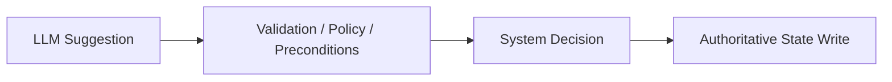
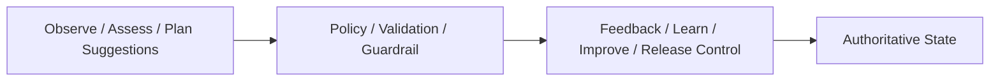

# Control Vs Intelligence Boundary Contract

## 1. Scope

This contract defines the hard boundary between the intelligence layer and the control layer.

Core principle: `LLM is responsible for suggestions, system code is responsible for decisions.`

Related Documents:

- `policy_engine_contract.md`
- `runtime_execution_contract.md`
- `approval_and_hitl_contract.md`

## 2. Goals

- Prevent model output from directly over-authorizing control systems.
- Bring high-risk decisions back to deterministic system code.
- Clarify which fields can be proposed by LLM and which fields must be generated or overridden by the system.

## 3. Things LLM Can Do

- Propose division / role / plan
- Generate intermediate content
- Provide risk explanations
- Generate candidate operations
- Generate user-readable explanations
- Generate `FeedbackSignal` / `LearningObject` / `ImprovementCandidate` drafts
- Generate knowledge summaries and assess suggestions

## 4. Things LLM Cannot Directly Do

- Directly release destructive actions
- Directly decide `timeout_behavior`
- Directly bypass preconditions
- Directly write final authoritative state
- Directly elevate its own permissions
- Directly issue approval passing results
- Directly mark `LearningObject` as `validated/promoted`
- Directly advance `ImprovementCandidate` to `accepted/deployed/rolled_back`
- Directly modify `StrategyVersion` status
- Directly advance `RolloutRecord` stage / status
- Directly modify trust tier, L5/L6 memory promotion, or feedback handling results

## 5. Boundary Diagram

## 5A. OAPEFLIR Boundary Diagram

## 6. Fields System Must Override

The following fields, if appearing in model output, can only be treated as suggestions and must not be directly trusted:

- `timeout_behavior`
- `approval_required`
- `risk_level`
- `final_status`
- `destructive_allowed`
- `budget_override`
- `policy_decision`
- `sandbox_mode`
- `allowed_paths`
- `allowed_tools`
- `promotion_status`
- `rollout_status`
- `guardrail_reason_codes`

## 7. Engineering Requirements

- Agent output schema must distinguish between `suggested_*` and authoritative fields.
- Repository / transition service only accepts structures after system layer validation.
- Audit should be able to see the difference between "model suggestion" and "system final decision."
- UI / inspect / explainability views should simultaneously display suggested values, final values, and override reasons.
- In OAPEFLIR closed loop, `Observe/Assess/Plan` can be assisted by models, but `Learn.validate`, `Improve.guardrail`, `Release.transition` must be executed by deterministic code.

## 8. Closure Conclusion

Industrial-grade systems, if let models both suggest and decide, make it difficult to be auditable, predictable, and reliable.

Therefore, this boundary must be an architecture-level hard rule, not an unspoken understanding at coding time.