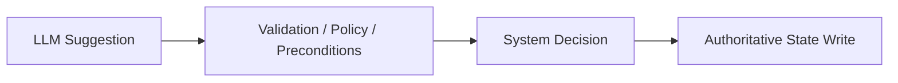
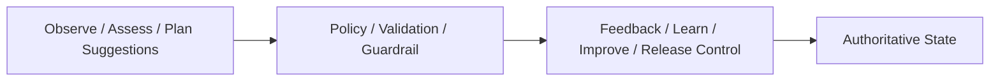

# Control Vs Intelligence Boundary Contract

## 1. Scope

This contract defines the hard boundary between the intelligence layer and the control layer.

Core principle: `LLM is responsible for suggestions; system code is responsible for decisions.`

Related documents:

- `policy_engine_contract.md`
- `runtime_execution_contract.md`
- `approval_and_hitl_contract.md`

## 2. Goals

- Prevent model output from directly overruling system controls.
- Bring high-risk decisions back into deterministic system code.
- Clarify which fields can be proposed by the LLM and which must be generated or overwritten by the system.

## 3. Things the LLM CAN Do

- Propose division / role / plan
- Generate intermediate content
- Provide risk explanations
- Generate candidate actions
- Generate human-readable explanations
- Generate drafts of `FeedbackSignal` / `LearningObject` / `ImprovementCandidate`
- Generate knowledge summaries and assess suggestions

## 4. Things the LLM CANNOT Do Directly

- Directly permit destructive actions
- Directly decide `timeout_behavior`
- Directly bypass preconditions
- Directly write authoritative final state
- Directly escalate its own permissions
- Directly issue approval pass results
- Directly mark `LearningObject` as `validated/promoted`
- Directly advance `ImprovementCandidate` to `accepted/deployed/rolled_back`
- Directly modify `StrategyVersion` state
- Directly advance `RolloutRecord` stage / status
- Directly modify trust tier, L5/L6 memory promotion, or feedback disposition results

## 5. Boundary Diagram

## 5A. OAPEFLIR Boundary Diagram

## 6. Fields the System Must Override

The following fields, if they appear in model output, must only be treated as suggestions and must not be directly trusted:

- `timeout_behavior`
- `approval_required`
- `risk_level`
- `final_status`
- `destructive_allowed`
- `budget_override`
- `policy_decision`
- `sandbox_mode`
- `allowed_paths`
- `allowed_tools`
- `promotion_status`
- `rollout_status`
- `guardrail_reason_codes`

## 7. Engineering Requirements

- Agent output schemas must distinguish between `suggested_*` and authoritative fields.
- Repository / transition service only accepts structures validated through the system layer.
- Audit logs must show the difference between "model suggestion" and "system final decision".
- UI / inspect / explainability views must display suggested value, final value, and reason for override together.
- In the OAPEFLIR closed loop, `Observe/Assess/Plan` may be assisted by the model, but `Learn.validate`, `Improve.guardrail`, `Release.transition` must be executed by deterministic code.

## 8. Conclusion

An industrial-grade system that lets the model both propose and decide is difficult to audit, predict, or rely upon.

Therefore, this boundary must be an architecture-level hard rule, not an informal coding convention.
