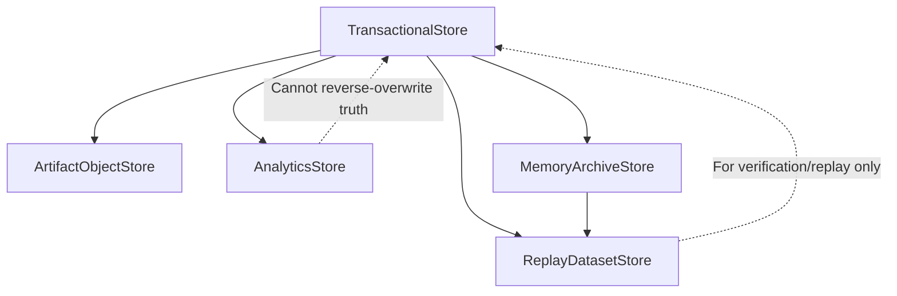
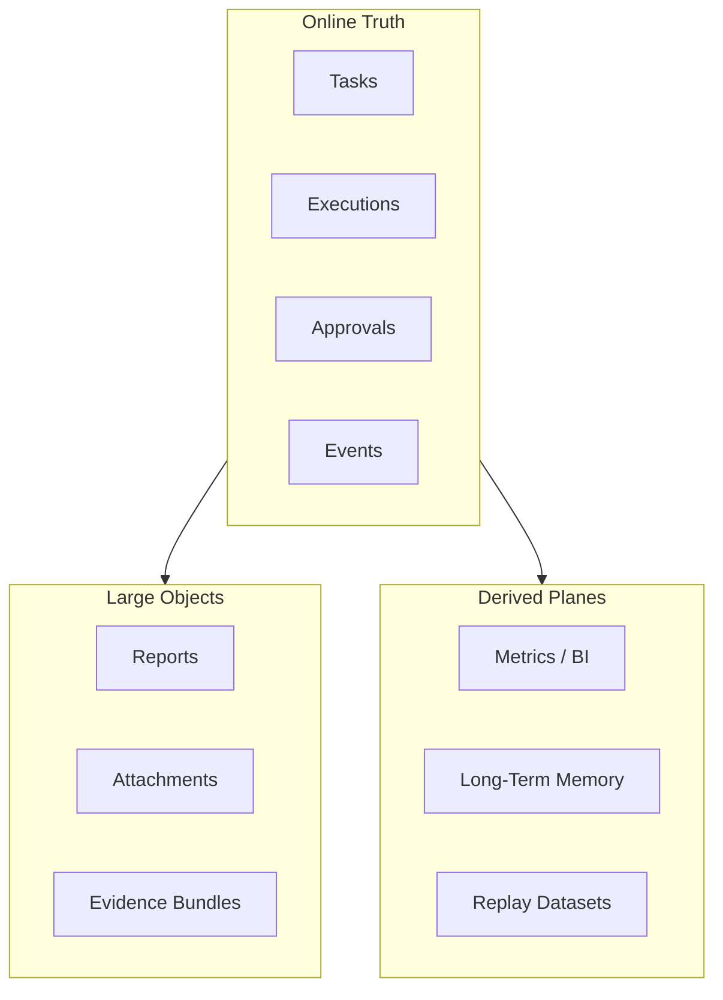

# Data Plane Contract

---

## OAPEFLIR Association

This contract participates in the following stages of the OAPEFLIR eight-stage cycle:

- **Observe**: Signal collection and aggregation
- **Assess**: Pre-execution assessment and risk judgment
- **Plan**: Task decomposition and DAG construction
- **Execute**: Step execution and fault tolerance
- **Feedback**: Signal collection and preprocessing
- **Learn**: Pattern detection and knowledge extraction
- **Improve**: Improvement candidate evaluation and rollout
- **Release**: Controlled release and rollback

---

## 1. Scope

This contract defines the layered data planes of the final platform, including transactional data, artifacts/objects, analytics, knowledge, memory/archive, and replay data.

It is a upper-layer extension of `storage_schema_contract.md`, answering "where should different data be stored, who is responsible for it, how it flows, how long it is retained, and who is the authoritative source."

## 2. Goals

- Clarify the authoritative transaction store.
- Clarify object / artifact naming conventions, lifecycle, and reference semantics.
- Clarify layered responsibilities for analytics, memory, archive, and replay.
- Clarify synchronization and writeback boundaries between different data planes.

## 3. Non-Goals

- This contract does not specify specific database or object storage product selection.
- This contract does not replace Phase 1a transactional table field definitions.
- This contract does not require all data planes to launch in the same phase at once.

## 4. Data Plane Layers

- `TransactionalStore`
- `ArtifactObjectStore`
- `AnalyticsStore`
- `KnowledgePlane`
- `MemoryArchiveStore`
- `ReplayDatasetStore`

## 5. Layer Responsibilities

`TransactionalStore`
: Stores transactional facts such as tasks, executions, approvals, events, and billing ledger refs. It is the primary source of runtime authoritative truth.

`ArtifactObjectStore`
: Stores large files, reports, attachments, model outputs, evidence bundles, and binary artifacts. The transactional layer only stores refs, not BLOBs directly.

`AnalyticsStore`
: Stores aggregated metrics, cost analysis, conversions, retention, usage aggregations, and business dashboard data. It consumes facts from the truth layer but does not reverse-act as a source of truth.

`KnowledgePlane`
: Stores knowledge entries, retrieval indexes, trust/freshness metadata, and namespace boundaries. It is not an online transactional source of truth.

`MemoryArchiveStore`
: Stores long-term memory, compressed summaries, evolution archives, handover bundles, and memory promotion materials. Provenance must be preserved.

`ReplayDatasetStore`
: Stores replays, evaluations, comparisons, regression, and golden datasets. Used for verification and learning, not as an online transactional source.

## 6. Data Ownership Principles

- Tasks, executions, approvals, and events are owned by `TransactionalStore`.
- Artifact content itself is owned by `ArtifactObjectStore`.
- Metrics and trend analysis are owned by `AnalyticsStore`.
- Knowledge entries and namespace metadata are owned by `KnowledgePlane`.
- Memory and archive materials are owned by `MemoryArchiveStore`.
- Evaluation and replay samples are owned by `ReplayDatasetStore`.

Rules:

- When any plane reads data from another plane, it should be through refs, snapshots, or pipelines, not by privately copying semantics.
- Analytics and replay must not reverse-overwrite transactional truth.

## 7. Key Objects

- `DataNamespace`
- `ArtifactRef`
- `ArchiveBundle`
- `AnalyticsFact`
- `ReplayDataset`
- `DataMovementJob`
- `KnowledgeRef`
- `MemoryRef`

## 8. `DataNamespace` Minimum Fields

| Field | Type | Description |
| --- | --- | --- |
| `namespace_id` | `string` | Namespace ID |
| `plane` | `transactional \| artifact \| analytics \| knowledge \| memory_archive \| replay` | Belonging plane |
| `tenant_scope` | `string?` | Tenant / org boundary |
| `retention_policy` | `string` | Retention policy |
| `encryption_policy` | `string` | Encryption policy |
| `residency_policy?` | `string` | Data residency requirements |

## 9. `ArtifactRef` Minimum Fields

- `artifact_id`
- `namespace_id`
- `object_key`
- `content_type`
- `size_bytes`
- `checksum`
- `created_at`
- `source_execution_id?`

Rules:

- The transactional layer can only store `ArtifactRef` and must not backfill artifact body.
- Artifact refs must be stable, verifiable, and traceable.

## 10. `AnalyticsFact` Minimum Fields

- `fact_id`
- `metric_name`
- `dimension_json`
- `value`
- `window_start`
- `window_end`
- `source_ref`
- `captured_at`

Rules:

- Analytics facts must be traceable to transactional truth or an explicit snapshot.
- The same metric must not mix real-time facts with manual estimates without distinction.

## 11. `ArchiveBundle` and `ReplayDataset`

`ArchiveBundle` minimum fields:

- `bundle_id`
- `bundle_type`
- `source_refs`
- `summary_ref`
- `created_at`

`ReplayDataset` minimum fields:

- `dataset_id`
- `dataset_type`
- `sample_refs`
- `truth_refs`
- `version`
- `created_at`

## 12. Data Flow Rules

Allowed primary paths:

- transaction -> artifact ref
- transaction -> analytics
- transaction -> knowledge
- transaction -> memory/archive
- transaction + archive -> replay

Restrictions:

- analytics -> transaction: Only allowed through explicit decision writeback; direct fact overwriting is not permitted.
- knowledge -> transaction: Only allowed through controlled retrieval, manual confirmation, or explicit governance writeback.
- replay -> transaction: Forbidden from directly becoming an online source of truth.
- archive -> transaction: Only allowed through manual confirmation or explicit recovery flows.

### 12.1 Data Flow Diagram

### 12.2 Plane Ownership Diagram

## 13. Retention and Lifecycle

- Transaction records are retained according to operational and audit requirements.
- Artifacts are retained by type, tenant, and compliance requirements.
- Analytics may undergo rollup, downsample, and TTL.
- Knowledge should support namespace, trust tier, freshness decay, and expiration policies.
- Memory/archive should support compaction, but compaction must not destroy provenance.
- Replay datasets should support versioning and expiration policies.

## 14. Tenant / Security Constraints

- All planes must be tenant-aware with namespace support.
- Artifacts/objects and analytics must not bypass tenant scope for direct sharing.
- Archive and replay datasets require explicit authorization before cross-tenant sharing.
- Residency / encryption must be expressed at the namespace layer, not the UI layer.

## 15. Data Movement Job

`DataMovementJob` minimum fields:

- `job_id`
- `source_plane`
- `target_plane`
- `input_refs`
- `status`
- `started_at`
- `finished_at?`

Use cases:

- archive compaction
- analytics ETL
- knowledge indexing / reindex
- replay dataset build
- artifact lifecycle move

## 16. Relationship with Existing Documents

- `storage_schema_contract.md` is the Phase 1a transactional baseline.
- `artifact_store_contract.md` is the minimal boundary for objects/artifacts.
- `monetization_metering_plane_contract.md` consumes analytics / transaction data.
- This contract is responsible for the final platform data plane layered evolution model.

## 17. Phased Introduction

- Phase 2: memory / archive layering.
- Phase 3: analytics / PMF data layer.
- Phase 4: enterprise data governance, cross-plane migration, and residency control.

## 18. Conclusion

The key to the data plane is not "just add a few more stores," but rather establishing clear ownership, retention, security, and writeback boundaries for each type of data.

Any future storage extension should first determine which plane it belongs to, then decide its storage location and source-of-truth priority.
