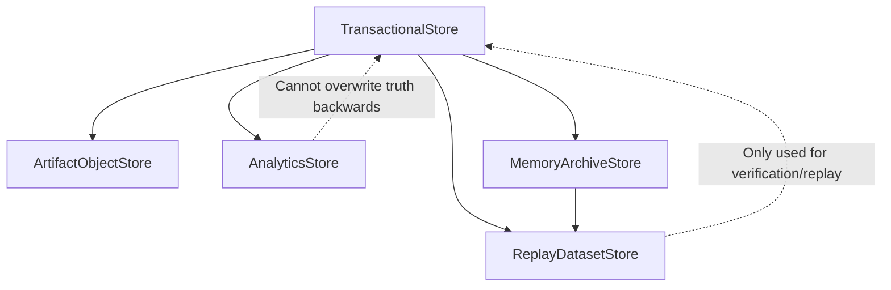
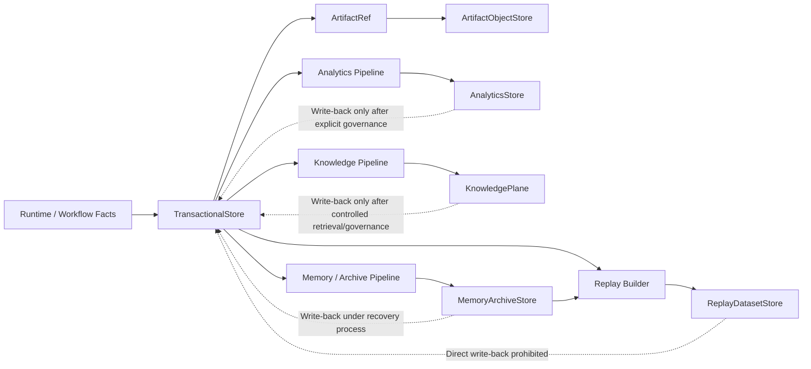
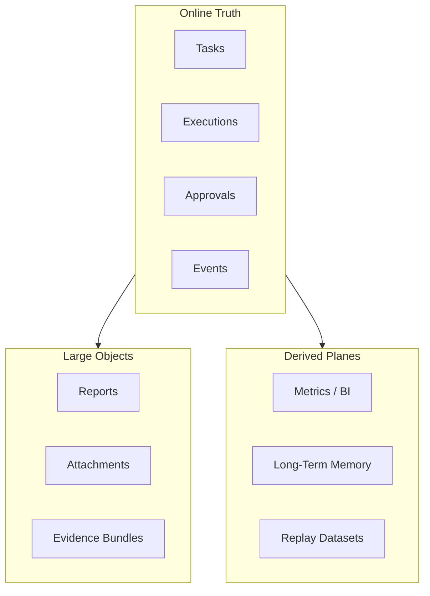

# Data Plane Contract

---

## OAPEFLIR Association

This contract participates in the following stages of the OAPEFLIR eight-stage loop:

- **Observe**: Signal collection and aggregation
- **Assess**: Pre-execution evaluation and risk assessment
- **Plan**: Task decomposition and DAG construction
- **Execute**: Step execution and fault tolerance
- **Feedback**: Signal collection and preprocessing
- **Learn**: Pattern detection and knowledge extraction
- **Improve**: Improvement candidate evaluation and rollout
- **Release**: Controlled release and rollback

---

## 1. Scope

This contract defines the data plane layering of the final platform, including transactional data, artifact/object, analytics, knowledge, memory/archive, and replay data.

It is a superordinate extension of `storage_schema_contract.md`, used to answer "where should different data be stored, who is responsible for it, how it flows, how long it is retained, and who is the source of truth".

## 2. Objectives

- Clarify the authoritative transaction store.
- Clarify the namespace, lifecycle, and reference semantics for objects/artifacts.
- Clarify the layered responsibilities for analytics, memory, archive, and replay.
- Clarify synchronization and write-back boundaries between different data planes.

## 3. Non-Objectives

- This contract does not specify specific database or object storage product selection.
- This contract does not replace Phase 1a transactional table field definitions.
- This contract does not require all data planes to launch in the same phase.

## 4. Data Plane Layers

- `TransactionalStore`
- `ArtifactObjectStore`
- `AnalyticsStore`
- `KnowledgePlane`
- `MemoryArchiveStore`
- `ReplayDatasetStore`

## 5. Layer Responsibilities

`TransactionalStore`
: Stores transactional facts such as tasks, executions, approvals, events, and billing ledger refs. It is the primary source of runtime authoritative truth.

`ArtifactObjectStore`
: Stores large files, reports, attachments, model outputs, evidence bundles, and binary artifacts. The transactional layer only retains refs and does not directly store BLOBs.

`AnalyticsStore`
: Stores aggregated metrics, cost analysis, conversions, retention, usage aggregation, and business dashboard data. It consumes the truth layer but does not serve as a truth source in reverse.

`KnowledgePlane`
: Stores knowledge entries, retrieval indexes, trust/freshness metadata, and namespace boundaries. It is not the online transactional source of truth.

`MemoryArchiveStore`
: Stores long-term memories, compressed summaries, evolutionary archives, handover bundles, and memory promotion materials. Provenance must be preserved.

`ReplayDatasetStore`
: Stores replays, evaluations, comparisons, regression, and golden datasets. Used for verification and learning, not as an online transactional source.

## 6. Data Ownership Principles

- The authoritative owner of tasks, executions, approvals, and events is `TransactionalStore`.
- The authoritative owner of artifact content body is `ArtifactObjectStore`.
- The authoritative owner of metrics and trend analysis is `AnalyticsStore`.
- The authoritative owner of knowledge entries and namespace metadata is `KnowledgePlane`.
- The authoritative owner of memories and archive materials is `MemoryArchiveStore`.
- The authoritative owner of evaluation and replay samples is `ReplayDatasetStore`.

Rules:

- When any plane reads data from other planes, it should be through refs, snapshots, or pipelines, not by私自 copying semantics.
- Analytics and replay must not overwrite transaction truth in reverse.

## 7. Key Objects

- `DataNamespace`
- `ArtifactRef`
- `ArchiveBundle`
- `AnalyticsFact`
- `ReplayDataset`
- `DataMovementJob`
- `KnowledgeRef`
- `MemoryRef`

## 8. `DataNamespace` Minimum Fields

| Field | Type | Description |
| --- | --- | --- |
| `namespace_id` | `string` | Namespace ID |
| `plane` | `transactional \| artifact \| analytics \| knowledge \| memory_archive \| replay` | Plane |
| `tenant_scope` | `string?` | Tenant/org boundary |
| `retention_policy` | `string` | Retention policy |
| `encryption_policy` | `string` | Encryption policy |
| `residency_policy?` | `string` | Data residency requirements |

## 9. `ArtifactRef` Minimum Fields

- `artifact_id`
- `namespace_id`
- `object_key`
- `content_type`
- `size_bytes`
- `checksum`
- `created_at`
- `source_execution_id?`

Rules:

- The transactional layer can only store `ArtifactRef` and cannot backfill artifact bodies.
- Artifact refs must be stable, verifiable, and traceable.

## 10. `AnalyticsFact` Minimum Fields

- `fact_id`
- `metric_name`
- `dimension_json`
- `value`
- `window_start`
- `window_end`
- `source_ref`
- `captured_at`

Rules:

- Analytics facts must be traceable to transaction truth or explicit snapshots.
- The same metric must not mix real-time facts and manual estimates without distinction.

## 11. `ArchiveBundle` and `ReplayDataset`

`ArchiveBundle` minimum fields:

- `bundle_id`
- `bundle_type`
- `source_refs`
- `summary_ref`
- `created_at`

`ReplayDataset` minimum fields:

- `dataset_id`
- `dataset_type`
- `sample_refs`
- `truth_refs`
- `version`
- `created_at`

## 12. Data Flow Rules

Allowed primary paths:

- transaction -> artifact ref
- transaction -> analytics
- transaction -> knowledge
- transaction -> memory/archive
- transaction + archive -> replay

Restrictions:

- analytics -> transaction: Only allowed via explicit decision write-back, not direct fact overwrite.
- knowledge -> transaction: Only allowed via controlled retrieval, manual confirmation, or explicit governance write-back.
- replay -> transaction: Explicitly prohibited from being an online source of truth.
- archive -> transaction: Can only write back via manual confirmation or explicit recovery process.

### 12.1 Data Flow Diagram

### 12.2 Plane Ownership Diagram

## 13. Retention and Lifecycle

- Transaction records are retained according to runtime and audit requirements.
- Artifacts are retained by type, tenant, and compliance requirements.
- Analytics can undergo rollup, downsample, and TTL.
- Knowledge should support namespace, trust tier, freshness decay, and expiration policies.
- Memory/archive should support compaction, but compaction must not destroy provenance.
- Replay datasets should support versioning and expiration policies.

## 14. Tenant / Security Constraints

- All planes must have tenant-aware namespaces.
- Artifacts/objects and analytics must not bypass tenant scope for direct sharing.
- Archive and replay datasets must have explicit authorization before cross-tenant sharing.
- Residency / encryption must be expressed at the namespace layer, not the UI layer.

## 15. Data Movement Job

`DataMovementJob` minimum fields:

- `job_id`
- `source_plane`
- `target_plane`
- `input_refs`
- `status`
- `started_at`
- `finished_at?`

Use cases:

- archive compaction
- analytics ETL
- knowledge indexing / reindex
- replay dataset build
- artifact lifecycle move

## 16. Relationship with Existing Documents

- `storage_schema_contract.md` is the Phase 1a transactional baseline.
- `artifact_store_contract.md` is the minimum boundary for objects/artifacts.
- `monetization_metering_plane_contract.md` consumes analytics / transaction data.
- This contract is responsible for the final platform data plane layered evolution model.

## 17. Phased Introduction

- Phase 2: memory / archive layer.
- Phase 3: analytics / PMF data layer.
- Phase 4: enterprise data governance, cross-plane migration, and residency control.

## 18. Closure Conclusion

The key to the data plane is not "adding a few more databases", but clarifying owner, retention, security, and write-back boundaries for each type of data.

Any subsequent storage expansion should first determine which plane it belongs to, then decide the落地 location and source-of-truth priority.