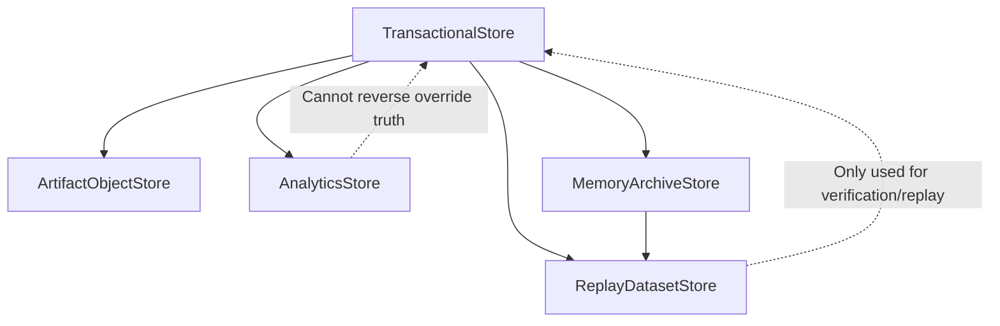
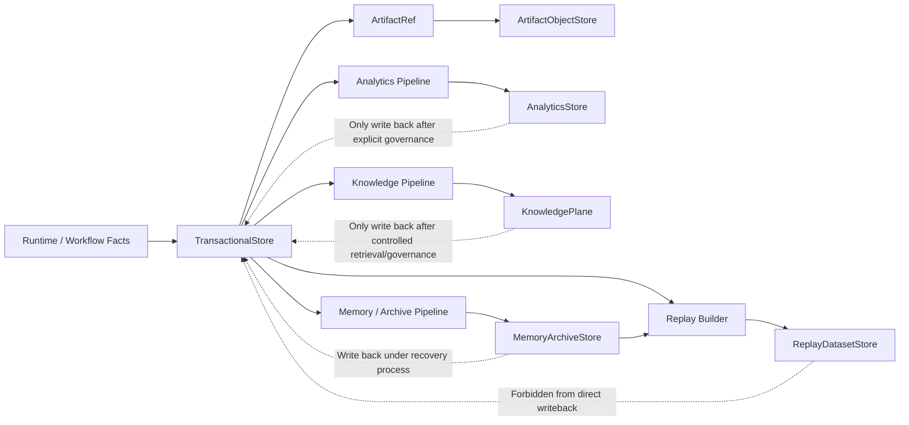
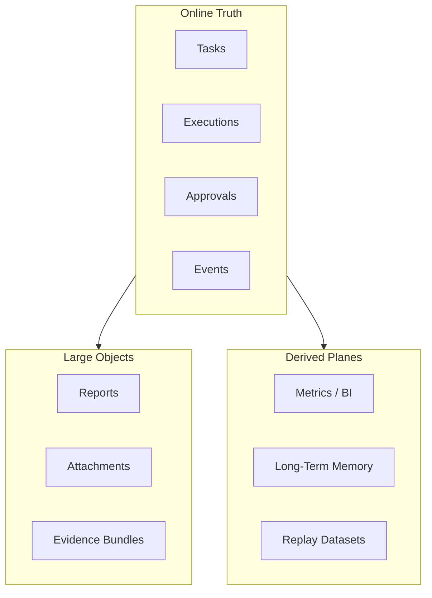

# Data Plane Contract

## 1. Scope

This contract defines the final platform's data plane layering, including transactional data, artifact/object, analytics, knowledge, memory/archive, and replay data.

It is an upper-layer extension of `storage_schema_contract.md`, answering "where different data should be stored, who is responsible, how it flows, how long it is retained, and who is the source of truth."

## 2. Goals

- Clarify authoritative transaction store.
- Clarify object / artifact namespace, lifecycle, and reference semantics.
- Clarify analytics, memory, archive, and replay layered responsibilities.
- Clarify synchronization and writeback boundaries between different data planes.

## 3. Non-Goals

- This contract does not specify specific database or object storage product selection.
- This contract does not replace Phase 1a transaction table field definitions.
- This contract does not require all data planes to go live in the same phase.

## 4. Data Plane Layers

- `TransactionalStore`
- `ArtifactObjectStore`
- `AnalyticsStore`
- `KnowledgePlane`
- `MemoryArchiveStore`
- `ReplayDatasetStore`

## 5. Layered Responsibilities

`TransactionalStore`
: Stores transactional facts such as tasks, executions, approvals, events, and billing ledger refs. It is the primary source of authoritative truth for runtime.

`ArtifactObjectStore`
: Stores large files, reports, attachments, model outputs, evidence bundles, and binary artifacts. The transaction layer only stores refs and does not directly store BLOBs.

`AnalyticsStore`
: Stores aggregated metrics, cost analysis, conversion, retention, usage aggregation, and business dashboard data. It consumes facts but does not reverse override act as a source of truth.

`KnowledgePlane`
: Stores knowledge entries, retrieval indexes, trust/freshness metadata, and namespace boundaries. It is not an online transactional source of truth.

`MemoryArchiveStore`
: Stores long-term memory, compression summaries, evolution archives, handover bundles, and memory promotion materials. Provenance must be preserved.

`ReplayDatasetStore`
: Stores replays, evaluations, comparisons, regression, and golden datasets. Used for verification and learning, not as an online transactional source.

## 6. Data Ownership Principles

- Tasks, executions, approvals, and events authoritative owner is `TransactionalStore`.
- Artifact content body authoritative owner is `ArtifactObjectStore`.
- Metrics and trend analysis authoritative owner is `AnalyticsStore`.
- Knowledge entries and namespace metadata authoritative owner is `KnowledgePlane`.
- Memory and archive materials authoritative owner is `MemoryArchiveStore`.
- Evaluation and replay samples authoritative owner is `ReplayDatasetStore`.

Rules:

- When any plane reads data from other planes, it should do so through refs, snapshots, or pipelines, not by privately copying semantics.
- Analytics and replay must not reverse overwrite transaction truth.

## 7. Key Objects

- `DataNamespace`
- `ArtifactRef`
- `ArchiveBundle`
- `AnalyticsFact`
- `ReplayDataset`
- `DataMovementJob`
- `KnowledgeRef`
- `MemoryRef`

## 8. `DataNamespace` Minimum Fields

| Field | Type | Description |
| --- | --- | --- |
| `namespace_id` | `string` | Namespace ID |
| `plane` | `transactional \| artifact \| analytics \| knowledge \| memory_archive \| replay` | Belongs to plane |
| `tenant_scope` | `string?` | Tenant / org boundary |
| `retention_policy` | `string` | Retention policy |
| `encryption_policy` | `string` | Encryption policy |
| `residency_policy?` | `string` | Data residency requirements |

## 9. `ArtifactRef` Minimum Fields

- `artifact_id`
- `namespace_id`
- `object_key`
- `content_type`
- `size_bytes`
- `checksum`
- `created_at`
- `source_execution_id?`

Rules:

- Transaction layer can only store `ArtifactRef` and cannot backfill artifact body.
- Artifact refs must be stable, verifiable, and traceable.

## 10. `AnalyticsFact` Minimum Fields

- `fact_id`
- `metric_name`
- `dimension_json`
- `value`
- `window_start`
- `window_end`
- `source_ref`
- `captured_at`

Rules:

- Analytics facts must be traceable to transactional truth or explicit snapshots.
- The same metric must not mix real-time facts and manual estimates without distinction.

## 11. `ArchiveBundle` and `ReplayDataset`

`ArchiveBundle` minimum fields:

- `bundle_id`
- `bundle_type`
- `source_refs`
- `summary_ref`
- `created_at`

`ReplayDataset` minimum fields:

- `dataset_id`
- `dataset_type`
- `sample_refs`
- `truth_refs`
- `version`
- `created_at`

## 12. Data Flow Rules

Allowed primary paths:

- transaction -> artifact ref
- transaction -> analytics
- transaction -> knowledge
- transaction -> memory/archive
- transaction + archive -> replay

Restrictions:

- analytics -> transaction: Only allowed through explicit decision writeback, not direct fact overwriting.
- knowledge -> transaction: Only allowed through controlled retrieval, manual confirmation, or explicit governance writeback.
- replay -> transaction: Forbidden from directly becoming online source of truth.
- archive -> transaction: Can only write back through manual confirmation or explicit recovery process.

### 12.1 Data Flow Diagram

### 12.2 Plane Ownership Diagram

## 13. Retention and Lifecycle

- Transaction records are retained according to operation and audit requirements.
- Artifacts are retained according to type, tenant, and compliance requirements.
- Analytics can do rollup, downsample, and TTL.
- Knowledge should support namespace, trust tier, freshness decay, and expiration strategies.
- Memory/archive should support compaction, but compaction must not break/damage provenance.
- Replay datasets should support versioning and expiration strategies.

## 14. Tenant / Security Constraints

- All planes must be tenant-aware namespace.
- Artifact/object and analytics cannot bypass tenant scope to directly share.
- Archive and replay datasets must have explicit authorization before cross-tenant sharing.
- Residency / encryption must be expressed at the namespace layer, not UI layer.

## 15. Data Movement Job

`DataMovementJob` minimum fields:

- `job_id`
- `source_plane`
- `target_plane`
- `input_refs`
- `status`
- `started_at`
- `finished_at?`

Use cases:

- archive compaction
- analytics ETL
- knowledge indexing / reindex
- replay dataset build
- artifact lifecycle move

## 16. Relationship with Existing Documents

- `storage_schema_contract.md` is the Phase 1a transaction baseline.
- `artifact_store_contract.md` is the minimum boundary for object / artifact.
- `monetization_metering_plane_contract.md` consumes analytics / transaction data.
- This contract is responsible for the final platform's data plane layered evolution model.

## 17. Phased Introduction

- Phase 2: memory / archive layering.
- Phase 3: analytics / PMF data layer.
- Phase 4: enterprise data governance, cross-plane migration, and residency control.

## 18. Closure Conclusion

The key to Data plane is not "adding a few more libraries" but clarifying owner, retention, security, and writeback boundaries for each type of data.

Any future storage expansion should first determine which plane it belongs to, then decide the landing location/placement and source of truth priority.
