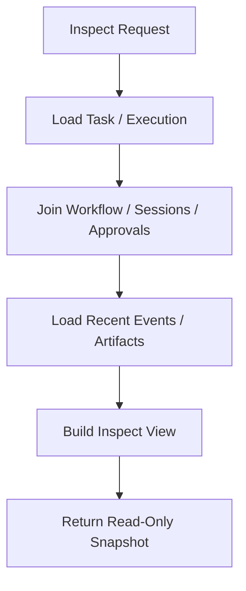

# Debug Inspect Health Backpressure Contract

---

## OAPEFLIR Association

This contract participates in the following stages of the OAPEFLIR eight-stage cycle:

- **Observe**: Signal collection and aggregation
- **Assess**: Pre-execution assessment and risk judgment
- **Plan**: Task decomposition and DAG construction
- **Execute**: Step execution and fault tolerance
- **Feedback**: Signal collection and preprocessing
- **Learn**: Pattern detection and knowledge extraction
- **Improve**: Improvement candidate evaluation and rollout
- **Release**: Controlled release and rollback

---

## 1. Scope

This contract defines runtime debug entry points, inspect queries, health checks, and backpressure strategies.

Related documents:

- `observability_contract.md`
- `api_surface_contract.md`
- `event_registry_and_ops_threshold_contract.md`
- `startup_consistency_and_recovery_drill_contract.md`
- `execution_plane_contract.md`

## 2. Goals

This document answers 4 questions:

- When something goes wrong, what can developers and operators see?
- How can external systems determine if the service is healthy?
- How to check the complete trace of a single task / workflow / execution with one click?
- How does the system reject, queue, or degrade when overloaded, rather than continuing to amplify the problem?

## 3. Key Objects

### 3.1 `HealthStatusReport`

| Field | Type | Description |
| --- | --- | --- |
| `status` | `ok \| degraded \| overloaded \| unhealthy` | Overall health status |
| `uptime_seconds` | `number` | Runtime duration |
| `db_writable` | `boolean` | Whether DB is writable |
| `provider_health` | `healthy \| degraded \| failed` | Aggregated provider health |
| `active_executions` | `number` | Number of active executions |
| `queued_tasks` | `number` | Number of queued tasks |
| `oapeflir_loop_health` | `healthy \| drifting \| stalled \| failed?` | Closed-loop aggregated health |
| `knowledge_plane_health` | `healthy \| degraded \| not_enabled?` | Knowledge Plane health or not enabled |
| `active_rollouts` | `number` | Number of currently active rollouts |
| `event_loop_lag_ms` | `number?` | Event loop lag |
| `memory_rss_mb` | `number?` | RSS memory |
| `tier1_ack_backlog` | `number` | Tier 1 unacknowledged backlog |

### 3.2 `TaskInspectView`

- `task`
- `workflow_state?`
- `executions[]`
- `approvals[]`
- `sessions[]`
- `recent_events[]`
- `artifacts[]`
- `recovery_summary?`
- `current_stage?`
- `loop_iteration?`
- `oapeflir_timeline?`
- `feedback_signals[]?`
- `learning_objects[]?`
- `improvement_candidates[]?`
- `rollout_records[]?`

### 3.3 `DebugDump`

- `trace_id`
- `recent_logs`
- `state_snapshots`
- `event_tail`
- `warnings`
- `warning_summary`

### 3.4 `BackpressurePolicy`

- `max_queued_tasks`
- `max_active_executions`
- `provider_concurrency_limit`
- `memory_high_watermark_mb`
- `event_loop_lag_threshold_ms`
- `degradation_mode`

### 3.5 `QueueGovernanceMetrics`

- `queue_id`
- `fairness_index?`
- `min_share?`
- `max_share?`
- `oldest_wait_seconds`
- `backlog_size`
- `backlog_growth_rate?`
- `starvation_detected`

## 4. Health Checks

### 4.1 Endpoint

The unified health endpoint is:

- `GET /healthz`

Compatibility rules:

- `GET /health` may be used as a compatible alias.
- The authoritative contract uses `/healthz` as the source of truth.

### 4.2 Status Semantics

| status | Meaning | Default HTTP |
| --- | --- | --- |
| `ok` | Service is healthy, can accept traffic | `200` |
| `degraded` | Partial capability degraded, but still serving | `200` |
| `overloaded` | Entering backpressure/degraded state | `429` or `503` |
| `unhealthy` | Core dependency failed, should not accept traffic | `503` |

### 4.3 Minimum Check Items

Phase 1a required:

- Process alive
- DB writable
- Active execution count
- Queued task count

Phase 1b enhancements:

- Provider success rate over the last 5 minutes
- Event loop lag
- RSS / memory pressure
- Tier 1 ack backlog

## 5. Inspect Queries

### 5.1 Minimum Interfaces

- `GET /tasks/:taskId/inspect`
- `GET /executions/:executionId/inspect`
- `GET /approvals/:approvalId/inspect`
- `GET /rollouts/:rolloutId/inspect`
- `GET /knowledge/:namespace/inspect`
- `GET /tasks/:taskId/oapeflir-timeline`

### 5.2 Query Requirements

- `task inspect` should restore the task's primary state, workflow, execution, approvals, sessions, and event tail.
- `task inspect` should show current `stage`, `loop_iteration`, and recent feedback / learn / improve / release references.
- Inspect output must prioritize reading from the authoritative store, not just in-memory state.
- Inspect queries must not change business state.
- If there is recovery or takeover history, inspect should show the most recent recovery decision, trigger reason, and current active execution ownership.
- `oapeflir-timeline` should return each stage state, key evidence refs, approval gates, and rollout actions in chronological order.
- Rollout inspect must restore rollout level, status, metrics, approval, and rollback lineage.
- Knowledge inspect is an extension entry point; when the Knowledge Plane is not enabled, it should return explicit `not_enabled` rather than a 404 pretending the resource does not exist.



## 6. Debug Capabilities

Minimum debug capabilities:

- Recent structured logs
- Recent event tail
- State snapshots
- Warning / error summary

Rules:

- Debug must not expose sensitive content by default.
- High-sensitivity payloads require sanitization or permission-controlled display.
- Debug dumps are for troubleshooting only and must not be used as a new source of truth.
- `warnings` retains a compatible string array output but should be deduplicated by task dimension.
- `warning_summary` should aggregate similar alerts, count suppressed duplicates, and provide minimal escalation paths.

## 7. Backpressure Strategy

### 7.1 Trigger Conditions

Consider at minimum:

- `queued_tasks > max_queued_tasks`
- `active_executions > max_active_executions`
- Provider concurrency exceeded
- `memory_rss_mb > memory_high_watermark_mb`
- `event_loop_lag_ms > event_loop_lag_threshold_ms`
- Tier 1 ack backlog continuously exceeding threshold
- Queue fairness continuously deteriorating
- Starvation entry exceeds wait threshold

### 7.2 Actions

| Scenario | Action |
| --- | --- |
| Queue backlog | New tasks queued or rejected |
| Provider overload | Rate limit / delay / degrade model |
| Memory pressure | Limit new executions, prioritize keeping current tasks alive |
| Event loop lag | Mark `degraded` or `overloaded` |
| Tier 1 backlog | Pause non-critical traffic, prioritize recovering critical events |
| Queue unfairness / starvation | Adjust priority, promote starved tasks, limit hot tenants or workers |

### 7.3 Degradation Modes

`degradation_mode` enumeration and decision priority (highest to lowest):

| Mode | Trigger Condition | Meaning |
| --- | --- | --- |
| `none` | `status == ok` | No degradation |
| `read_only_operations_only` | DB not writable | Only read operations allowed |
| `pause_non_critical` | Tier 1 ack backlog exceeds `overloaded` threshold | Pause non-critical traffic, prioritize recovering critical events |
| `queue_only` | Queue pressure (starvation / backlog / stale busy worker) or severe performance pressure (memory > 110% high watermark or event loop lag > 150% threshold) | New non-high-priority tasks are queued but not directly executed |
| `fast_only` | Provider unhealthy or moderate performance pressure (memory > high watermark or event loop lag > threshold) | Degrade model, rate limit, or delay |

Decision logic:

```
if status == ok:           → none
if !db_writable:           → read_only_operations_only
if tier1_ack_overloaded:   → pause_non_critical
if queue_pressure || severe_performance_pressure: → queue_only
if provider_degraded || performance_pressure:     → fast_only
else:                      → queue_only (conservative default)
```

### 7.3.1 Interaction Between Degradation Mode and Admission Control

`AdmissionController` makes admission decisions based on current `degradation_mode`:

| Degradation Mode | Admission Strategy |
| --- | --- |
| `read_only_operations_only` | Reject all new tasks (`admission.reject_read_only_mode`) |
| `pause_non_critical` | Only allow high-priority tasks (`high` / `urgent`), normal and low-priority tasks are rejected (`admission.reject_non_critical_paused`) |
| `queue_only` | High-priority tasks execute directly, normal and low-priority tasks are downgraded to queued (`admission.queue_backpressure`) |
| `fast_only` / `none` | Proceed to normal admission checks (budget, backlog, capacity) |

Additional admission protections:

- Budget exceeded: reject directly (`admission.reject_budget_exceeded`)
- When `starvation_detected`: reject low-priority tasks (`admission.reject_starvation_protection`)
- When Tier 1 ack backlog reaches hard limit: reject (`admission.reject_tier1_backlog`)
- When active executions / queued tasks reach limit: reject or queue

Rules:

- Backpressure must not silently discard Tier 1 factual events.
- Degradation mode must be observable and auditable.
- Admission rejections must return a structured `reasonCode` and must not return only a generic error.

### 7.4 Queue Governance

Queue governance should at minimum answer:

- Whether long-term unfair scheduling has occurred.
- Whether any entries have been starved for a long time.
- Whether backlog is continuously growing abnormally.

Recommended thresholds:

- `fairness_index < 0.8`
- `oldest_wait_seconds > starvation_threshold`
- `backlog_growth_rate` continuously exceeds growth window

## 8. Boundary with Execution Plane

- Phase 1a / 1b backpressure primarily targets single-machine runtime.
- Queue / worker registry / lease-level backpressure belongs to the subsequent execution plane.
- This contract only freezes the minimum protection strategy for the single-machine phase.

## 9. Phase Boundaries

Phase 1a:

- `/healthz` baseline
- `task / execution / approval inspect` basic queries
- Minimum backpressure thresholds
- Ability to trace the last tool call, failure reason, and recovery history by `taskId`.
- `oapeflir-timeline` must at minimum return the closed-loop stages for phase 1-4, with minimal timeline for feedback, learning, improvement, and release.

Phase 1b:

- Debug dump / tail
- Provider success rate
- Event loop lag / memory pressure metrics
- More granular degradation modes.

Currently not doing:

- Enterprise monitoring alerting platform.
- Cross-machine queue scheduling backpressure.
- Web UI complete operations panel.

## 10. Conclusion

A system without inspect, health, and backpressure, when problems occur, can only be guessed at; the purpose of this contract is to formalize "how to observe, when to consider abnormal, and how to scale back under overload" as official boundaries.
