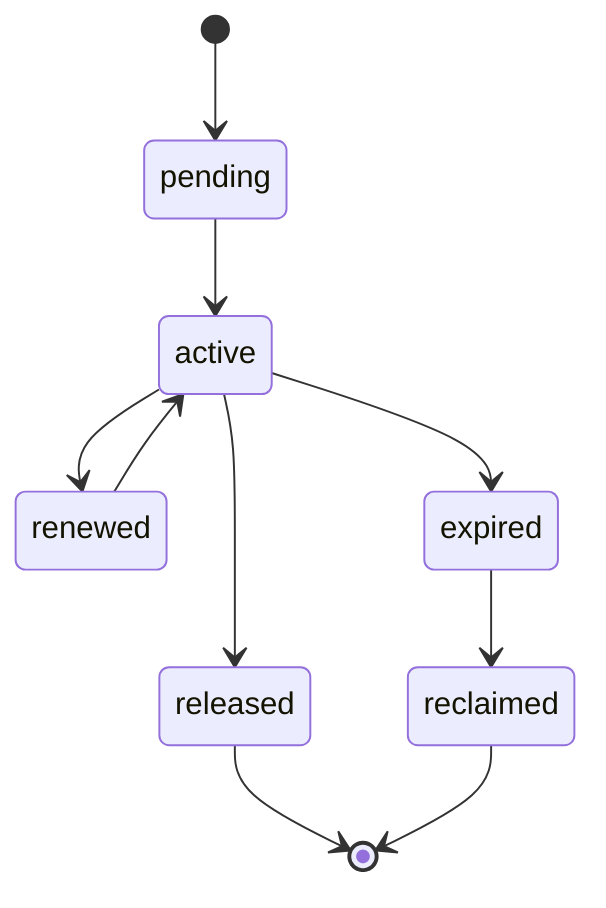

# Distributed Locking Contract

---

## OAPEFLIR Correlation

This contract participates in the following stages of the OAPEFLIR eight-stage cycle:

- **Observe**: Signal collection and aggregation
- **Assess**: Pre-execution assessment and risk judgment
- **Plan**: Task decomposition and DAG construction
- **Execute**: Step execution and fault tolerance
- **Feedback**: Signal collection and preprocessing
- **Learn**: Pattern detection and knowledge extraction
- **Improve**: Improvement candidate evaluation and rollout
- **Release**: Controlled release and rollback

---

## 1. Scope

This contract defines platform lock semantics for industrial-grade deployments, including local locks, database locks, lease locks, and approval mutex locks.

The problem it solves: which locks are only effective within a single process, which locks must guarantee cross-worker, and which operations can only rely on lease rather than general locks.

Related Documents:

- `file_lock_contract.md`
- `task_lease_and_fencing_contract.md`
- `production_storage_and_queue_contract.md`

## 2. Lock Classification

| Lock Type | Authoritative Backend | Primary Use |
| --- | --- | --- |
| `local_mutex` | process memory | Single-process cache refresh, singleton initialization protection |
| `file_lock` | authoritative store | File read/write mutual exclusion |
| `execution_lease` | authoritative store | Execution execution rights |
| `approval_lock` | authoritative store | Approval object serial updates |
| `advisory_lock` | PostgreSQL | Short transaction mutual exclusion, repair / migration / compaction serialization |

## 3. Key Principles

- Local locks must not be mistaken for distributed locks.
- Execution ownership prioritizes lease + fencing over ordinary mutex replacement.
- Write locks must have TTL, renewal, recovery, and owner identification.
- Lock failures must be observable, alertable, and recoverable.
- Lock states that affect truth must advance from a unified state write entry point and cannot be scattered across callers.

## 4. Recommended Solutions

- Short transaction mutual exclusion: PostgreSQL advisory lock
- Long-lifecycle execution rights: lease + fencing token
- File mutual exclusion: authoritative file lock repository
- Redis locks are not the current preferred truth source; if Redlock is adopted in the future, additional ADR must explain risk boundaries

## 5. Lock State Machine

Note:

- The above state machine only describes the resource lifecycle of `LockRecord` / `LeaseRecord` and is not a second set of truth mutation entry points independent of the runtime state machine.
- Any truth changes related to `execution_lease`, `approval_lock`, or system maintenance locks must be persisted through the unified command entry point and append fact events.

### 5.1 LockTransitionCommand

`LockTransitionCommand` minimum fields:

- `lock_id`
- `lock_type`
- `resource_key`
- `from_status`
- `to_status`
- `owner_id`
- `reason_code`
- `trace_id`
- `occurred_at`
- `fencing_token?`

Rules:

- `execution_lease` acquisition, renewal, expiration, and recovery must work in coordination with `RuntimeStateMachine.transition(command)`; lease state must not bypass the unified state write entry point for direct modification.
- For `execution_lease`, lock state advancement must share the same truth boundary with `NodeRun` / `NodeAttempt` lease / fencing verification.
- `approval_lock`, `file_lock`, `advisory_lock` that affect audit or system maintenance truth must also be recorded through append-only events and audit chains.

## 6. Required Fields

- `lock_id`
- `lock_type`
- `resource_key`
- `owner_kind`
- `owner_id`
- `expires_at`
- `fencing_token?`
- `created_at`
- `updated_at`

## 7. Rules

- Any distributed write lock must support expiration determination.
- Lock acquisition failure must return a clear `reason_code` and cannot just return `false`.
- Lock release must verify owner to avoid accidentally releasing others' locks.
- Lock recovery actions must generate logs and audit events.
- `execution_lease` state advancement must not become a RuntimeStateMachine bypass; if driving `NodeRun` recovery, failure, or takeover is needed, it must be done through unified state machine commands.

## 8. Applicable Boundaries

Scenarios where distributed locks should NOT be used:

- Side-effect-free deduplication of purely local in-memory objects
- Repeatable, idempotent read-only tasks with already-established idempotent semantics

Scenarios that must use authoritative distributed locks or lease:

- File writes
- Execution primary write chain
- Approval final verdict
- System-level maintenance actions such as migration / repair / reindex

## 9. Failure Handling

- After lock expiration, original owner must not continue writing.
- If network partition causes owner to still believe they hold the lock, the authoritative backend still takes the current latest token as authoritative.
- Lock table bloat or expired lock accumulation should trigger operations alerts.

## 10. Closure Conclusion

The focus of industrial-grade lock design is not "locking everywhere", but first distinguishing:

- Local mutual exclusion
- Distributed resource locks
- Execution lease

Only with clear boundaries can the system be both safe and not dragged down by lock design.

## v4.3 Architecture Remediation

The following items fix contract deviations recorded in `platform-architecture-implementation-consistency-audit.md`. If historical sections of this document conflict with this section, this section, `docs_zh/architecture/00-platform-architecture.md`, ADR-109 through ADR-113, and `src/platform/contracts/executable-contracts/` take precedence.

- T-31: This document previously described lock state machine as an independent self-consistent lifecycle without explaining how it subordinated to the unified state write entry point. Root cause: the early lock contract treated lease/lock as infrastructure details and ignored that once they affect execution rights they enter the runtime truth boundary. Fix: The main text now adds `LockTransitionCommand` and explicitly states that `execution_lease` state advancement must coordinate with `RuntimeStateMachine.transition(command)` and cannot become a bypass state machine.

Mandatory Rules: State transitions must go through `RuntimeStateMachine.transition(command)`; execution plans must use `PlanGraphBundle`; execution results must use `NodeAttemptReceipt`; truth events can only use `platform.*`; OAPEFLIR can only be used as `oapeflir.view.*` / rationale projection; budgets must use `BudgetLedger` / `BudgetReservation` / `BudgetSettlement`.
