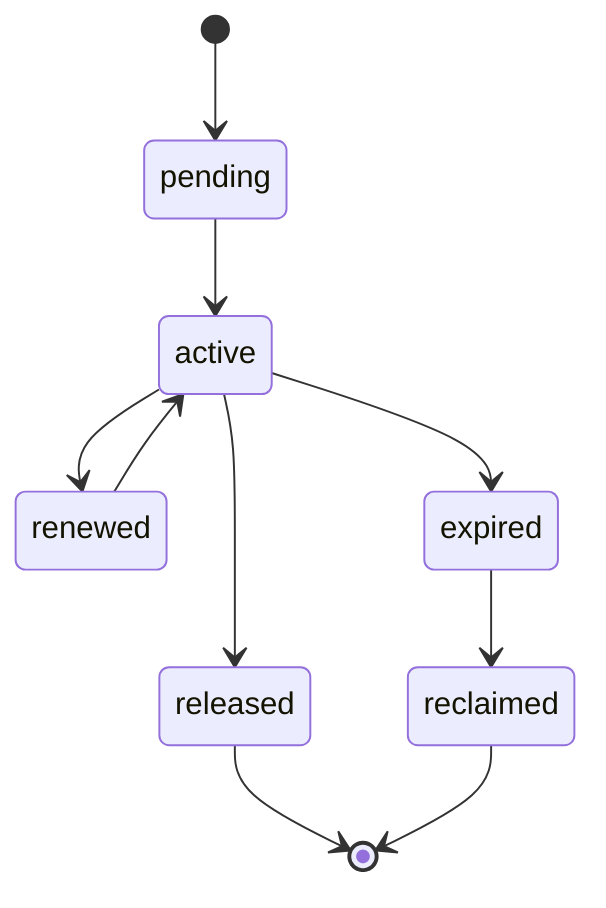

# Distributed Locking Contract

---

## OAPEFLIR Association

This contract participates in the following stages of the OAPEFLIR eight-stage cycle:

- **Observe**: Signal collection and aggregation
- **Assess**: Pre-execution evaluation and risk assessment
- **Plan**: Task decomposition and DAG construction
- **Execute**: Step execution and fault tolerance
- **Feedback**: Signal collection and preprocessing
- **Learn**: Pattern detection and knowledge extraction
- **Improve**: Improvement candidate evaluation and rollout
- **Release**: Controlled release and rollback

---

## 1. Scope

This contract defines the platform's lock semantics for industrial-grade deployments, including local locks, database locks, lease locks, and approval mutex locks.

The problem it addresses: which locks are only effective within a single process, which locks must be guaranteed across workers, and which operations can only rely on leases rather than general-purpose locks.

Related documents:

- `file_lock_contract.md`
- `task_lease_and_fencing_contract.md`
- `production_storage_and_queue_contract.md`

## 2. Lock Classification

| Lock Type | Authoritative Backend | Primary Use Case |
| --- | --- | --- |
| `local_mutex` | process memory | Single-process cache refresh, singleton initialization protection |
| `file_lock` | authoritative store | File read/write mutual exclusion |
| `execution_lease` | authoritative store | Execution ownership |
| `approval_lock` | authoritative store | Serialized approval object updates |
| `advisory_lock` | PostgreSQL | Short transaction mutual exclusion, repair/migration/compaction serialization |

## 3. Key Principles

- Local locks must not be mistaken for distributed locks.
- Execution ownership should preferably use lease + fencing, not ordinary mutex as a substitute.
- Write locks must have TTL, renewal, reclamation, and owner identification.
- Lock failures must be observable, alertable, and recoverable.
- Lock state progression that affects truth must be subordinate to the unified state write entry point and cannot be scattered across individual callers.

## 4. Recommended Solutions

- Short transaction mutual exclusion: PostgreSQL advisory lock
- Long-lifecycle execution ownership: lease + fencing token
- File mutual exclusion: authoritative file lock repository
- Redis locks are not the current preferred authoritative source; if Redlock is adopted in the future, an additional ADR must explain the risk boundaries

## 5. Lock State Machine

Description:

- The above state machine only describes the resource lifecycle of `LockRecord` / `LeaseRecord`, not a second set of truth mutation entry points independent of the runtime state machine.
- Any truth changes related to `execution_lease`, `approval_lock`, or system maintenance locks must go through the unified command entry point and append fact events.

### 5.1 LockTransitionCommand

`LockTransitionCommand` minimum fields:

- `lock_id`
- `lock_type`
- `resource_key`
- `from_status`
- `to_status`
- `owner_id`
- `reason_code`
- `trace_id`
- `occurred_at`
- `fencing_token?`

Rules:

- Acquisition, renewal, expiration, and reclamation of `execution_lease` must work in coordination with `RuntimeStateMachine.transition(command)`; lease state must not bypass the unified state write entry point for direct modification.
- For `execution_lease`, lock state progression must maintain the same truth boundary as the lease/fencing validation of `NodeRun` / `NodeAttempt`.
- `approval_lock`, `file_lock`, and `advisory_lock` must also go through append-only events and audit chain records if they affect audit or system maintenance truth.

## 6. Required Fields

- `lock_id`
- `lock_type`
- `resource_key`
- `owner_kind`
- `owner_id`
- `expires_at`
- `fencing_token?`
- `created_at`
- `updated_at`

## 7. Rules

- Any distributed write lock must support expiration determination.
- Lock acquisition failure must return a clear `reason_code`, not just `false`.
- Lock release must verify the owner to avoid accidentally releasing others' locks.
- Lock reclamation actions must produce logs and audit events.
- State progression of `execution_lease` must not become a RuntimeStateMachine bypass; if driving `NodeRun` recovery, failure, or takeover is needed, it must be done through the unified state machine command.

## 8. Applicable Boundaries

Scenarios where distributed locks should not be used:

- Side-effect-free deduplication of purely local in-memory objects
- Read-only tasks with idempotent semantics that can be re-executed repeatedly

Scenarios that must use authoritative distributed locks or leases:

- File writes
- Execution main write chain
- Approval final ruling
- System-level maintenance actions such as migration/repair/reindex

## 9. Fault Handling

- After lock expiration, the original owner must not continue writing.
- If a network partition causes the owner to believe it still holds the lock, the authoritative backend still takes the current latest token as authoritative.
- Lock table bloat or accumulated expired locks should trigger operations alerts.

## 10. Conclusion

The focus of industrial-grade lock design is not "locking everywhere," but first distinguishing:

- Local mutual exclusion
- Distributed resource locks
- Execution lease

Only with clear boundaries can the system be both safe and not dragged down by lock design.

## v4.3 Architecture Remediation

The following items fix contract deviations recorded in `platform-architecture-implementation-consistency-audit.md`. If any historical sections of this document conflict with this section, this section, `docs_zh/architecture/00-platform-architecture.md`, ADR-109 through ADR-113, and `src/platform/contracts/executable-contracts/` take precedence.

- T-31: This document previously described the lock state machine as a self-contained independent lifecycle but failed to explain how it is subordinate to the unified state write entry point. The root cause is that early lock contracts treated lease/lock as infrastructure details, ignoring that once they affect execution ownership they enter the runtime truth boundary. Fix: The main text now incorporates `LockTransitionCommand` and explicitly states that state progression of `execution_lease` must coordinate with `RuntimeStateMachine.transition(command)` and cannot become a bypass state machine.

Mandatory rules: State transitions must go through `RuntimeStateMachine.transition(command)`; execution plans must use `PlanGraphBundle`; execution results must use `NodeAttemptReceipt`; truth events can only use `platform.*`; OAPEFLIR can only be used as `oapeflir.view.*` / rationale projection; budgets must use `BudgetLedger` / `BudgetReservation` / `BudgetSettlement`.