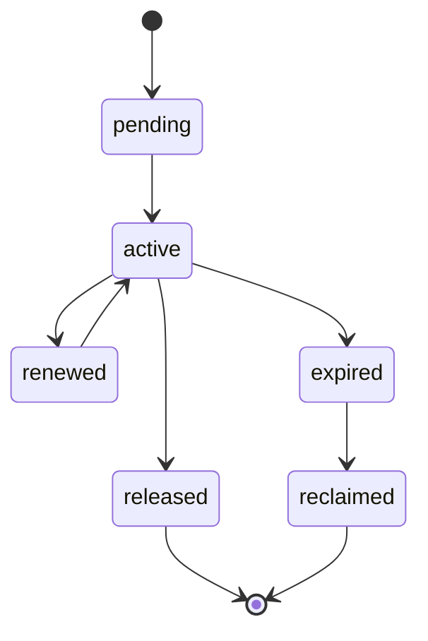

# Distributed Locking Contract

---

## OAPEFLIR Association

This contract participates in the following phases of the OAPEFLIR eight-phase loop:

- **Observe**: Signal collection and aggregation
- **Assess**: Pre-execution assessment and risk judgment
- **Plan**: Task decomposition and DAG construction
- **Execute**: Step execution and fault tolerance
- **Feedback**: Signal collection and preprocessing
- **Learn**: Pattern detection and knowledge extraction
- **Improve**: Improvement candidate evaluation and rollout
- **Release**: Controlled release and rollback

---

## 1. Scope

This contract defines lock semantics for industrial-grade platform deployment, including local locks, database locks, lease locks, and approval mutex locks.

The problem it solves: Which locks are only effective within a single process, which locks must be guaranteed across workers, and which operations can only rely on lease rather than general locks.

Related Documents:

- `file_lock_contract.md`
- `task_lease_and_fencing_contract.md`
- `production_storage_and_queue_contract.md`

## 2. Lock Classification

| Lock Type | Authoritative Backend | Primary Use |
| --- | --- | --- |
| `local_mutex` | process memory | Single process cache refresh, singleton initialization protection |
| `file_lock` | authoritative store | File read/write mutex |
| `execution_lease` | authoritative store | Execution ownership |
| `approval_lock` | authoritative store | Approval object serial update |
| `advisory_lock` | PostgreSQL | Short transaction mutex, repair / migration / compaction serialization |

## 3. Key Principles

- Must not mistake local locks for distributed locks.
- Execution ownership should prioritize lease + fencing, not using ordinary mutex as substitute.
- Write locks must have TTL, renewal, recycling, and owner identification.
- Lock failures must be observable, alertable, and recoverable.

## 4. Recommended Solutions

- Short transaction mutex: PostgreSQL advisory lock
- Long-lifecycle execution ownership: lease + fencing token
- File mutex: authoritative file lock repository
- Redis lock is not the current preferred authoritative source; if Redlock is adopted in the future, additional ADR must explain risk boundary

## 5. Lock State Machine

## 6. Required Fields

- `lock_id`
- `lock_type`
- `resource_key`
- `owner_kind`
- `owner_id`
- `expires_at`
- `fencing_token?`
- `created_at`
- `updated_at`

## 7. Rules

- Any distributed write lock must support expiration judgment.
- Lock acquisition failure must return explicit `reason_code`, not just `false`.
- Lock release must verify owner to avoid mistakenly releasing others' locks.
- Lock recycling actions must generate logs and audit events.

## 8. Applicable Boundaries

Scenarios where distributed locks should not be used:

- Side-effect-free deduplication of purely local memory objects
- Read-only tasks that are repeatable and already have idempotent semantics

Scenarios where authoritative distributed locks or lease must be used:

- File writes
- Execution primary write chain
- Approval final decision
- System-level maintenance actions like migration / repair / reindex

## 9. Failure Handling

- After lock expires, original owner must not continue writing.
- If network partition causes owner to believe it still holds the lock, authoritative backend still uses current latest token as authority.
- Lock table abnormal expansion or expired lock accumulation should trigger operations alerts.

## 10. Closure Conclusion

The focus of industrial-grade lock design is not "adding locks everywhere", but first distinguishing:

- Local mutex
- Distributed resource lock
- Execution lease

Only with clear boundaries can the system be both safe and not dragged down by lock design.
