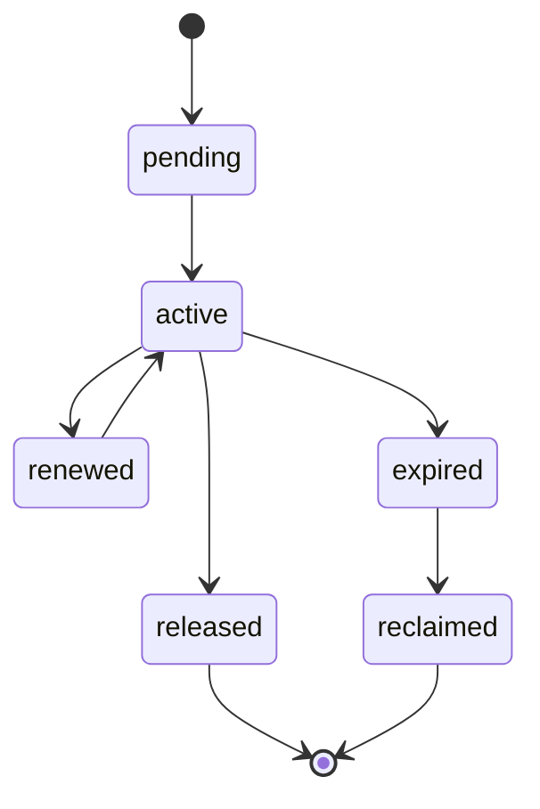

# Distributed Locking Contract

---

## OAPEFLIR Association

This contract participates in the following stages of the OAPEFLIR eight-stage cycle:

- **Observe**: Signal collection and aggregation
- **Assess**: Pre-execution assessment and risk judgment
- **Plan**: Task decomposition and DAG construction
- **Execute**: Step execution and fault tolerance
- **Feedback**: Signal collection and preprocessing
- **Learn**: Pattern detection and knowledge extraction
- **Improve**: Improvement candidate evaluation and rollout
- **Release**: Controlled release and rollback

---

## 1. Scope

This contract defines lock semantics for industrial-grade platform deployment, including local locks, database locks, lease locks, and approval mutex locks.

The problem it solves: which locks are only effective within a single process, which must be guaranteed across workers, and which operations must rely on lease rather than general-purpose locks.

Related documents:

- `file_lock_contract.md`
- `task_lease_and_fencing_contract.md`
- `production_storage_and_queue_contract.md`

## 2. Lock Classification

| Lock Type | Authoritative Backend | Primary Use |
| --- | --- | --- |
| `local_mutex` | process memory | Single-process cache refresh, singleton initialization protection |
| `file_lock` | authoritative store | File read/write mutual exclusion |
| `execution_lease` | authoritative store | Execution ownership |
| `approval_lock` | authoritative store | Approval object serial updates |
| `advisory_lock` | PostgreSQL | Short-transaction mutex, repair / migration / compaction serialization |

## 3. Key Principles

- Local locks must not be mistaken for distributed locks.
- Execution ownership should prioritize lease + fencing over ordinary mutex replacement.
- Write locks must have TTL, renewal, reclamation, and owner identification.
- Lock failures must be observable, alertable, and recoverable.

## 4. Recommended Solutions

- Short-transaction mutex: PostgreSQL advisory lock
- Long-lifecycle execution ownership: lease + fencing token
- File mutual exclusion: authoritative file lock repository
- Redis locks are not the current preferred source of truth; if Redlock is adopted in the future, an additional ADR must explain the risk boundary.

## 5. Lock State Machine

## 6. Required Fields

- `lock_id`
- `lock_type`
- `resource_key`
- `owner_kind`
- `owner_id`
- `expires_at`
- `fencing_token?`
- `created_at`
- `updated_at`

## 7. Rules

- Any distributed write lock must support expiration determination.
- Lock acquisition failures must return an explicit `reason_code` and must not just return `false`.
- Lock release must verify owner to avoid releasing someone else's lock.
- Lock reclamation actions must produce logs and audit events.

## 8. Applicable Boundaries

Scenarios where distributed locks should NOT be used:

- Side-effect-free deduplication of local in-memory objects only
- Read-only tasks that are repeatable and already have idempotent semantics

Scenarios that must use authoritative distributed locks or lease:

- File writes
- Execution primary write chain
- Approval final decisions
- Migration / repair / reindex and other system-level maintenance actions

## 9. Fault Handling

- After a lock expires, the original owner must not continue writing.
- If a network partition causes the owner to believe it still holds the lock, the authoritative backend still uses the current latest token as the source of truth.
- Lock table abnormal inflation or expired lock accumulation should trigger operations alerts.

## 10. Conclusion

The focus of industrial-grade lock design is not "lock everywhere," but first distinguishing:

- Local mutex
- Distributed resource lock
- Execution lease

Only with clear boundaries can the system be both safe and not be dragged down by lock design.
