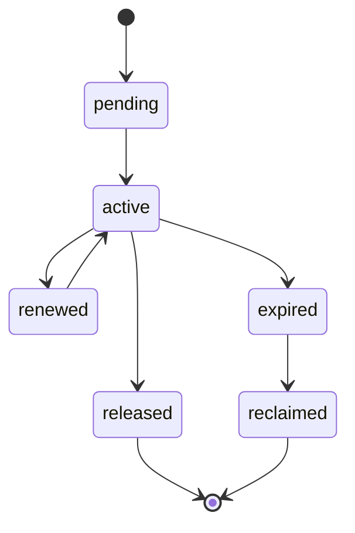

# Distributed Locking Contract

## 1. Scope

This contract defines the platform's lock semantics under industrial-grade deployment, including local locks, database locks, lease locks, and approval mutex locks.

The problem it solves: Which locks are only effective within a single process, which must be guaranteed across workers, and which operations must rely on lease rather than general locks.

Related documents:

- `file_lock_contract.md`
- `task_lease_and_fencing_contract.md`
- `production_storage_and_queue_contract.md`

## 2. Lock Classification

| Lock Type | Authoritative Backend | Primary Use |
| --- | --- | --- |
| `local_mutex` | process memory | Single-process cache refresh, singleton initialization protection |
| `file_lock` | authoritative store | File read/write mutual exclusion |
| `execution_lease` | authoritative store | Execution rights |
| `approval_lock` | authoritative store | Approval object serial update |
| `advisory_lock` | PostgreSQL | Short transaction mutual exclusion, repair / migration / compaction serial |

## 3. Key Principles

- Must not mistake local locks for distributed locks.
- For execution ownership, prioritize using lease + fencing, not general mutex replacement.
- Write locks must have TTL, renewal, reclamation, and owner identification.
- Lock failures must be observable, alertable, and recoverable.

## 4. Recommended Solutions

- Short transaction mutual exclusion: PostgreSQL advisory lock
- Long-lifecycle execution rights: lease + fencing token
- File mutual exclusion: authoritative file lock repository
- Redis locks are not the current preferred source of truth; if Redlock is adopted in the future, additional ADR must explain risk boundaries

## 5. Lock State Machine

## 6. Required Fields

- `lock_id`
- `lock_type`
- `resource_key`
- `owner_kind`
- `owner_id`
- `expires_at`
- `fencing_token?`
- `created_at`
- `updated_at`

## 7. Rules

- Any distributed write lock must support expiration judgment.
- Lock acquisition failure must return explicit `reason_code` and must not only return `false`.
- Lock release must verify owner to avoid mistakenly releasing others' locks.
- Lock reclamation actions must produce logs and audit events.

## 8. Applicable Boundaries

Scenarios where distributed locks should not be used:

- Deduplication of local in-memory objects without side effects
- Read-only tasks that can be repeatedly executed and already have idempotent semantics

Scenarios that must use authoritative distributed locks or leases:

- File writes
- Execution primary write chain
- Approval final decision
- System-level maintenance actions such as migration / repair / reindex

## 9. Fault Handling

- After lock expires, original owner must not continue writing.
- If network partition causes owner to still think it holds the lock, authoritative backend still uses the current latest token as standard.
- Lock table abnormal expansion or expired lock buildup should trigger operations alerts.

## 10. Closure Conclusion

The focus of industrial-grade lock design is not "adding locks everywhere" but first distinguishing:

- Local mutual exclusion
- Distributed resource locks
- Execution leases

Only with clear boundaries can the system be both safe and not weighed down by lock design.
