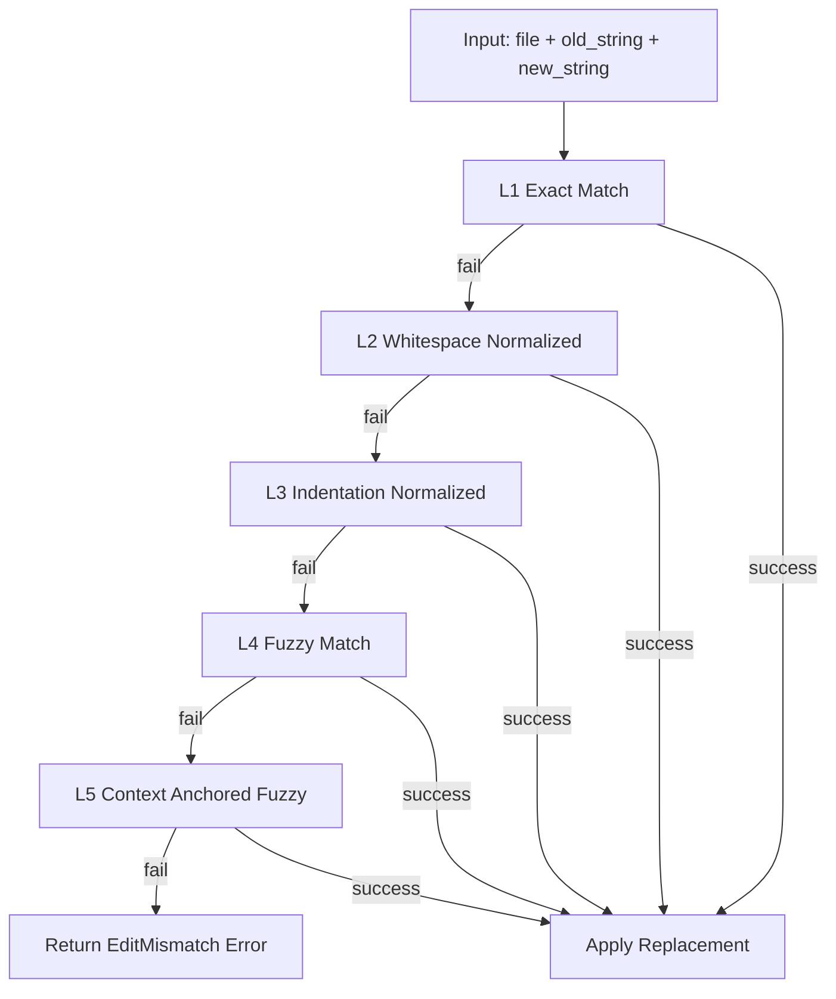

# Edit Replacement Chain Contract

---

## OAPEFLIR Association

This contract participates in the following stages of the OAPEFLIR eight-stage cycle:

- **Observe**: Signal collection and aggregation
- **Assess**: Pre-execution assessment and risk judgment
- **Plan**: Task decomposition and DAG construction
- **Execute**: Step execution and fault tolerance
- **Feedback**: Signal collection and preprocessing
- **Learn**: Pattern detection and knowledge extraction
- **Improve**: Improvement candidate evaluation and rollout
- **Release**: Controlled release and rollback

---

## 1. Scope

This contract defines the multi-level matching chain for `edit / patch / replace` tools when locating old content and applying replacements.

Related documents:

- `tool_and_provider_execution_contract.md`
- `file_lock_contract.md`
- `tool_output_sanitization_contract.md`
- `idempotency_and_recovery_matrix_contract.md`

## 2. Goals

The multi-level matching chain must simultaneously solve two types of problems:

- LLM-generated `old_string` has slight whitespace, indentation, or newline deviations from the actual file.
- To improve success rate, fuzzy replacement cannot be amplified into silent mis-modification risk.

## 3. Core Principles

- The matching chain must attempt in a fixed order, stopping at the first success.
- The vaguer the matching level, the stricter the security constraints must be.
- Any non-exact replacement must leave warnings and audit records.
- When unique positioning is not possible, it must fail rather than "guess a close enough spot."

## 4. `EditReplacementAttempt`

| Field | Type | Description |
| --- | --- | --- |
| `attempt_level` | `exact \| whitespace_normalized \| indentation_normalized \| fuzzy \| context_anchored` | Matching level |
| `matched` | `boolean` | Whether successfully located |
| `candidate_count` | `number` | Candidate count |
| `similarity_score` | `number?` | Fuzzy match score |
| `warning_codes` | `string[]` | Risk warnings |
| `applied_range` | `string?` | Change location |

## 5. Multi-Level Matching Chain

### 5.1 Level 1 `exact`

- Exact string matching.
- No normalization performed.
- If uniquely matched, apply directly.

### 5.2 Level 2 `whitespace_normalized`

- Normalize consecutive whitespace.
- Remove trailing whitespace differences.
- Do not change semantic character order.

### 5.3 Level 3 `indentation_normalized`

- Strip common indentation before matching.
- Applicable to entire code block indentation changes.
- Should preserve the current indentation style of the target file after replacement.

### 5.4 Level 4 `fuzzy`

- Attempted only after levels 1-3 all fail.
- Requires `similarity_score >= 0.85`.
- Must have only one unique candidate.
- On success, must record warning: `fuzzy_edit_applied`.

### 5.5 Level 5 `context_anchored`

- Use before/after anchors to narrow the candidate region first, then do fuzzy matching.
- Only effective within a unique anchor window.
- On success, must record stronger warning: `anchored_fuzzy_edit_applied`.

## 6. Explicitly Not Doing Currently

Phase 1a / 1b does not do:

- AST-aware replacement.
- Tree-sitter-level structured node location.
- Cross-file semantic rewriting.

If these capabilities are to be introduced, they should enter Phase 2 with a separate ADR or contract.

## 7. Security Constraints

- If multiple candidates appear for the same request, it must fail and return conflict information.
- Any fuzzy success result should return a warning for upper-layer message or log prompts for human review.
- Multi-level matching chain must not be enabled on binary / non-text files.
- A `write` lock must be held before applying replacements.

## 8. Error Semantics

Recommended stable error codes:

- `tool.edit_target_not_found`
- `tool.edit_multiple_candidates`
- `tool.edit_similarity_too_low`
- `tool.execution_failed`

Rules:

- Target not found and "multiple targets found" must be reported as separate errors.
- Similarity below threshold should explicitly fail and must not silently downgrade and apply.

## 9. Idempotency and Recovery

- If the file content after replacement equals the expected result, it can be considered idempotent success.
- Before retrying recovery, the target file should be re-read rather than directly reusing old candidate ranges.
- Retries at fuzzy / anchored levels must not continue using old scores after the file has changed.

## 10. Phase Boundaries

Phase 1a does:

- `exact`
- `whitespace_normalized`
- `indentation_normalized`

Phase 1b does:

- `fuzzy`
- `context_anchored`

## 11. Conclusion

Improving edit success rate cannot rely on "being bolder with changes," but rather on a matching chain that tightens order, explicitly signals risk, and fails explainably.
