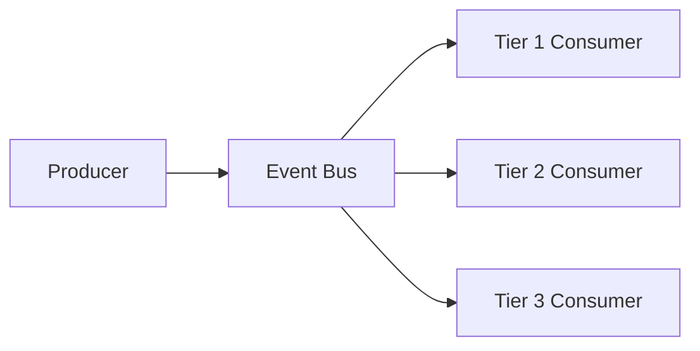
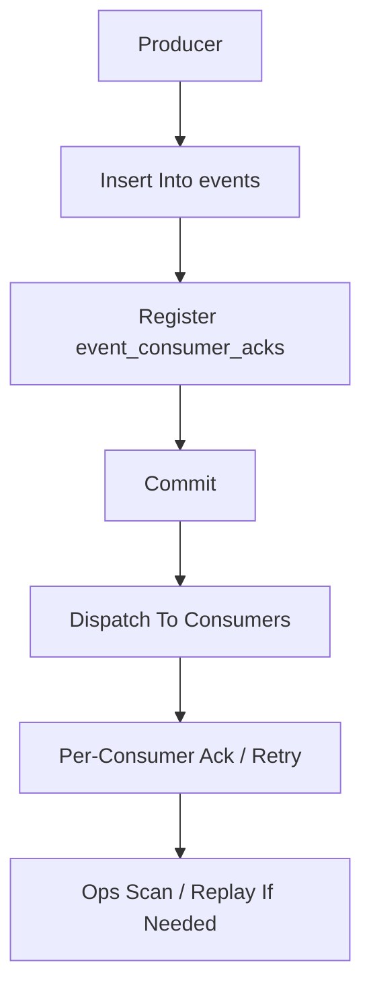

# Event Bus Contract

## 1. Scope

This contract defines the event bus architecture with three tiers, producer/consumer contracts, schema governance, and delivery guarantees.

Related documents:

- `event_reliability_matrix_contract.md`
- `event_registry_and_ops_threshold_contract.md`
- `storage_schema_contract.md`
- `startup_consistency_and_recovery_drill_contract.md`

## 2. Goals

- Tier 1 events are reliably delivered with consumer acknowledgments (required).
- Tier 2 events are at-least-once delivered with optional acknowledgment.
- Tier 3 events are best-effort (e.g., SSE stream chunks).

## 3. Tier Definitions

| Tier | Delivery Guarantee | Ack Required | Use Cases |
| --- | --- | --- | --- |
| Tier 1 | Reliable delivery with consumer ack | Required | Task, approval, state, recovery chain |
| Tier 2 | At-least-once delivery | Optional | Important progress, tool stages, observability events |
| Tier 3 | Best-effort | Not required | Stream chunks, heartbeats, transient progress |

## 4. Architecture

## 5. Producer Contract

- Tier 1 events must be persisted before dispatch.
- Tier 2 events may be emitted before persistence.
- Tier 3 events flow through memory or display layer channels.

## 6. Consumer Contract

- Tier 1 consumers must acknowledge events.
- Tier 2 consumers may skip acknowledgment.
- Tier 3 consumers do not acknowledge.

## 7. Schema Governance

- All events must carry `payloadSchemaRef` (default `event://{domain}/{action}/v1`).
- Compatibility policy defaults to `backward_compatible_additive`.
- Typed event bus layer uses these for compile-time validation.

## 8. Observability

- Tier 1 unacknowledged events must trigger alerts.
- Tier 2 backlog must be monitored.
- Tier 3 loss is only tracked trend-wise.

## 9. Write and Distribution Order

Rules:

- Tier 1 must fully go through this chain.
- Tier 2 may skip `event_consumer_acks` but should upgrade to Tier 1 if it assumes key projection functions in the future.
- Tier 3 must not pretend to be a recoverable source of truth.

## 10. Closure Conclusion

The event system's reliability depends not only on "whether events are sent" but on whether there is a stable registry explaining who should receive what, how long they should wait, and how the system reacts when they do not receive it.
