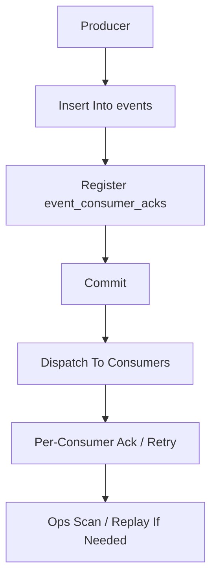

# Event Registry And Ops Threshold Contract

> **v4.3 Compatibility Note**: This file is preserved as historical event registry and ops threshold documentation. v4.3 event tiering is based on [ADR-111](../adr/111-platform-fact-vs-oapeflir-view-events.md) and [v4_3_event_envelope_contract.md](./v4_3_event_envelope_contract.md); `platform.*` is truth fact, `oapeflir.view.*` / `oapeflir.rationale.*` only serve as projection.

> **OAPEFLIR Related**: This contract defines the event registry for OAPEFLIR 8 phases, corresponding to ADR-016/ADR-079/ADR-080.
> **Updated**: 2026-04-17

## 1. Scope

This contract, on top of `event_reliability_matrix_contract.md`, continues to freeze the event registry, consumer relationships, and ops thresholds for the current phase.

Related Documents:

- `event_bus_contract.md`
- `event_reliability_matrix_contract.md`
- `storage_schema_contract.md`
- `startup_consistency_and_recovery_drill_contract.md`
- [ADR-079 Feedback Hub](../adr/079-feedback-hub-signals.md)
- [ADR-080 Learn Hub](../adr/080-learn-hub-pattern-detection.md)

## 2. Goals

This document answers 3 questions:

- What stable event types currently exist.
- Who produces and who consumes each type of event, and whether ack is needed.
- When backlog or loss becomes an ops alert.

## 3. Registration Principles

- Events entering implementation must be registered here first.
- Tier 1 events must declare producer, consumer, ack strategy, and replay requirements.
- Tier 2 / 3, even if not forcing ack, must clarify usage scenarios to avoid event semantics drift.
- Each registered event automatically carries `payloadSchemaRef` (default `event://{domain}/{action}/v1`) and `compatibilityPolicy` (default `backward_compatible_additive`), for compile-time validation at typed event bus layer.

## 4. Phase 1a / 1b Event Registry

| event_type | tier | producer | primary_consumers | ack_required | replay_required |
| --- | --- | --- | --- | --- | --- |
| `task.created` | `tier1` | gateway / scheduler | runtime, observability | Yes | Yes |
| `task.status_changed` | `tier1` | transition service | gateway, observability, recovery scan | Yes | Yes |
| `workflow.started` | `tier1` | workflow runtime | observability, recovery scan | Yes | Yes |
| `workflow.step_completed` | `tier1` | workflow runtime | orchestrator, recovery scan | Yes | Yes |
| `workflow.failed` | `tier1` | workflow runtime | supervisor, recovery scan | Yes | Yes |
| `approval.requested` | `tier1` | transition service / policy engine | gateway, approval inbox | Yes | Yes |
| `approval.resolved` | `tier1` | approval service | runtime, gateway | Yes | Yes |
| `execution.blocked` | `tier1` | runtime | supervisor, recovery scan | Yes | Yes |
| `execution.succeeded` | `tier1` | runtime | transition service, observability | Yes | Yes |
| `execution.failed` | `tier1` | runtime | supervisor, recovery scan | Yes | Yes |
| `cost.limit_reached` | `tier1` | budget guard / policy engine | runtime, gateway, observability | Yes | Yes |
| `oapeflir.observe.signals_collected` | `tier2` | observe hub | observability, inspect projection | No | Suggested |
| `oapeflir.assess.evaluation_completed` | `tier2` | assess hub | observability, inspect projection | No | Suggested |
| `oapeflir.plan.proposal_created` | `tier2` | plan hub | observability, inspect projection | No | Suggested |
| `feedback.signal_received` | `tier2` | feedback hub / gateway / explainability pipeline | learn hub, observability, inspect projection | No | Suggested |
| `learn.object_created` | `tier2` | learn hub | observability, inspect projection | No | Suggested |
| `learn.object_promoted` | `tier2` | learn hub | improvement pipeline, observability, inspect projection | No | Suggested |
| `improve.candidate_proposed` | `tier2` | improve hub | observability, inspect projection | No | Suggested |
| `improve.candidate_accepted` | `tier1` | improve hub / guardrail evaluator | release hub, observability, audit lineage | Yes | Yes |
| `release.rollout_started` | `tier1` | release hub | observability, audit lineage, inspect projection | Yes | Yes |
| `release.rollout_completed` | `tier1` | release hub | observability, audit lineage, inspect projection | Yes | Yes |
| `release.rollback_triggered` | `tier1` | release hub / supervisor | observability, audit lineage, inspect projection | Yes | Yes |
| `loop.iteration_completed` | `tier2` | oapeflir loop service | observability, inspect projection | No | Suggested |
| `gateway.message_received` | `tier2` | gateway adapter | runtime, observability | No | Suggested |
| `gateway.message_sent` | `tier2` | gateway adapter | observability | No | No |
| `tool.call_started` | `tier2` | tool executor | observability | No | No |
| `tool.call_completed` | `tier2` | tool executor | observability, cost tracker | No | Suggested |
| `supervisor.health_warning` | `tier2` | supervisor | observability, operator UI | No | Suggested |
| `stream.chunk_emitted` | `tier3` | gateway streaming bridge | UI / channel client | No | No |
| `heartbeat.sampled` | `tier3` | supervisor / runtime | observability | No | No |
| `dispatch:ticket_created` | `tier2` | execution dispatch service | inspect_projection | No | Suggested |
| `dispatch:ticket_claimed` | `tier2` | execution dispatch service | inspect_projection | No | Suggested |
| `dispatch:decision_recorded` | `tier2` | execution dispatch service | inspect_projection | No | Suggested |
| `dispatch:ticket_reconciled` | `tier2` | execution dispatch reconciliation service | inspect_projection | No | No |
| `dispatch:ticket_requeued` | `tier2` | execution dispatch reconciliation service | inspect_projection | No | No |
| `worker:claim_accepted` | `tier2` | execution worker handshake service | inspect_projection | No | Suggested |
| `worker:claim_rejected` | `tier2` | execution worker handshake service | inspect_projection | No | No |
| `worker:heartbeat_recorded` | `tier2` | execution worker handshake service | inspect_projection | No | No |
| `worker:writeback_recorded` | `tier2` | execution worker writeback service | inspect_projection | No | Suggested |
| `worker:writeback_rejected` | `tier2` | execution worker writeback service | inspect_projection | No | No |
| `worker:lease_released_after_writeback` | `tier2` | execution worker writeback service | inspect_projection | No | No |
| `takeover:session_opened` | `tier2` | human takeover service | inspect_projection | No | Suggested |
| `takeover:action_applied` | `tier2` | human takeover service | inspect_projection | No | Suggested |
| `recovery:repair_applied` | `tier2` | runtime repair service | inspect_projection | No | Suggested |
| `recovery:decision_recorded` | `tier2` | runtime recovery decision service | inspect_projection | No | Suggested |
| `recovery:dead_lettered` | `tier2` | runtime recovery decision service | inspect_projection | No | Suggested |
| `recovery:cancelled` | `tier2` | runtime recovery decision service | inspect_projection | No | No |
| `skill:execution_started` | `tier2` | skill execution service | inspect_projection | No | No |
| `skill:cache_miss` | `tier2` | skill execution service | inspect_projection | No | No |
| `skill:cache_hit` | `tier2` | skill execution service | inspect_projection | No | No |
| `skill:cache_stored` | `tier2` | skill execution service | inspect_projection | No | No |
| `skill:step_started` | `tier2` | skill execution service | inspect_projection | No | No |
| `skill:retry_scheduled` | `tier2` | skill execution service | inspect_projection | No | No |
| `skill:step_succeeded` | `tier2` | skill execution service | inspect_projection | No | No |
| `skill:step_failed` | `tier2` | skill execution service | inspect_projection | No | No |
| `skill:execution_completed` | `tier2` | skill execution service | inspect_projection | No | No |

## 5. Consumer Specifications

### 5.1 Tier 1 Consumers

Standard consumers for Tier 1 at least include:

- `runtime_recovery_scanner`
- `gateway_projection`
- `observability_sink`

Rules:

- Same Tier 1 event can be independently acknowledged by multiple consumers.
- One consumer failure must not overwrite other consumers' acknowledgment results.
- When adding new Tier 1 consumers, must simultaneously evaluate startup scan and ack threshold.
- `gateway_projection`, `runtime_recovery_scanner`, `observability_sink` `consumer_id` must remain stable, must not drift due to process restart.

### 5.2 Tier 2 Consumers

Current main consumers for Tier 2 events are `inspect_projection`, used to maintain structured projections for inspect / diagnostics / timeline.

By domain grouping:

- **OAPEFLIR events** (`oapeflir.*`, `feedback.*`, `learn.*`, `improve.*`, `release.*`, `loop.*`): Produced by each hub, projected to closed-loop timeline, feedback chain, and rollout diagnostic views.
- **dispatch events** (`dispatch:*`): Produced by `execution_dispatch_service` or `execution_dispatch_reconciliation_service`, projected to dispatch decision trace and ticket state.
- **worker events** (`worker:*`): Produced by `execution_worker_handshake_service` and `execution_worker_writeback_service`, projected to worker lease state and fencing audit.
- **takeover events** (`takeover:*`): Produced by `human_takeover_service`, projected to human takeover audit chain.
- **recovery events** (`recovery:*`): Produced by `runtime_repair_service` and `runtime_recovery_decision_service`, projected to recovery decision and dead-letter audit chain.
- **skill events** (`skill:*`): Produced by `skill_execution_service`, projected to skill execution observability chain. Covers skill full lifecycle: start, cache hit/miss/store, step start/success/fail, retry schedule, execution complete.

Rules:

- Tier 2 may skip persistent ack, but if undertaking key projection function, should explicitly declare degradation strategy in implementation.

### 5.3 Tier 3 Consumers

- No persistent ack
- Must not impersonate recoverable fact sources

## 6. Ops Thresholds

### 6.1 Backlog Alerts

| Metric | Threshold | Action |
| --- | --- | --- |
| Tier 1 unacked events count | `> 0` and persistent `5m` | Alert |
| Single consumer Tier 1 backlog | `>= 20` | Alert and trigger recovery scan |
| Tier 2 backlog | `>= 100` and persistent `10m` | Optional alert |
| Tier 3 loss | Not individually alerting | Only monitor trends |

### 6.2 Latency Thresholds

| Metric | Suggested Threshold | Action |
| --- | --- | --- |
| Tier 1 write to first dispatch latency | `> 5s` | Alert |
| Tier 1 write to all ack latency | `> 30s` | Alert |
| Tier 2 write to dispatch latency | `> 30s` | Optional alert |

### 6.3 Recovery Thresholds

| Scenario | Threshold | Action |
| --- | --- | --- |
| Tier 1 ack consecutive failures | `>= 3` | Mark `degraded` and enter recovery |
| Same event replay count | `>= 5` | Human intervention |
| Single consumer long inactive | `> 10m` | Pause registration or degrade projection |

## 7. Write and Dispatch Order

Rules:

- Tier 1 must completely go through this chain.
- Tier 2 can skip `event_consumer_acks`, but if undertaking key projection in future, should upgrade to Tier 1.
- Tier 3 must not impersonate recoverable fact sources.

## 8. Startup Scan Linkage

Startup scan at least checks:

- Whether there are Tier 1 events exceeding threshold and not acked
- Whether there are events produced but not registered in registry
- Whether there are events with inconsistent consumer status and registry

## 9. Phase Boundary

Phase 1a does:

- Tier 1 / 2 / 3 baseline registry
- Tier 1 per-consumer ack
- Basic backlog threshold

Phase 1b does:

- More gateway / orchestration event types
- Finer consumer grouping and projection alerts

Currently does not do:

- External message queue partitioning strategy
- Cross-region event replication
- Enterprise event retention policy

## 10. Closure Conclusion

Whether an event system is reliable depends not only on "whether events will be sent", but on having a stable registry说明 who should receive, how long they should receive, and how the system will react when not received.
