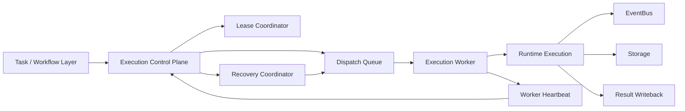
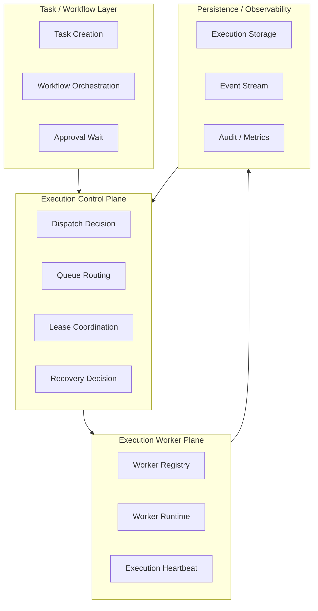
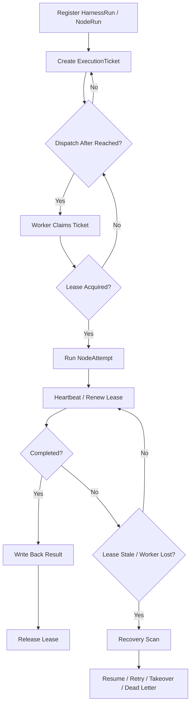

# Execution Plane Contract

> **v4.3 Compatibility Note**: This file is retained as historical execution plane description. v4.3 P3 -> P4 execution handover takes [plan-graph-patch-contract.md](./plan-graph-patch-contract.md) as authoritative, P4 status advancement takes [ADR-110](../adr/110-runtime-state-machine-authority.md) as authoritative; linear execution / workflow semantics can only be used as legacy projection.

> **OAPEFLIR Related**: This contract defines the OAPEFLIR Execute Hub's execution plane, corresponding to ADR-016 Execute stage and ADR-079 Feedback Hub.
> **Updated**: 2026-04-17

## 1. Scope

This contract defines the target architecture of the platform evolving from single-machine runtime to multi-execution plane, including scheduling, dispatch, lease, worker survival, takeover, recovery and execution authority governance.

It is the upper-level extension of `runtime_execution_contract.md`, answering "when execution no longer only runs in a single process, how does the platform remain controllable, recoverable and auditable".

## 2. Goals

- Formally separate `control plane` and `execution plane`.
- Enable execution to be scheduled, recovered and taken over across workers.
- Ensure stale run, failover, handover and takeover have unified semantics.
- Ensure only one authoritative execution authority holder in multi-worker environment.

## 3. Non-Goals

- Phase 1a does not require full distributed queue cluster.
- This contract does not specify specific queue backend product selection.
- This contract does not replace single-run state machine and execution semantics definition.

## 4. Architecture Layering

`Task / Workflow Layer`
: Responsible for task generation, workflow orchestration, approval waiting and result write-back.

`Execution Control Plane`
: Responsible for dispatch, lease, route, capacity awareness, recovery decision.

`Execution Worker Plane`
: Responsible for actually consuming execution ticket, executing run, reporting heartbeat and results.

`Recovery And Governance Hooks`
: Responsible for stale detection, takeover proposal, kill / freeze / retry decision linkage.

`Plan / Feedback Boundary (OAPEFLIR)`
: P3 only allows issuing `PlanGraphBundle` / `GraphPatch`; after execution plane executes, first write back `NodeAttemptReceipt`, `FeedbackSignal` and user summary can only be used as derived view based on receipt (corresponding to ADR-079).

## 5. Key Components

- `ExecutionControlPlane`
- `DispatchQueue`
- `LeaseCoordinator`
- `ExecutionWorker`
- `RecoveryCoordinator`
- `WorkerRegistry`
- `WorkerHeartbeat`
- `TakeoverManager`
- `PlanGraphBundle` (P3 -> P4 unique execution plan contract)
- `NodeAttemptReceipt` (P4 -> other planes unique execution receipt)
- `FeedbackSignal` (Cognitive/learning input derived based on `NodeAttemptReceipt`)

## 6. Target Architecture

Supplementary notes:

- `ExecutionControlPlane` is responsible for deciding "who should execute".
- `ExecutionWorker` is responsible for executing "runs that have been authorized to execute".
- `LeaseCoordinator` is responsible for ensuring only one worker holds the same execution at the same time.
- `RecoveryCoordinator` is responsible for scanning stale executions and deciding recovery, retry, takeover or dead letter.

## 6.1 Execution Plane Layering Diagram

## 7. Key Objects

- `ExecutionTicket`
- `DispatchDecision`
- `LeaseRecord`
- `WorkerSnapshot`
- `RecoveryDecision`
- `TakeoverProposal`
- `WorkerCapabilitySet`

## 8. `ExecutionTicket` Minimum Fields

| Field | Type | Description |
| --- | --- | --- |
| `ticket_id` | `string` | Dispatch ticket ID |
| `harness_run_id` | `string` | Target HarnessRun |
| `node_run_id` | `string` | Target NodeRun |
| `attempt_id` | `string` | Current NodeAttempt |
| `task_id` | `string?` | Compatible query entry; not truth primary key |
| `plan_graph_bundle_id` | `string` | Associated execution graph bundle |
| `graph_version` | `number` | Corresponding graph version |
| `stage_view_ref` | `string?` | Associated OAPEFLIR stage view; only for explanation/display, does not drive execution |
| `priority` | `low \| normal \| high \| urgent` | Scheduling priority |
| `queue_name` | `string` | Target queue |
| `required_capabilities` | `string[]` | Worker required capabilities |
| `dispatch_target` | `any \| local_only \| prefer_remote \| require_remote` | Dispatch target strategy |
| `required_isolation_level` | `read_only \| workspace_write \| scoped_external_access \| restricted_exec` | Minimum isolation level requirement |
| `required_repo_version?` | `string` | Requires worker code version match |
| `dispatch_after` | `timestamp?` | Earliest dispatch time |
| `attempt_no` | `integer` | Attempt count associated with this ticket |
| `created_at` | `timestamp` | Creation time |

### 8.1 Dispatch Target Semantics

| Strategy | Meaning |
| --- | --- |
| `any` | No preference for worker deployment location, both local and remote OK |
| `local_only` | Only local worker execution allowed, remote worker excluded |
| `prefer_remote` | Prefer remote worker; if no remote worker available, downgrade to local |
| `require_remote` | Must be remote worker; if no remote worker available, fail-closed (no downgrade) |

Rules:

- When `require_remote` and remote worker partially available, dispatch should return `remote.partial_available` and reject dispatch, rather than downgrading to local.
- Dispatch target is decided by ticket creator (orchestrator / operator), must not be modified by worker.

### 8.2 Isolation Level Semantics

Worker isolation levels are ordered: `read_only (0) < workspace_write (1) < scoped_external_access (2) < restricted_exec (3)`.

| Level | Meaning |
| --- | --- |
| `read_only` | Read-only sandbox, no write permission |
| `workspace_write` | Standard sandbox, allows writing to workspace |
| `scoped_external_access` | Hardened sandbox, limited external access |
| `restricted_exec` | Strict isolation, minimum privilege execution |

Rules:

- High-risk execution can declare `required_isolation_level`, worker's actual isolation level must be >= required level to accept.
- When isolation level not satisfied, dispatch should record rejection reason in decision trace.

### 8.3 Repo Version Consistency

- Execution ticket can declare `required_repo_version`.
- Worker heartbeat reports `repoVersion`.
- If version does not match, dispatch defaults to fail-closed and records rejection.

### 8.4 General Rules

- A `node_run_id` should correspond to only one active ticket under the same `attempt_id`.
- Ticket after expiration must not be consumed by worker again.
- Authoritative input that execution plane receives must come from `PlanGraphBundle`, not `PlanDTO` or unstructured prompt stitching.

## 8A. OAPEFLIR Plan → Execute → Feedback Boundary

### 8A.1 Plan Hub → Execute (Corresponding to ADR-060)

When `PlanGraphBundle` enters execution plane, minimum must provide:

- `planGraphBundleId`
- `harnessRunId`
- `graphVersion`
- `graph.graphId`
- `graph.nodes[]`
- `graph.edges[]`
- `schedulerPolicy`
- `budget`
- `riskProfile`

**P3 -> P4 Constraints**:
- Execute layer can only receive `PlanGraphBundle` / `GraphPatch`, must not bypass raw task or linear `PlanDTO` direct execution.
- Graph version chain must maintain stable lineage, must not be silently overwritten by new worker.
- Node semantics after `NodeAttemptReceipt` generated must not be原地 rewritten by new worker.

### 8A.2 Execute → Feedback Hub (Corresponding to ADR-079)

After execution plane completes single attempt, truth output must first land `NodeAttemptReceipt`:

- `receiptId`
- `nodeAttemptId`
- `nodeRunId`
- `status`
- `outputRef?`
- `sideEffectRefs[]`
- `budgetSettlementRefs[]`
- `evidenceRefs[]`

On this basis, other planes or read models can derive:

- `FeedbackSignal[]`
- `artifact_refs[]`
- `policy_decision_ref?`
- `release_evidence_ref?`
- `DualChannelStepOutput` (User display projection)

**Rules**:

- `NodeAttemptReceipt` is the formal truth output from Execute → other planes, must not be side-carried only through logs.
- `FeedbackSignal` must explicitly associate `receiptId`, `planGraphBundleId` and `graphVersion`, as derived cognitive input, rather than replacing receipt.
- If some attempt did not produce feedback, should explicitly record `feedback_count=0` or equivalent evidence, to avoid subsequent Learn / Improve misjudging chain missing.
- `DualChannelStepOutput` only allowed as user display projection, must not be the sole basis for recovery, budget settlement or side-effect confirmation.

## 9. `LeaseRecord` Minimum Fields

| Field | Type | Description |
| --- | --- | --- |
| `lease_id` | `string` | Lease ID |
| `harness_run_id` | `string` | Belonging HarnessRun |
| `node_run_id` | `string` | Target NodeRun |
| `attempt_id` | `string?` | Associated NodeAttempt |
| `worker_id` | `string` | Current holder |
| `acquired_at` | `timestamp` | Acquisition time |
| `expires_at` | `timestamp` | Expiration time |
| `last_heartbeat_at` | `timestamp?` | Most recent renewal time |
| `status` | `active \| expired \| released \| reclaimed \| handed_over` | Lease status (aligned with `task_lease_and_fencing_contract.md` §5) |

Rules:

- At the same moment, same `node_run_id` can only have one `active` lease.
- Worker must not execute side effect steps without obtaining active lease.
- After lease expires, original worker is considered to have lost execution authority, even if local process is still alive.

## 10. `WorkerSnapshot` Minimum Fields

- `worker_id`
- `status` (`idle | busy | draining | degraded | unavailable | quarantined | offline`)
- `capabilities`
- `running_executions`
- `last_heartbeat_at`
- `max_concurrency`
- `queue_affinity?`
- `isolation_level` (`read_only | workspace_write | scoped_external_access | restricted_exec`)
- `saturation` (load saturation)
- `repo_version?`
- `remote_session_status?`（`connecting | connected | reconnecting | degraded | failed | viewer_only`）
- `last_acknowledged_stream_offset?`
- `resume_ready?`
- `credential_expiry_at?`
- `consistency_check_status?`（`passed | failed | pending`）
- `runtime_instance_id?`
- `restart_generation?`（restart generation）
- `parent_runtime_instance_id?`

### 10.1 Worker Status Semantics

| status | Meaning | Can Accept New Dispatch |
| --- | --- | --- |
| `idle` | Idle, no task executing | Yes |
| `busy` | Task executing, not saturated | Yes (constrained by max_concurrency) |
| `draining` | In maintenance, can complete current task, not accepting new tasks | No |
| `degraded` | Partial capability degradation (e.g., provider timeout, memory pressure) | Depends on situation |
| `unavailable` | Currently unserviceable (e.g., network partition, dependency failure) | No |
| `quarantined` | Isolated due to anomaly (e.g., consecutive failures, security incident) | No |
| `offline` | Heartbeat timeout or主动 offline | No |

### 10.2 Worker Scheduling Projection

Scheduling layer projects 7 worker statuses into simplified scheduling view:

| Scheduling Status | Corresponding worker status |
| --- | --- |
| `healthy` | `idle`, `busy` (and other not explicitly mapped statuses) |
| `degraded` | `degraded` |
| `draining` | `draining` |
| `quarantined` | `quarantined` |
| `offline` | `offline` |
| `unavailable` | `unavailable` |

Rules:

- Scheduling layer only consumes projected scheduling status, does not directly read worker internal status.
- `healthy` is the only scheduling status allowed to accept new dispatch (constrained by capacity and capability).

## 11. `RecoveryDecision` Minimum Fields

- `decision_id`
- `harness_run_id`
- `node_run_id`
- `attempt_id?`
- `reason`
- `action` (`resume_same_worker | retry_new_ticket | escalate_takeover | move_dead_letter | cancel`)
- `decided_at`
- `decided_by`

Rules:

- Recovery decision must be auditable.
- Recovery decision must not bypass approval, budget and policy boundaries.

## 12. Execution Lifecycle

Standard lifecycle for multi-execution plane:

1. `HarnessRun` / `NodeRun` registered by control plane.
2. Control plane generates `ExecutionTicket`.
3. Ticket enters target `DispatchQueue`.
4. Worker claims lease and consumes ticket.
5. Worker enters actual execution after obtaining lease.
6. Worker periodically sends heartbeat / lease renew.
7. After attempt ends, write back `NodeAttemptReceipt` and release lease.
8. If lease expires, worker disappears or attempt hangs, enters recovery scan.

### 12.1 Lifecycle Flow Diagram

## 13. Dispatch Rules

- Queue selection considers at minimum: priority, capability, isolation level, queue congestion, and `graphVersion` / `required_repo_version` compatibility.
- Workers not meeting `required_capabilities` must not claim ticket.
- High-risk execution can require entering specific queue or specific worker class.
- Ticket must not be consumed before `dispatch_after` time reached.

## 14. Lease and Heartbeat Rules

- Lease defaults to short TTL, relies on heartbeat for renewal.
- Heartbeat loss does not directly equal execution failure, but triggers recovery candidate.
- Stale determination should combine `lease.expires_at` with worker heartbeat.
- Worker heartbeat and node attempt heartbeat are different levels:
  - Worker heartbeat indicates worker survival and capacity.
  - Node attempt heartbeat indicates progress and survival of a specific `NodeAttempt`.

## 15. Handover / Takeover Rules

`handover`
: Controlled transfer of execution authority within system, e.g., original worker about to go offline.

`takeover`
: Due to anomaly, human takeover or governance need, forcibly handing `NodeRun` / `NodeAttempt` to new execution subject or human process.

Rules:

- Handover must record old lease, new lease and lineage.
- Takeover must generate `TakeoverProposal` or governance decision record.
- Takeover must not happen silently, must be traceable to cause and trigger.

## 16. Failure Mode

Main failure modes:

- Worker crashed but lease did not expire timely.
- Worker network isolation causing false survival.
- Ticket already consumed but result not written back.
- Lease expired but old worker continues execution.

Handling rules:

- Authoritative result takes control plane + storage as standard, not worker local memory.
- When old worker continues write-back after lease expiration, should be identified as expired write and rejected or degraded.
- Recovery scan must identify at minimum `running but stale`, `ticket lost`, `duplicate claimant` three types of anomalies, and can chain back to corresponding `NodeAttemptReceipt` gap.

## 17. Relationship with Storage and Governance

- `runtime_repository_and_migration_contract.md` should supplement repository for lease / queue / worker registry in the future.
- `governance_control_plane_contract.md` constrains governance paths for freeze / kill / takeover.
- `storage_schema_contract.md` continues to be responsible for `HarnessRun / NodeRun / NodeAttempt / NodeAttemptReceipt` authoritative baseline, execution plane only adds scheduling layer on top.

## 18. Implementation Order

- Phase 1b: Minimum queue + stale detection + worker registry.
- Phase 2a: lease / failover / handover.
- Phase 2b: capacity-aware scheduling + recovery policy.
- Phase 4: enterprise multi-environment execution fleet.

## 19. Closure Conclusion

The core of Execution plane is not "moving run to multi-process", but formally modeling execution authority, recovery authority and scheduling authority.

Current platform already has single-machine runtime baseline; after supplementing this contract, subsequent implementation should take "control plane and worker plane layering" as the only evolution direction.

## v4.3 Architecture Remediation

The following entries fix contract deviations recorded in `platform-architecture-implementation-consistency-audit.md`. If historical paragraphs of this document conflict with this section, this section, `docs_zh/architecture/00-platform-architecture.md`, ADR-109 through ADR-113, and `src/platform/contracts/executable-contracts/` take precedence.

- T-14: This document originally wrote `PlanDTO + steps[] + dag` and `DualChannelStepOutput / FeedbackSignal` directly as execution plane main input/output. The root cause was old execution plane document followed ADR-060/079 linear plan and feedback bridge draft, did not rewrite object model as `PlanGraphBundle` / `NodeAttemptReceipt` became canonical truth. Fix: The main text now converges P3 -> P4 input to `PlanGraphBundle`, P4 truth output to `NodeAttemptReceipt`, other objects only allowed as derived view.
- T-75: This document originally continued using `nodeAttemptReceiptId` in Execute -> Feedback boundary. The root cause was execution plane contract did not synchronize API-level field shape after v4.3 renaming. Fix: The main text now uniformly uses `receiptId` as receipt primary key.
- T-20: Original `WorkerSnapshot.isolation_level` referenced deprecated enum `standard/hardened/strict`, not aligned with architecture §25.8 defined `read_only/workspace_write/scoped_external_access/restricted_exec`. Fix: §10 `WorkerSnapshot` field updated to canonical enum; `ExecutionTicket.required_isolation_level` field (§8) remains consistent.

Mandatory rules: State transitions must go through `RuntimeStateMachine.transition(command)`; execution plans must use `PlanGraphBundle`; execution results must use `NodeAttemptReceipt`; truth events must only use `platform.*`; OAPEFLIR can only be used as `oapeflir.view.*` / rationale projection; budgets must use `BudgetLedger` / `BudgetReservation` / `BudgetSettlement`.
