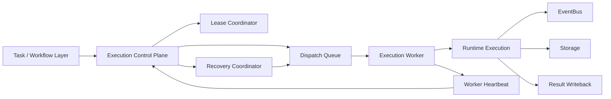
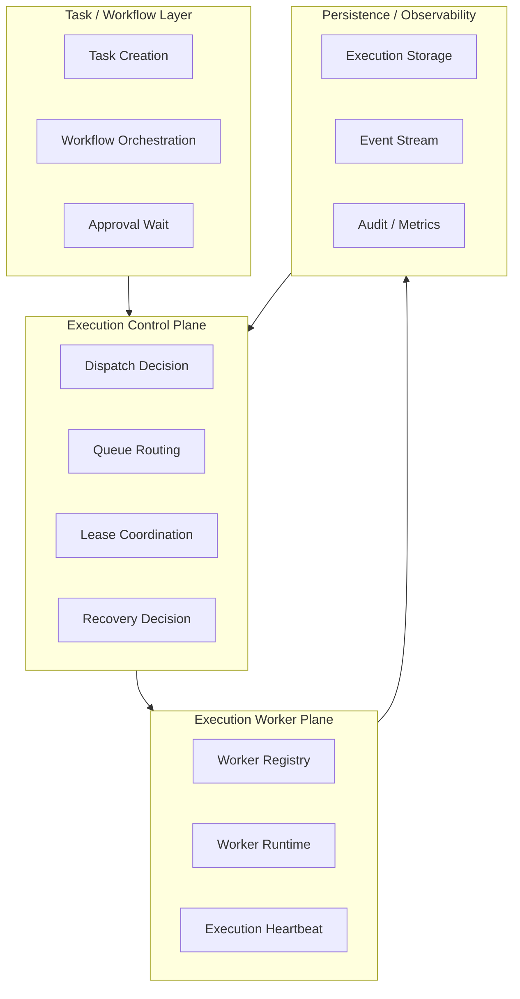
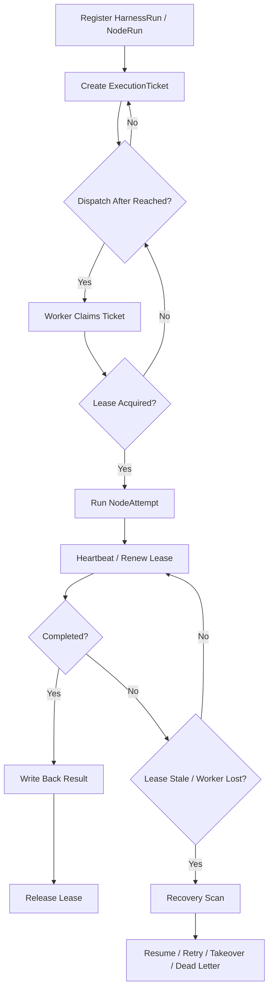

# Execution Plane Contract

> **v4.3 Compatibility Note**: This file is retained as a historical execution plane description. For v4.3 P3 -> P4 execution handoff, see [plan-graph-patch-contract.md](./plan-graph-patch-contract.md); for P4 state advancement, see [ADR-110](../adr/110-runtime-state-machine-authority.md); linear execution / workflow semantics may only be used as legacy projection.

> **OAPEFLIR Related**: This contract defines the execution plane of the OAPEFLIR Execute Hub, corresponding to ADR-016 Execute stage and ADR-079 Feedback Hub.
> **Update Date**: 2026-04-17

## 1. Scope

This contract defines the platform's target architecture for evolving from a single-machine runtime to a multi-execution plane, including scheduling, dispatch, lease, worker liveness, takeover, recovery, and execution authority governance.

It is an upper-layer extension of `runtime_execution_contract.md`, used to answer "when execution no longer runs in a single process, how does the platform remain controllable, recoverable, and auditable".

## 2. Goals

- Formally separate the `control plane` from the `execution plane`.
- Allow execution to be scheduled, recovered, and taken over across workers.
- Ensure that stale run, failover, handover, and takeover have unified semantics.
- Ensure that even in multi-worker environments there is only one authoritative execution authority holder.

## 3. Non-Goals

- Phase 1a does not require a complete distributed queue cluster.
- This contract does not prescribe a specific queue backend product selection.
- This contract does not replace the state machine and execution semantics definitions for a single run.

## 4. Architecture Layers

`Task / Workflow Layer`
: Responsible for task creation, workflow orchestration, approval wait, and result writeback.

`Execution Control Plane`
: Responsible for dispatch, lease, route, capacity awareness, and recovery decision.

`Execution Worker Plane`
: Responsible for actually consuming execution tickets, executing runs, reporting heartbeats, and results.

`Recovery And Governance Hooks`
: Responsible for stale detection, takeover proposal, and kill / freeze / retry decision linkage.

`Plan / Feedback Boundary (OAPEFLIR)`
: P3 is only allowed to issue `PlanGraphBundle` / `GraphPatch`; the execution plane writes back `NodeAttemptReceipt` first, and `FeedbackSignal` and user summaries can only be used as derived views based on the receipt (corresponding to ADR-079).

## 5. Key Components

- `ExecutionControlPlane`
- `DispatchQueue`
- `LeaseCoordinator`
- `ExecutionWorker`
- `RecoveryCoordinator`
- `WorkerRegistry`
- `WorkerHeartbeat`
- `TakeoverManager`
- `PlanGraphBundle` (the only execution plan contract from P3 to P4)
- `NodeAttemptReceipt` (the only execution receipt from P4 to other planes)
- `FeedbackSignal` (cognitive / learning input derived from `NodeAttemptReceipt`)

## 6. Target Architecture

Additional explanation:

- `ExecutionControlPlane` is responsible for deciding "who should execute".
- `ExecutionWorker` is responsible for executing the run that "has already been authorized".
- `LeaseCoordinator` is responsible for ensuring that the same execution is held by only one worker at a time.
- `RecoveryCoordinator` is responsible for scanning stale executions and deciding recovery, retry, takeover, or dead-letter.

## 6.1 Execution Plane Layered Diagram

## 7. Key Objects

- `ExecutionTicket`
- `DispatchDecision`
- `LeaseRecord`
- `WorkerSnapshot`
- `RecoveryDecision`
- `TakeoverProposal`
- `WorkerCapabilitySet`

## 8. `ExecutionTicket` Minimum Fields

| Field | Type | Description |
| --- | --- | --- |
| `ticket_id` | `string` | Dispatch ticket ID |
| `harness_run_id` | `string` | Target HarnessRun |
| `node_run_id` | `string` | Target NodeRun |
| `attempt_id` | `string` | Current NodeAttempt |
| `task_id` | `string?` | Compatible query entry; not a truth primary key |
| `plan_graph_bundle_id` | `string` | Associated execution graph bundle |
| `graph_version` | `number` | Corresponding graph version |
| `stage_view_ref` | `string?` | Associated OAPEFLIR stage view; for explanation / display only, does not drive execution |
| `priority` | `low \| normal \| high \| urgent` | Scheduling priority |
| `queue_name` | `string` | Target queue |
| `required_capabilities` | `string[]` | Worker required capabilities |
| `dispatch_target` | `any \| local_only \| prefer_remote \| require_remote` | Dispatch target policy |
| `required_isolation_level` | `read_only \| workspace_write \| scoped_external_access \| restricted_exec` | Minimum isolation level requirement |
| `required_repo_version?` | `string` | Requires worker code version match |
| `dispatch_after` | `timestamp?` | Earliest dispatch time |
| `attempt_no` | `integer` | Attempt count associated with this ticket |
| `created_at` | `timestamp` | Creation time |

### 8.1 Dispatch Target Semantics

| Policy | Meaning |
| --- | --- |
| `any` | No preference for worker deployment location; both local and remote are acceptable |
| `local_only` | Only local workers allowed; remote workers are excluded |
| `prefer_remote` | Prefer remote workers; fall back to local if no remote workers are available |
| `require_remote` | Must use a remote worker; fail-closed (no degradation) when no remote workers are available |

Rules:

- When `require_remote` and remote workers are only partially available, dispatch should return `remote.partial_available` and refuse the dispatch, rather than degrading to local.
- The dispatch target is decided by the ticket creator (orchestrator / operator) and must not be modified by the worker itself.

### 8.2 Isolation Level Semantics

Worker isolation levels are ordered: `read_only (0) < workspace_write (1) < scoped_external_access (2) < restricted_exec (3)`.

| Level | Meaning |
| --- | --- |
| `read_only` | Read-only sandbox, no write permission |
| `workspace_write` | Standard sandbox, workspace write allowed |
| `scoped_external_access` | Hardened sandbox, limited external access |
| `restricted_exec` | Strict isolation, minimum-privilege execution |

Rules:

- High-risk execution can declare `required_isolation_level`; the worker's actual isolation level must be >= the required level to accept.
- When the isolation level is not met, dispatch should record the rejection reason in the decision trace.

### 8.3 Repo Version Consistency

- Execution tickets can declare `required_repo_version`.
- Worker heartbeat reports `repoVersion`.
- If versions do not match, dispatch defaults to fail-closed and records the rejection.

### 8.4 General Rules

- A single `node_run_id` under the same `attempt_id` should correspond to only one active ticket.
- Once a ticket is invalidated, it must not be consumed by a worker again.
- The authoritative input received by the execute plane must come from `PlanGraphBundle`, not from `PlanDTO` or unstructured prompt stitching.

## 8A. OAPEFLIR Plan → Execute → Feedback Boundary

### 8A.1 Plan Hub → Execute (corresponds to ADR-060)

When `PlanGraphBundle` enters the execution plane, it should at least provide:

- `planGraphBundleId`
- `harnessRunId`
- `graphVersion`
- `graph.graphId`
- `graph.nodes[]`
- `graph.edges[]`
- `schedulerPolicy`
- `budget`
- `riskProfile`

**P3 -> P4 Constraints**:
- The Execute layer can only receive `PlanGraphBundle` / `GraphPatch`; bypassing raw tasks or linear `PlanDTO` for direct execution is not allowed.
- The graph version chain must maintain a stable lineage and must not be silently rewritten by new workers.
- Node semantics that have already produced `NodeAttemptReceipt` must not be rewritten in place by new workers.

### 8A.2 Execute → Feedback Hub (corresponds to ADR-079)

After the execution plane completes a single attempt, the truth output must first land in `NodeAttemptReceipt`:

- `receiptId`
- `nodeAttemptId`
- `nodeRunId`
- `status`
- `outputRef?`
- `sideEffectRefs[]`
- `budgetSettlementRefs[]`
- `evidenceRefs[]`

On top of that, other planes or read models can derive:

- `FeedbackSignal[]`
- `artifact_refs[]`
- `policy_decision_ref?`
- `release_evidence_ref?`
- `DualChannelStepOutput` (user display projection)

**Rules**:

- `NodeAttemptReceipt` is the official truth output from Execute to other planes, and must not be delivered only through the log side-channel.
- `FeedbackSignal` must explicitly reference `receiptId`, `planGraphBundleId`, and `graphVersion`, as a derived cognitive input rather than a replacement for the receipt.
- If an attempt produces no feedback, `feedback_count=0` or equivalent evidence should be explicitly recorded, to avoid subsequent Learn / Improve misjudging a missing link.
- `DualChannelStepOutput` is only allowed as a user display projection and must not be the sole basis for recovery, budget settlement, or side-effect confirmation.

## 9. `LeaseRecord` Minimum Fields

| Field | Type | Description |
| --- | --- | --- |
| `lease_id` | `string` | Lease ID |
| `harness_run_id` | `string` | Owning HarnessRun |
| `node_run_id` | `string` | Target NodeRun |
| `attempt_id` | `string?` | Associated NodeAttempt |
| `worker_id` | `string` | Current holder |
| `acquired_at` | `timestamp` | Acquisition time |
| `expires_at` | `timestamp` | Expiration time |
| `last_heartbeat_at` | `timestamp?` | Most recent renewal time |
| `status` | `active \| expired \| released \| reclaimed \| handed_over` | Lease status (aligned with `task_lease_and_fencing_contract.md` §5) |

Rules:

- At the same moment, the same `node_run_id` can only have one `active` lease.
- A worker must not execute side-effect steps without obtaining an active lease.
- After a lease expires, the original worker is considered to have lost execution authority, even if its local process is still alive.

## 10. `WorkerSnapshot` Minimum Fields

- `worker_id`
- `status` (`idle | busy | draining | degraded | unavailable | quarantined | offline`)
- `capabilities`
- `running_executions`
- `last_heartbeat_at`
- `max_concurrency`
- `queue_affinity?`
- `isolation_level` (`read_only | workspace_write | scoped_external_access | restricted_exec`)
- `saturation` (load saturation)
- `repo_version?`
- `remote_session_status?` (`connecting | connected | reconnecting | degraded | failed | viewer_only`)
- `last_acknowledged_stream_offset?`
- `resume_ready?`
- `credential_expiry_at?`
- `consistency_check_status?` (`passed | failed | pending`)
- `runtime_instance_id?`
- `restart_generation?` (restart generation count)
- `parent_runtime_instance_id?`

### 10.1 Worker Status Semantics

| status | Meaning | Accepts new dispatch |
| --- | --- | --- |
| `idle` | Idle, no task in progress | Yes |
| `busy` | Executing task, not yet saturated | Yes (subject to max_concurrency) |
| `draining` | Under maintenance, can finish in-hand task, does not accept new tasks | No |
| `degraded` | Partial capability degradation (e.g., provider timeout, memory pressure) | Conditional |
| `unavailable` | Currently unserviceable (e.g., network partition, dependency failure) | No |
| `quarantined` | Quarantined due to anomaly (e.g., consecutive failures, security incident) | No |
| `offline` | Heartbeat timeout or actively offline | No |

### 10.2 Worker Scheduling Projection

The scheduling layer projects the 7 worker states into a simplified scheduling view:

| Scheduling Status | Corresponding worker status |
| --- | --- |
| `healthy` | `idle`, `busy` (and other states not explicitly mapped) |
| `degraded` | `degraded` |
| `draining` | `draining` |
| `quarantined` | `quarantined` |
| `offline` | `offline` |
| `unavailable` | `unavailable` |

Rules:

- The scheduling layer only consumes the projected scheduling status and does not directly read the worker's internal state.
- `healthy` is the only scheduling status allowed to accept new dispatches (subject to capacity and capability constraints).

## 11. `RecoveryDecision` Minimum Fields

- `decision_id`
- `harness_run_id`
- `node_run_id`
- `attempt_id?`
- `reason`
- `action` (`resume_same_worker | retry_new_ticket | escalate_takeover | move_dead_letter | cancel`)
- `decided_at`
- `decided_by`

Rules:

- Recovery decisions must be auditable.
- Recovery decisions must not bypass approval, budget, and policy boundaries.

## 12. Execution Lifecycle

The standard lifecycle of a multi-execution plane:

1. `HarnessRun` / `NodeRun` is registered by the control plane.
2. The control plane generates an `ExecutionTicket`.
3. The ticket enters the target `DispatchQueue`.
4. A worker applies for a lease and consumes the ticket.
5. The worker enters actual execution after acquiring the lease.
6. The worker periodically sends heartbeat / lease renewal.
7. After the attempt ends, write back `NodeAttemptReceipt` and release the lease.
8. If the lease expires, the worker disappears, or the attempt stalls, enter the recovery scan.

### 12.1 Lifecycle Flow Diagram

## 13. Dispatch Rules

- Queue selection must at least consider: priority, capability, isolation level, queue congestion, and `graphVersion` / `required_repo_version` compatibility.
- Workers that do not meet `required_capabilities` must not claim the ticket.
- High-risk execution may require entering a specific queue or specific worker class.
- Tickets must not be consumed before `dispatch_after`.

## 14. Lease and Heartbeat Rules

- Leases default to short TTL and rely on heartbeat renewal.
- A lost heartbeat does not directly equal execution failure, but triggers a recovery candidate.
- Stale judgement should combine `lease.expires_at` with worker heartbeat.
- Worker heartbeat and node attempt heartbeat are at different levels:
  - Worker heartbeat is used to indicate worker liveness and capacity.
  - Node attempt heartbeat is used to indicate the progress and liveness of a specific `NodeAttempt`.

## 15. Handover / Takeover Rules

`handover`
: A controlled transfer of execution authority within the system, e.g., the original worker is about to be taken offline.

`takeover`
: Due to anomaly, manual takeover, or governance need, forcibly handing the `NodeRun` / `NodeAttempt` over to a new execution principal or manual process.

Rules:

- Handover must record the old lease, new lease, and lineage.
- Takeover must generate a `TakeoverProposal` or governance decision record.
- Takeover must not occur silently; it must be traceable to the cause and the trigger.

## 16. Failure Mode

Main failure modes:

- Worker crashes but the lease is not expired in time.
- Worker network isolation causes false liveness.
- Ticket has been consumed but the result was not written back.
- Lease has expired but the old worker continues to execute.

Handling rules:

- Authoritative results are based on control plane + storage, not on the worker's local memory.
- When an old worker continues to write back after its lease has expired, it should be identified as an expired write and be rejected or downgraded.
- The recovery scan should at least identify the three anomaly types `running but stale`, `ticket lost`, `duplicate claimant`, and be linkable back to the corresponding `NodeAttemptReceipt` gap.

## 17. Relationship to Storage and Governance

- `runtime_repository_and_migration_contract.md` should add repositories for lease / queue / worker registry in the future.
- `governance_control_plane_contract.md` constrains the governance path for freeze / kill / takeover.
- `storage_schema_contract.md` continues to be responsible for the authoritative baseline of `HarnessRun / NodeRun / NodeAttempt / NodeAttemptReceipt`; the execution plane only adds a scheduling layer on top.

## 18. Implementation Order

- Phase 1b: minimum queue + stale detection + worker registry.
- Phase 2a: lease / failover / handover.
- Phase 2b: capacity-aware scheduling + recovery policy.
- Phase 4: enterprise multi-environment execution fleet.

## 19. Closure Conclusion

The core of the execution plane is not "moving the runtime to multiple processes", but formally modeling execution authority, recovery authority, and scheduling authority.

The platform currently has a single-machine runtime baseline; after completing this contract, subsequent implementations should use "control plane and worker plane layering" as the only evolution direction.

## v4.3 Architecture Remediation

The following entries fix the contract deviations recorded in `platform-architecture-implementation-consistency-audit.md`. If any historical section of this document conflicts with this section, this section, `docs_zh/architecture/00-platform-architecture.md`, ADR-109 through ADR-113, and `src/platform/contracts/executable-contracts/` take precedence.

- T-14: This document originally wrote `PlanDTO + steps[] + dag` and `DualChannelStepOutput / FeedbackSignal` directly as the main inputs and outputs of the execution plane. The root cause was that the old execution plane documentation followed the linear plan and feedback bridging draft of ADR-060/079, and did not rewrite the object model after `PlanGraphBundle` / `NodeAttemptReceipt` became the canonical truth. Fix: The main text now converges P3 -> P4 input to `PlanGraphBundle`, and P4 truth output to `NodeAttemptReceipt`; the remaining objects are only allowed as derived views.
- T-75: This document continued to use `nodeAttemptReceiptId` in the Execute -> Feedback boundary. The root cause was that the execution plane contract did not sync the API-level field shape to a consistent form after the v4.3 rename. Fix: The main text now uniformly uses `receiptId` as the receipt primary key.
- T-20: The original `WorkerSnapshot.isolation_level` referenced deprecated enums `standard/hardened/strict`, which did not align with the `read_only/workspace_write/scoped_external_access/restricted_exec` defined in architecture §25.8. Fix: The `WorkerSnapshot` field in §10 has been updated to the canonical enum; the `ExecutionTicket.required_isolation_level` field (§8) is kept consistent.

Mandatory rules: state transitions must go through `RuntimeStateMachine.transition(command)`; execution plans must use `PlanGraphBundle`; execution results must use `NodeAttemptReceipt`; truth events may only use `platform.*`; OAPEFLIR may only act as `oapeflir.view.*` / rationale projection; budgets must use `BudgetLedger` / `BudgetReservation` / `BudgetSettlement`.
