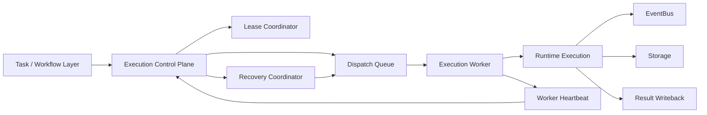
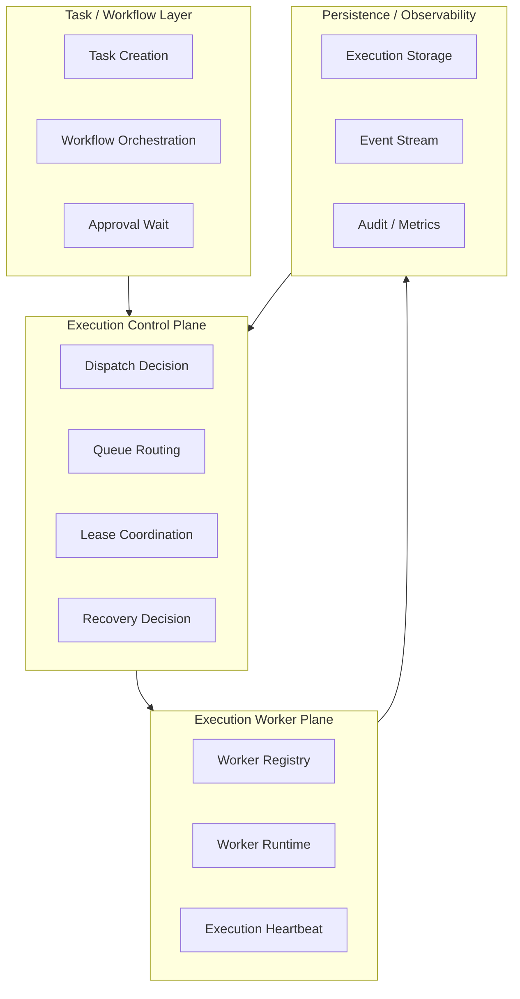
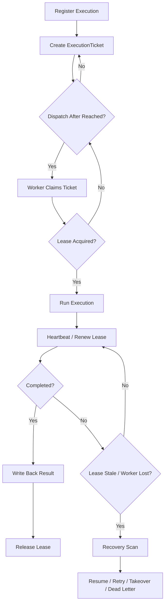

# Execution Plane Contract

## 1. Scope

This contract defines the platform's target architecture evolving from single-machine runtime to multi-execution plane, including scheduling, dispatch, lease, worker liveness, takeover, recovery, and execution rights governance.

It is an upper-layer extension of `runtime_execution_contract.md`, answering "how the platform remains controllable, recoverable, and auditable when execution no longer runs in just a single process."

## 2. Goals

- Formally separate `control plane` and `execution plane`.
- Enable execution to be scheduled, recovered, and taken over across workers.
- Ensure unified semantics for stale run, failover, handover, and takeover.
- Ensure that in a multi-worker environment there is still only one authoritative execution rights holder.

## 3. Non-Goals

- Phase 1a does not require a complete distributed queue cluster.
- This contract does not specify specific queue backend product selection.
- This contract does not replace the state machine and execution semantics definition for single runs.

## 4. Architecture Layering

`Task / Workflow Layer`
: Responsible for task generation, workflow orchestration, approval waiting, and result writeback.

`Execution Control Plane`
: Responsible for dispatch, lease, route, capacity awareness, and recovery decision.

`Execution Worker Plane`
: Responsible for actually consuming execution tickets, executing runs, reporting heartbeats, and results.

`Recovery And Governance Hooks`
: Responsible for stale detection, takeover proposal, and kill / freeze / retry decision linkage.

`Plan / Feedback Boundary`
: Plan stage produces `PlanDTO` to enter execution plane; after execution plane executes, it writes `StepOutput` and `FeedbackSignal` back to feedback / inspect / audit chain.

## 5. Key Components

- `ExecutionControlPlane`
- `DispatchQueue`
- `LeaseCoordinator`
- `ExecutionWorker`
- `RecoveryCoordinator`
- `WorkerRegistry`
- `WorkerHeartbeat`
- `TakeoverManager`
- `PlanDTO`
- `FeedbackSignal`

## 6. Target Architecture

Supplementary notes:

- `ExecutionControlPlane` is responsible for deciding "who should execute."
- `ExecutionWorker` is responsible for executing "runs that have been authorized to execute."
- `LeaseCoordinator` is responsible for ensuring that the same execution is held by only one worker at a time.
- `RecoveryCoordinator` is responsible for scanning stale executions and deciding recovery, retry, takeover, or dead letter.

## 6.1 Execution Plane Layering Diagram

## 7. Key Objects

- `ExecutionTicket`
- `DispatchDecision`
- `LeaseRecord`
- `WorkerSnapshot`
- `RecoveryDecision`
- `TakeoverProposal`
- `WorkerCapabilitySet`

## 8. `ExecutionTicket` Minimum Fields

| Field | Type | Description |
| --- | --- | --- |
| `ticket_id` | `string` | Dispatch ticket ID |
| `execution_id` | `string` | Target execution |
| `task_id` | `string` | Associated task |
| `plan_ref` | `string?` | Associated PlanDTO or execution graph reference |
| `stage` | `observe \| assess \| plan \| execute \| feedback \| learn \| improve \| release?` | Closed-loop stage that generated this ticket |
| `priority` | `low \| normal \| high \| urgent` | Scheduling priority |
| `queue_name` | `string` | Target queue |
| `required_capabilities` | `string[]` | Worker required capabilities |
| `dispatch_target` | `any \| local_only \| prefer_remote \| require_remote` | Dispatch target strategy |
| `required_isolation_level` | `standard \| hardened \| strict` | Minimum isolation level requirement |
| `required_repo_version?` | `string` | Requires worker code version match |
| `dispatch_after` | `timestamp?` | Earliest dispatch time |
| `attempt` | `integer` | Attempt count associated with this ticket |
| `created_at` | `timestamp` | Creation time |

### 8.1 Dispatch Target Semantics

| Strategy | Meaning |
| --- | --- |
| `any` | No preference for worker deployment location; both local and remote acceptable |
| `local_only` | Only local worker execution allowed; remote workers excluded |
| `prefer_remote` | Prefer remote workers; if no remote workers available, degrade to local |
| `require_remote` | Must be remote worker; if no remote workers available, fail-closed (no degradation) |

Rules:

- When `require_remote` and remote workers are partially available, dispatch should return `remote.partial_available` and reject dispatch rather than degrading to local.
- Dispatch target is determined by ticket creator (orchestrator / operator) and must not be modified by workers.

### 8.2 Isolation Level Semantics

Worker isolation levels ordered: `standard (0) < hardened (1) < strict (2)`.

| Level | Meaning |
| --- | --- |
| `standard` | Standard sandbox |
| `hardened` | Hardened sandbox (additional network/filesystem restrictions) |
| `strict` | Strict isolation (least privilege) |

Rules:

- High-risk executions can declare `required_isolation_level`; worker's actual isolation level must be >= required level to accept.
- When isolation level is not satisfied, dispatch should record rejection reason in decision trace.

### 8.3 Repo Version Consistency

- Execution ticket can declare `required_repo_version`.
- Worker heartbeat reports `repoVersion`.
- If versions do not match, dispatch defaults to fail-closed and records rejection.

### 8.4 General Rules

- One execution in the same attempt should correspond to only one active ticket.
- Tickets after expiration must not be consumed by workers again.
- Authoritative input to execute plane should come from `PlanDTO`, not rely solely on unstructured prompt concatenation.

## 8A. PlanDTO and FeedbackSignal Boundary

When `PlanDTO` enters execution plane, at minimum should provide:

- `task_id`
- `workflow_id`
- `loop_iteration`
- `strategy`
- `execution_graph`
- `policy_context_ref?`

After execution plane completes a single run, besides `StepOutput`, should also be able to produce:

- `FeedbackSignal[]`
- `artifact_refs[]`
- `policy_decision_ref?`
- `rollout_evidence_ref?`

Rules:

- `FeedbackSignal` is the formal output of execute -> feedback and must not be side-loaded through logs only.
- If a run does not produce feedback, should explicitly record `feedback_count=0` or equivalent evidence to avoid subsequent learn / improve misjudging missing chain.
- When dispatch / worker / recovery undergoes takeover or retry, `PlanDTO` reference must maintain stable lineage and must not be silently overwritten by new workers.

## 9. `LeaseRecord` Minimum Fields

| Field | Type | Description |
| --- | --- | --- |
| `lease_id` | `string` | Lease ID |
| `execution_id` | `string` | Target execution |
| `worker_id` | `string` | Current holder |
| `acquired_at` | `timestamp` | Acquisition time |
| `expires_at` | `timestamp` | Expiration time |
| `last_heartbeat_at` | `timestamp?` | Last renewal time |
| `status` | `active \| expired \| released \| reclaimed \| handed_over` | Lease status (aligned with `task_lease_and_fencing_contract.md` §5) |

Rules:

- At any moment, only one `active` lease for the same `execution_id`.
- Workers must not execute side-effect steps without obtaining an active lease.
- After lease expires, original worker is considered to have lost execution rights even if the local process is still alive.

## 10. `WorkerSnapshot` Minimum Fields

- `worker_id`
- `status` (`idle | busy | draining | degraded | unavailable | quarantined | offline`)
- `capabilities`
- `running_executions`
- `last_heartbeat_at`
- `max_concurrency`
- `queue_affinity?`
- `isolation_level` (`standard | hardened | strict`)
- `saturation` (load saturation)
- `repo_version?`
- `remote_session_status?` (`connecting | connected | reconnecting | degraded | failed | viewer_only`)
- `last_acknowledged_stream_offset?`
- `resume_ready?`
- `credential_expiry_at?`
- `consistency_check_status?` (`passed | failed | pending`)
- `runtime_instance_id?`
- `restart_generation?` (restart generation)
- `parent_runtime_instance_id?`

### 10.1 Worker Status Semantics

| status | Meaning | Can Accept New Dispatch |
| --- | --- | --- |
| `idle` | Idle, no tasks executing | Yes |
| `busy` | Executing tasks, not saturated | Yes (constrained by max_concurrency) |
| `draining` | Under maintenance; can finish current tasks, not accepting new ones | No |
| `degraded` | Partially degraded capability (e.g., provider timeout, memory pressure) | Depends on situation |
| `unavailable` | Currently not serviceable (e.g., network partition, dependency failure) | No |
| `quarantined` | Isolated due to anomalies (e.g., consecutive failures, security incidents) | No |
| `offline` | Heartbeat timeout or proactive offline | No |

### 10.2 Worker Scheduling Projection

The scheduling layer projects 7 worker statuses into a simplified scheduling view:

| Scheduling State | Corresponding worker status |
| --- | --- |
| `healthy` | `idle`, `busy` (and other explicitly unmapped statuses) |
| `degraded` | `degraded` |
| `draining` | `draining` |
| `quarantined` | `quarantined` |
| `offline` | `offline` |
| `unavailable` | `unavailable` |

Rules:

- Scheduling layer only consumes projected scheduling state and does not directly read worker internal state.
- `healthy` is the only scheduling state that allows accepting new dispatches (subject to capacity and capability constraints).

## 11. `RecoveryDecision` Minimum Fields

- `decision_id`
- `execution_id`
- `reason`
- `action` (`resume_same_worker | retry_new_ticket | escalate_takeover | move_dead_letter | cancel`)
- `decided_at`
- `decided_by`

Rules:

- Recovery decisions must be auditable.
- Recovery decisions must not bypass approval, budget, and policy boundaries.

## 12. Execution Lifecycle

Standard lifecycle for multiple execution planes:

1. `execution` is registered by control plane.
2. Control plane creates `ExecutionTicket`.
3. Ticket enters target `DispatchQueue`.
4. Worker claims lease and consumes ticket.
5. Worker obtains lease and enters actual execution.
6. Worker periodically sends heartbeat / lease renew.
7. After run ends, write back results and release lease.
8. If lease expires, worker disappears, or run is stuck, enter recovery scan.

### 12.1 Lifecycle Flow Diagram

## 13. Dispatch Rules

- Queue selection at minimum considers: priority, capabilities, isolation level, and queue congestion.
- Workers not satisfying `required_capabilities` must not claim tickets.
- High-risk executions can require entering specific queues or specific worker classes.
- Tickets must not be consumed before `dispatch_after` is reached.

## 14. Lease and Heartbeat Rules

- Leases default to short TTL and rely on heartbeat renewal.
- Heartbeat loss does not directly equal execution failure but triggers recovery candidate.
- Stale determination should combine `lease.expires_at` and worker heartbeat.
- Worker heartbeat and execution heartbeat are different levels:
  - Worker heartbeat indicates worker liveness and capacity.
  - Execution heartbeat indicates progress and liveness of a specific run.

## 15. Handover / Takeover Rules

`handover`
: System-controlled transfer of execution rights, e.g., original worker is about to go offline.

`takeover`
: Due to anomalies, human takeover, or governance needs, forcefully handing over execution to a new execution subject or manual process.

Rules:

- Handover must record old lease, new lease, and lineage.
- Takeover must generate `TakeoverProposal` or governance decision records.
- Takeover must not occur silently and must be traceable to cause and trigger.

## 16. Failure Mode

Main failure modes:

- Worker crashes but lease does not expire in time.
- Worker network isolation causes false liveness.
- Ticket has been consumed but result not written back.
- Lease has expired but old worker continues executing.

Handling rules:

- Authoritative results are based on control plane + storage, not worker local memory.
- When old worker continues writeback after lease invalidation, should be identified as expired writeback and rejected or degraded.
- Recovery scan at minimum can identify `running but stale`, `ticket lost`, `duplicate claimant` three types of anomalies.

## 17. Relationship with Storage and Governance

- `runtime_repository_and_migration_contract.md` should in the future add repositories for lease / queue / worker registry.
- `governance_control_plane_contract.md` constrains governance paths for freeze / kill / takeover.
- `storage_schema_contract.md` continues to be responsible for `executions` authoritative baseline; execution plane only adds a scheduling layer on top.

## 18. Implementation Sequence

- Phase 1b: Minimum queue + stale detection + worker registry.
- Phase 2a: lease / failover / handover.
- Phase 2b: capacity-aware scheduling + recovery policy.
- Phase 4: Enterprise multi-environment execution fleet.

## 19. Closure Conclusion

The core of Execution plane is not "moving execution to multiple processes" but formally modeling execution rights, recovery rights, and scheduling rights.

The current platform has single-machine runtime baseline; after completing this contract, subsequent implementation should use "control plane and worker plane layering" as the only evolution direction.
