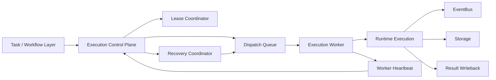
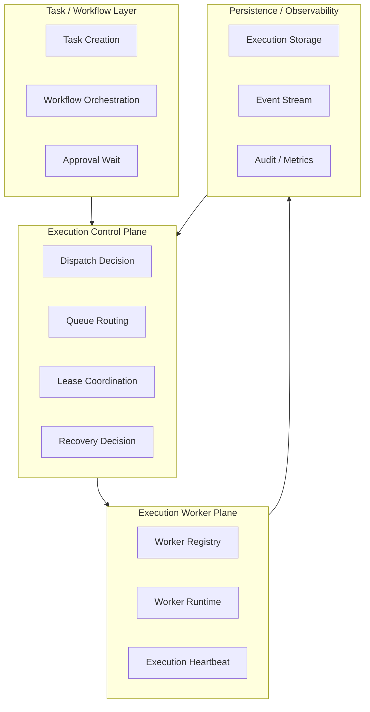
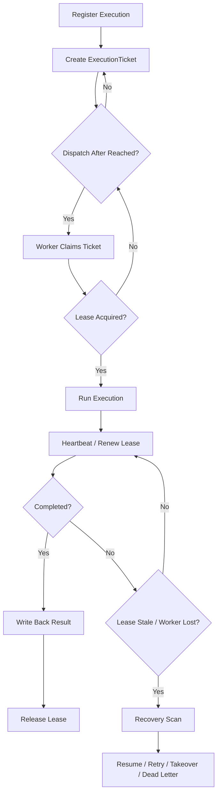

# Execution Plane Contract

> **v4.3 Compatibility Note**: This file is preserved as historical execution plane documentation. v4.3 P3 -> P4 execution handover is based on [v4_3_plan_graph_and_patch_contract.md](./v4_3_plan_graph_and_patch_contract.md), P4 state advancement is based on [ADR-110](../adr/110-runtime-state-machine-authority.md); linear execution / workflow semantics can only serve as legacy projection.

> **OAPEFLIR Related**: This contract defines the execution plane for OAPEFLIR Execute Hub, corresponding to ADR-016 Execute phase and ADR-079 Feedback Hub.
> **Updated**: 2026-04-17

## 1. Scope

This contract defines the target architecture of the platform evolving from single-machine runtime to multi-execution plane, including scheduling, dispatch, lease, worker survival, takeover, recovery, and execution authority governance.

It is an upper-level extension of `runtime_execution_contract.md`, answering "when execution no longer runs only in a single process, how does the platform remain controllable, recoverable, and auditable".

## 2. Goals

- Formally separate `control plane` from `execution plane`.
- Enable execution to be scheduled, recovered, and taken over across workers.
- Ensure stale run, failover, handover, and takeover have unified semantics.
- Ensure that in multi-worker environment, there is still only one authoritative execution authority holder.

## 3. Non-Goals

- Phase 1a does not require complete distributed queue cluster.
- This contract does not specify specific queue backend product selection.
- This contract does not replace single-run state machine and execution semantics definition.

## 4. Architecture Layering

`Task / Workflow Layer`
: Responsible for task generation, workflow orchestration, approval waiting, and result writeback.

`Execution Control Plane`
: Responsible for dispatch, lease, route, capacity awareness, recovery decision.

`Execution Worker Plane`
: Responsible for truly consuming execution tickets, executing runs, reporting heartbeats, and results.

`Recovery And Governance Hooks`
: Responsible for stale detection, takeover proposal, kill / freeze / retry decision linkage.

`Plan / Feedback Boundary (OAPEFLIR)`
: Plan Hub outputs `Plan` DTO to execution plane; after execution plane executes, it writes `DualChannelStepOutput` and `FeedbackSignal` back to Feedback Hub (corresponding to ADR-079).

## 5. Key Components

- `ExecutionControlPlane`
- `DispatchQueue`
- `LeaseCoordinator`
- `ExecutionWorker`
- `RecoveryCoordinator`
- `WorkerRegistry`
- `WorkerHeartbeat`
- `TakeoverManager`
- `Plan` (OAPEFLIR Plan Hub output)
- `FeedbackSignal` (OAPEFLIR Feedback Hub input)

## 6. Target Architecture

Supplementary notes:

- `ExecutionControlPlane` is responsible for deciding "who should execute".
- `ExecutionWorker` is responsible for executing "runs that have been authorized to execute".
- `LeaseCoordinator` is responsible for ensuring the same execution is held by only one worker at a time.
- `RecoveryCoordinator` is responsible for scanning stale executions and deciding recovery, retry, takeover, or dead letter.

## 6.1 Execution Plane Layering Diagram

## 7. Key Objects

- `ExecutionTicket`
- `DispatchDecision`
- `LeaseRecord`
- `WorkerSnapshot`
- `RecoveryDecision`
- `TakeoverProposal`
- `WorkerCapabilitySet`

## 8. ExecutionTicket Minimum Fields

| Field | Type | Description |
| --- | --- | --- |
| `ticket_id` | `string` | Dispatch ticket ID |
| `execution_id` | `string` | Target execution |
| `task_id` | `string` | Associated task |
| `plan_ref` | `string?` | Associated PlanDTO or execution graph reference |
| `stage` | `observe \| assess \| plan \| execute \| feedback \| learn \| improve \| release?` | Closed-loop phase that generated this ticket |
| `priority` | `low \| normal \| high \| urgent` | Scheduling priority |
| `queue_name` | `string` | Target queue |
| `required_capabilities` | `string[]` | Worker required capabilities |
| `dispatch_target` | `any \| local_only \| prefer_remote \| require_remote` | Dispatch target strategy |
| `required_isolation_level` | `standard \| hardened \| strict` | Minimum isolation level requirement |
| `required_repo_version?` | `string` | Requires worker code version match |
| `dispatch_after` | `timestamp?` | Earliest dispatch time |
| `attempt` | `integer` | Attempt count associated with this ticket |
| `created_at` | `timestamp` | Creation time |

### 8.1 Dispatch Target Semantics

| Strategy | Meaning |
| --- | --- |
| `any` | No preference on worker deployment location, both local and remote |
| `local_only` | Only local worker execution allowed, remote workers excluded |
| `prefer_remote` | Prefer remote worker; if no available remote worker, degrade to local |
| `require_remote` | Must be remote worker; fail-closed when no available remote worker (no degradation) |

Rules:

- When `require_remote` and remote worker is partially available, dispatch should return `remote.partial_available` and refuse dispatch, rather than degrading to local.
- Dispatch target is decided by ticket creator (orchestrator / operator), must not be modified by worker itself.

### 8.2 Isolation Level Semantics

Worker isolation levels are ordered: `standard (0) < hardened (1) < strict (2)`.

| Level | Meaning |
| --- | --- |
| `standard` | Standard sandbox |
| `hardened` | Hardened sandbox (additional network/filesystem restrictions) |
| `strict` | Strict isolation (minimum privilege) |

Rules:

- High-risk execution can declare `required_isolation_level`; worker's actual isolation level must be >= required level to allow acceptance.
- When isolation level is not satisfied, dispatch should record rejection reason in decision trace.

### 8.3 Repo Version Consistency

- Execution ticket can declare `required_repo_version`.
- Worker heartbeat reports `repoVersion`.
- If version does not match, dispatch defaults to fail-closed and records rejection.

### 8.4 General Rules

- One execution at the same attempt should correspond to only one active ticket.
- After ticket expires, it must not be consumed by worker again.
- Authoritative input to execute plane should come from `PlanDTO`, not relying on unstructured prompt stitching alone.

## 8A. OAPEFLIR Plan → Execute → Feedback Boundary

### 8A.1 Plan Hub → Execute (corresponding to ADR-060)

When `Plan` enters execution plane, minimum should provide (corresponding to ADR-060 §2):

- `planId`
- `taskId`
- `version`
- `strategy`
- `steps[]` (DAG nodes)
- `dag` (dependency structure)
- `retryPolicy`
- `estimatedCost`
- `estimatedDuration`

**R3 constraints** (ADR-060 §3):
- Execute layer can only receive Plan DTO, not allow bypassing raw task direct execution (R3-NOBYPASS)
- Plan version chain must maintain stable lineage, must not be silently overwritten by new worker

### 8A.2 Execute → Feedback Hub (corresponding to ADR-079)

After execution plane completes a single run, besides `DualChannelStepOutput`, should also output:

- `FeedbackSignal[]`
- `artifact_refs[]`
- `policy_decision_ref?`
- `rollout_evidence_ref?`

**Rules** (corresponding to ADR-079 §4):

- `FeedbackSignal` is the formal output from Execute → Feedback, must not only be side-carried through logs.
- If a run does not produce feedback, should explicitly record `feedback_count=0` or equivalent evidence to avoid subsequent Learn / Improve misjudging missing chain.
- FeedbackSignal must be associated with original Plan version and executionId (for Learn Hub evidence linking, R4-EVIDENCE constraint)

## 9. LeaseRecord Minimum Fields

| Field | Type | Description |
| --- | --- | --- |
| `lease_id` | `string` | Lease ID |
| `execution_id` | `string` | Target execution |
| `worker_id` | `string` | Current holder |
| `acquired_at` | `timestamp` | Acquisition time |
| `expires_at` | `timestamp` | Expiration time |
| `last_heartbeat_at` | `timestamp?` | Last renewal time |
| `status` | `active \| expired \| released \| reclaimed \| handed_over` | Lease status (aligned with `task_lease_and_fencing_contract.md` §5) |

Rules:

- At any moment, the same `execution_id` can only have one `active` lease.
- Worker must not execute side-effect steps without obtaining active lease.
- After lease expires, original worker is deemed to have lost execution authority even if local process is still alive.

## 10. WorkerSnapshot Minimum Fields

- `worker_id`
- `status` (`idle | busy | draining | degraded | unavailable | quarantined | offline`)
- `capabilities`
- `running_executions`
- `last_heartbeat_at`
- `max_concurrency`
- `queue_affinity?`
- `isolation_level` (`standard | hardened | strict`)
- `saturation` (load saturation)
- `repo_version?`
- `remote_session_status?` (`connecting | connected | reconnecting | degraded | failed | viewer_only`)
- `last_acknowledged_stream_offset?`
- `resume_ready?`
- `credential_expiry_at?`
- `consistency_check_status?` (`passed | failed | pending`)
- `runtime_instance_id?`
- `restart_generation?` (restart generation)
- `parent_runtime_instance_id?`

### 10.1 Worker Status Semantics

| status | Meaning | Can Accept New Dispatch |
| --- | --- | --- |
| `idle` | Idle, no task executing | Yes |
| `busy` | Task executing, not saturated | Yes (subject to max_concurrency constraint) |
| `draining` | In maintenance, can complete current tasks, not accepting new tasks | No |
| `degraded` | Partial capability degradation (e.g., provider timeout, memory pressure) | Depends on situation |
| `unavailable` | Currently unserviceable (e.g., network partition, dependency failure) | No |
| `quarantined` | Isolated due to anomalies (e.g., consecutive failures, security events) | No |
| `offline` | Heartbeat timeout or主动 offline | No |

### 10.2 Worker Scheduling Projection

Scheduling layer projects 7 worker states into simplified scheduling view:

| Scheduling State | Corresponding worker status |
| --- | --- |
| `healthy` | `idle`, `busy` (and other unmapped states) |
| `degraded` | `degraded` |
| `draining` | `draining` |
| `quarantined` | `quarantined` |
| `offline` | `offline` |
| `unavailable` | `unavailable` |

Rules:

- Scheduling layer only consumes projected scheduling state, does not directly read worker internal state.
- `healthy` is the only scheduling state allowed to accept new dispatch (subject to capacity and capability constraints).

## 11. RecoveryDecision Minimum Fields

- `decision_id`
- `execution_id`
- `reason`
- `action` (`resume_same_worker | retry_new_ticket | escalate_takeover | move_dead_letter | cancel`)
- `decided_at`
- `decided_by`

Rules:

- Recovery decisions must be auditable.
- Recovery decisions must not bypass approval, budget, and policy boundaries.

## 12. Execution Lifecycle

Standard lifecycle for multi-execution plane:

1. `execution` is registered by control plane.
2. Control plane generates `ExecutionTicket`.
3. Ticket enters target `DispatchQueue`.
4. Worker applies for lease and consumes ticket.
5. Worker enters actual execution after obtaining lease.
6. Worker periodically sends heartbeat / lease renew.
7. After run ends, write back result and release lease.
8. If lease expires, worker disappears, or run stalls, enter recovery scan.

### 12.1 Lifecycle Flowchart

## 13. Dispatch Rules

- Queue selection at least considers: priority, capabilities, isolation level, queue congestion.
- Workers not meeting `required_capabilities` must not claim ticket.
- High-risk execution can require entering specific queue or specific worker class.
- Must not consume ticket before `dispatch_after` is reached.

## 14. Lease and Heartbeat Rules

- Lease defaults to short TTL, relies on heartbeat for renewal.
- Heartbeat loss does not directly equal execution failure, but triggers recovery candidate.
- Stale judgment should combine `lease.expires_at` and worker heartbeat.
- Worker heartbeat and execution heartbeat are different levels:
  - Worker heartbeat indicates worker survival and capacity.
  - Execution heartbeat indicates progress and survival of a certain run.

## 15. Handover / Takeover Rules

`handover`
: Controlled transfer of execution authority within the system, e.g., original worker is about to go offline.

`takeover`
: Forcefully handing execution to new execution subject or human process due to anomalies, human takeover, or governance needs.

Rules:

- Handover must record old lease, new lease, and lineage.
- Takeover must generate `TakeoverProposal` or governance decision record.
- Takeover must not occur silently, must be traceable to cause and trigger.

## 16. Failure Mode

Main failure modes:

- Worker crashed but lease did not expire in time.
- Worker network isolation caused false survival.
- Ticket consumed but result not written back.
- Lease expired but old worker continued executing.

Handling rules:

- Authoritative result is based on control plane + storage, not worker local memory.
- When old worker continues writeback after lease expiration, should be identified as stale write and rejected or degraded.
- Recovery scan can at least identify `running but stale`, `ticket lost`, `duplicate claimant` three types of anomalies.

## 17. Relationship with Storage and Governance

- `runtime_repository_and_migration_contract.md` should supplement repository for lease / queue / worker registry in the future.
- `governance_control_plane_contract.md` constrains governance paths for freeze / kill / takeover.
- `storage_schema_contract.md` continues to be responsible for `executions` authoritative baseline; execution plane only adds scheduling layer on top.

## 18. Implementation Sequence

- Phase 1b: Minimum queue + stale detection + worker registry.
- Phase 2a: lease / failover / handover.
- Phase 2b: capacity-aware scheduling + recovery policy.
- Phase 4: Enterprise multi-environment execution fleet.

## 19. Closure Conclusion

The core of Execution plane is not "moving execution to multi-process", but formally modeling execution authority, recovery authority, and scheduling authority.

Current platform already has single-machine runtime baseline; after supplementing this contract, subsequent implementation should take "control plane and worker plane separation" as the only evolution direction.
