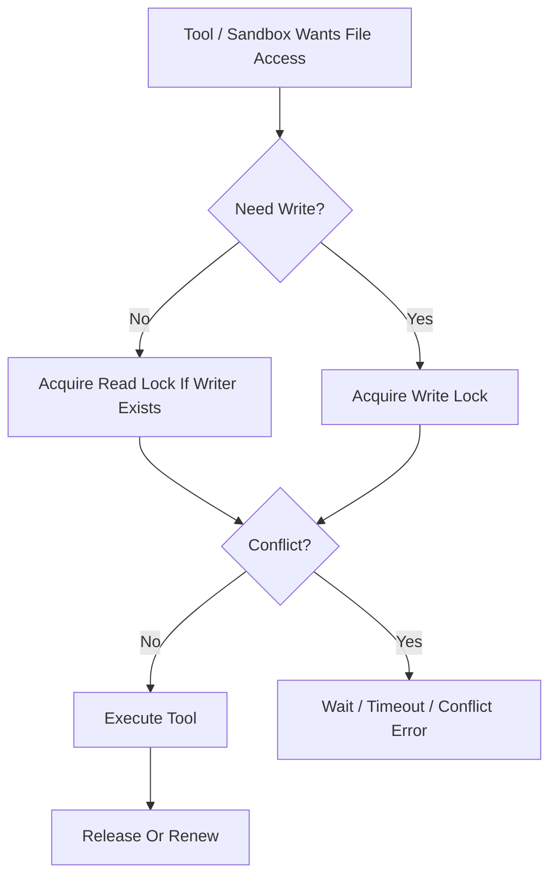

# File Lock Contract

---

## OAPEFLIR Association

This contract participates in the following stages of the OAPEFLIR eight-stage cycle:

- **Observe**: Signal collection and aggregation
- **Assess**: Pre-execution assessment and risk judgment
- **Plan**: Task decomposition and DAG construction
- **Execute**: Step execution and fault tolerance
- **Feedback**: Signal collection and preprocessing
- **Learn**: Pattern detection and knowledge extraction
- **Improve**: Improvement candidate evaluation and rollout
- **Release**: Controlled release and rollback

---

## 1. Scope

This contract defines read/write semantics, lease rules, crash recovery, and boundaries with tools/sandbox for file locks.

Related documents:

- `tool_and_provider_execution_contract.md`
- `sandbox_and_auth_contract.md`
- `storage_schema_contract.md`
- `runtime_repository_and_migration_contract.md`
- `error_code_registry.md`

## 2. Goals

Phase 1a / 1b must at minimum achieve:

- The same file will not be modified by two write operations simultaneously.
- Read/write conflicts are detectable, awaitable, and timeoutable.
- Post-crash residual locks can be cleaned up by startup inspection and recovery chains.

## 3. Key Objects

### 3.1 `FileLockRequest`

| Field | Type | Description |
| --- | --- | --- |
| `lock_scope` | `file` | Currently fixed to file-level for this stage |
| `target_path` | `string` | Absolute normalized path |
| `mode` | `read \| write` | Lock mode |
| `task_id` | `string?` | Legacy task projection ID |
| `harness_run_id` | `string` | HarnessRun ID |
| `node_run_id` | `string` | NodeRun ID |
| `agent_id` | `string` | Agent ID |
| `ttl_seconds` | `number` | Lease TTL |
| `wait_timeout_ms` | `number` | Wait time for conflict release |
| `reentrant_token` | `string?` | Same node run reentrant identifier |

### 3.2 `FileLockRecord`

- `lock_id`
- `target_path`
- `normalized_path`
- `mode`
- `holder_task_id?`
- `holder_harness_run_id`
- `holder_node_run_id`
- `holder_agent_id`
- `acquired_at`
- `expires_at`
- `last_renewed_at`

## 4. Compatibility Matrix

| Existing Lock | New Request | Result |
| --- | --- | --- |
| `read` | `read` | Shared access allowed |
| `read` | `write` | Block and wait or fail |
| `write` | `read` | Block and wait or fail |
| `write` | `write` | Exclusive conflict |

Supplementary rules:

- Reentrant requests for the same `node_run_id + normalized_path + mode` may reuse existing locks.
- When the same node run already holds a `write` lock, requesting a `read` lock for the same file should reuse it directly without downgrading.
- "Two different node runs but same task" is not allowed to bypass exclusive rules.

## 5. Lease and Renewal

- Default TTL for Phase 1a is recommended to be `60s`.
- Active node runs must renew via heartbeat or explicit `renewLock(...)`.
- After lock expiration, it does not mean the file is automatically safe to write; the recovery chain should first confirm that the holder node run is stale or terminated.

## 6. Service Entry Points

Minimum interface:

- `acquireLock(request)`
- `renewLock(lockId, now)`
- `releaseLock(lockId)`
- `releaseAllByExecution(executionId)`
- `listLocksByExecution(executionId)`
- `listExpiredLocks(now)`
- `reapExpiredLocks(now)`

## 7. Boundary with Tools and Sandbox

- Read-only tools like `read_file / grep / list` may acquire `read` locks on demand as needed.
- Write tools like `write_file / edit / patch` must hold a `write` lock first.
- Tools like `bash` whose write set cannot be statically and precisely inferred must not masquerade as fine-grained file lock safety; they should be guarded by coarser ExecPolicy and approval policies.
- FileLock does not replace sandbox path allowlists; it only solves same-path concurrent conflicts.

## 8. Storage and Recovery Boundary

- Authoritative lock state must be persisted; it must not exist only in an in-memory Map.
- Startup inspection should clean up locks where `expires_at < now` and holder execution is inactive.
- If execution terminates but locks remain, they should be released by the recovery chain or cleanup handler.

## 9. Error Semantics

Recommended stable error codes:

- `tool.file_lock_conflict`
- `tool.file_lock_timeout`
- `runtime.stale_lock_detected`

Rules:

- Timeout waiting should return a conflict-type error, not a generic `tool.execution_failed`.
- When lock records are corrupted or holder is inconsistent, report a recovery error and enter inspection handling.

## 10. Phase Boundaries

Phase 1a explicitly does:

- File-level locks
- SQLite persistence
- TTL + heartbeat renewal
- Startup reclamation and execution termination reclamation

Currently not doing:

- Directory-level locks
- Distributed lock service
- Git worktree-level isolation replacement

## 11. Closure Conclusion

The goal of file locks is not "make all IO automatically safe," but to compress the most dangerous concurrent write conflicts into a minimal boundary that is clear, auditable, and recoverable.
