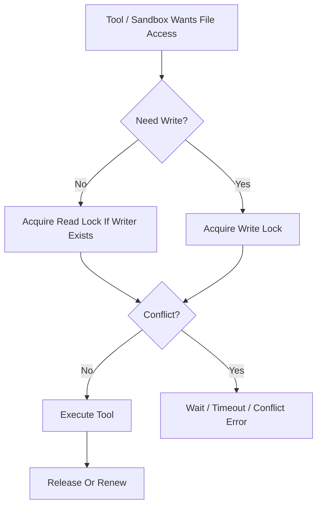

# File Lock Contract

## 1. Scope

This contract defines file lock read/write semantics, lease rules, crash recovery, and boundaries with tool / sandbox.

Related documents:

- `tool_and_provider_execution_contract.md`
- `sandbox_and_auth_contract.md`
- `storage_schema_contract.md`
- `runtime_repository_and_migration_contract.md`
- `error_code_registry.md`

## 2. Goals

Phase 1a / 1b at minimum must:

- Prevent the same file from being simultaneously modified by two write operations.
- Make read/write conflicts detectable, waitable, and timeout-able.
- Ensure locks left behind after crashes can be cleaned up by startup inspection and recovery chains.

## 3. Key Objects

### 3.1 `FileLockRequest`

| Field | Type | Description |
| --- | --- | --- |
| `lock_scope` | `file` | Fixed to file-level for current phase |
| `target_path` | `string` | Absolute normalized path |
| `mode` | `read \| write` | Lock mode |
| `task_id` | `string` | Task ID |
| `execution_id` | `string` | Execution ID |
| `agent_id` | `string` | Agent ID |
| `ttl_seconds` | `number` | Lease TTL |
| `wait_timeout_ms` | `number` | Wait time for conflict release |
| `reentrant_token` | `string?` | Same execution reentrant identifier |

### 3.2 `FileLockRecord`

- `lock_id`
- `target_path`
- `normalized_path`
- `mode`
- `holder_task_id`
- `holder_execution_id`
- `holder_agent_id`
- `acquired_at`
- `expires_at`
- `last_renewed_at`

## 4. Compatibility Matrix

| Existing Lock | New Request | Result |
| --- | --- | --- |
| `read` | `read` | Shared allowed |
| `read` | `write` | Block wait or fail |
| `write` | `read` | Block wait or fail |
| `write` | `write` | Exclusive conflict |

Supplementary rules:

- Reentrant requests for the same `execution_id + normalized_path + mode` can reuse existing locks.
- When the same execution already holds a `write` lock, requesting a `read` lock for the same file should directly reuse it, not degrade.
- Must not allow "two different executions but same task" to bypass exclusive rules.

## 5. Lease and Renewal

- Phase 1a default TTL is recommended as `60s`.
- Active executions must renew through heartbeat or explicit `renewLock(...)`.
- After lock expires, it does not mean it is automatically safe to write; recovery chain should first confirm holder execution is stale or terminated.

## 6. Service Entry Points

Minimum interfaces:

- `acquireLock(request)`
- `renewLock(lockId, now)`
- `releaseLock(lockId)`
- `releaseAllByExecution(executionId)`
- `listLocksByExecution(executionId)`
- `listExpiredLocks(now)`
- `reapExpiredLocks(now)`

## 7. Boundary with Tools and Sandbox

- Read-only tools like `read_file / grep / list` can by default acquire `read` locks on demand.
- Write tools like `write_file / edit / patch` must first hold `write` locks.
- Tools like `bash` whose write set cannot be precisely inferred statically must not impersonate fine-grained file lock safety; should be guarded by coarser ExecPolicy and approval strategies.
- FileLock does not replace sandbox path whitelist; it only solves same-path concurrent conflicts.

## 8. Storage and Recovery Boundaries

- Authoritative lock state must be persisted and must not exist only in in-memory Map.
- Startup inspection should clean locks where `expires_at < now` and holder execution is inactive.
- If execution terminates but lock still exists, recovery chain or cleaner should release it.

## 9. Error Semantics

Suggested stable error codes:

- `tool.file_lock_conflict`
- `tool.file_lock_timeout`
- `runtime.stale_lock_detected`

Rules:

- Wait timeout should return conflict-type error, not generalized `tool.execution_failed`.
- When lock record damage or holder inconsistency is found, should report recovery error and enter inspection handling.

## 10. Phase Boundaries

Phase 1a explicitly does:

- File-level locks
- SQLite persistence
- TTL + heartbeat renewal
- Startup reclamation and execution termination reclamation

Currently does not do:

- Directory-level locks
- Distributed lock services
- Git worktree-level isolation replacement

## 11. Closure Conclusion

The goal of file locks is not "making all IO automatically safe" but compressing the most dangerous concurrent write conflicts into a clear, auditable, recoverable minimum boundary.
