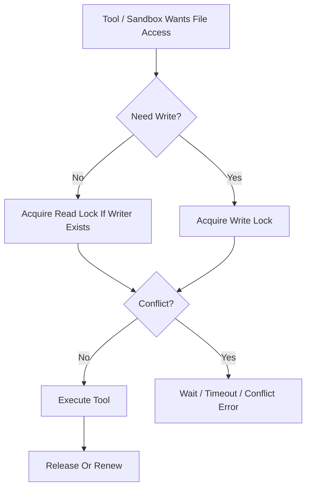

# File Lock Contract

---

## OAPEFLIR Association

This contract participates in the following stages of the OAPEFLIR eight-stage cycle:

- **Observe**: Signal collection and aggregation
- **Assess**: Pre-execution assessment and risk judgment
- **Plan**: Task decomposition and DAG construction
- **Execute**: Step execution and fault tolerance
- **Feedback**: Signal collection and preprocessing
- **Learn**: Pattern detection and knowledge extraction
- **Improve**: Improvement candidate evaluation and rollout
- **Release**: Controlled release and rollback

---

## 1. Scope

This contract defines file lock read/write semantics, lease rules, crash recovery, and boundaries with tool/sandbox.

Related documents:

- `tool_and_provider_execution_contract.md`
- `sandbox_and_auth_contract.md`
- `storage_schema_contract.md`
- `runtime_repository_and_migration_contract.md`
- `error_code_registry.md`

## 2. Objectives

Phase 1a/1b minimum requirements:

- Same file will not be simultaneously modified by two write operations.
- Read/write conflicts are detectable, waitable, and timeoutable.
- Orphaned locks after crashes can be cleaned up by startup inspection and recovery chain.

## 3. Key Objects

### 3.1 `FileLockRequest`

| Field | Type | Description |
| --- | --- | --- |
| `lock_scope` | `file` | Fixed to file-level for current phase |
| `target_path` | `string` | Absolute normalized path |
| `mode` | `read \| write` | Lock mode |
| `task_id` | `string` | Task ID |
| `execution_id` | `string` | Execution ID |
| `agent_id` | `string` | Agent ID |
| `ttl_seconds` | `number` | Lease TTL |
| `wait_timeout_ms` | `number` | Wait time for conflict release |
| `reentrant_token` | `string?` | Same-execution reentrant identifier |

### 3.2 `FileLockRecord`

- `lock_id`
- `target_path`
- `normalized_path`
- `mode`
- `holder_task_id`
- `holder_execution_id`
- `holder_agent_id`
- `acquired_at`
- `expires_at`
- `last_renewed_at`

## 4. Compatibility Matrix

| Existing Lock | New Request | Result |
| --- | --- | --- |
| `read` | `read` | Shared allowed |
| `read` | `write` | Block/wait or fail |
| `write` | `read` | Block/wait or fail |
| `write` | `write` | Exclusive conflict |

Supplementary rules:

- Reentrant requests for the same `execution_id + normalized_path + mode` may reuse existing lock.
- When same execution already holds `write` lock, requesting `read` lock on same file should directly reuse, not downgrade.
- "Two different executions but same task" must not bypass exclusive rules.

## 5. Lease and Renewal

- Phase 1a default TTL recommendation is `60s`.
- Active execution must renew via heartbeat or explicit `renewLock(...)`.
- Lock expiration does not imply automatic safe-write; recovery chain should first confirm holder execution is stale or terminated.

## 6. Service Entry Points

Minimum interface:

- `acquireLock(request)`
- `renewLock(lockId, now)`
- `releaseLock(lockId)`
- `releaseAllByExecution(executionId)`
- `listLocksByExecution(executionId)`
- `listExpiredLocks(now)`
- `reapExpiredLocks(now)`

## 7. Boundaries with Tool and Sandbox

- Read-only tools like `read_file / grep / list` may acquire `read` lock on demand by default.
- Write tools like `write_file / edit / patch` must hold `write` lock first.
- Tools like `bash` where write set cannot be statically precisely inferred must not masquerade as fine-grained file lock safety; should be guarded by coarser ExecPolicy and approval policy.
- FileLock does not replace sandbox path whitelist; it only solves same-path concurrency conflicts.

## 8. Storage and Recovery Boundaries

- Authoritative lock state must be persisted; must not exist only in memory Map.
- Startup inspection should clean locks where `expires_at < now` and holder execution is inactive.
- If execution terminates but lock still exists, recovery chain or cleaner should release.

## 9. Error Semantics

Recommended stable error codes:

- `tool.file_lock_conflict`
- `tool.file_lock_timeout`
- `runtime.stale_lock_detected`

Rules:

- Wait timeout should return conflict-type error, not generic `tool.execution_failed`.
- When lock record corruption or holder inconsistency is found, should report recovery error and enter inspection handling.

## 10. Phase Boundaries

Phase 1a explicitly does:

- File-level locks
- SQLite persistence
- TTL + heartbeat renewal
- Startup reclamation and execution termination reclamation

Currently excluded:

- Directory-level locks
- Distributed lock service
- Git worktree-level isolation alternatives

## 11. Closure Conclusion

The goal of file locks is not "make all IO automatically safe", but to compress the most dangerous concurrent write conflicts into a clear, auditable, recoverable minimum boundary.
