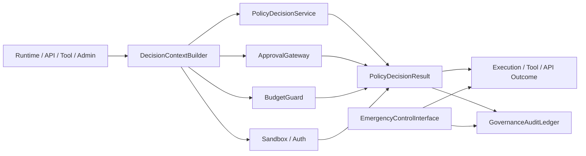
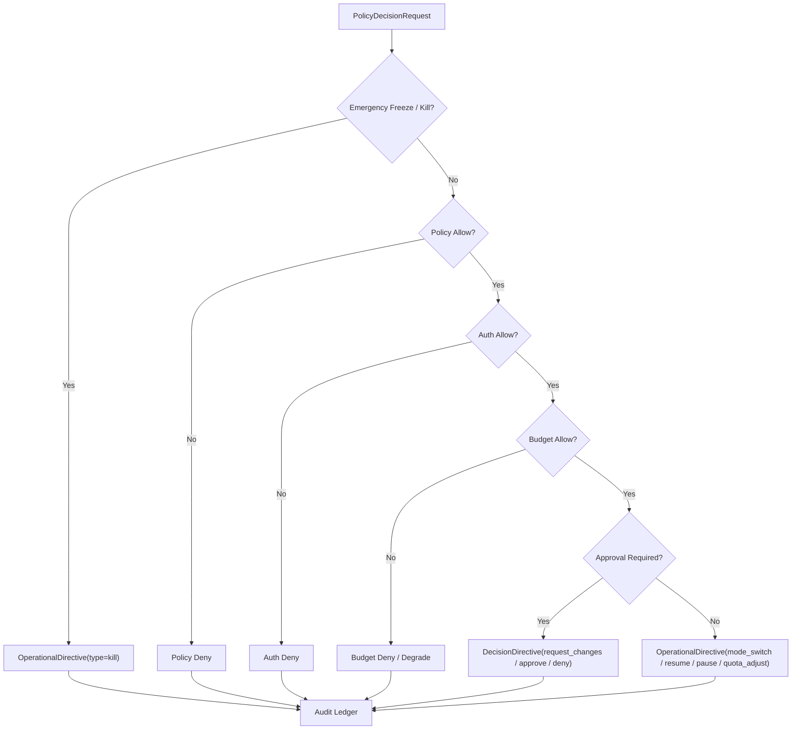

# Governance Control Plane Contract

## 1. 范围

本 contract defines最终平台的统一治理平面，includes policy evaluation、approval、budget、sandbox、kill switch、freeze 和 audit 入口。

它used for回答“高风险动作由谁决定、在哪一层决定、如何审计、如何阻断和如何恢复”。

## 2. 目标

- 把分散的治理判断收拢到统一 `control plane`。
- 让 runtime、tool、approval、budget 和 auth 有一致的Decision入口。
- 让 deny、freeze、kill、takeover 成为正式平台能力。
- 让治理Decision可追溯、可解释、可回放。

## 3. 非目标

- 本 contract 不规定具体 policy engine 产品。
- 本 contract 不替代审批对象、sandbox 规则或budget字段本身。
- 本 contract 不让治理层directly篡改业务结果。

## 4. Architecture角色

- `PolicyDecisionService`
- `ApprovalGateway`
- `BudgetGuard`
- `ExecutionFreezeSwitch`
- `GovernanceAuditLedger`
- `DecisionContextBuilder`
- `EmergencyControlInterface`

## 5. 适用动作域

统一治理平面至少覆盖以下动作：

- runtime execution start
- tool call
- network access
- filesystem write
- external side-effect action
- observe / assess action proposal promote
- billing / quota sensitive action
- enterprise admin action

## 6. 关键对象

- `OperationalDirective`
- `DecisionDirective`
- `DenyReason`
- `FreezeOrder`
- `KillOrder`
- `AuditEntry`
- `ApprovalRequirement`

## 7. `OperationalDirective` / `DecisionDirective`

治理平面对 P3 / P4 的 canonical 指令对象分为两class：

| 指令对象 | `type` 枚举 | 作用范围 | Description |
|---|-------|--------|
| `OperationalDirective` | `pause \| resume \| abort \| rollback \| kill \| mode_switch \| quota_adjust` | `HarnessRun`、`NodeRun`、Plane、Tenant、Region | 只改变运lines控制Status，不table达业务 approve / deny |
| `DecisionDirective` | `approve \| deny \| override \| request_changes \| expire_approval` | `decisionId`、`sideEffectId`、`hitlTaskId`、`budgetReservationId` | 只能由 HITL / Policy / Approval 流程生成，table达业务裁决 |

`OperationalDirective` minimum fields:

- `directive_id`
- `type`
- `scope_type` (`platform | region | tenant | domain | harness_run | node_run`)
- `scope_ref`
- `issued_by`
- `issued_at`
- `expires_at?`
- `reason_code`
- `constraint_patch?`

`DecisionDirective` minimum fields:

- `directive_id`
- `type`
- `decision_id`
- `scope_type`
- `scope_ref`
- `issued_by`
- `issued_at`
- `expires_at?`
- `evidence_ref?`

规则：

- P2 -> P3 / P4 的常规控制必须via `OperationalDirective` 或 `DecisionDirective` 下发，不得再defines平lines的 `DecisionRequest` / `DecisionResult` canonical schema。
- `PolicyDecisionRequest` / `PolicyDecisionResult` 仍is策略求值输入输出，但它们belongs toDecision形成过程，不is控制平面发给执lines平面的最终指令对象。
- P2 -> P4 的直达通道只允许 `OperationalDirective(type=kill)`，且only限 panic / emergency 场景。

## 8. vs `PolicyDecisionRequest` / `PolicyDecisionResult` 的关系

| control-plane 概念 | policy-engine 对象 | Description |
|---|-------|--------|
| Decision形成输入 | `PolicyDecisionRequest` | 进入策略、budget、审批、auth 联合求值 |
| Decision形成输出 | `PolicyDecisionResult` | table达 allow / deny / allow_with_constraints / escalate_for_approval |
| 运lines控制下发 | `OperationalDirective` | 将控制Conclusion发送给 P3 / P4 |
| 业务裁决下发 | `DecisionDirective` | 将审批 / HITL / override 等业务裁决发送给 P3 / P4 |

规则：

- 治理平面不得把 `PolicyDecisionResult` directly当作执lines平面指令对象下发。
- `DecisionDirective` 必须references用上游 `decision_id` 或等价审批/budget/副作用对象，确保裁决链可追溯。
- `OperationalDirective` 只能改变控制Status，不得as业务 approve / deny。

## 9. Decision优先级

Recommendation优先级从高到低：

1. `OperationalDirective(type=kill)` / panic / freeze
2. `policy deny`
3. `auth deny`
4. `budget deny`
5. `DecisionDirective(approve/deny/expire_approval/override/request_changes)`
6. `OperationalDirective(mode_switch/quota_adjust/resume/pause/abort/rollback)`

解释：

- 紧急冻结优先于普通业务允许。
- 显式 deny 优先于 approval required。
- approval 只解决需要人工许可的Issue，不覆盖 auth / policy 的硬性禁止。

### 9.1 Decision流程图

## 10. Freeze / Kill 语义

`FreezeOrder`
: 暂停一个 domain 的新执lines或新副作用，但不一定杀死已via执lines中的动作。

`KillOrder`
: mandatory中断指定 `HarnessRun`、`NodeRun`、worker、queue、region 或 tenant 的运lines。

最小字段：

- `order_id`
- `domain_type`
- `domain_ref`
- `reason`
- `issued_by`
- `issued_at`
- `expires_at?`

规则：

- freeze vs kill 都必须writes审计账本。
- kill 不得静默发生，必须能追溯到触发者、范围和原因。
- 被 freeze 的 domain 在恢复前defaults to fail-closed。
- `KillOrder` 真正进入执lines层时，必须table现为 `OperationalDirective(type=kill)`。

## 11. Approval 联动

- approval gateway 负责生成 approval requirement，不负责最终 policy 解释。
- 高风险动作必须先via governance control plane 判断isno进入审批。
- 审批via后仍需再iterationsvia过最小Decision重评估，不能directly跳过治理层执lines。

## 12. Budget 联动

- budget guard 作为 decision source 之一参vs统一判断。
- budget不足应返回明确 deny 或 degrade 语义。
- budget放lines不等于策略放lines，两者必须分别有Decision来源。

## 13. Sandbox / Auth 联动

- sandbox Decision负责约束“能做什么”。
- auth Decision负责约束“谁有资格做”。
- governance 层负责把两者放进同一Decision管道，而不is让call方分别手写判断。

## 14. Audit Ledger

`AuditEntry` 最小字段：

- `audit_id`
- `request_id`
- `decision_source`
- `decision_summary`
- `actor_ref`
- `created_at`
- `trace_id?`

规则：

- deny / freeze / kill / approval required 均必须写审计record。
- audit ledger is治理事实源的一部分，不应只存在日志中。

## 15. Failure Mode

治理平面需明确handle以下failed模式：

- policy engine 不可用
- approval backend 不可用
- budget service timeout
- auth provider 波动
- emergency kill vs普通 allow conflicts

handleprinciple：

- 高风险动作defaults to fail-closed。

## 15A. OAPEFLIR Governance Gates

对 OAPEFLIR Phase 1-4，治理平面至少要覆盖以下 gate：

- `plan_gate`
- `feedback_disposition_gate`
- `improvement_acceptance_gate`
- `release_transition_gate`

规则：

- `Observe / Assess / Plan` 可提交Recommendation，但不得越过治理 gate directlyaccepts改进或推进 release。
- `release_transition_gate` 必须以 ADR-075 的 `evaluate_0 / canary_5 / partial_25 / stable_75 / stable_100` 级别和对应 guardrail 为 authoritative 输入。
- `canary_promote / full_release / rollback automation` belongs to后续扩展 gate，不得as phase1-4 已落地能力。
- 低风险只读动作可按configure降级。
- emergency control 始终优先。

## 16. vs现有文档的关系

- `approval_and_hitl_contract.md` defines审批对象。
- `sandbox_and_auth_contract.md` definessecurityvsauthentication边界。
- `cost_and_budget_contract.md` definesbudgetvs成本约束。
- `execution_plane_contract.md` defines freeze / kill / takeover 对 execution plane 的作用面。
- 本 contract defines这些能力如何汇合成统一治理平面。

## 17. 分阶段references入

- Phase 2: 最小统一Decision入口 + deny taxonomy。
- Phase 3: observe-compatible product slice / monetization 动作纳入治理。
- Phase 4: enterprise policy / compliance / audit 套件。

## 18. 收口Conclusion

治理平面的核心不is“增加更多规则”，而is把审批、budget、permission、策略、紧急控制统一到一个可解释的Decision入口。

后续任何高风险动作，只要不能接入该平面，就不应被视为平台级能力。

## v4.3 Architecture Remediation

以下条目修复 `platform-architecture-implementation-consistency-audit.md` 中record的 contract 偏差。本文档历史段落如vs本节conflicts，以本节、`docs_zh/architecture/00-platform-architecture.md`、ADR-109 至 ADR-113、以及 `src/platform/contracts/executable-contracts/` 为准。

- T-24: 本文原先把 `DecisionRequest / DecisionResult` 写成治理平面对 P3/P4 的 canonical 指令，Root cause: 早期文档把“策略求值过程”和“控制平面下发对象”混成了一层，导致 policy output directly冒充 runtime directive。修复：正文现把 P2 -> P3/P4 指令收敛到 `OperationalDirective` / `DecisionDirective`，并将 `PolicyDecisionRequest / Result` 明确降回Decision形成过程对象。

mandatory规则：Status迁移必须via `RuntimeStateMachine.transition(command)`；执lines计划必须uses `PlanGraphBundle`；执lines结果必须uses `NodeAttemptReceipt`；truth event 只能uses `platform.*`；OAPEFLIR 只能作为 `oapeflir.view.*` / rationale 投影；budget必须uses `BudgetLedger` / `BudgetReservation` / `BudgetSettlement`。
