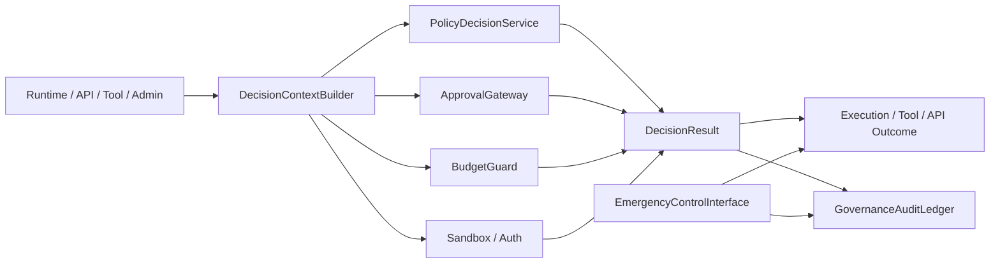
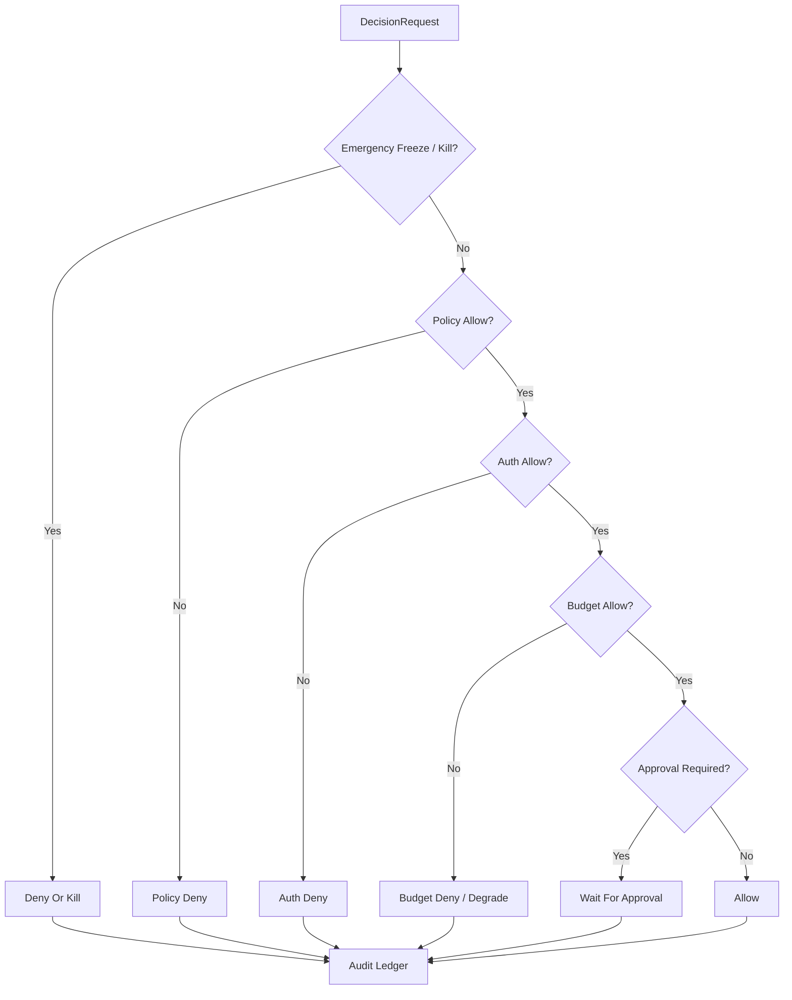

# Governance Control Plane Contract

## 1. Scope

This contract defines the unified governance plane for the eventual platform, including policy evaluation, approval, budget, sandbox, kill switch, freeze, and audit entry.

It is used to answer "who decides high-risk actions, at which layer, how to audit, how to block, and how to recover".

## 2. Goals

- Consolidate scattered governance decisions into unified `control plane`.
- Give runtime, tool, approval, budget, and auth a consistent decision entry point.
- Make deny, freeze, kill, takeover formal platform capabilities.
- Make governance decisions traceable, explainable, replayable.

## 3. Non-Goals

- This contract does not specify specific policy engine product.
- This contract does not replace approval objects, sandbox rules, or budget fields themselves.
- This contract does not allow governance layer to directly tamper with business results.

## 4. Architecture Roles

- `PolicyDecisionService`
- `ApprovalGateway`
- `BudgetGuard`
- `ExecutionFreezeSwitch`
- `GovernanceAuditLedger`
- `DecisionContextBuilder`
- `EmergencyControlInterface`

## 5. Applicable Action Domains

Unified governance plane covers at least the following actions:

- runtime execution start
- tool call
- network access
- filesystem write
- external side-effect action
- observe / assess action proposal promote
- billing / quota sensitive action
- enterprise admin action

## 6. Key Objects

- `DecisionRequest`
- `DecisionResult`
- `DenyReason`
- `FreezeOrder`
- `KillOrder`
- `AuditEntry`
- `ApprovalRequirement`

## 7. Relationship Between `DecisionRequest` And `PolicyDecisionRequest`

> `DecisionRequest` in this contract is a conceptual description of the governance plane entry. The authoritative request object in the implementation layer is `PolicyDecisionRequest` defined in `policy_engine_contract.md`. The field mapping is as follows:

| This Contract Conceptual Field | PolicyDecisionRequest Implementation Field | Description |
| --- | --- | --- |
| `request_id` | `decision_id` | Unique request identifier |
| `subject_id` | `subject_id` + `subject_type` | Policy Engine additionally distinguishes subject type |
| `task_id` | `task_id` | Associated task |
| `execution_id` | `execution_id` | Associated execution |
| `action_type` | `action` | Policy Engine defines enumerated values |
| `risk_level` | `risk_category` | Policy Engine uses more granular risk classification name |
| `context_json` | `metadata_json` + `resource_ref` + `estimated_cost_usd` + `mode` | Policy Engine splits context into structured fields |
| `submitted_at` | (Internally recorded by Policy Engine) | — |

Rules:

- Implementation should use `PolicyDecisionRequest` as authoritative schema; this contract does not define a second set of request objects.
- If governance plane needs urgent controls like freeze / kill, may trigger through independent entry points `FreezeOrder` / `KillOrder` without forcing through `PolicyDecisionRequest`.
- `DecisionResult` (below) similarly uses `PolicyDecisionResult` as implementation reference, but governance plane extends `decision_source` dimension to distinguish source.

## 8. `DecisionResult` Minimum Fields

- `request_id`
- `allowed`
- `decision_source` (`policy | approval | budget | auth | emergency_override`)
- `deny_reason?`
- `requires_approval`
- `applied_controls?`
- `resolved_at`

Rules:

- When `allowed=false`, must have explicit deny reason.
- `requires_approval=true` does not equal deny; enters waiting state.
- Decision result must explain source; "rejected but no source" not allowed.

## 9. Decision Priority

Recommended priority from high to low:

1. `emergency_override / freeze / kill`
2. `policy deny`
3. `auth deny`
4. `budget deny`
5. `approval required`
6. `allow`

Explanation:

- Emergency freeze takes precedence over normal business allow.
- Explicit deny takes precedence over approval required.
- Approval only solves "needs human permission" issues; does not cover auth / policy hard blocks.

### 9.1 Decision Flowchart

## 10. Freeze / Kill Semantics

`FreezeOrder`
: Suspend new executions or new side effects for a domain, but does not necessarily kill already-executing actions.

`KillOrder`
: Forcefully interrupt specified execution, worker, queue, or tenant running.

Minimum fields:

- `order_id`
- `domain_type`
- `domain_ref`
- `reason`
- `issued_by`
- `issued_at`
- `expires_at?`

Rules:

- Both freeze and kill must write to audit ledger.
- Kill must not occur silently; must be traceable to trigger, scope, and reason.
- Domain under freeze defaults to fail-closed before recovery.

## 11. Approval Linkage

- Approval gateway is responsible for generating approval requirement, not responsible for final policy interpretation.
- High-risk actions must first go through governance control plane to determine whether to enter approval.
- After approval passes, still need to go through minimum decision re-evaluation; cannot skip governance layer execution directly.

## 12. Budget Linkage

- Budget guard participates as one of the decision sources in unified judgment.
- Insufficient budget should return explicit deny or degrade semantics.
- Budget allow does not equal policy allow; both must separately have decision sources.

## 13. Sandbox / Auth Linkage

- Sandbox decision is responsible for constraining "what can be done".
- Auth decision is responsible for constraining "who has qualification to do".
- Governance layer is responsible for putting both into the same decision pipeline, rather than letting callers separately hand-write judgments.

## 14. Audit Ledger

`AuditEntry` minimum fields:

- `audit_id`
- `request_id`
- `decision_source`
- `decision_summary`
- `actor_ref`
- `created_at`
- `trace_id?`

Rules:

- deny / freeze / kill / approval required must all write audit records.
- Audit ledger is part of governance factual source; should not exist only in logs.

## 15. Failure Mode

Governance plane must explicitly handle the following failure modes:

- policy engine unavailable
- approval backend unavailable
- budget service timeout
- auth provider fluctuation
- emergency kill conflicts with normal allow

Handling principles:

- High-risk actions default to fail-closed.

## 15A. OAPEFLIR Governance Gates

For OAPEFLIR Phase 1-4, governance plane must cover at least the following gates:

- `plan_gate`
- `feedback_disposition_gate`
- `improvement_acceptance_gate`
- `rollout_transition_gate`

Rules:

- `Observe / Assess / Plan` may submit recommendations, but must not bypass governance gate to directly accept improvement or advance rollout.
- `rollout_transition_gate` within current authoritative scope only allows advancing to `off / suggest / shadow`.
- `canary_promote / full_release / rollback automation` belong to subsequent extension gates; must not impersonate phase1-4 implemented capabilities.
- Low-risk read-only actions may degrade per configuration.
- Emergency control always takes precedence.

## 16. Relationship With Existing Documents

- `approval_and_hitl_contract.md` defines approval objects.
- `sandbox_and_auth_contract.md` defines security and authentication boundaries.
- `cost_and_budget_contract.md` defines budget and cost constraints.
- `execution_plane_contract.md` defines the surface of freeze / kill / takeover on execution plane.
- This contract defines how these capabilities converge into a unified governance plane.

## 17. Phased Introduction

- Phase 2: Minimum unified decision entry + deny taxonomy.
- Phase 3: observe-compatible product slice / monetization actions included in governance.
- Phase 4: enterprise policy / compliance / audit suite.

## 18. Closure Conclusion

The core of governance plane is not "adding more rules", but unifying approval, budget, permissions, strategy, and emergency control into one explainable decision entry.

Any subsequent high-risk action that cannot integrate with this plane should not be considered a platform-level capability.