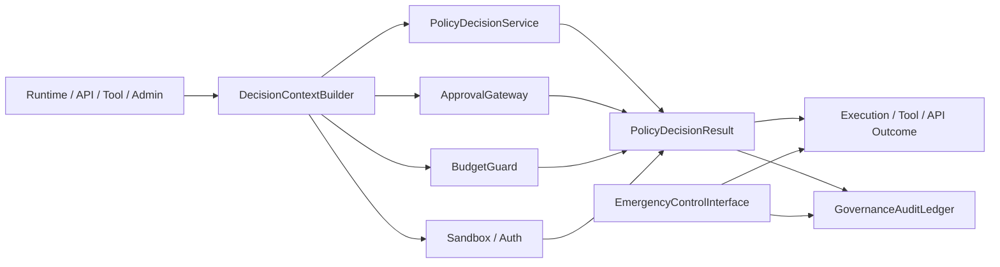
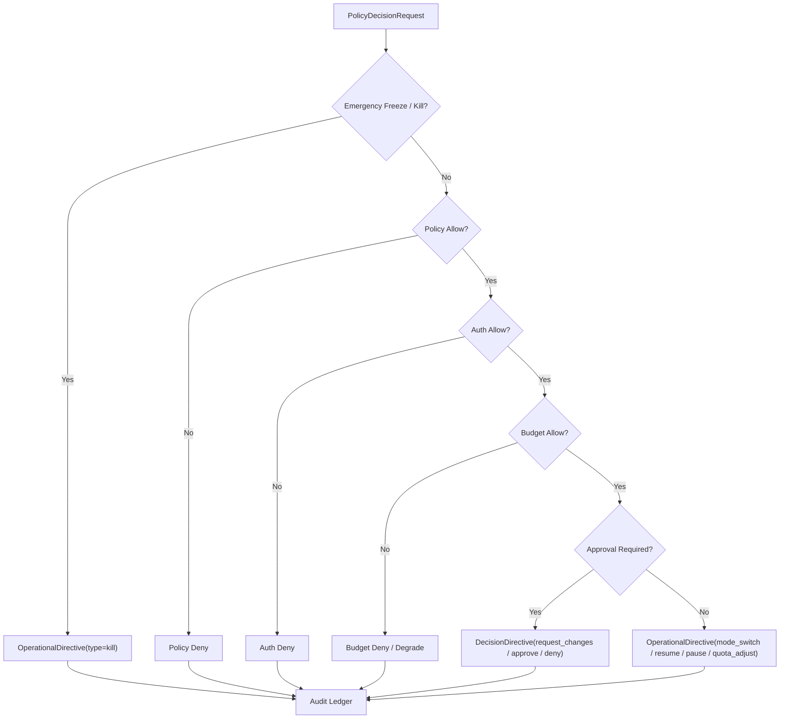

# Governance Control Plane Contract

## 1. Scope

This contract defines the unified governance plane for the ultimate platform, including policy evaluation, approval, budget, sandbox, kill switch, freeze, and audit entry points.

It answers the questions: "Which high-risk actions are decided by whom, at which layer, how they are audited, blocked, and recovered."

## 2. Goals

- Consolidate scattered governance decisions into a unified `control plane`.
- Provide a consistent decision entry point for runtime, tool, approval, budget, and auth.
- Make deny, freeze, kill, and takeover formal platform capabilities.
- Make governance decisions traceable, explainable, and replayable.

## 3. Non-Goals

- This contract does not mandate a specific policy engine product.
- This contract does not replace approval objects, sandbox rules, or budget field definitions themselves.
- This contract does not allow the governance layer to directly tamper with business results.

## 4. Architecture Roles

- `PolicyDecisionService`
- `ApprovalGateway`
- `BudgetGuard`
- `ExecutionFreezeSwitch`
- `GovernanceAuditLedger`
- `DecisionContextBuilder`
- `EmergencyControlInterface`

## 5. Applicable Action Domains

The unified governance plane covers at least the following actions:

- runtime execution start
- tool call
- network access
- filesystem write
- external side-effect action
- observe / assess action proposal promote
- billing / quota sensitive action
- enterprise admin action

## 6. Key Objects

- `OperationalDirective`
- `DecisionDirective`
- `DenyReason`
- `FreezeOrder`
- `KillOrder`
- `AuditEntry`
- `ApprovalRequirement`

## 7. `OperationalDirective` / `DecisionDirective`

For P3 / P4, the governance plane's canonical directive objects are divided into two categories:

| Directive Object | `type` Enum | Scope | Description |
| --- | --- | --- | --- |
| `OperationalDirective` | `pause \| resume \| abort \| rollback \| kill \| mode_switch \| quota_adjust` | `HarnessRun`, `NodeRun`, Plane, Tenant, Region | Only changes runtime control state, does not express business approve / deny |
| `DecisionDirective` | `approve \| deny \| override \| request_changes \| expire_approval` | `decisionId`, `sideEffectId`, `hitlTaskId`, `budgetReservationId` | Can only be generated by HITL / Policy / Approval flow, expresses business ruling |

`OperationalDirective` minimum fields:

- `directive_id`
- `type`
- `scope_type` (`platform | region | tenant | domain | harness_run | node_run`)
- `scope_ref`
- `issued_by`
- `issued_at`
- `expires_at?`
- `reason_code`
- `constraint_patch?`

`DecisionDirective` minimum fields:

- `directive_id`
- `type`
- `decision_id`
- `scope_type`
- `scope_ref`
- `issued_by`
- `issued_at`
- `expires_at?`
- `evidence_ref?`

Rules:

- Normal control from P2 -> P3 / P4 must be issued via `OperationalDirective` or `DecisionDirective`, and no parallel `DecisionRequest` / `DecisionResult` canonical schema should be defined.
- `PolicyDecisionRequest` / `PolicyDecisionResult` are still the input/output for policy evaluation, but they belong to the decision formation process, not the final directive object issued by the control plane to the execution plane.
- Direct channel from P2 -> P4 is allowed only for `OperationalDirective(type=kill)`, and only in panic / emergency scenarios.

## 8. Relationship with `PolicyDecisionRequest` / `PolicyDecisionResult`

| Control-plane Concept | Policy-engine Object | Description |
| --- | --- | --- |
| Decision formation input | `PolicyDecisionRequest` | Enters policy, budget, approval, auth joint evaluation |
| Decision formation output | `PolicyDecisionResult` | Expresses allow / deny / allow_with_constraints / escalate_for_approval |
| Runtime control issuance | `OperationalDirective` | Sends control conclusion to P3 / P4 |
| Business ruling issuance | `DecisionDirective` | Sends approval / HITL / override business ruling to P3 / P4 |

Rules:

- The governance plane must not issue `PolicyDecisionResult` directly as the execution plane directive object.
- `DecisionDirective` must reference upstream `decision_id` or equivalent approval/budget/side-effect object, ensuring traceability of the ruling chain.
- `OperationalDirective` can only change control state and must not disguise as business approve / deny.

## 9. Decision Priority

Recommended priority from high to low:

1. `OperationalDirective(type=kill)` / panic / freeze
2. `policy deny`
3. `auth deny`
4. `budget deny`
5. `DecisionDirective(approve/deny/expire_approval/override/request_changes)`
6. `OperationalDirective(mode_switch/quota_adjust/resume/pause/abort/rollback)`

Explanation:

- Emergency freeze takes precedence over normal business allowance.
- Explicit deny takes precedence over approval required.
- Approval only resolves issues requiring human permission and does not cover auth / policy hard prohibitions.

### 9.1 Decision Flow Diagram

## 10. Freeze / Kill Semantics

`FreezeOrder`
: Pauses new executions or new side effects for a domain, but does not necessarily kill actions already in execution.

`KillOrder`
: Forcibly interrupts execution of the specified `HarnessRun`, `NodeRun`, worker, queue, region, or tenant.

Minimum fields:

- `order_id`
- `domain_type`
- `domain_ref`
- `reason`
- `issued_by`
- `issued_at`
- `expires_at?`

Rules:

- Both freeze and kill must be written to the audit ledger.
- Kill must not happen silently and must be traceable to the trigger, scope, and cause.
- A domain that has been frozen defaults to fail-closed before recovery.
- When `KillOrder` truly enters the execution layer, it must manifest as `OperationalDirective(type=kill)`.

## 11. Approval Integration

- The approval gateway is responsible for generating approval requirements, not for final policy interpretation.
- High-risk actions must first go through the governance control plane to determine whether to enter approval.
- After approval passes, a minimum decision re-evaluation must still be performed and cannot directly skip the governance layer for execution.

## 12. Budget Integration

- The budget guard participates as one of the decision sources in the unified judgment.
- Insufficient budget should return explicit deny or degrade semantics.
- Budget release does not equal policy release; both must have separate decision sources.

## 13. Sandbox / Auth Integration

- Sandbox decisions are responsible for constraining "what can be done".
- Auth decisions are responsible for constraining "who is qualified to do it".
- The governance layer is responsible for putting both into the same decision pipeline, rather than letting callers manually write separate judgments.

## 14. Audit Ledger

`AuditEntry` minimum fields:

- `audit_id`
- `request_id`
- `decision_source`
- `decision_summary`
- `actor_ref`
- `created_at`
- `trace_id?`

Rules:

- deny / freeze / kill / approval required must all write audit records.
- The audit ledger is part of the governance facts source and should not exist only in logs.

## 15. Failure Mode

The governance plane must explicitly handle the following failure modes:

- policy engine unavailable
- approval backend unavailable
- budget service timeout
- auth provider fluctuation
- emergency kill conflicts with normal allow

Handling principles:

- High-risk actions default to fail-closed.

## 15A. OAPEFLIR Governance Gates

For OAPEFLIR Phase 1-4, the governance plane must cover at least the following gates:

- `plan_gate`
- `feedback_disposition_gate`
- `improvement_acceptance_gate`
- `release_transition_gate`

Rules:

- `Observe / Assess / Plan` can submit suggestions but must not bypass governance gates to directly accept improvements or advance release.
- `release_transition_gate` within the current authoritative scope only allows advancement to `off / suggest / shadow`.
- `canary_promote / full_release / rollback automation` belong to subsequent extension gates and must not be disguised as phase1-4 delivered authoritative capabilities.
- Low-risk read-only actions may be downgraded by configuration.
- Emergency control always takes priority.

## 16. Relationship with Existing Documents

- `approval_and_hitl_contract.md` defines approval objects.
- `sandbox_and_auth_contract.md` defines security and authentication boundaries.
- `cost_and_budget_contract.md` defines budget and cost constraints.
- `execution_plane_contract.md` defines the surface of freeze / kill / takeover on the execution plane.
- This contract defines how these capabilities converge into a unified governance plane.

## 17. Phased Introduction

- Phase 2: Minimal unified decision entry point + deny taxonomy.
- Phase 3: observe-compatible product slice / monetization actions incorporated into governance.
- Phase 4: enterprise policy / compliance / audit suite.

## 18. Closure Conclusion

The core of the governance plane is not "adding more rules", but converging approval, budget, permissions, policy, and emergency control into a single explainable decision entry point.

Subsequent high-risk actions that cannot integrate into this plane should not be considered platform-level capabilities.

## v4.3 Architecture Remediation

The following entries fix contract deviations recorded in `platform-architecture-implementation-consistency-audit.md`. If historical sections of this document conflict with this section, this section, `docs_zh/architecture/00-platform-architecture.md`, ADR-109 through ADR-113, and `src/platform/contracts/executable-contracts/` shall prevail.

- T-24: This document originally wrote `DecisionRequest / DecisionResult` as the canonical directives from the governance plane to P3/P4. The root cause was that early documents mixed "policy evaluation process" and "control plane issued objects" into one layer, causing policy output to directly impersonate runtime directives. Fix: The body now converges P2 -> P3/P4 directives to `OperationalDirective` / `DecisionDirective`, and explicitly demotes `PolicyDecisionRequest / Result` back to decision formation process objects.

Mandatory rules: State transitions must go through `RuntimeStateMachine.transition(command)`; execution plans must use `PlanGraphBundle`; execution results must use `NodeAttemptReceipt`; truth events must only use `platform.*`; OAPEFLIR can only be `oapeflir.view.*` / rationale projections; budgets must use `BudgetLedger` / `BudgetReservation` / `BudgetSettlement`.
