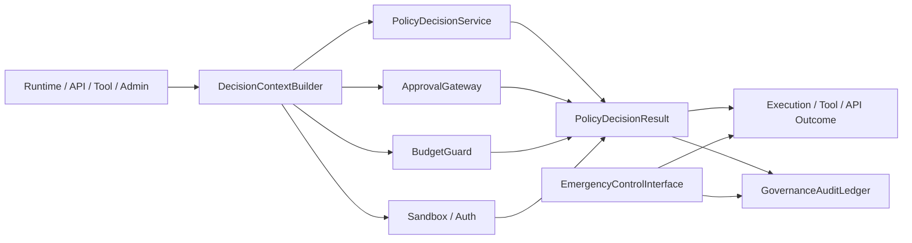
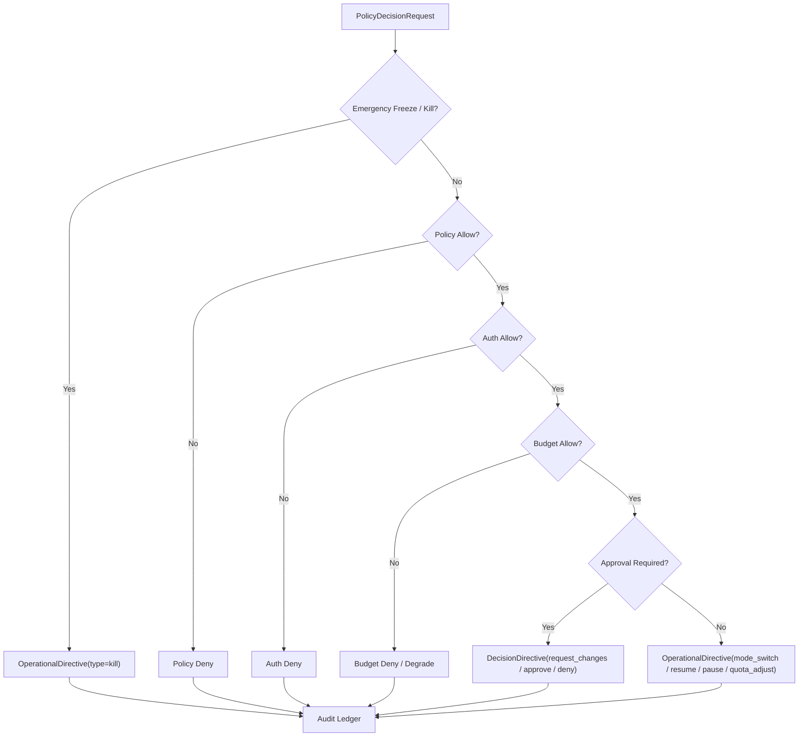

# Governance Control Plane Contract

## 1. Scope

This contract defines the unified governance plane of the target platform, including policy evaluation, approval, budget, sandbox, kill switch, freeze, and audit entry points.

It answers the questions: "Who decides high-risk actions, at which layer, how to audit, how to block, and how to recover."

## 2. Goals

- Consolidate scattered governance judgments into a unified `control plane`.
- Provide consistent decision entry points for runtime, tool, approval, budget, and auth.
- Make deny, freeze, kill, takeover formal platform capabilities.
- Make governance decisions traceable, explainable, and replayable.

## 3. Non-Goals

- This contract does not specify specific policy engine products.
- This contract does not replace approval objects, sandbox rules, or budget fields themselves.
- This contract does not allow the governance layer to directly tamper with business results.

## 4. Architectural Roles

- `PolicyDecisionService`
- `ApprovalGateway`
- `BudgetGuard`
- `ExecutionFreezeSwitch`
- `GovernanceAuditLedger`
- `DecisionContextBuilder`
- `EmergencyControlInterface`

## 5. Applicable Action Domains

The unified governance plane covers at minimum the following actions:

- runtime execution start
- tool call
- network access
- filesystem write
- external side-effect action
- observe / assess action proposal promote
- billing / quota sensitive action
- enterprise admin action

## 6. Key Objects

- `OperationalDirective`
- `DecisionDirective`
- `DenyReason`
- `FreezeOrder`
- `KillOrder`
- `AuditEntry`
- `ApprovalRequirement`

## 7. `OperationalDirective` / `DecisionDirective`

The governance plane's canonical directive objects for P3/P4 are divided into two categories:

| Directive Object | `type` Enumeration | Scope | Description |
| --- | --- | --- | --- |
| `OperationalDirective` | `pause \| resume \| abort \| rollback \| kill \| mode_switch \| quota_adjust` | `HarnessRun`, `NodeRun`, Plane, Tenant, Region | Only changes runtime control status, does not express business approve/deny |
| `DecisionDirective` | `approve \| deny \| override \| request_changes \| expire_approval` | `decisionId`, `sideEffectId`, `hitlTaskId`, `budgetReservationId` | Can only be generated by HITL/Policy/Approval flows, expresses business decisions |

`OperationalDirective` minimum fields:

- `directive_id`
- `type`
- `scope_type` (`platform | region | tenant | domain | harness_run | node_run`)
- `scope_ref`
- `issued_by`
- `issued_at`
- `expires_at?`
- `reason_code`
- `constraint_patch?`

`DecisionDirective` minimum fields:

- `directive_id`
- `type`
- `decision_id`
- `scope_type`
- `scope_ref`
- `issued_by`
- `issued_at`
- `expires_at?`
- `evidence_ref?`

Rules:

- P2 -> P3/P4 routine control must be issued via `OperationalDirective` or `DecisionDirective`, parallel `DecisionRequest`/`DecisionResult` canonical schema must not be defined.
- `PolicyDecisionRequest`/`PolicyDecisionResult` are still strategy evaluation input/output, but they belong to the decision formation process, not the final directive object sent from control plane to execution plane.
- P2 -> P4 direct channel only allows `OperationalDirective(type=kill)`, and only for panic/emergency scenarios.

## 8. Relationship with `PolicyDecisionRequest` / `PolicyDecisionResult`

| control-plane Concept | policy-engine Object | Description |
| --- | --- | --- |
| Decision formation input | `PolicyDecisionRequest` | Enter joint evaluation of strategy, budget, approval, auth |
| Decision formation output | `PolicyDecisionResult` | Express allow/deny/allow_with_constraints/escalate_for_approval |
| Runtime control issuance | `OperationalDirective` | Send control conclusion to P3/P4 |
| Business decision issuance | `DecisionDirective` | Send approval/HITL/override and other business decisions to P3/P4 |

Rules:

- Governance plane must not issue `PolicyDecisionResult` directly as execution plane directive object.
- `DecisionDirective` must reference upstream `decision_id` or equivalent approval/budget/side-effect object to ensure traceability of the decision chain.
- `OperationalDirective` can only change control status, must not masquerade as business approve/deny.

## 9. Decision Priority

Recommended priority from high to low:

1. `OperationalDirective(type=kill)` / panic / freeze
2. `policy deny`
3. `auth deny`
4. `budget deny`
5. `DecisionDirective(approve/deny/expire_approval/override/request_changes)`
6. `OperationalDirective(mode_switch/quota_adjust/resume/pause/abort/rollback)`

Explanation:

- Emergency freeze takes precedence over normal business allowance.
- Explicit deny takes precedence over approval required.
- Approval only resolves issues requiring human permission, does not override auth/policy hard denials.

### 9.1 Decision Flowchart

## 10. Freeze / Kill Semantics

`FreezeOrder`
: Suspend new executions or new side effects for a domain, but not necessarily kill actions already in execution.

`KillOrder`
: Forcefully interrupt execution of specified `HarnessRun`, `NodeRun`, worker, queue, region, or tenant.

Minimum fields:

- `order_id`
- `domain_type`
- `domain_ref`
- `reason`
- `issued_by`
- `issued_at`
- `expires_at?`

Rules:

- Both freeze and kill must be written to audit ledger.
- Kill must not happen silently, must be traceable to trigger, scope, and reason.
- Frozen domains are fail-closed by default before recovery.
- When `KillOrder` truly enters execution layer, it must manifest as `OperationalDirective(type=kill)`.

## 11. Approval Linkage

- Approval gateway is responsible for generating approval requirements, not for final policy interpretation.
- High-risk actions must first go through governance control plane to determine whether to enter approval.
- After approval passes, minimum decision re-evaluation must be passed again, cannot directly skip governance layer execution.

## 12. Budget Linkage

- Budget guard participates in unified judgment as one of the decision sources.
- Insufficient budget should return clear deny or degrade semantics.
- Budget release does not equal strategy release, both must have separate decision sources.

## 13. Sandbox / Auth Linkage

- Sandbox decision is responsible for constraining "what can be done."
- Auth decision is responsible for constraining "who is qualified to do."
- Governance layer is responsible for putting both into the same decision pipeline, not letting callers write judgments separately.

## 14. Audit Ledger

`AuditEntry` minimum fields:

- `audit_id`
- `request_id`
- `decision_source`
- `decision_summary`
- `actor_ref`
- `created_at`
- `trace_id?`

Rules:

- deny/freeze/kill/approval required must all write audit records.
- Audit ledger is part of governance fact source, should not exist only in logs.

## 15. Failure Mode

Governance plane must explicitly handle the following failure modes:

- policy engine unavailable
- approval backend unavailable
- budget service timeout
- auth provider fluctuation
- emergency kill conflicts with normal allow

Handling principles:

- High-risk actions are fail-closed by default.

## 15A. OAPEFLIR Governance Gates

For OAPEFLIR Phase 1-4, governance plane must cover at minimum the following gates:

- `plan_gate`
- `feedback_disposition_gate`
- `improvement_acceptance_gate`
- `release_transition_gate`

Rules:

- `Observe/Assess/Plan` may submit recommendations, but must not bypass governance gate to directly accept improvements or advance release.
- `release_transition_gate` must use ADR-075's `evaluate_0/canary_5/partial_25/stable_75/stable_100` levels and corresponding guardrails as authoritative input.
- `canary_promote/full_release/rollback automation` belongs to subsequent extension gates, must not masquerade as phase1-4 already delivered capabilities.
- Low-risk read-only actions may be downgraded by configuration.
- Emergency control always takes priority.

## 16. Relationship with Existing Documents

- `approval_and_hitl_contract.md` defines approval objects.
- `sandbox_and_auth_contract.md` defines security and authentication boundaries.
- `cost_and_budget_contract.md` defines budget and cost constraints.
- `execution_plane_contract.md` defines the surface of freeze/kill/takeover on execution plane.
- This contract defines how these capabilities converge into a unified governance plane.

## 17. Phased Introduction

- Phase 2: Minimum unified decision entry + deny taxonomy.
- Phase 3: Observe-compatible product slice/monetization actions brought under governance.
- Phase 4: Enterprise policy/compliance/audit suite.

## 18. Closure Conclusion

The core of governance plane is not "add more rules," but to unify approval, budget, permissions, policy, and emergency control into a single explainable decision entry.

Any subsequent high-risk action that cannot connect to this plane should not be considered a platform-level capability.

## v4.3 Architecture Remediation

The following items fix contract deviations recorded in `platform-architecture-implementation-consistency-audit.md`. If historical paragraphs of this document conflict with this section, this section, `docs_zh/architecture/00-platform-architecture.md`, ADR-109 through ADR-113, and `src/platform/contracts/executable-contracts/` prevail.

- T-24: This document previously wrote `DecisionRequest/DecisionResult` as the governance plane's canonical directive for P3/P4. Root cause: Early documents mixed "strategy evaluation process" and "control plane issuing object" into one layer, causing policy output to directly impersonate runtime directive. Fix: The main text now converges P2->P3/P4 directives to `OperationalDirective`/`DecisionDirective`, and explicitly demotes `PolicyDecisionRequest/Result` back to decision formation process objects.

Mandatory rules: State transition must go through `RuntimeStateMachine.transition(command)`; execution plan must use `PlanGraphBundle`; execution result must use `NodeAttemptReceipt`; truth event must only use `platform.*`; OAPEFLIR can only be used as `oapeflir.view.*`/rationale projection; budget must use `BudgetLedger`/`BudgetReservation`/`BudgetSettlement`.