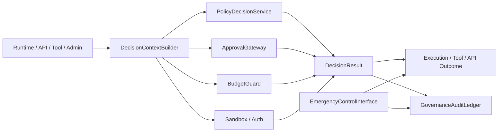
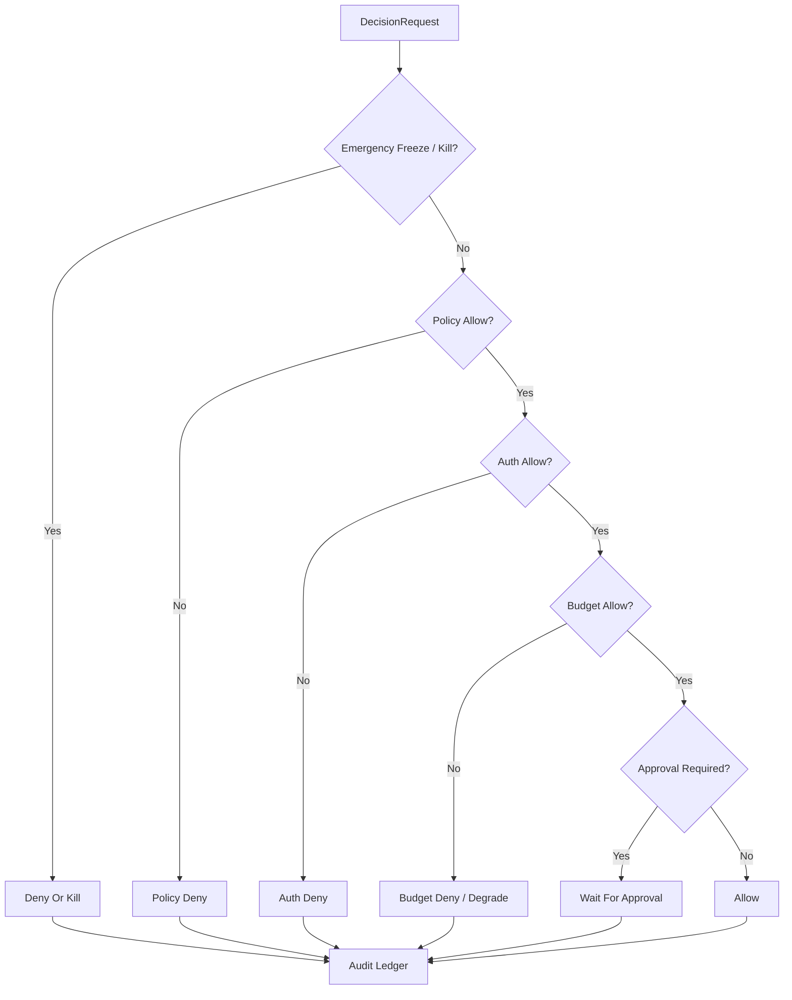

# Governance Control Plane Contract

## 1. Scope

This contract defines the unified governance plane for the final platform, including policy evaluation, approval, budget, sandbox, kill switch, freeze, and audit entrypoints.

It answers "who decides high-risk actions, at which layer, how they are audited, how they are blocked, and how they are recovered."

## 2. Goals

- Consolidate scattered governance judgments into a unified `control plane`.
- Give runtime, tool, approval, budget, and auth a consistent decision entrypoint.
- Make deny, freeze, kill, and takeover formal platform capabilities.
- Make governance decisions traceable, explainable, and replayable.

## 3. Non-Goals

- This contract does not specify a specific policy engine product.
- This contract does not replace approval objects, sandbox rules, or budget fields themselves.
- This contract does not let the governance layer directly tamper with business results.

## 4. Architecture Roles

- `PolicyDecisionService`
- `ApprovalGateway`
- `BudgetGuard`
- `ExecutionFreezeSwitch`
- `GovernanceAuditLedger`
- `DecisionContextBuilder`
- `EmergencyControlInterface`

## 5. Applicable Action Domains

The unified governance plane covers at minimum the following actions:

- runtime execution start
- tool call
- network access
- filesystem write
- external side-effect action
- observe / assess action proposal promote
- billing / quota sensitive action
- enterprise admin action

## 6. Key Objects

- `DecisionRequest`
- `DecisionResult`
- `DenyReason`
- `FreezeOrder`
- `KillOrder`
- `AuditEntry`
- `ApprovalRequirement`

## 7. Relationship Between `DecisionRequest` and `PolicyDecisionRequest`

> The `DecisionRequest` in this contract is a conceptual description of the governance plane entrypoint. The authoritative request object at the implementation layer is `PolicyDecisionRequest` defined in `policy_engine_contract.md`. The field mapping is as follows:

| This Contract Concept Field | PolicyDecisionRequest Implementation Field | Description |
| --- | --- | --- |
| `request_id` | `decision_id` | Unique request identifier |
| `subject_id` | `subject_id` + `subject_type` | Policy Engine additionally distinguishes subject type |
| `task_id` | `task_id` | Associated task |
| `execution_id` | `execution_id` | Associated execution |
| `action_type` | `action` | Policy Engine defines enumeration values |
| `risk_level` | `risk_category` | Policy Engine uses more granular risk classification name |
| `context_json` | `metadata_json` + `resource_ref` + `estimated_cost_usd` + `mode` | Policy Engine splits context into structured fields |
| `submitted_at` | (Recorded internally by Policy Engine) | — |

Rules:

- Implementation uses `PolicyDecisionRequest` as authoritative schema; this contract does not separately define a second set of request objects.
- If the governance plane needs emergency controls like freeze / kill, they can be triggered through independent entrypoints `FreezeOrder` / `KillOrder` and do not need to forcibly go through `PolicyDecisionRequest`.
- `DecisionResult` (below) similarly uses `PolicyDecisionResult` as implementation reference, but the governance plane extends the `decision_source` dimension to distinguish sources.

## 8. `DecisionResult` Minimum Fields

- `request_id`
- `allowed`
- `decision_source` (`policy | approval | budget | auth | emergency_override`)
- `deny_reason?`
- `requires_approval`
- `applied_controls?`
- `resolved_at`

Rules:

- When `allowed=false`, there must be a clear deny reason.
- `requires_approval=true` does not equal deny but enters a waiting state.
- Decision results must be able to explain the source; "denied but no source" is not allowed.

## 9. Decision Priority

Suggested priority from high to low:

1. `emergency_override / freeze / kill`
2. `policy deny`
3. `auth deny`
4. `budget deny`
5. `approval required`
6. `allow`

Explanation:

- Emergency freeze takes priority over normal business allow.
- Explicit deny takes priority over approval required.
- Approval only solves problems requiring human permission and does not cover auth / policy hard prohibitions.

### 9.1 Decision Flow Diagram

## 10. Freeze / Kill Semantics

`FreezeOrder`
: Pauses new executions or new side effects for a domain but does not necessarily kill actions already in execution.

`KillOrder`
: Forcefully interrupts execution of specified execution, worker, queue, or tenant.

Minimum fields:

- `order_id`
- `domain_type`
- `domain_ref`
- `reason`
- `issued_by`
- `issued_at`
- `expires_at?`

Rules:

- Both freeze and kill must write to audit ledger.
- Kill must not occur silently and must be traceable to trigger, scope, and cause.
- Domains under freeze default to fail-closed before recovery.

## 11. Approval Linkage

- Approval gateway is responsible for generating approval requirements, not for final policy interpretation.
- High-risk actions must first go through governance control plane to determine whether to enter approval.
- After approval passes, must still go through minimum decision re-evaluation and cannot directly skip governance layer execution.

## 12. Budget Linkage

- Budget guard participates in unified judgment as one of the decision sources.
- Insufficient budget should return clear deny or degrade semantics.
- Budget allow does not equal policy allow; both must separately have decision sources.

## 13. Sandbox / Auth Linkage

- Sandbox decisions are responsible for constraining "what can be done."
- Auth decisions are responsible for constraining "who is qualified to do it."
- Governance layer is responsible for putting both into the same decision pipeline rather than letting callers separately write judgments.

## 14. Audit Ledger

`AuditEntry` minimum fields:

- `audit_id`
- `request_id`
- `decision_source`
- `decision_summary`
- `actor_ref`
- `created_at`
- `trace_id?`

Rules:

- deny / freeze / kill / approval required must all write audit records.
- Audit ledger is part of governance fact source and should not exist only in logs.

## 15. Failure Mode

Governance plane needs to clearly handle the following failure modes:

- policy engine unavailable
- approval backend unavailable
- budget service timeout
- auth provider fluctuation
- emergency kill conflicting with normal allow

Handling principles:

- High-risk actions default to fail-closed.

## 15A. OAPEFLIR Governance Gates

For OAPEFLIR Phase 1-4, governance plane covers at minimum the following gates:

- `plan_gate`
- `feedback_disposition_gate`
- `improvement_acceptance_gate`
- `rollout_transition_gate`

Rules:

- `Observe / Assess / Plan` can submit suggestions but cannot bypass governance gate to directly accept improvements or advance rollout.
- `rollout_transition_gate` in current authoritative scope only allows advancing to `off / suggest / shadow`.
- `canary_promote / full_release / rollback automation` belongs to subsequent extension gates and must not impersonate phase1-4 delivered capabilities.
- Low-risk read-only actions can be downgraded by configuration.
- Emergency control always takes priority.

## 16. Relationship with Existing Documents

- `approval_and_hitl_contract.md` defines approval objects.
- `sandbox_and_auth_contract.md` defines security and authentication boundaries.
- `cost_and_budget_contract.md` defines budget and cost constraints.
- `execution_plane_contract.md` defines the surface where freeze / kill / takeover act on execution plane.
- This contract defines how these capabilities converge into a unified governance plane.

## 17. Phased Introduction

- Phase 2: Minimum unified decision entrypoint + deny taxonomy.
- Phase 3: Observe-compatible product slice / monetization actions included in governance.
- Phase 4: Enterprise policy / compliance / audit suite.

## 18. Closure Conclusion

The core of governance plane is not "adding more rules" but unifying approval, budget, permissions, policies, and emergency control into one explainable decision entrypoint.

Any future high-risk action that cannot connect to this plane should not be considered a platform-level capability.
