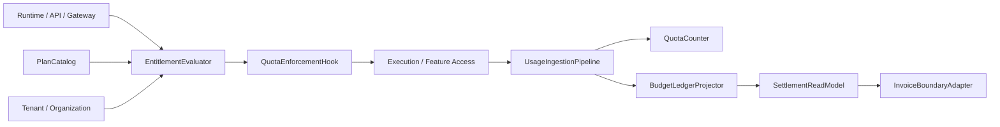
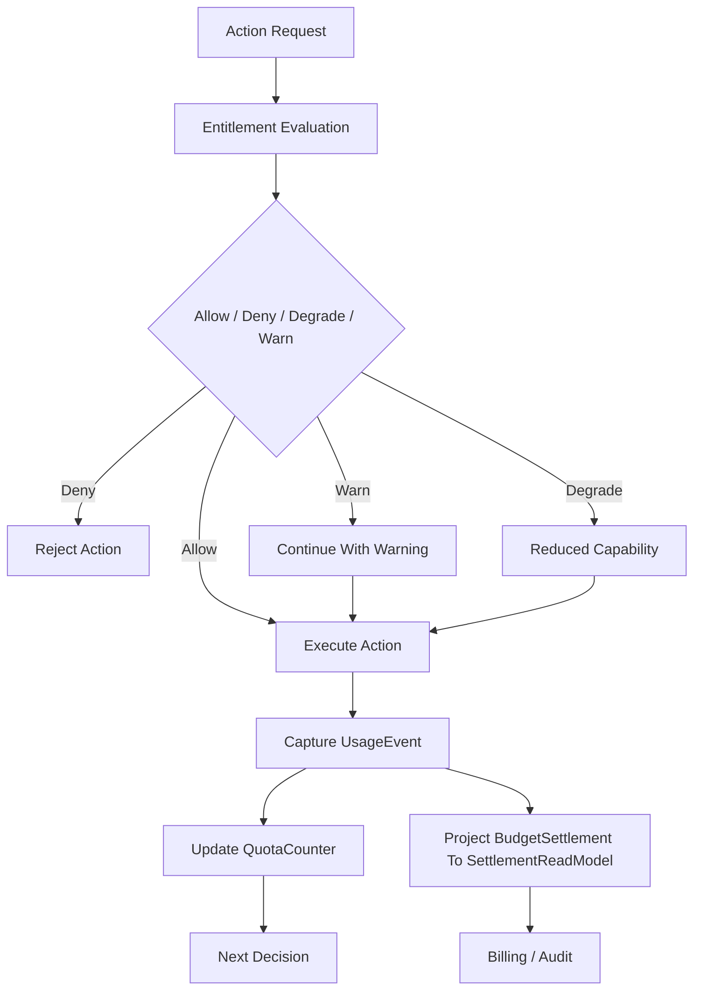
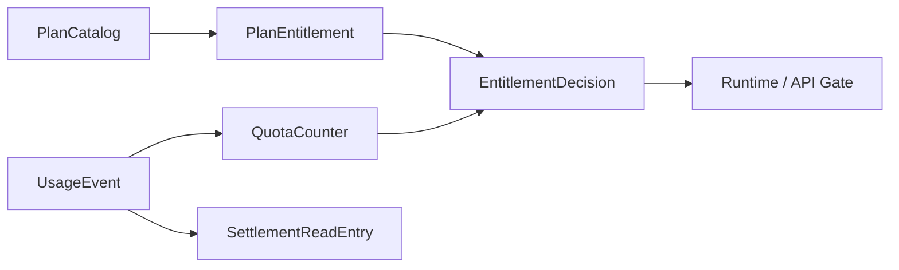

# Monetization Metering Plane Contract

---

## OAPEFLIR 关联

本 contract 参vs OAPEFLIR 八阶段循环中的以下阶段：

- **Observe**：信号采集vs聚合
- **Assess**：执lines前评估vs风险判断
- **Plan**：任务分解vs DAG 构建
- **Execute**：步骤执linesvs容错
- **Feedback**：信号收集vs预handle
- **Learn**：模式检测vs知识提取
- **Improve**：改进候选评估vs rollout
- **Release**：受控发布vs回滚

---

## 1. 范围

本 contract defines最终平台的商业化计量平面，includes usage metering、quota enforcement、entitlement evaluation、budget truth、settlement read model 和 plan catalog。

它扩展 `billing_and_tenant_contract.md` vs `cost_and_budget_contract.md`，used for回答“平台如何把uses量、permission、配额和账单连成闭环”。

## 2. 目标

- 把计量和配额从静态字段提升为正式平台能力。
- 让 runtime、API、workspace permission都能消费 entitlement Decision。
- 为 Pro vs Enterprise 的收费模型建立统一budgetvs结算基础。
- 让 usage、quota、billing vs tenant / organization 模型可对接。

## 3. 非目标

- 本 contract 不规定支付渠道或税务产品选型。
- 本 contract 不defines市场价格策略本身。
- 本 contract 不替代单iterations execution 的budget守卫defines。

## 4. 核心组件

- `UsageIngestionPipeline`
- `EntitlementEvaluator`
- `QuotaEnforcementHook`
- `BudgetLedgerProjector`
- `SettlementReadModel`
- `PlanCatalog`
- `InvoiceBoundaryAdapter`

## 5. 核心对象

- `UsageEvent`
- `EntitlementDecision`
- `QuotaCounter`
- `SettlementReadEntry`
- `PlanEntitlement`
- `BillingPeriod`

Description：

- `BudgetLedger / BudgetReservation / BudgetSettlement` is runtime truth，冻结defines见 `budget-ledger-contract.md`。
- `SettlementReadModel / SettlementReadEntry` is面向发票、对账和商业报table的派生读模型，不得反向充当budget truth。

## 6. `UsageEvent` 最小字段

| 字段 | class型 | Description |
|---|-------|--------|
| `usage_id` | `string` | uses事件 ID |
| `subject_id` | `string` | 产生uses量的主体 |
| `workspace_id?` | `string` | 关联 workspace |
| `tenant_id?` | `string` | 关联 tenant |
| `harness_run_id?` | `string` | 关联运lines主链 truth |
| `node_run_id?` | `string` | 关联节点运lines truth |
| `task_id?` | `string` | 关联任务投影 |
| `execution_id?` | `string` | legacy 执lines投影或迁移输入 |
| `metric_type` | `string` | 指标class型 |
| `quantity` | `number` | count |
| `source` | `runtime \| api \| gateway \| admin \| tool \| model \| side_effect` | 来源 |
| `cost_source` | `provider_invoice \| internal_compute \| human_review \| storage \| egress` | 成本归因来源 |
| `captured_at` | `timestamp` | 采集time |

规则：

- `harness_run_id / node_run_id` is v4.3 runtime truth 对齐字段；`task_id / execution_id` 只允许作为投影、legacy 查询键或迁移输入保留。
- `source` table示uses量来自哪class入口或执lines源；`cost_source` table示成本最终由哪class结算依据驱动，二者不可混用。

## 7. `PlanEntitlement` 最小字段

- `plan_id`
- `feature_key`
- `limit_type` (`hard | soft | burst`)
- `limit_value`
- `reset_policy`
- `applies_to`

示例：

- 月 token upper limit
- concurrent execution upper limit
- 可用 workspace 数
- 可enabled Observe source 数

## 8. `EntitlementDecision` 最小字段

- `decision_id`
- `subject_ref`
- `feature_key`
- `allowed`
- `decision_type` (`allow | deny | degrade | warn`)
- `reason?`
- `resolved_at`

规则：

- entitlement 判断必须能在 runtime 执lines前做出。
- `degrade` used for能力降级，而不is完全拒绝。
- `warn` 只能used for不Impactsecurity和账务正确性的软threshold场景。

## 9. `QuotaCounter`、`BudgetLedger` vs `SettlementReadEntry`

`QuotaCounter` 最小字段：

- `counter_id`
- `subject_ref`
- `metric_type`
- `window_start`
- `window_end`
- `used_quantity`
- `limit_quantity`
- `updated_at`

`BudgetLedger` / `BudgetReservation` / `BudgetSettlement`：

- truth contract directly复用 `budget-ledger-contract.md`
- 本文不再repeatsdefines另一套vs其平lines的 ledger truth DTO

`SettlementReadEntry` 最小字段：

- `entry_id`
- `account_ref`
- `period_id`
- `entry_type`
- `amount`
- `currency`
- `source_refs`
- `recorded_at`

规则：

- quota counter 服务实时限制。
- `BudgetLedger` 负责执lines前budget truth vs结算事实，不得relies on临时内存累计结果。
- `SettlementReadEntry` 服务账务展示、发票边界和对账报table。
- usage event、quota counter、budget settlement、settlement read entry 之间必须可对账，不能只relies on最终聚合结果。

## 10. 计量粒度

Phase 3 起至少supported：

- token / model usage
- execution time
- tool call count
- artifact storage bytes
- active workspace count
- premium feature activation count

## 11. 典型判断路径

1. user或系统发起动作。
2. runtime / API 先request `EntitlementEvaluator`。
3. evaluator 读取 plan entitlement、quota counter、tenant/org 归属。
4. 返回 `allow / deny / degrade / warn`。
5. 动作执lines后由 `UsageIngestionPipeline` 回写 usage event。
6. cycle性或准实时聚合进入 quota、budget settlement vs settlement read model。

### 11.1 商业化闭环流程图

### 11.2 计量对象关系图

## 12. Quota Enforcement 规则

- quota exceeds限时必须有统一 `deny / degrade / warn` 语义。
- 高成本或高风险能力优先采用 hard deny。
- 体验class能力可采用 degrade，例如降低concurrent或delay执lines。
- quota 判断结果应可追溯到 plan entitlement 和当前 counter。
- entitlement Decision不得只relies on过期cache；若 authoritative counter 不可用，应优先 fail-closed 或保守 degrade。
- commercial metering 不得bypassing `BudgetLedger / BudgetReservation / BudgetSettlement` truth directly写 invoice ledger 字段。

## 13. Tenant / Organization 关系

- workspace 级套餐可映射到 org / tenant 级账务主体。
- enterprise 结算应supported organization 级汇总。
- usage event 必须可归集到 workspace、tenant 或 organization。

## 14. vs现有文档的关系

- `billing_and_tenant_contract.md` is主体模型基线。
- `cost_and_budget_contract.md` is单iterations执linesbudget基线。
- `budget-ledger-contract.md` 冻结 `BudgetLedger / BudgetReservation / BudgetSettlement` 作为 runtime truth。
- `tenant_and_organization_contract.md` defines归属边界。
- 本 contract defines产品收费、配额、budget truth 派生结算读模型的完整平台层。

## 15. Failure Mode

需要重点防范：

- 动作执linessuccess但 usage 未回写。
- settlement read model delay或回放failed导致账务展示inconsistent。
- quota counter 落后导致透支执lines。
- organization 汇总时 tenant 归属错误。

handleprinciple：

- 高成本动作宁可保守 deny，也不应no计量执lines。
- usage pipeline、budget settlement projector vs settlement read model pipeline 必须有补偿路径。
- entitlement Decision优先uses authoritative counter，而不iscache猜测值。
- 若动作已执lines但 usage 未回写，系统必须能via对账任务补账，而不is默默丢失计量。

## 16. 分阶段references入

- Phase 3: Pro usage metering + entitlement + quota enforcement。
- Phase 4: enterprise ledger、组织结算、审计vs发票边界。

## 17. 收口Conclusion

Monetization plane 的核心不is“事后计费”，而is让 runtime、permission、配额、budget truth vs结算读模型在执lines前后形成闭环。

后续任何收费能力，只要不能接入 usage、entitlement 和 `BudgetLedger / BudgetReservation / BudgetSettlement` 三条链，就不应被视为正式商业化能力。

## v4.3 Architecture Remediation

以下条目修复 `platform-architecture-implementation-consistency-audit.md` 中record的 contract 偏差。本文档历史段落如vs本节conflicts，以本节、`docs_zh/architecture/00-platform-architecture.md`、ADR-109 至 ADR-113、以及 `src/platform/contracts/executable-contracts/` 为准。

- T-35: 本文原先把 `BillingLedger / LedgerEntry` 写成商业化计量平面的核心对象，Root cause: 旧版文案把发票/报table读模型和执lines前budget truth 混成同一层，未在 v4.3 references入 `BudgetLedger / BudgetReservation / BudgetSettlement` 后synchronous重构。修复：正文现明确budget truth 复用 `budget-ledger-contract.md`，`SettlementReadModel / SettlementReadEntry` 只保留为派生账务读模型。
- T-55: 本文原先的 `UsageEvent.source` 仍停留在 `runtime / api / gateway / admin` 四class入口枚举，Root cause: 该段落accesses along用了早期 API 入口视角，没有随着工具执lines、模型call和副作用结算接入统一成本归因模型一起扩展。修复：正文现补齐 `tool / model / side_effect` 来源，并新增独立 `cost_source` 枚举承接 `provider_invoice / internal_compute / human_review / storage / egress`。

mandatory规则：Status迁移必须via `RuntimeStateMachine.transition(command)`；执lines计划必须uses `PlanGraphBundle`；执lines结果必须uses `NodeAttemptReceipt`；truth event 只能uses `platform.*`；OAPEFLIR 只能作为 `oapeflir.view.*` / rationale 投影；budget必须uses `BudgetLedger` / `BudgetReservation` / `BudgetSettlement`。
