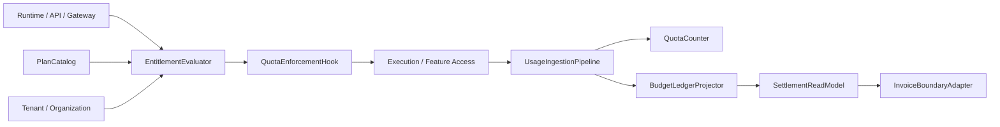
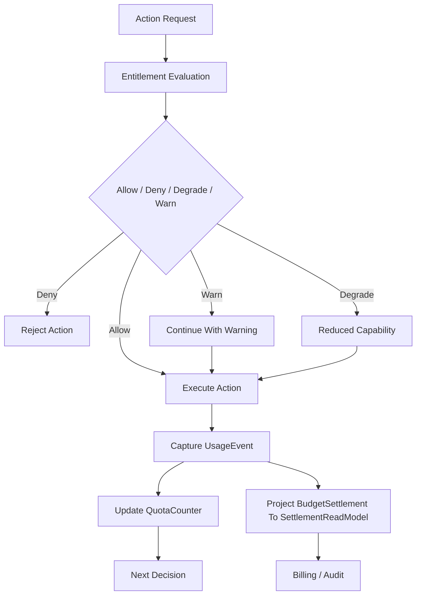
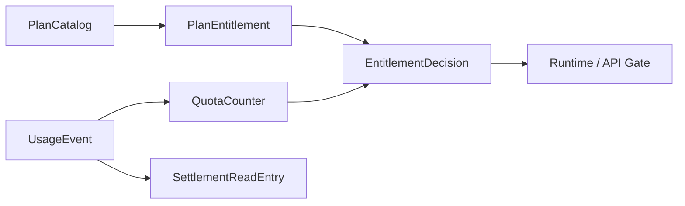

# Monetization Metering Plane Contract

---

## OAPEFLIR Association

This contract participates in the following stages of the OAPEFLIR eight-stage cycle:

- **Observe**: Signal collection and aggregation
- **Assess**: Pre-execution assessment and risk judgment
- **Plan**: Task decomposition and DAG construction
- **Execute**: Step execution and fault tolerance
- **Feedback**: Signal collection and preprocessing
- **Learn**: Pattern detection and knowledge extraction
- **Improve**: Improvement candidate evaluation and rollout
- **Release**: Controlled release and rollback

---

## 1. Scope

This contract defines the commercial metering plane of the ultimate platform, including usage metering, quota enforcement, entitlement evaluation, budget truth, settlement read model, and plan catalog.

It extends `billing_and_tenant_contract.md` and `cost_and_budget_contract.md` to answer "how the platform connects usage, permissions, quotas, and billing into a closed loop".

## 2. Objectives

- Elevate metering and quotas from static fields to formal platform capabilities.
- Enable runtime, API, and workspace permissions to all consume entitlement decisions.
- Establish unified budget and settlement foundation for Pro and Enterprise billing models.
- Enable usage, quota, billing, and tenant / organization models to interface with each other.

## 3. Non-Objectives

- This contract does not specify payment channel or tax product selection.
- This contract does not define market pricing strategy itself.
- This contract does not replace per-execution budget guard definitions.

## 4. Core Components

- `UsageIngestionPipeline`
- `EntitlementEvaluator`
- `QuotaEnforcementHook`
- `BudgetLedgerProjector`
- `SettlementReadModel`
- `PlanCatalog`
- `InvoiceBoundaryAdapter`

## 5. Core Objects

- `UsageEvent`
- `EntitlementDecision`
- `QuotaCounter`
- `SettlementReadEntry`
- `PlanEntitlement`
- `BillingPeriod`

Note:

- `BudgetLedger / BudgetReservation / BudgetSettlement` are runtime truth; frozen definitions are in `budget-ledger-contract.md`.
- `SettlementReadModel / SettlementReadEntry` are derived read models for invoicing, reconciliation, and commercial reporting, and must not be used in reverse as budget truth.

## 6. `UsageEvent` Minimum Fields

| Field | Type | Description |
| --- | --- | --- |
| `usage_id` | `string` | Usage event ID |
| `subject_id` | `string` | Subject generating usage |
| `workspace_id?` | `string` | Associated workspace |
| `tenant_id?` | `string` | Associated tenant |
| `harness_run_id?` | `string` | Associated harness run primary chain truth |
| `node_run_id?` | `string` | Associated node run truth |
| `task_id?` | `string` | Associated task projection |
| `execution_id?` | `string` | Legacy execution projection or migration input |
| `metric_type` | `string` | Metric type |
| `quantity` | `number` | Quantity |
| `source` | `runtime \| api \| gateway \| admin \| tool \| model \| side_effect` | Source |
| `cost_source` | `provider_invoice \| internal_compute \| human_review \| storage \| egress` | Cost attribution source |
| `captured_at` | `timestamp` | Capture timestamp |

Rules:

- `harness_run_id / node_run_id` are v4.3 runtime truth alignment fields; `task_id / execution_id` are only permitted as projections, legacy query keys, or migration input retention.
- `source` indicates which category of entry point or execution source the usage comes from; `cost_source` indicates which settlement basis the cost is ultimately driven by. The two must not be conflated.

## 7. `PlanEntitlement` Minimum Fields

- `plan_id`
- `feature_key`
- `limit_type` (`hard | soft | burst`)
- `limit_value`
- `reset_policy`
- `applies_to`

Examples:

- Monthly token limit
- Concurrent execution limit
- Number of available workspaces
- Number of enabled Observe sources

## 8. `EntitlementDecision` Minimum Fields

- `decision_id`
- `subject_ref`
- `feature_key`
- `allowed`
- `decision_type` (`allow | deny | degrade | warn`)
- `reason?`
- `resolved_at`

Rules:

- Entitlement decisions must be made before runtime execution.
- `degrade` is used for capability degradation, not complete denial.
- `warn` may only be used in soft threshold scenarios that do not affect safety or billing correctness.

## 9. `QuotaCounter`, `BudgetLedger`, and `SettlementReadEntry`

`QuotaCounter` minimum fields:

- `counter_id`
- `subject_ref`
- `metric_type`
- `window_start`
- `window_end`
- `used_quantity`
- `limit_quantity`
- `updated_at`

`BudgetLedger` / `BudgetReservation` / `BudgetSettlement`:

- Truth contract directly reuses `budget-ledger-contract.md`
- This document does not redefine another parallel set of ledger truth DTOs

`SettlementReadEntry` minimum fields:

- `entry_id`
- `account_ref`
- `period_id`
- `entry_type`
- `amount`
- `currency`
- `source_refs`
- `recorded_at`

Rules:

- Quota counter serves real-time limiting.
- `BudgetLedger` is responsible for pre-execution budget truth and settlement facts and must not rely on temporary in-memory cumulative results.
- `SettlementReadEntry` serves billing display, invoice boundaries, and reconciliation reports.
- Usage events, quota counters, budget settlements, and settlement read entries must be reconcilable with each other and must not rely solely on final aggregated results.

## 10. Metering Granularity

From Phase 3, support at minimum:

- token / model usage
- execution time
- tool call count
- artifact storage bytes
- active workspace count
- premium feature activation count

## 11. Typical Decision Path

1. User or system initiates an action.
2. Runtime / API first requests `EntitlementEvaluator`.
3. Evaluator reads plan entitlement, quota counter, tenant/org ownership.
4. Returns `allow / deny / degrade / warn`.
5. After action execution, `UsageIngestionPipeline` writes back the usage event.
6. Periodic or near-real-time aggregation enters quota, budget settlement, and settlement read model.

### 11.1 Commercial Closed-Loop Flowchart

### 11.2 Metering Object Relationship Diagram

## 12. Quota Enforcement Rules

- Quota overruns must have unified `deny / degrade / warn` semantics.
- High-cost or high-risk capabilities prioritize hard deny.
- Experience-type capabilities may use degrade, such as reducing concurrency or deferred execution.
- Quota decision results should be traceable to plan entitlement and current counter.
- Entitlement decisions must not rely solely on stale cache; if the authoritative counter is unavailable, prefer fail-closed or conservative degrade.
- Commercial metering must not bypass `BudgetLedger / BudgetReservation / BudgetSettlement` truth by directly writing invoice ledger fields.

## 13. Tenant / Organization Relationship

- Workspace-level plans may map to org / tenant-level billing subjects.
- Enterprise settlements should support organization-level aggregation.
- Usage events must be attributable to workspace, tenant, or organization.

## 14. Relationship with Existing Documents

- `billing_and_tenant_contract.md` is the primary model baseline.
- `cost_and_budget_contract.md` is the per-execution budget baseline.
- `budget-ledger-contract.md` freezes `BudgetLedger / BudgetReservation / BudgetSettlement` as runtime truth.
- `tenant_and_organization_contract.md` defines ownership boundaries.
- This contract defines the complete platform layer for product billing, quotas, budget truth derived settlement read models.

## 15. Failure Mode

Key scenarios to prevent:

- Action executed successfully but usage not written back.
- Settlement read model latency or replay failure causing billing display inconsistency.
- Quota counter lag leading to overdraw execution.
- Incorrect tenant ownership during organization aggregation.

Handling principles:

- For high-cost actions, prefer conservative deny over unmeasured execution.
- Usage pipeline, budget settlement projector, and settlement read model pipeline must have compensation paths.
- Entitlement decisions prioritize using authoritative counters rather than cached guesses.
- If an action has been executed but usage not written back, the system must be able to backfill usage through reconciliation tasks rather than silently losing metering.

## 16. Phased Introduction

- Phase 3: Pro usage metering + entitlement + quota enforcement.
- Phase 4: Enterprise ledger, organizational settlement, audit, and invoice boundaries.

## 17. Conclusion

The core of the monetization plane is not "post-hoc billing" but closing the loop between runtime, permissions, quotas, budget truth, and settlement read models before and after execution.

Any subsequent billing capability that cannot plug into usage, entitlement, and `BudgetLedger / BudgetReservation / BudgetSettlement` three chains should not be considered a formal commercial capability.

## v4.3 Architecture Remediation

The following entries fix contract deviations recorded in `platform-architecture-implementation-consistency-audit.md`. If this document's historical sections conflict with this section, this section, `docs_zh/architecture/00-platform-architecture.md`, ADR-109 through ADR-113, and `src/platform/contracts/executable-contracts/` take precedence.

- T-35: This document previously wrote `BillingLedger / LedgerEntry` as core objects of the commercial metering plane. The root cause was that old copy conflated invoice/report read models with pre-execution budget truth in the same layer, and after v4.3 introduced `BudgetLedger / BudgetReservation / BudgetSettlement`, the refactoring was not synchronized. Fix: The main text now explicitly states that budget truth reuses `budget-ledger-contract.md`, and `SettlementReadModel / SettlementReadEntry` are retained only as derived billing read models.
- T-55: This document's original `UsageEvent.source` remained at the four-type enumeration—`runtime / api / gateway / admin`—from the early API entry perspective. The root cause was that section followed the early API entry point viewpoint and did not expand along with the unified cost attribution model that incorporated tool execution, model calls, and side effect settlement. Fix: The main text now supplements `tool / model / side_effect` sources and adds a separate `cost_source` enumeration covering `provider_invoice / internal_compute / human_review / storage / egress`.

Mandatory rules: State transitions must go through `RuntimeStateMachine.transition(command)`; execution plans must use `PlanGraphBundle`; execution results must use `NodeAttemptReceipt`; truth events must only use `platform.*`; OAPEFLIR must only appear as `oapeflir.view.*` / rationale projections; budgets must use `BudgetLedger` / `BudgetReservation` / `BudgetSettlement`.