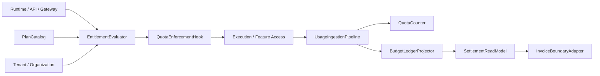
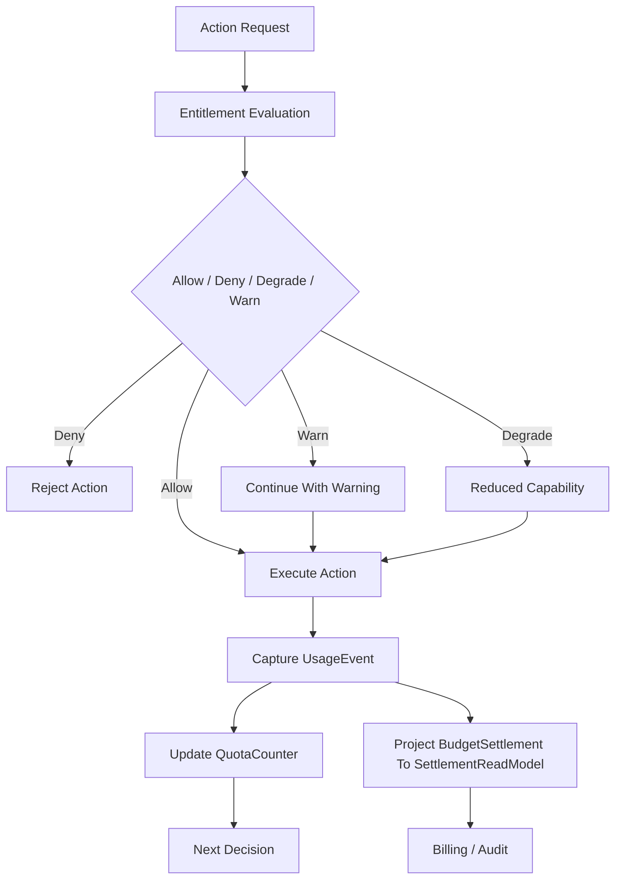
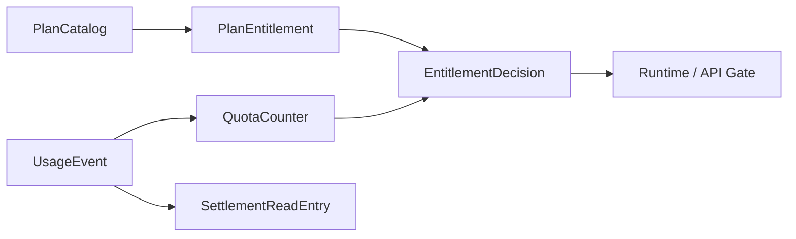

# Monetization Metering Plane Contract

---

## OAPEFLIR Association

This contract participates in the following stages of the OAPEFLIR eight-stage cognitive loop:

- **Observe**: Signal collection and aggregation
- **Assess**: Pre-execution assessment and risk judgment
- **Plan**: Task decomposition and DAG construction
- **Execute**: Step execution and fault tolerance
- **Feedback**: Signal collection and preprocessing
- **Learn**: Pattern detection and knowledge extraction
- **Improve**: Improvement candidate evaluation and rollout
- **Release**: Controlled release and rollback

---

## 1. Scope

This contract defines the commercial metering plane of the end platform, including usage metering, quota enforcement, entitlement evaluation, budget truth, settlement read model, and plan catalog.

It extends `billing_and_tenant_contract.md` and `cost_and_budget_contract.md` to answer "how the platform connects usage, permissions, quotas, and billing into a closed loop".

## 2. Objectives

- Elevate metering and quotas from static fields to formal platform capabilities.
- Enable runtime, API, and workspace permissions to all consume entitlement decisions.
- Establish a unified budget and settlement foundation for Pro and Enterprise pricing models.
- Enable usage, quota, billing, and tenant/organization models to interconnect.

## 3. Non-Objectives

- This contract does not specify payment channel or tax product selection.
- This contract does not define market pricing strategy itself.
- This contract does not replace per-execution budget guard definitions.

## 4. Core Components

- `UsageIngestionPipeline`
- `EntitlementEvaluator`
- `QuotaEnforcementHook`
- `BudgetLedgerProjector`
- `SettlementReadModel`
- `PlanCatalog`
- `InvoiceBoundaryAdapter`

## 5. Canonical Objects

- `UsageEvent`
- `EntitlementDecision`
- `QuotaCounter`
- `SettlementReadEntry`
- `PlanEntitlement`
- `BillingPeriod`

Note:

- `BudgetLedger / BudgetReservation / BudgetSettlement` are runtime truth; frozen definitions are in `budget-ledger-contract.md`.
- `SettlementReadModel / SettlementReadEntry` are derived read models for invoicing, reconciliation, and commercial reporting, and must not reversely serve as budget truth.

## 6. `UsageEvent` Minimum Fields

| Field | Type | Description |
| --- | --- | --- |
| `usage_id` | `string` | Usage event ID |
| `subject_id` | `string` | Subject that generated the usage |
| `workspace_id?` | `string` | Associated workspace |
| `tenant_id?` | `string` | Associated tenant |
| `harness_run_id?` | `string` | Associated run primary chain truth |
| `node_run_id?` | `string` | Associated node run truth |
| `task_id?` | `string` | Associated task projection |
| `execution_id?` | `string` | Legacy execution projection or migration input |
| `metric_type` | `string` | Metric type |
| `quantity` | `number` | Quantity |
| `source` | `runtime \| api \| gateway \| admin \| tool \| model \| side_effect` | Source |
| `cost_source` | `provider_invoice \| internal_compute \| human_review \| storage \| egress` | Cost attribution source |
| `captured_at` | `timestamp` | Capture time |

Rules:

- `harness_run_id / node_run_id` are v4.3 runtime truth alignment fields; `task_id / execution_id` are only allowed as projections, legacy query keys, or migration input retention.
- `source` indicates which type of entry point or execution source the usage came from; `cost_source` indicates which type of settlement basis ultimately drives the cost. The two must not be mixed.

## 7. `PlanEntitlement` Minimum Fields

- `plan_id`
- `feature_key`
- `limit_type` (`hard | soft | burst`)
- `limit_value`
- `reset_policy`
- `applies_to`

Examples:

- Monthly token limit
- Concurrent execution limit
- Number of available workspaces
- Number of enabled Observe sources

## 8. `EntitlementDecision` Minimum Fields

- `decision_id`
- `subject_ref`
- `feature_key`
- `allowed`
- `decision_type` (`allow | deny | degrade | warn`)
- `reason?`
- `resolved_at`

Rules:

- Entitlement judgment must be makeable before runtime execution.
- `degrade` is used for capability degradation, not complete denial.
- `warn` may only be used in soft threshold scenarios that do not affect security and billing correctness.

## 9. `QuotaCounter`, `BudgetLedger`, and `SettlementReadEntry`

`QuotaCounter` minimum fields:

- `counter_id`
- `subject_ref`
- `metric_type`
- `window_start`
- `window_end`
- `used_quantity`
- `limit_quantity`
- `updated_at`

`BudgetLedger` / `BudgetReservation` / `BudgetSettlement`:

- Truth contract directly reuses `budget-ledger-contract.md`
- This document does not redefine another parallel ledger truth DTO

`SettlementReadEntry` minimum fields:

- `entry_id`
- `account_ref`
- `period_id`
- `entry_type`
- `amount`
- `currency`
- `source_refs`
- `recorded_at`

Rules:

- Quota counter serves real-time limits.
- `BudgetLedger` is responsible for pre-execution budget truth and settlement facts and must not rely on temporary in-memory cumulative results.
- `SettlementReadEntry` serves billing display, invoice boundaries, and reconciliation reports.
- Usage events, quota counters, budget settlements, and settlement read entries must be reconcilable against each other and must not rely solely on final aggregated results.

## 10. Metering Granularity

Starting from Phase 3, at minimum support:

- token / model usage
- execution time
- tool call count
- artifact storage bytes
- active workspace count
- premium feature activation count

## 11. Typical Decision Path

1. User or system initiates an action.
2. Runtime / API first requests `EntitlementEvaluator`.
3. Evaluator reads plan entitlement, quota counter, tenant/org affiliation.
4. Returns `allow / deny / degrade / warn`.
5. After action execution, `UsageIngestionPipeline` writes back usage event.
6. Periodic or near-real-time aggregation enters quota, budget settlement, and settlement read model.

### 11.1 Commercial Closed Loop Flowchart

### 11.2 Metering Object Relationship Diagram

## 12. Quota Enforcement Rules

- When quota is exceeded, there must be unified `deny / degrade / warn` semantics.
- High-cost or high-risk capabilities prioritize hard deny.
- Experience-oriented capabilities may use degrade, such as reducing concurrency or delaying execution.
- Quota judgment results should be traceable to plan entitlement and current counter.
- Entitlement decisions must not rely solely on stale cache; if the authoritative counter is unavailable, should prioritize fail-closed or conservative degrade.
- Commercial metering must not bypass `BudgetLedger / BudgetReservation / BudgetSettlement` truth to directly write invoice ledger fields.

## 13. Tenant / Organization Relationship

- Workspace-level plans can map to org / tenant-level billing subjects.
- Enterprise settlement should support organization-level aggregation.
- Usage events must be attributable to workspace, tenant, or organization.

## 14. Relationship with Existing Documents

- `billing_and_tenant_contract.md` is the main model baseline.
- `cost_and_budget_contract.md` is the per-execution budget baseline.
- `budget-ledger-contract.md` freezes `BudgetLedger / BudgetReservation / BudgetSettlement` as runtime truth.
- `tenant_and_organization_contract.md` defines attribution boundaries.
- This contract defines the complete platform layer for product billing, quotas, budget truth derived settlement read models.

## 15. Failure Mode

Key risks to prevent:

- Action executed successfully but usage not written back.
- Settlement read model delay or replay failure causing billing display inconsistency.
- Quota counter lag causing overdraw execution.
- Tenant attribution errors during organization aggregation.

Handling principles:

- High-cost actions should conservatively deny rather than execute without metering.
- Usage pipeline, budget settlement projector, and settlement read model pipeline must have compensation paths.
- Entitlement decisions prioritize authoritative counters rather than cached guess values.
- If action has been executed but usage not written back, system must be able to reconcile through reconciliation tasks rather than silently losing metering.

## 16. Phased Introduction

- Phase 3: Pro usage metering + entitlement + quota enforcement.
- Phase 4: Enterprise ledger, organization settlement, audit, and invoice boundaries.

## 17. Closure Conclusion

The core of the monetization plane is not "post-hoc billing" but forming a closed loop between runtime, permissions, quotas, budget truth, and settlement read models before and after execution.

Any future billing capability that cannot connect to usage, entitlement, and `BudgetLedger / BudgetReservation / BudgetSettlement` three chains should not be considered a formal commercial capability.

## v4.3 Architecture Remediation

The following entries fix contract deviations recorded in `platform-architecture-implementation-consistency-audit.md`. If historical sections of this document conflict with this section, this section, `docs_zh/architecture/00-platform-architecture.md`, ADR-109 through ADR-113, and `src/platform/contracts/executable-contracts/` shall prevail.

- T-35: This document originally wrote `BillingLedger / LedgerEntry` as core objects of the commercial metering plane. Root cause: old copy mixed invoice/report read models and pre-execution budget truth into the same layer, and did not refactor synchronously after introducing `BudgetLedger / BudgetReservation / BudgetSettlement` in v4.3. Fix: The main text now explicitly states that budget truth reuses `budget-ledger-contract.md`, and `SettlementReadModel / SettlementReadEntry` are retained only as derived billing read models.
- T-55: This document's original `UsageEvent.source` remained at four entry point enumerations: `runtime / api / gateway / admin`. Root cause: that section followed the early API entry point perspective and did not expand with tool execution, model calls, and side effect settlement accessing the unified cost attribution model. Fix: The main text now supplements `tool / model / side_effect` sources and adds a separate `cost_source` enumeration to carry `provider_invoice / internal_compute / human_review / storage / egress`.

Mandatory rules: State transitions must go through `RuntimeStateMachine.transition(command)`; execution plans must use `PlanGraphBundle`; execution results must use `NodeAttemptReceipt`; truth events must only use `platform.*`; OAPEFLIR may only be used as `oapeflir.view.*` / rationale projection; budgets must use `BudgetLedger` / `BudgetReservation` / `BudgetSettlement`.