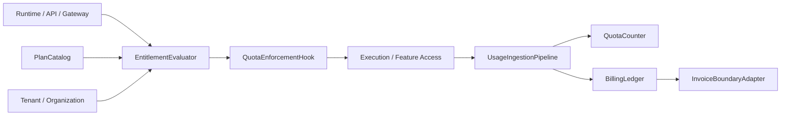
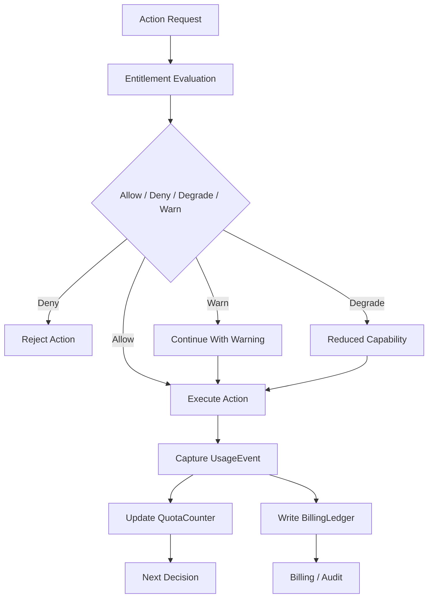
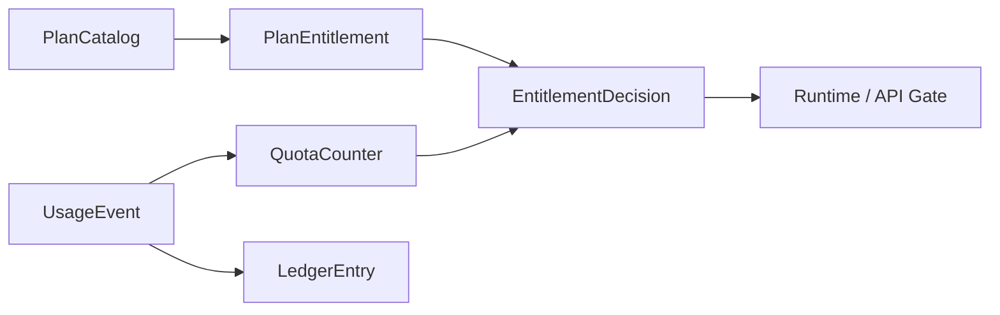

# Monetization Metering Plane Contract

---

## OAPEFLIR Association

This contract participates in the following stages of the OAPEFLIR eight-stage cognitive loop:

- **Observe**: Signal collection and aggregation
- **Assess**: Pre-execution assessment and risk judgment
- **Plan**: Task decomposition and DAG construction
- **Execute**: Step execution and fault tolerance
- **Feedback**: Signal collection and preprocessing
- **Learn**: Pattern detection and knowledge extraction
- **Improve**: Improvement candidate evaluation and rollout
- **Release**: Controlled release and rollback

---

## 1. Scope

This contract defines the commercial metering plane for the final platform, including usage metering, quota enforcement, entitlement evaluation, billing ledger, and plan catalog.

It extends `billing_and_tenant_contract.md` and `cost_and_budget_contract.md` to answer "how the platform connects usage, permissions, quotas, and billing into a closed loop".

## 2. Goals

- Promote metering and quota from static fields to formal platform capabilities.
- Enable runtime, API, and workspace permissions to consume entitlement decisions.
- Establish a unified billing foundation for Pro and Enterprise pricing models.
- Enable usage, quota, billing, and tenant / organization models to connect.

## 3. Non-Goals

- This contract does not specify payment channel or tax product selection.
- This contract does not define market pricing strategies themselves.
- This contract does not replace per-execution budget guard definitions.

## 4. Core Components

- `UsageIngestionPipeline`
- `EntitlementEvaluator`
- `QuotaEnforcementHook`
- `BillingLedger`
- `PlanCatalog`
- `InvoiceBoundaryAdapter`

## 5. Core Objects

- `UsageEvent`
- `EntitlementDecision`
- `QuotaCounter`
- `LedgerEntry`
- `PlanEntitlement`
- `BillingPeriod`

## 6. `UsageEvent` Minimum Fields

| Field | Type | Description |
| --- | --- | --- |
| `usage_id` | `string` | Usage event ID |
| `subject_id` | `string` | Subject generating usage |
| `workspace_id?` | `string` | Associated workspace |
| `tenant_id?` | `string` | Associated tenant |
| `task_id?` | `string` | Associated task |
| `execution_id?` | `string` | Associated execution |
| `metric_type` | `string` | Metric type |
| `quantity` | `number` | Quantity |
| `source` | `runtime \| api \| gateway \| admin` | Source |
| `captured_at` | `timestamp` | Capture time |

## 7. `PlanEntitlement` Minimum Fields

- `plan_id`
- `feature_key`
- `limit_type` (`hard | soft | burst`)
- `limit_value`
- `reset_policy`
- `applies_to`

Examples:

- Monthly token limit
- Concurrent execution limit
- Available workspace count
- Number of observable sources that can be enabled

## 8. `EntitlementDecision` Minimum Fields

- `decision_id`
- `subject_ref`
- `feature_key`
- `allowed`
- `decision_type` (`allow | deny | degrade | warn`)
- `reason?`
- `resolved_at`

Rules:

- Entitlement decisions must be made before runtime execution.
- `degrade` is for capability degradation, not complete rejection.
- `warn` can only be used in soft threshold scenarios that do not affect safety and billing correctness.

## 9. `QuotaCounter` and `LedgerEntry`

`QuotaCounter` minimum fields:

- `counter_id`
- `subject_ref`
- `metric_type`
- `window_start`
- `window_end`
- `used_quantity`
- `limit_quantity`
- `updated_at`

`LedgerEntry` minimum fields:

- `entry_id`
- `account_ref`
- `period_id`
- `entry_type`
- `amount`
- `currency`
- `source_refs`
- `recorded_at`

Rules:

- Quota counter serves real-time limiting.
- Billing ledger serves accounting and auditing.
- Ledger must not rely on temporary in-memory accumulated results.
- Usage event, quota counter, and ledger entry must be reconcilable with each other; relying solely on final aggregation results is not acceptable.

## 10. Metering Granularity

Starting from Phase 3, at minimum support:

- token / model usage
- execution time
- tool call count
- artifact storage bytes
- active workspace count
- premium feature activation count

## 11. Typical Decision Path

1. User or system initiates an action.
2. Runtime / API first requests `EntitlementEvaluator`.
3. Evaluator reads plan entitlement, quota counter, tenant/org ownership.
4. Returns `allow / deny / degrade / warn`.
5. After action execution, `UsageIngestionPipeline` writes back usage event.
6. Periodic or near-real-time aggregation into quota and ledger.

### 11.1 Commercial Closed-Loop Flowchart

### 11.2 Metering Object Relationship Diagram

## 12. Quota Enforcement Rules

- Quota exceeding must have unified `deny / degrade / warn` semantics.
- High-cost or high-risk capabilities prioritize hard deny.
- Experience-oriented capabilities can use degrade, such as reducing concurrency or delaying execution.
- Quota decision results must be traceable to plan entitlement and current counter.
- Entitlement decisions must not rely solely on stale cache; if authoritative counter is unavailable, prioritize fail-closed or conservative degrade.

## 13. Tenant / Organization Relationship

- Workspace-level plans can map to org / tenant-level billing subjects.
- Enterprise settlement should support organization-level aggregation.
- Usage events must be aggregable to workspace, tenant, or organization.

## 14. Relationship with Existing Documents

- `billing_and_tenant_contract.md` is the main model baseline.
- `cost_and_budget_contract.md` is the per-execution budget baseline.
- `tenant_and_organization_contract.md` defines ownership boundaries.
- This contract defines the complete platform layer for product billing, quota, and accounting.

## 15. Failure Mode

Key scenarios to prevent:

- Action executed successfully but usage not written back.
- Ledger delay causes billing inconsistency.
- Quota counter lags causing overdraft execution.
- Tenant ownership error during organization aggregation.

Handling principles:

- High-cost actions should prefer conservative deny over executing without metering.
- Usage pipeline and ledger pipeline must have compensation paths.
- Entitlement decisions prioritize authoritative counter over cached speculative values.
- If action has been executed but usage not written back, the system must be able to reconcile through a reconciliation task, not silently lose metering.

## 16. Phased Introduction

- Phase 3: Pro usage metering + entitlement + quota enforcement.
- Phase 4: Enterprise ledger, organizational settlement, audit, and invoice boundaries.

## 17. Closure Conclusion

The core of the monetization plane is not "billing after the fact", but forming a closed loop between runtime, permissions, quota, and accounting before and after execution.

Any subsequent billing capability that cannot connect to usage, entitlement, and ledger three chains should not be considered a formal commercial capability.
