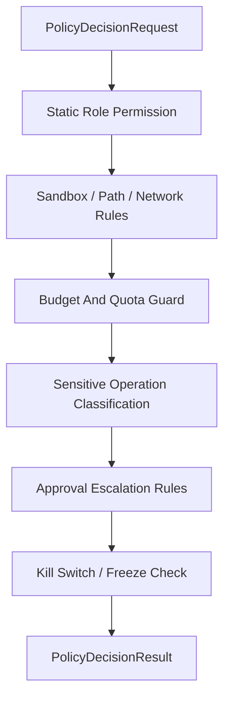

# Policy Engine Contract

## 1. Scope

This contract defines the unified Policy Engine entry point, used to aggregate role static permissions, execution policies, approval escalation, budget guard, sensitive operation classification, and kill switch.

Related documents:

- `approval_and_hitl_contract.md`
- `sandbox_and_auth_contract.md`
- `cost_and_budget_contract.md`
- `governance_control_plane_contract.md`
- `tool_skill_plugin_contract.md`

## 2. Goals

Unified Policy Engine at minimum solves:

- Different modules no longer separately do permission judgment.
- High-risk actions enter the same decision chain.
- Approval, budget, permissions, kill switch conclusions are combinable and auditable.

## 3. Key Objects

### 3.1 `PolicyDecisionRequest`

| Field | Type | Description |
| --- | --- | --- |
| `decision_id` | `string` | Decision request ID |
| `task_id` | `string` | Current task |
| `execution_id` | `string?` | Current execution |
| `session_id` | `string?` | Current session |
| `subject_type` | `user \| agent \| system` | Request subject |
| `subject_id` | `string` | Subject ID |
| `action` | `invoke_model \| invoke_tool \| write_file \| exec_command \| network_access \| install_extension \| org_change \| dispatch_execution \| set_isolation_level` | Target action |
| `resource_ref` | `string?` | Resource reference |
| `risk_category` | `destructive \| irreversible \| prod_affecting \| cost_sensitive \| org_changing \| sensitive_data` | Risk classification |
| `mode` | `supervised \| auto \| full-auto` | Current execution mode |
| `estimated_cost_usd` | `number?` | Estimated cost |
| `metadata_json` | `json?` | Additional context |

### 3.2 `PolicyDecisionResult`

- `decision`
- `reason_code`
- `requires_approval`
- `enforced_constraints`
- `kill_switch_applied`
- `audit_payload`
- `evaluated_policy_version`
- `decision_ttl_ms?`
- `matched_rule_refs?`
- `explain_summary?`

`decision` enumeration:

- `allow`
- `deny`
- `allow_with_constraints`
- `escalate_for_approval`

### 3.3 `PolicyDecisionExplain`

Minimum fields:

- `decision_id`
- `summary`
- `factors`
- `policy_paths`
- `trace_refs?`
- `rule_sources?`
- `remediation_hint?`

### 3.4 `PolicyAuditRecord`

Minimum fields:

- `audit_id`
- `decision_id`
- `policy_bundle_id`
- `policy_version`
- `input_snapshot_ref`
- `decision_snapshot_ref`
- `evaluated_at`
- `latency_ms`

## 4. Decision Chain

Rules:

- Any step explicitly `deny` should fail-closed.
- `allow_with_constraints` must explicitly return tightened path, tool, budget, or timeout constraints.
- Approval escalation must not override hard prohibition items; actions hard-rejected must not be passed through approval.
- After kill switch / freeze hits, approval cannot re-allow already frozen actions.
- Constraints of `allow_with_constraints` must be authoritative and subsequent execution must not arbitrarily relax.

## 5. Sensitive Operation Classification Table

| Classification | Examples | Default Action |
| --- | --- | --- |
| `destructive` | Delete files, overwrite critical config | Approval or deny |
| `irreversible` | External commit, publish, send irretrivable messages | Approval |
| `prod_affecting` | Commands affecting production environment | Approval or deny |
| `cost_sensitive` | High-cost long reasoning with large models | Budget check + possible approval |
| `org_changing` | Modify organization, role, tenant config | Approval |
| `sensitive_data` | Access keys, credentials, privacy data | Path/permission constraints + approval |

## 6. Boundary with Approval

- Policy Engine decides "whether approval is needed."
- Approval system is responsible for "how approval requests are sent and how results are returned."
- After approval passes, must again enter Policy Engine for final allow to avoid environment changes after approval.

## 7. Boundary with Tools, Skills, Plugins

- Skills must not bypass role tool whitelist.
- Plugin / MCP installation units must first pass Policy Engine and cannot directly bypass ToolRegistry.
- MCP must not impersonate locally trusted tools to gain wider permissions.
- Same action under different `resource_ref`, `path_scope`, `tenant scope` must be independently evaluated and must not incorrectly reuse old allow conclusion.

## 7A. Boundary with Dispatch and Isolation

Execution dispatch involves the following policy evaluation points and must go through Policy Engine:

| Evaluation Point | action | Description |
| --- | --- | --- |
| dispatch target selection | `dispatch_execution` | Determines which worker or worker group (local / named / capability-match) execution is dispatched to; resource_ref is target worker or capability description |
| isolation level elevation | `set_isolation_level` | When execution requires `containerized` or higher isolation level, policy checks whether that isolation level and associated resource consumption are allowed |
| remote worker capability authorization | `dispatch_execution` | Whether capabilities declared by remote worker are within `allowedCapabilities` whitelist, needs policy confirmation |

Rules:

- Dispatch decision must go through Policy Engine before ticket creation and must not independently determine target within dispatch service.
- Isolation level elevation may involve additional resource costs (container startup, image pull) and should be linked with `cost_sensitive` risk classification.
- Remote worker capability filtering results (rejected capability list) should be written to `PolicyAuditRecord`.
- `allow_with_constraints` can be used to tighten dispatch target scope (e.g., restrict to specific worker group) or lower isolation level.

## 8. Caching and Inherited Rejection

- Within the same session, consecutive similar high-risk requests can inherit recent rejection conclusion to avoid approval spam.
- Cache key must not be only command name, should include action, resource, subject, and risk classification.
- When hitting inherited rejection, audit record must still be retained.
- Cache hit must not cross `tenant / workspace / organization / mode` for reuse.

## 9. Rule Lint and Unreachable Rule Detection

Before enabling, Policy / permission rules at minimum should do:

- Duplicate rule detection
- Shadow rule detection
- Unreachable allow rule detection
- Source conflict detection

At minimum identify the following issues:

- tool-wide `deny` makes more specific `allow` never reachable
- tool-wide `ask` makes more specific `allow` never directly hit
- Shared source rules and local temporary rules masking each other results in final effect inconsistent with author expectation

Rules:

- Policy bundles failing lint must not enter authoritative allow path.
- If allowed to continue as warning, warning must be written to explain and audit result.
- Runtime judgment results should try to return which rule source won and remediation hint rather than just abstract `deny`.

## 10. Rule Evaluation Order

- Policy / permission rule matching order must be deterministic and explainable.
- If system supports wildcard, partial override, local temporary rules, and global rules coexisting, must clarify:
  - By explicit `priority`
  - Or by source order / last-match
  - Or other equivalent stable strategy
- Same request must not get different conclusions due to traversal order, concurrent loading order, or source aggregation order.
- Explain and audit results should be able to point out "which rule finally won and who it overrode."

## 11. Audit Requirements

Each policy decision at minimum retains:

- Who requested what
- Which policy nodes were triggered
- Why final allow, deny, or escalate
- What the tightened constraints are
- Which policy version / config version was used
- Which input / decision snapshot the audit snapshot references

## 12. Key Decision Boundaries

- Policy Engine is the final decision entry, not a suggestion collector.
- LLM, workflow planner, approval packet can only provide context or suggestions and must not construct authoritative allow.
- If Policy Engine conflicts with upstream suggestions, always prioritize Policy Engine.

## 13. Phase Boundaries

Phase 1a / 1b explicitly does:

- Single-process unified entry
- Role static permissions
- sandbox / path / network rules
- Budget guard
- Approval escalation
- kill switch / freeze check

Currently does not do:

- OPA integration
- External policy provider
- Multi-tenant distributed policy execution cluster

Supplementary note:

- Currently not writing OPA as fait accompli, but shape of `PolicyDecisionRequest / Result / Explain / AuditRecord` should try to remain connectable to external policy engine.
- If later introducing OPA or equivalent policy engine, should prioritize reusing input, explanation, and audit boundaries of this contract rather than creating another parallel model.

## 14. Closure Conclusion

The meaning of Policy Engine is not to create another layer of abstraction but to converge judgments scattered across permissions, budget, approval, and security into one unified, auditable, reusable decision chain.
