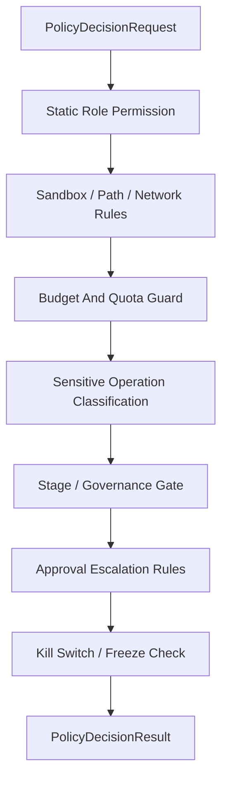

# Policy Engine Contract

## 1. Scope

This contract defines the unified Policy Engine entry point, used to aggregate role static permissions, execution policies, approval escalation, budget guards, sensitive operation classification, and kill switch.

Related documents:

- `approval_and_hitl_contract.md`
- `sandbox_and_auth_contract.md`
- `cost_and_budget_contract.md`
- `governance_control_plane_contract.md`
- `tool_skill_plugin_contract.md`

## 2. Goals

A unified Policy Engine must solve at minimum:

- Different modules no longer make permission judgments independently.
- High-risk actions enter the same decision chain.
- Conclusions from approval, budget, permissions, and kill switch can be composed and audited.

## 3. Key Objects

### 3.1 `PolicyDecisionRequest`

| Field | Type | Description |
| --- | --- | --- |
| `decision_id` | `string` | Decision request ID |
| `task_id` | `string` | Current task |
| `execution_id` | `string?` | Current execution |
| `session_id` | `string?` | Current session |
| `subject_type` | `user \| agent \| system` | Request subject |
| `subject_id` | `string` | Subject ID |
| `action` | `invoke_model \| invoke_tool \| write_file \| exec_command \| network_access \| install_extension \| org_change \| dispatch_execution \| set_isolation_level \| promote_improvement \| advance_rollout \| modify_knowledge_trust \| promote_memory_layer` | Target action |
| `resource_ref` | `string?` | Resource reference |
| `risk_category` | `destructive \| irreversible \| prod_affecting \| cost_sensitive \| org_changing \| sensitive_data \| strategy_affecting \| governance_sensitive` | Risk classification |
| `mode` | `supervised \| auto \| full-auto` | Current execution mode |
| `stage` | `observe \| assess \| plan \| execute \| feedback \| learn \| improve \| release?` | Current OAPEFLIR stage |
| `estimated_cost_usd` | `number?` | Estimated cost |
| `metadata_json` | `json?` | Additional context |

### 3.2 `PolicyDecisionResult`

- `decision`
- `reason_code`
- `requires_approval`
- `enforced_constraints`
- `kill_switch_applied`
- `audit_payload`
- `evaluated_policy_version`
- `decision_ttl_ms?`
- `matched_rule_refs?`
- `explain_summary?`

`decision` enum:

- `allow`
- `deny`
- `allow_with_constraints`
- `escalate_for_approval`

### 3.3 `PolicyDecisionExplain`

Minimum fields:

- `decision_id`
- `summary`
- `factors`
- `policy_paths`
- `trace_refs?`
- `rule_sources?`
- `remediation_hint?`

### 3.4 `PolicyAuditRecord`

Minimum fields:

- `audit_id`
- `decision_id`
- `policy_bundle_id`
- `policy_version`
- `input_snapshot_ref`
- `decision_snapshot_ref`
- `evaluated_at`
- `latency_ms`

## 4. Decision Chain

Rules:

- Any step explicitly `deny` should fail-closed.
- `allow_with_constraints` must explicitly return the tightened path, tools, budget, or timeout constraints.
- Approval escalation must not override hard denial items; hard-rejected actions cannot be approved through escalation.
- After kill switch / freeze is hit, approval cannot re-enable a frozen action.
- Constraints of `allow_with_constraints` must be authoritative; subsequent execution must not unilaterally relax them.

## 5. Sensitive Operation Classification Table

| Classification | Examples | Default Action |
| --- | --- | --- |
| `destructive` | Delete files, overwrite critical config | Approve or deny |
| `irreversible` | External commit, release, send non-retractable message | Approve |
| `prod_affecting` | Commands affecting production environment | Approve or deny |
| `cost_sensitive` | High-cost LLM long reasoning | Budget check + possible approval |
| `org_changing` | Modify organization, role, tenant config | Approve |
| `sensitive_data` | Access keys, credentials, private data | Path/permission constraint + approval |
| `strategy_affecting` | Accept improvement candidate, change strategy version | Guardrail + approval |
| `governance_sensitive` | Rollout advancement, knowledge trust modification, memory promotion | Gate + approval or deny |

## 6. Boundary with Approval

- Policy Engine decides "whether approval is needed".
- Approval system is responsible for "how approval requests are sent and how they return".
- After approval passes, it must still re-enter Policy Engine for final authorization to avoid environment changes after approval.

## 7. Boundary with Tools, Skills, and Plugins

- Skills must not bypass role tool whitelist.
- Plugin / MCP installation units must first pass Policy Engine; cannot bypass ToolRegistry directly.
- MCP must not disguise as locally trusted tools to gain broader permissions.
- Same action under different `resource_ref`, `path_scope`, `tenant scope` must be evaluated independently; cannot incorrectly reuse old approval conclusions.

## 7B. Boundary with OAPEFLIR Hub

- Observe / Assess / Plan stages produce suggestions and context, not authoritative approval conclusions.
- FeedbackHub can provide negative signals, user corrections, and quality metrics, but cannot directly mark candidate improvements as accepted.
- LearnHub can only generate draft / validated learning objects; cannot directly modify release or rollout status.
- ImproveHub proposals must be ruled by Policy Engine for `promote_improvement` before entering guardrail / approval chain.
- When ReleaseHub advances `advance_rollout`, Policy Engine must re-evaluate current risk, budget, execution mode, and freeze status.
- `modify_knowledge_trust` and `promote_memory_layer` belong to M2 extended actions; must fail-closed when relevant planes are not enabled, not silently allow.

## 7A. Boundary with Dispatch and Isolation

Execution dispatch involves the following policy evaluation points and must go through Policy Engine:

| Evaluation Point | Action | Description |
| --- | --- | --- |
| Dispatch target selection | `dispatch_execution` | Decides which worker or worker group (local / named / capability-match) the execution is dispatched to; resource_ref is the target worker or capability description |
| Isolation level elevation | `set_isolation_level` | When execution requires `containerized` or higher isolation level, policy checks whether that isolation level and associated resource consumption are allowed |
| Remote worker capability authorization | `dispatch_execution` | Whether capabilities declared by remote worker are within `allowedCapabilities` whitelist, needs policy confirmation |

Rules:

- Dispatch decision must go through Policy Engine before ticket creation; cannot be determined independently within dispatch service.
- Isolation level elevation may involve additional resource costs (container startup, image pull); should link with `cost_sensitive` risk classification.
- Remote worker capability filtering results (rejected capability list) should be written to `PolicyAuditRecord`.
- `allow_with_constraints` can be used to tighten dispatch target scope (e.g., limit to specific worker group) or reduce isolation level.

## 8. Caching and Inheritance Rejection

- Similar high-risk requests in continuous sequence within same session can inherit recent rejection conclusions to avoid approval spam.
- Cache key must not be just the command name; it should include action, resource, subject, and risk classification.
- When inheritance rejection is hit, audit records must still be retained.
- Cache hits must not be reused across `tenant / workspace / organization / mode`.

## 9. Rule Lint and Unreachable Rule Detection

Policy / permission rules before enabling must at minimum do:

- Duplicate rule detection
- Shadow rule detection
- Unreachable allow rule detection
- Source conflict detection

Must identify at minimum:

- Tool-wide `deny` makes more specific `allow` forever unreachable
- Tool-wide `ask` makes more specific `allow` never directly hit
- After shared source rules and local temporary rules obscure each other, final effect inconsistent with author expectation

Rules:

- Strategy packages that fail lint must not enter authoritative allow path.
- If allowed to continue with warning, warning must be written to explain and audit results.
- Runtime decision results should try to return which rule source hit and fix hints, not just abstract `deny`.

## 10. Rule Evaluation Order

- Policy / permission rule matching order must be deterministic and explainable.
- If system supports wildcard, partial override, local temporary rules coexisting with global rules, must clarify:
  - By explicit `priority`
  - Or by source order / last-match
  - Or other equivalent stable strategy
- Same request must not get different conclusions due to traversal order, concurrent loading order, or source aggregation order differences.
- Explain and audit results should be able to point out "which rule finally won and who it overrides".

## 11. Audit Requirements

Each policy decision must retain at minimum:

- Who requested what
- Which policy nodes were triggered
- Why final allowed, denied, or escalated
- What the tightened constraints are
- Which policy version / config version was used
- Which input / decision snapshot the audit snapshot references

## 12. Key Decision Boundaries

- Policy Engine is the final authoritative entry point, not a suggestion collector.
- LLM, workflow planner, and approval packet can only provide context or suggestions; cannot directly construct authoritative allow.
- If Policy Engine conflicts with upstream suggestions, Policy Engine always prevails.

## 13. Phase Boundaries

Phase 1a / 1b explicitly do:

- Single-process unified entry
- Role static permissions
- Sandbox / path / network rules
- Budget guard
- Approval escalation
- Kill switch / freeze check

Currently do not do:

- OPA integration
- External policy providers
- Multi-tenant distributed policy execution cluster

Supplementary notes:

- Currently not writing OPA as a done deal, but `PolicyDecisionRequest / Result / Explain / AuditRecord` shapes should try to stay compatible with external policy engine.
- If OPA or equivalent policy engine is introduced later, priority should be given to reusing this contract's input, explanation, and audit boundaries rather than creating another parallel model.

## 14. Closure Conclusion

The meaning of Policy Engine is not to create another layer of abstraction, but to close the judgments previously scattered across permissions, budget, approval, and security into a unified, auditable, reusable decision chain.
