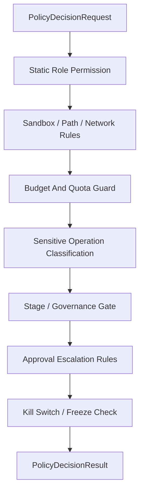

# Policy Engine Contract

## 1. 范围

本 contract defines统一 Policy Engine 入口，用来汇总角色静态permission、执lines策略、审批升级、budget守卫、敏感操作分class和 kill switch。

相关文档：

- `approval_and_hitl_contract.md`
- `sandbox_and_auth_contract.md`
- `cost_and_budget_contract.md`
- `governance_control_plane_contract.md`
- `tool_skill_plugin_contract.md`

## 2. 目标

统一 Policy Engine 至少要解决：

- 不同模块不再each单独做permission判断。
- 高风险动作进入同一条Decision链。
- 审批、budget、permission、kill switch 的Conclusion可组合、可审计。

## 3. 关键对象

### 3.1 `PolicyDecisionRequest`

| 字段 | class型 | Description |
|---|-------|--------|
| `decision_id` | `string` | Decisionrequest ID |
| `task_id` | `string` | 当前任务 |
| `harness_run_id` | `string?` | 当前 HarnessRun |
| `node_run_id` | `string?` | 当前 NodeRun |
| `attempt_id` | `string?` | 当前 NodeAttempt |
| `session_id` | `string?` | 当前会话 |
| `subject_type` | `user \| agent \| system` | request主体 |
| `subject_id` | `string` | 主体 ID |
| `action` | `invoke_model \| invoke_tool \| write_file \| exec_command \| network_access \| install_extension \| org_change \| dispatch_execution \| set_isolation_level \| promote_improvement \| advance_rollout \| modify_knowledge_trust \| promote_memory_layer` | 目标动作 |
| `resource_ref` | `string?` | 资源references用 |
| `risk_category` | `destructive \| irreversible \| prod_affecting \| cost_sensitive \| org_changing \| sensitive_data \| strategy_affecting \| governance_sensitive` | 风险分class |
| `mode` | `full_auto \| supervised_auto \| read_only \| no-write \| no-external-call \| no-rollout \| manual_only \| incident-mode` | 当前运lines模式 |
| `stage_view_ref` | `observe \| assess \| plan \| execute \| feedback \| learn \| improve \| release?` | 当前 OAPEFLIR 阶段视图references用；不得作为 truth Decision主键 |
| `estimated_cost_usd` | `number?` | 估算成本 |
| `metadata_json` | `json?` | 额外上下文 |

规则：

- `harness_run_id / node_run_id / attempt_id` 为权威关联键。
- `mode` 必须usesArchitecturedefines的 8 种规范模式；`supervised / auto / full-auto` 只允许作为 legacy 输入并在入口归一化。
- 降级模式必须被策略显式理解，而不is由call方用布尔组合私自推断。
- `stage_view_ref` 只提供解释上下文，运lines模式裁决仍以 `OperationalDirective`、风险分class、budget和 policy 规则为准。

## v4.3 Contract Remediation

### 3.2 `PolicyDecisionResult`

- `decision`
- `reason_code`
- `requires_approval`
- `enforced_constraints`
- `kill_switch_applied`
- `audit_payload`
- `evaluated_policy_version`
- `decision_ttl_ms?`
- `matched_rule_refs?`
- `explain_summary?`

`decision` 枚举：

- `allow`
- `deny`
- `allow_with_constraints`
- `escalate_for_approval`

### 3.3 `PolicyDecisionExplain`

最小字段：

- `decision_id`
- `summary`
- `factors`
- `policy_paths`
- `trace_refs?`
- `rule_sources?`
- `remediation_hint?`

### 3.4 `PolicyAuditRecord`

最小字段：

- `audit_id`
- `decision_id`
- `policy_bundle_id`
- `policy_version`
- `input_snapshot_ref`
- `decision_snapshot_ref`
- `evaluated_at`
- `latency_ms`

## 4. Decision链

规则：

- 任何一步明确 `deny` 都应 fail-closed。
- `allow_with_constraints` 必须显式返回被收紧后的路径、工具、budget或timeout约束。
- 审批升级不应覆盖硬性禁止项；被硬拒的动作不得再via审批放lines。
- kill switch / freeze 命中后，审批也不能把已冻结动作重新放lines。
- `allow_with_constraints` 的约束必须is authoritative，后续执lines不得擅自放宽。
- `manual_only` vs `incident-mode` 不is UI 标签，而is强约束运lines模式；命中后执lines层不得把它们降格为普通 warning。

## 5. 敏感操作分classtable

| 分class | 示例 | defaults to动作 |
|---|-------|--------|
| `destructive` | 删除文件、覆盖关键configure | 审批或拒绝 |
| `irreversible` | 外部提交、发布、发送不可撤回消息 | 审批 |
| `prod_affecting` | Impact生产环境命令 | 审批或拒绝 |
| `cost_sensitive` | 大模型高成本长推理 | budget检查 + 可能审批 |
| `org_changing` | 修改组织、角色、租户configure | 审批 |
| `sensitive_data` | 访问key、凭据、隐私data | 路径/permission约束 + 审批 |
| `strategy_affecting` | accepts improvement candidate、变更 strategy version | guardrail + 审批 |
| `governance_sensitive` | rollout 推进、knowledge trust 修改、memory promotion | gate + 审批或拒绝 |

## 6. vs审批的边界

- Policy Engine 决定“isno需要审批”。
- Approval 系统负责“审批request如何发出、如何回传”。
- 审批via后仍要再iterations进入 Policy Engine 进lines最终放lines，避免批准后环境已变化。

## 7. vs工具、Skill、Plugin 的边界

- Skill 不得越过角色工具白名单。
- Plugin / MCP 安装单元必须先via Policy Engine，不能directlybypassing ToolRegistry。
- MCP 不得as本地可信工具获得更宽permission。
- 相同动作在不同 `resource_ref`、`path_scope`、`tenant scope` 下必须独立评估，不能错误复用旧放linesConclusion。
- 同一request在不同 `mode` 下必须重新求值，不能把 `full_auto` 的旧 allow 复used for `read_only`、`no-rollout` 或 `incident-mode`。

## 7B. vs OAPEFLIR Hub 的边界

- Observe / Assess / Plan 阶段产生的isRecommendation和上下文，不is authoritative 放linesConclusion。
- FeedbackHub 可以提供负面信号、user纠正和质量指标，但不得directly把候选改进标为 accepted。
- LearnHub 只能生成 draft / validated learning object，不能directly修改 release 或 rollout Status。
- ImproveHub 提案必须via Policy Engine 裁决 `promote_improvement`，再进入 guardrail / approval 链。
- ReleaseHub 推进 `advance_rollout` 时，Policy Engine 必须重新评估当前风险、budget、运lines模式和 freeze Status。
- `modify_knowledge_trust` vs `promote_memory_layer` belongs to M2 扩展 action；未enabled相关平面时必须 fail-closed，而不is静默 allow。

## 7A. vs Dispatch 和 Isolation 的边界

Execution dispatch 涉及以下策略评估点，必须via过 Policy Engine：

| 评估点 | action | Description |
|---|-------|--------|
| dispatch target 选择 | `dispatch_execution` | 决定 execution 派发到哪个 worker 或 worker 组（local / named / capability-match），resource_ref 为目标 worker 或 capability Description |
| isolation level 提升 | `set_isolation_level` | 当 execution 要求 `containerized` 或更高隔离级别时，策略检查isno允许该隔离级别和关联资源消耗 |
| 远程 worker 能力authorization | `dispatch_execution` | 远程 worker 声明的 capabilities isno在 `allowedCapabilities` 白名单内，需via策略确认 |

规则：

- dispatch decision 在 ticket 创建前必须via过 Policy Engine，不得在 dispatch service 内部独立判定目标。
- isolation level 提升可能涉及额外资源成本（容器启动、镜像拉取），应vs `cost_sensitive` 风险分class联动。
- 远程 worker 的 capability 过滤结果（被拒绝的能力列table）应writes `PolicyAuditRecord`。
- `allow_with_constraints` 可used for收紧 dispatch target 范围（如限制到特定 worker 组）或降低 isolation level。

## 8. cachevs继承拒绝

- 同一 session 内连续相似高风险request可继承近期拒绝Conclusion，避免审批轰炸。
- cache键不得只按命令名，应contains动作、资源、主体和风险分class。
- 命中继承拒绝时，仍需保留审计record。
- cache命中不得跨 `tenant / workspace / organization / mode` 复用。

## 9. 规则 lint vs不可达规则检测

Policy / permission 规则在enabled前至少应做：

- repeats规则检测
- 阴影规则检测
- 不可达 allow 规则检测
- 来源conflicts检测

最少要识别以下Issue：

- tool-wide `deny` 让更具体的 `allow` 永远不可达
- tool-wide `ask` 让更具体的 `allow` 永远no法directly命中
- 共享来源规则vs本地临时规则互相遮蔽后，最终效果vs作者预期inconsistent

规则：

- lint failed的策略包不得进入 authoritative allow path。
- 若允许以 warning 形式继续uses，必须把 warning writes explain vs审计结果。
- 运lines时判定结果应尽量返回命中的规则来源vs修复提示，而不is只给出抽象的 `deny`。

## 10. 规则求值顺序

- policy / permission 规则的匹配顺序必须is确定性的、可解释的。
- 若系统supported wildcard、局部 override、本地临时规则vsglobally规则并存，必须明确：
  - is按显式 `priority`
  - 还is按 source order / last-match
  - 或其他等价的稳定策略
- 同一request不得因遍历顺序、concurrent装载顺序或来源聚合顺序不同而得到不同Conclusion。
- explain vs audit 结果应能指出“最终is哪条规则获胜，以及它覆盖了谁”。

## 11. 审计要求

每iterations策略Decision至少保留：

- 谁request了什么
- 触发了哪些策略节点
- 最终为何放lines、拒绝或升级
- 收紧后的约束is什么
- uses的is哪个 policy version / config version
- 审计快照references用的is哪份 input / decision snapshot

## 12. 关键裁决边界

- Policy Engine is最终裁决入口，不isRecommendation收集器。
- LLM、workflow planner、approval packet 只能提供上下文或Recommendation，不得directly构造 authoritative allow。
- 若 Policy Engine vs上游Recommendationconflicts，始终以 Policy Engine 为准。

## 13. Phase 边界

Phase 1a / 1b 明确做：

- 单进程统一入口
- 角色静态permission
- sandbox / path / network 规则
- budget守卫
- 审批升级
- kill switch / freeze 检查

当前不做：

- OPA 集成
- 外部策略提供者
- 多租户分布式策略执lines集群

补充Description：

- 当前不把 OPA 写成既成事实，但 `PolicyDecisionRequest / Result / Explain / AuditRecord` 的形状应尽量保持可对接外部策略references擎。
- 后续若references入 OPA 或等价策略references擎，应优先复用本 contract 的输入、解释vs审计边界，而不is再创造一套平lines模型。

## 14. 收口Conclusion

Policy Engine 的意义不is再造一层抽象，而is把过去分散在permission、budget、审批、security里的判断收口成一条统一、可审计、可复用的Decision链。

## v4.3 Architecture Remediation

以下条目修复 `platform-architecture-implementation-consistency-audit.md` 中record的 contract 偏差。本文档历史段落如vs本节conflicts，以本节、`docs_zh/architecture/00-platform-architecture.md`、ADR-109 至 ADR-113、以及 `src/platform/contracts/executable-contracts/` 为准。

- T-17: 本文原先把运lines模式压缩成 `supervised / auto / full-auto` 三值，Root cause: 早期策略合同只覆盖”isno自动执lines”，没有把Architecture中的降级保护模式也视为一等治理对象。修复：正文现把 `mode` 收敛到 `full_auto / supervised_auto / read_only / no-write / no-external-call / no-rollout / manual_only / incident-mode` 八种规范模式，并把旧三值降为 legacy 输入。
- T-19: 原 `PolicyDecisionRequest` 字段已正确uses `harness_run_id / node_run_id / attempt_id` 作为权威关联键，未uses废弃的 `execution_id`。R2-19 系 audit 误判；本文§3.1 自始即对齐 v4.3 规范，no须修改。

mandatory规则：Status迁移必须via `RuntimeStateMachine.transition(command)`；执lines计划必须uses `PlanGraphBundle`；执lines结果必须uses `NodeAttemptReceipt`；truth event 只能uses `platform.*`；OAPEFLIR 只能作为 `oapeflir.view.*` / rationale 投影；budget必须uses `BudgetLedger` / `BudgetReservation` / `BudgetSettlement`。
