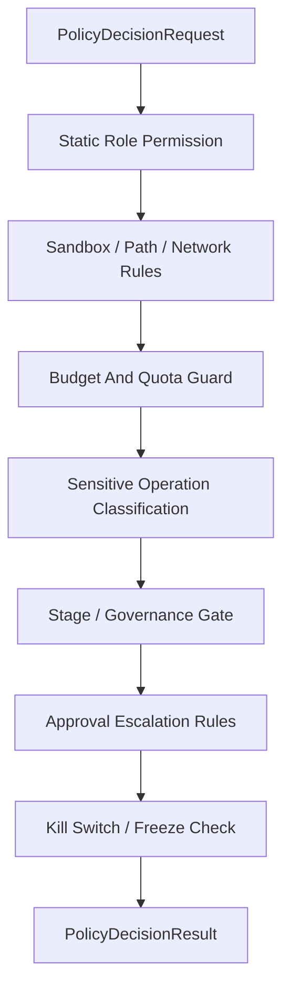

# Policy Engine Contract

## 1. Scope

This contract defines the unified Policy Engine entry point, which aggregates static role permissions, execution policies, approval escalation, budget guards, sensitive operation classification, and kill switch.

Related documents:

- `approval_and_hitl_contract.md`
- `sandbox_and_auth_contract.md`
- `cost_and_budget_contract.md`
- `governance_control_plane_contract.md`
- `tool_skill_plugin_contract.md`

## 2. Goals

A unified Policy Engine must at least solve:

- Different modules no longer make permission decisions independently.
- High-risk actions enter a single decision chain.
- Conclusions from approval, budget, permissions, and kill switch are composable and auditable.

## 3. Key Objects

### 3.1 `PolicyDecisionRequest`

| Field | Type | Description |
| --- | --- | --- |
| `decision_id` | `string` | Decision request ID |
| `task_id` | `string?` | Current task (deprecated - use harness_run_id instead) |
| `harness_run_id` | `string` | Canonical runtime chain anchor |
| `node_run_id` | `string?` | Current node run |
| `attempt_id` | `string?` | Current attempt |
| `session_id` | `string?` | Current session |
| `subject_type` | `user \| agent \| system` | Request subject |
| `subject_id` | `string` | Subject ID |
| `action` | `invoke_model \| invoke_tool \| write_file \| exec_command \| network_access \| install_extension \| org_change \| dispatch_execution \| set_isolation_level \| promote_improvement \| advance_rollout \| modify_knowledge_trust \| promote_memory_layer` | Target action |
| `resource_ref` | `string?` | Resource reference |
| `risk_category` | `destructive \| irreversible \| prod_affecting \| cost_sensitive \| org_changing \| sensitive_data \| strategy_affecting \| governance_sensitive` | Risk category |
| `mode` | `full_auto \| supervised_auto \| read_only \| no-write \| no-external-call \| no-rollout \| manual_only \| incident-mode` | Current runtime mode |
| `stage_view_ref` | `observe \| assess \| plan \| execute \| feedback \| learn \| improve \| release?` | Current OAPEFLIR stage view reference; must not be used as truth decision primary key |
| `estimated_cost_usd` | `number?` | Estimated cost |
| `metadata_json` | `json?` | Additional context |

Rules:

- `mode` must use the 8 canonical modes defined by the architecture; `supervised / auto / full-auto` are only permitted as legacy input and must be normalized at the entry point.
- Degraded modes must be explicitly understood by policies, not privately inferred by callers using boolean combinations.
- `stage_view_ref` only provides explanatory context; runtime mode decisions still rely on `OperationalDirective`, risk category, budget, and policy rules.

### 3.2 `PolicyDecisionResult`

- `decision`
- `reason_code`
- `requires_approval`
- `enforced_constraints`
- `kill_switch_applied`
- `audit_payload`
- `evaluated_policy_version`
- `decision_ttl_ms?`
- `matched_rule_refs?`
- `explain_summary?`

`decision` enum:

- `allow`
- `deny`
- `allow_with_constraints`
- `escalate_for_approval`

### 3.3 `PolicyDecisionExplain`

Minimum fields:

- `decision_id`
- `summary`
- `factors`
- `policy_paths`
- `trace_refs?`
- `rule_sources?`
- `remediation_hint?`

### 3.4 `PolicyAuditRecord`

Minimum fields:

- `audit_id`
- `decision_id`
- `policy_bundle_id`
- `policy_version`
- `input_snapshot_ref`
- `decision_snapshot_ref`
- `evaluated_at`
- `latency_ms`

## 4. Decision Chain

Rules:

- Any step that explicitly returns `deny` should fail-closed.
- `allow_with_constraints` must explicitly return tightened path, tools, budget, or timeout constraints.
- Approval escalation must not override hard-denied items; actions hard-rejected by policy cannot be approved afterward.
- After kill switch / freeze is triggered, approval cannot re-enable a frozen action.
- Constraints from `allow_with_constraints` are authoritative; subsequent execution must not relax them on its own.
- `manual_only` and `incident-mode` are not UI labels but strong constraint runtime modes; execution layer must not demote them to ordinary warnings when triggered.

## 5. Sensitive Operation Classification Table

| Category | Examples | Default Action |
| --- | --- | --- |
| `destructive` | Delete files, overwrite critical configuration | Approval or denial |
| `irreversible` | External commits, releases, sending irrevocable messages | Approval |
| `prod_affecting` | Commands affecting production environment | Approval or denial |
| `cost_sensitive` | High-cost long-reasoning LLM calls | Budget check + possible approval |
| `org_changing` | Modify organization, role, tenant configuration | Approval |
| `sensitive_data` | Access keys, credentials, private data | Path/permission constraints + approval |
| `strategy_affecting` | Accept improvement candidate, change strategy version | Guardrail + approval |
| `governance_sensitive` | Rollout advancement, knowledge trust modification, memory promotion | Gate + approval or denial |

## 6. Boundary with Approval

- Policy Engine decides "whether approval is needed".
- Approval system is responsible for "how approval requests are sent and how results are returned".
- After approval is granted, the request must re-enter Policy Engine for final release to avoid environment changes after approval.

## 7. Boundary with Tools, Skills, and Plugins

- Skills must not bypass role tool whitelists.
- Plugin / MCP installation units must pass through Policy Engine first and cannot directly bypass ToolRegistry.
- MCP must not impersonate local trusted tools to gain broader permissions.
- The same action under different `resource_ref`, `path_scope`, or `tenant scope` must be evaluated independently; old approval conclusions must not be incorrectly reused.
- The same request under different `mode` must be re-evaluated; old `allow` from `full_auto` cannot be reused for `read_only`, `no-rollout`, or `incident-mode`.

## 7B. Boundary with OAPEFLIR Hub

- Observe / Assess / Plan stages produce suggestions and context, not authoritative release conclusions.
- FeedbackHub may provide negative signals, user corrections, and quality metrics, but must not directly mark candidate improvements as accepted.
- LearnHub can only generate draft / validated learning objects and cannot directly modify release or rollout state.
- ImproveHub proposals must be decided by Policy Engine via `promote_improvement` before entering the guardrail / approval chain.
- When ReleaseHub advances `advance_rollout`, Policy Engine must re-evaluate current risk, budget, runtime mode, and freeze state.
- `modify_knowledge_trust` and `promote_memory_layer` are M2 extended actions; when related planes are not enabled, must fail-closed, not silently allow.

## 7A. Boundary with Dispatch and Isolation

Execution dispatch involves the following policy evaluation points and must pass through Policy Engine:

| Evaluation Point | action | Description |
| --- | --- | --- |
| Dispatch target selection | `dispatch_execution` | Determines which worker or worker group (local / named / capability-match) an execution is dispatched to; resource_ref is the target worker or capability description |
| Isolation level elevation | `set_isolation_level` | When an execution requires `containerized` or higher isolation level, policy checks whether that isolation level and associated resource consumption are allowed |
| Remote worker capability authorization | `dispatch_execution` | Whether remote worker-declared capabilities are in the `allowedCapabilities` whitelist requires policy confirmation |

Rules:

- Dispatch decisions must go through Policy Engine before ticket creation, not independently determined within the dispatch service.
- Isolation level elevation may involve additional resource costs (container startup, image pull) and should be linked with `cost_sensitive` risk classification.
- Remote worker capability filtering results (rejected capability list) should be written to `PolicyAuditRecord`.
- `allow_with_constraints` may be used to tighten dispatch target scope (e.g., limit to specific worker group) or lower isolation level.

## 8. Caching and Inheritance Rejection

- Consecutive similar high-risk requests within the same session may inherit recent rejection conclusions to avoid approval bombardment.
- Cache keys must not be based solely on command names; they must include action, resource, subject, and risk category.
- When inheritance rejection is triggered, audit records must still be retained.
- Cache hits must not be reused across `tenant / workspace / organization / mode`.

## 9. Rule Lint and Unreachable Rule Detection

Policy / permission rules must at least undergo before activation:

- Duplicate rule detection
- Shadow rule detection
- Unreachable allow rule detection
- Source conflict detection

Must at least identify the following issues:

- tool-wide `deny` makes more specific `allow` forever unreachable
- tool-wide `ask` makes more specific `allow` never directly hit
- After shared source rules and local temporary rules obscure each other, final effect inconsistent with author expectations

Rules:

- Policy bundles that fail lint must not enter the authoritative allow path.
- If allowed to continue with warnings, warnings must be written to explain and audit results.
- Runtime decision results should try to return the matched rule source and remediation hint, not just an abstract `deny`.

## 10. Rule Evaluation Order

- Policy / permission rule matching order must be deterministic and explainable.
- If the system supports wildcards, partial overrides, local temporary rules, and global rules coexisting, must clarify:
  - Whether it is by explicit `priority`
  - Or by source order / last-match
  - Or other equivalent stable strategy
- The same request must not get different conclusions due to traversal order, concurrent loading order, or source aggregation order differences.
- Explain and audit results should be able to point out "which rule ultimately won and what it overrode".

## 11. Audit Requirements

Each policy decision must retain at least:

- Who requested what
- Which policy nodes were triggered
- Why it was ultimately allowed, denied, or escalated
- What tightened constraints are
- Which policy version / config version was used
- Which input / decision snapshot the audit snapshot references

## 12. Key Decision Boundary

- Policy Engine is the final decision-making entry point, not a suggestion collector.
- LLM, workflow planner, and approval packet can only provide context or suggestions and must not directly construct authoritative allow.
- If Policy Engine conflicts with upstream suggestions, Policy Engine always takes precedence.

## 13. Phase Boundaries

Phase 1a / 1b explicitly do:

- Single-process unified entry point
- Static role permissions
- Sandbox / path / network rules
- Budget guard
- Approval escalation
- Kill switch / freeze check

Currently not doing:

- OPA integration
- External policy providers
- Multi-tenant distributed policy execution cluster

Supplementary notes:

- OPA is not currently assumed as a given, but the shapes of `PolicyDecisionRequest / Result / Explain / AuditRecord` should remain compatible with external policy engines.
- If OPA or equivalent policy engines are introduced later, should prioritize reusing this contract's input, explanation, and audit boundaries rather than creating a new parallel model.

## 14. Consolidation Conclusion

The purpose of Policy Engine is not to create another layer of abstraction, but to consolidate previously scattered judgments in permissions, budget, approval, and security into a single unified, auditable, reusable decision chain.

## v4.3 Architecture Remediation

The following entries fix contract deviations recorded in `platform-architecture-implementation-consistency-audit.md`. If historical sections of this document conflict with this section, this section, `docs_zh/architecture/00-platform-architecture.md`, ADR-109 through ADR-113, and `src/platform/contracts/executable-contracts/` take precedence.

- T-17: This document previously compressed runtime modes into three values: `supervised / auto / full-auto`. Root cause: early policy contracts only covered "whether to execute automatically" and did not treat architecture degradation protection modes as first-class governance objects. Fix: the main text now converges `mode` to 8 canonical modes: `full_auto / supervised_auto / read_only / no-write / no-external-call / no-rollout / manual_only / incident-mode`, and demotes the old three values to legacy input.

Mandatory rules: State transitions must go through `RuntimeStateMachine.transition(command)`; execution plans must use `PlanGraphBundle`; execution results must use `NodeAttemptReceipt`; truth events must only use `platform.*`; OAPEFLIR may only be used as `oapeflir.view.*` / rationale projection; budgets must use `BudgetLedger` / `BudgetReservation` / `BudgetSettlement`.
