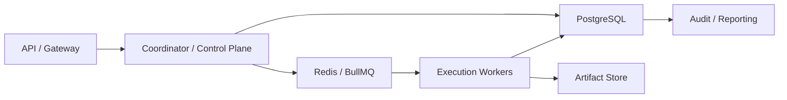

# Production Storage And Queue Contract

---

## OAPEFLIR Association

This contract participates in the following OAPEFLIR eight-stage loop stages:

- **Observe**: Signal collection and aggregation
- **Assess**: Pre-execution assessment and risk judgment
- **Plan**: Task decomposition and DAG construction
- **Execute**: Step execution and fault tolerance
- **Feedback**: Signal collection and preprocessing
- **Learn**: Pattern detection and knowledge extraction
- **Improve**: Improvement candidate evaluation and rollout
- **Release**: Controlled release and rollback

---

## 1. Scope

This contract defines the formal path from current transactional storage baseline to industrial-grade PostgreSQL + Redis/BullMQ queue.

It answers the question: when the platform enters production, which data must go into the authoritative relational store, which responsibilities go into queue/broker, and which designs must from now on follow PG semantic constraints.

Related documents:

- `storage_schema_contract.md`
- `runtime_repository_and_migration_contract.md`
- `execution_plane_contract.md`
- `event_bus_contract.md`

## 2. Objectives

- Clarify transaction truth, queue dispatch, and cache responsibilities.
- Avoid implementation over-binding to SQLite features.
- Freeze PG semantics-first repository / migration rules in advance.
- Provide clear boundaries for Redis/BullMQ as execution queue.

## 3. Production Data Layering

| Layer | Primary Backend | Responsibilities |
| --- | --- | --- |
| `transaction store` | PostgreSQL | task, workflow, execution, approval, lease, audit, quota authoritative truth |
| `queue / dispatch` | Redis + BullMQ | execution ticket, delayed queue, retry queue, dead-letter routing |
| `artifact store` | object storage / file store | large files, reports, attachments, export packages |
| `knowledge / rollout store` | PostgreSQL + pgvector | knowledge namespace metadata, semantic vector index, rollout record, strategy lineage |
| `analytics / replay` | PG secondary or downstream analytics store | usage, cost, evaluation, ops aggregation |

## 4. Key Invariants

- Authoritative task / execution state must not exist only in queue.
- After queue message loss, must be reconstructable from transaction store.
- Dispatch queue is responsible for "delivery and retry", not "final truth state".
- PG schema design takes priority over SQLite convenience features.
- rollout / strategy / knowledge namespace metadata must not be retained only in cache or artifact.
- If knowledge semantic embedding enables external vector retrieval, authoritative vector index must be reconstructable by PG/pgvector and must not exist only in process-level cache.

## 5. Production Recommended Topology

## 6. PostgreSQL Semantic Requirements

- All repository designs must be compatible with row-level locks, transactions, unique constraints, foreign keys, and JSONB.
- SQLite-specific implementation must not be written as contract truth.
- Migration must from the start support verification on PG.
- Any "only valid under SQLite" shortcut must be registered as technical debt.
- Knowledge semantic infra target backend is `pgvector`; schema should include `knowledge_semantic_vectors` or equivalent table, use `knowledge_ref` as stable key, and retain `chunk_id`, `document_id`, `namespace`, `embedding_id`, `embedding_model`, `embedding vector(32)`, `updated_at`.
- When pgvector extension is missing, migration may fail-soft and preserve notice, but runtime with explicit `AA_KNOWLEDGE_VECTOR_BACKEND=pgvector` must fail-close.
- Semantic query should sort through `embedding <=> query_vector` or equivalent cosine distance semantics and must not disguise keyword score as vector similarity.
- Repository must provide executable pgvector readiness / roundtrip check entry; currently `knowledge-semantic-readiness` CLI performs extension/table/ivfflat/roundtrip validation for `AA_STORAGE_DRIVER=postgres` + `AA_KNOWLEDGE_VECTOR_BACKEND=pgvector` and fails-close on failure.

## 7. Queue Semantic Requirements

- Dispatch at-least-once delivery.
- Queue consumption success does not equal business success and must wait for authoritative writeback.
- Delay, retry, and dead-letter are managed by queue, but decision source still comes from control plane.
- Duplicate delivery must rely on idempotency key + fencing token protection.

## 8. Dual-Run And Migration Recommendations

Industrial-grade progression order:

1. Repository first implements interface by PG semantics.
2. Migration performs compatibility validation on both SQLite and PG sides.
3. Queue first validates in single-instance mode, then goes to Redis/BullMQ.
4. Complete PG + queue drill before production; do not delay the switch to Phase 4.

Knowledge semantic infra migration path:

1. `Current`: local hash embedding + archive scan / in-memory vector store usable for development and non-PG environments.
2. `Transition`: `SemanticVectorStore` abstraction supports both `local_hash` and `pgvector`; API query path uses async retrieval and can wait for vector index write.
3. `Target`: Production enables PostgreSQL + pgvector, `knowledge_semantic_vectors` written by ingestion pipeline, semantic query goes through pgvector distance sorting; snapshot restore must also be able to backfill semantic vector index. Repository readiness CLI and roundtrip validation are complete, but real PG environment must still complete live validation evidence.

## 9. Consistency Model

| Object | Consistency |
| --- | --- |
| task / execution / lease | Strong consistency |
| approval decision | Strong consistency |
| queue delivery | At-least-once |
| UI progress | Eventual consistency |
| analytics aggregation | Delayed consistency |

## 10. Failure And Fallback

- When Redis/BullMQ is unavailable, system should enter admission control or degrade and must not silently drop tasks.
- When PG is unwritable, must not continue accepting tasks requiring authoritative state.
- When `AA_STORAGE_DRIVER=postgres`, startup preflight / doctor must first complete fail-close validation on DSN, SSL, pool sizing, dual-run switch, and shadow SQLite path; cannot enable postgres driver if validation fails.
- When queue and DB write are inconsistent, DB truth should be trusted first and repair job triggered.

## 11. Phase Boundaries

Current:

- Documents and repository first design by PG/queue semantics
- Implementation allowed to start from single-machine baseline

Must complete before entering production:

- PG migration compatibility test
- Queue replay / duplicate delivery drill
- DB/queue disconnect fault drill
- rollout / strategy lineage consistency drill

## 12. Closure Conclusion

Industrial production cannot treat PostgreSQL and queue as "future replacement items".

From documents and contracts, must design by the structure of "transaction truth in PG, scheduling delivery in queue, duplicate delivery guaranteed by idempotency and fencing".